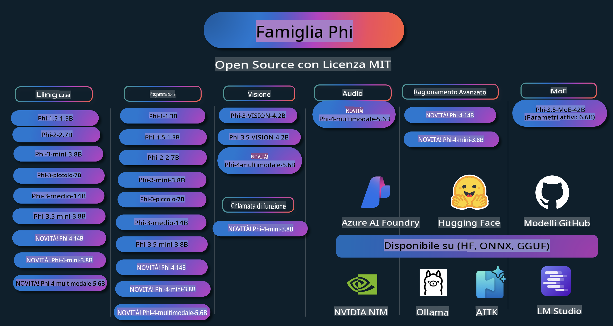

# Phi Cookbook: Esempi Pratici con i Modelli Phi di Microsoft

Phi è una serie di modelli di intelligenza artificiale open source sviluppati da Microsoft.

Phi è attualmente il modello linguistico di piccole dimensioni (SLM) più potente ed economico, con benchmark eccellenti in scenari multilingua, ragionamento, generazione di testo/chat, codifica, immagini, audio e altro ancora.

Puoi distribuire Phi nel cloud o su dispositivi edge e creare facilmente applicazioni di intelligenza artificiale generativa con una potenza di calcolo limitata.

Segui questi passaggi per iniziare a utilizzare queste risorse:
1. **Fai un Fork del Repository**: Clicca 
2. **Clona il Repository**:   `git clone https://github.com/microsoft/PhiCookBook.git`
3. [**Unisciti alla Community Microsoft AI su Discord per incontrare esperti e altri sviluppatori**](https://discord.com/invite/ByRwuEEgH4?WT.mc_id=aiml-137032-kinfeylo)

## Indice

- Introduzione
  - [Benvenuto nella Famiglia Phi](./md/01.Introduction/01/01.PhiFamily.md)
  - [Configurazione dell'Ambiente](./md/01.Introduction/01/01.EnvironmentSetup.md)
  - [Comprendere le Tecnologie Chiave](./md/01.Introduction/01/01.Understandingtech.md)
  - [Sicurezza AI per i Modelli Phi](./md/01.Introduction/01/01.AISafety.md)
  - [Supporto Hardware per Phi](./md/01.Introduction/01/01.Hardwaresupport.md)
  - [Modelli Phi e Disponibilità su Piattaforme](./md/01.Introduction/01/01.Edgeandcloud.md)
  - [Utilizzo di Guidance-ai e Phi](./md/01.Introduction/01/01.Guidance.md)
  - [Modelli nel GitHub Marketplace](https://github.com/marketplace/models)
  - [Catalogo Modelli Azure AI](https://ai.azure.com)

- Inferenza Phi in diversi ambienti
    - [Hugging Face](./md/01.Introduction/02/01.HF.md)
    - [Modelli GitHub](./md/01.Introduction/02/02.GitHubModel.md)
    - [Catalogo Modelli Azure AI Foundry](./md/01.Introduction/02/03.AzureAIFoundry.md)
    - [Ollama](./md/01.Introduction/02/04.Ollama.md)
    - [AI Toolkit VSCode (AITK)](./md/01.Introduction/02/05.AITK.md)
    - [NVIDIA NIM](./md/01.Introduction/02/06.NVIDIA.md)

- Inferenza della Famiglia Phi
    - [Inferenza Phi su iOS](./md/01.Introduction/03/iOS_Inference.md)
    - [Inferenza Phi su Android](./md/01.Introduction/03/Android_Inference.md)
- [Inferenza Phi su Jetson](./md/01.Introduction/03/Jetson_Inference.md)
    - [Inferenza Phi su AI PC](./md/01.Introduction/03/AIPC_Inference.md)
    - [Inferenza Phi con il framework Apple MLX](./md/01.Introduction/03/MLX_Inference.md)
    - [Inferenza Phi su server locale](./md/01.Introduction/03/Local_Server_Inference.md)
    - [Inferenza Phi su server remoto utilizzando AI Toolkit](./md/01.Introduction/03/Remote_Interence.md)
    - [Inferenza Phi con Rust](./md/01.Introduction/03/Rust_Inference.md)
    - [Inferenza Phi--Vision in locale](./md/01.Introduction/03/Vision_Inference.md)
    - [Inferenza Phi con Kaito AKS, Azure Containers (supporto ufficiale)](./md/01.Introduction/03/Kaito_Inference.md)
- [Quantificazione della famiglia Phi](./md/01.Introduction/04/QuantifyingPhi.md)
    - [Quantizzazione di Phi-3.5 / 4 utilizzando llama.cpp](./md/01.Introduction/04/UsingLlamacppQuantifyingPhi.md)
    - [Quantizzazione di Phi-3.5 / 4 utilizzando le estensioni di Generative AI per onnxruntime](./md/01.Introduction/04/UsingORTGenAIQuantifyingPhi.md)
    - [Quantizzazione di Phi-3.5 / 4 utilizzando Intel OpenVINO](./md/01.Introduction/04/UsingIntelOpenVINOQuantifyingPhi.md)
    - [Quantizzazione di Phi-3.5 / 4 utilizzando il framework Apple MLX](./md/01.Introduction/04/UsingAppleMLXQuantifyingPhi.md)

- Valutazione di Phi
    - [AI Responsabile](./md/01.Introduction/05/ResponsibleAI.md)
    - [Azure AI Foundry per la valutazione](./md/01.Introduction/05/AIFoundry.md)
    - [Utilizzo di Promptflow per la valutazione](./md/01.Introduction/05/Promptflow.md)
 
- RAG con Azure AI Search
    - [Come utilizzare Phi-4-mini e Phi-4-multimodal (RAG) con Azure AI Search](https://github.com/microsoft/PhiCookBook/blob/main/code/06.E2E/E2E_Phi-4-RAG-Azure-AI-Search.ipynb)

- Esempi di sviluppo di applicazioni Phi
  - Applicazioni di testo e chat
    - Esempi Phi-4 🆕
      - [📓] [Chat con il modello Phi-4-mini ONNX](./md/02.Application/01.TextAndChat/Phi4/ChatWithPhi4ONNX/README.md)
      - [Chat con il modello locale Phi-4 ONNX in .NET](../../md/04.HOL/dotnet/src/LabsPhi4-Chat-01OnnxRuntime)
      - [App console .NET per chat con Phi-4 ONNX utilizzando Semantic Kernel](../../md/04.HOL/dotnet/src/LabsPhi4-Chat-02SK)
    - Esempi Phi-3 / 3.5
      - [Chatbot locale nel browser utilizzando Phi3, ONNX Runtime Web e WebGPU](https://github.com/microsoft/onnxruntime-inference-examples/tree/main/js/chat)
      - [Chat OpenVino](./md/02.Application/01.TextAndChat/Phi3/E2E_OpenVino_Chat.md)
      - [Modello multiplo - Interattivo Phi-3-mini e OpenAI Whisper](./md/02.Application/01.TextAndChat/Phi3/E2E_Phi-3-mini_with_whisper.md)
      - [MLFlow - Creazione di un wrapper e utilizzo di Phi-3 con MLFlow](./md//02.Application/01.TextAndChat/Phi3/E2E_Phi-3-MLflow.md)
      - [Ottimizzazione del modello - Come ottimizzare il modello Phi-3-min per ONNX Runtime Web con Olive](https://github.com/microsoft/Olive/tree/main/examples/phi3)
      - [App WinUI3 con Phi-3 mini-4k-instruct-onnx](https://github.com/microsoft/Phi3-Chat-WinUI3-Sample/)
      - [Esempio di app per appunti AI-powered multi modello in WinUI3](https://github.com/microsoft/ai-powered-notes-winui3-sample)
      - [Personalizzazione e integrazione di modelli Phi-3 con Prompt flow](./md/02.Application/01.TextAndChat/Phi3/E2E_Phi-3-FineTuning_PromptFlow_Integration.md)
      - [Personalizzazione e integrazione di modelli Phi-3 con Prompt flow in Azure AI Foundry](./md/02.Application/01.TextAndChat/Phi3/E2E_Phi-3-FineTuning_PromptFlow_Integration_AIFoundry.md)
      - [Valutazione del modello Phi-3 / Phi-3.5 personalizzato in Azure AI Foundry con focus sui principi di AI Responsabile di Microsoft](./md/02.Application/01.TextAndChat/Phi3/E2E_Phi-3-Evaluation_AIFoundry.md)
- [📓] [Esempio di previsione linguistica Phi-3.5-mini-instruct (Cinese/Inglese)](../../md/02.Application/01.TextAndChat/Phi3/phi3-instruct-demo.ipynb)
      - [Chatbot RAG WebGPU Phi-3.5-Instruct](./md/02.Application/01.TextAndChat/Phi3/WebGPUWithPhi35Readme.md)
      - [Utilizzo della GPU di Windows per creare una soluzione Prompt Flow con Phi-3.5-Instruct ONNX](./md/02.Application/01.TextAndChat/Phi3/UsingPromptFlowWithONNX.md)
      - [Creare un'app Android utilizzando Microsoft Phi-3.5 tflite](./md/02.Application/01.TextAndChat/Phi3/UsingPhi35TFLiteCreateAndroidApp.md)
      - [Esempio Q&A .NET utilizzando il modello ONNX Phi-3 locale con Microsoft.ML.OnnxRuntime](../../md/04.HOL/dotnet/src/LabsPhi301)
      - [App console chat .NET con Semantic Kernel e Phi-3](../../md/04.HOL/dotnet/src/LabsPhi302)

  - Campioni basati su codice per Azure AI Inference SDK 
    - Campioni Phi-4 🆕
      - [📓] [Generare codice di progetto utilizzando Phi-4-multimodal](./md/02.Application/02.Code/Phi4/GenProjectCode/README.md)
    - Campioni Phi-3 / 3.5
      - [Costruisci il tuo GitHub Copilot Chat per Visual Studio Code con Microsoft Phi-3 Family](./md/02.Application/02.Code/Phi3/VSCodeExt/README.md)
      - [Crea il tuo agente chat Copilot per Visual Studio Code con Phi-3.5 utilizzando i modelli di GitHub](/md/02.Application/02.Code/Phi3/CreateVSCodeChatAgentWithGitHubModels.md)

  - Esempi di ragionamento avanzato
    - Campioni Phi-4 🆕
      - [📓] [Esempi di ragionamento avanzato Phi-4-mini](./md/02.Application/03.AdvancedReasoning/Phi4/AdvancedResoningPhi4mini/README.md)
  
  - Demo
      - [Demo Phi-4-mini ospitati su Hugging Face Spaces](https://huggingface.co/spaces/microsoft/phi-4-mini?WT.mc_id=aiml-137032-kinfeylo)
      - [Demo Phi-4-multimodal ospitati su Hugging Face Spaces](https://huggingface.co/spaces/microsoft/phi-4-multimodal?WT.mc_id=aiml-137032-kinfeylo)
  - Esempi Vision
    - Campioni Phi-4 🆕
      - [📓] [Utilizzare Phi-4-multimodal per leggere immagini e generare codice](./md/02.Application/04.Vision/Phi4/CreateFrontend/README.md) 
    - Campioni Phi-3 / 3.5
      -  [📓][Phi-3-vision - Da immagine a testo](../../md/02.Application/04.Vision/Phi3/E2E_Phi-3-vision-image-text-to-text-online-endpoint.ipynb)
      - [Phi-3-vision-ONNX](https://onnxruntime.ai/docs/genai/tutorials/phi3-v.html)
      - [📓][Phi-3-vision CLIP Embedding](../../md/02.Application/04.Vision/Phi3/E2E_Phi-3-vision-image-text-to-text-online-endpoint.ipynb)
      - [DEMO: Phi-3 Riciclo](https://github.com/jennifermarsman/PhiRecycling/)
      - [Phi-3-vision - Assistente visivo linguistico - con Phi3-Vision e OpenVINO](https://docs.openvino.ai/nightly/notebooks/phi-3-vision-with-output.html)
      - [Phi-3 Vision Nvidia NIM](./md/02.Application/04.Vision/Phi3/E2E_Nvidia_NIM_Vision.md)
      - [Phi-3 Vision OpenVino](./md/02.Application/04.Vision/Phi3/E2E_OpenVino_Phi3Vision.md)
      - [📓][Campione multi-frame o multi-immagine Phi-3.5 Vision](../../md/02.Application/04.Vision/Phi3/phi3-vision-demo.ipynb)
      - [Phi-3 Vision Modello ONNX Locale utilizzando Microsoft.ML.OnnxRuntime .NET](../../md/04.HOL/dotnet/src/LabsPhi303)
      - [Modello ONNX Locale Phi-3 Vision basato su menu utilizzando Microsoft.ML.OnnxRuntime .NET](../../md/04.HOL/dotnet/src/LabsPhi304)

  - Esempi Audio
    - Campioni Phi-4 🆕
      - [📓] [Estrarre trascrizioni audio utilizzando Phi-4-multimodal](./md/02.Application/05.Audio/Phi4/Transciption/README.md)
      - [📓] [Campione Audio Phi-4-multimodal](../../md/02.Application/05.Audio/Phi4/Siri/demo.ipynb)
      - [📓] [Campione di traduzione vocale Phi-4-multimodal](../../md/02.Application/05.Audio/Phi4/Translate/demo.ipynb)
      - [Applicazione console .NET utilizzando Phi-4-multimodal Audio per analizzare un file audio e generare una trascrizione](../../md/04.HOL/dotnet/src/LabsPhi4-MultiModal-02Audio)

  - Esempi MOE
    - Campioni Phi-3 / 3.5
      - [📓] [Phi-3.5 Modelli Mixture of Experts (MoEs) - Esempio per i social media](../../md/02.Application/06.MoE/Phi3/phi3_moe_demo.ipynb)
      - [📓] [Creare una pipeline di generazione aumentata da recupero (RAG) con NVIDIA NIM Phi-3 MOE, Azure AI Search e LlamaIndex](../../md/02.Application/06.MoE/Phi3/azure-ai-search-nvidia-rag.ipynb)
  - Esempi di chiamate di funzione
    - Campioni Phi-4 🆕
      -  [📓] [Utilizzare Function Calling con Phi-4-mini](./md/02.Application/07.FunctionCalling/Phi4/FunctionCallingBasic/README.md)
  - Esempi di miscelazione multimodale
    - Campioni Phi-4 🆕
-  [📓] [Utilizzare Phi-4-multimodal come giornalista tecnologico](../../md/02.Application/08.Multimodel/Phi4/TechJournalist/phi_4_mm_audio_text_publish_news.ipynb)
      - [Applicazione console .NET che utilizza Phi-4-multimodal per analizzare immagini](../../md/04.HOL/dotnet/src/LabsPhi4-MultiModal-01Images)

- Campioni di Fine-Tuning Phi
  - [Scenari di Fine-Tuning](./md/03.FineTuning/FineTuning_Scenarios.md)
  - [Fine-Tuning vs RAG](./md/03.FineTuning/FineTuning_vs_RAG.md)
  - [Fine-Tuning: rendere Phi-3 un esperto del settore](./md/03.FineTuning/LetPhi3gotoIndustriy.md)
  - [Fine-Tuning di Phi-3 con AI Toolkit per VS Code](./md/03.FineTuning/Finetuning_VSCodeaitoolkit.md)
  - [Fine-Tuning di Phi-3 con Azure Machine Learning Service](./md/03.FineTuning/Introduce_AzureML.md)
  - [Fine-Tuning di Phi-3 con Lora](./md/03.FineTuning/FineTuning_Lora.md)
  - [Fine-Tuning di Phi-3 con QLora](./md/03.FineTuning/FineTuning_Qlora.md)
  - [Fine-Tuning di Phi-3 con Azure AI Foundry](./md/03.FineTuning/FineTuning_AIFoundry.md)
  - [Fine-Tuning di Phi-3 con Azure ML CLI/SDK](./md/03.FineTuning/FineTuning_MLSDK.md)
  - [Fine-Tuning con Microsoft Olive](./md/03.FineTuning/FineTuning_MicrosoftOlive.md)
  - [Fine-Tuning con Microsoft Olive Hands-On Lab](./md/03.FineTuning/olive-lab/readme.md)
  - [Fine-Tuning di Phi-3-vision con Weights and Bias](./md/03.FineTuning/FineTuning_Phi-3-visionWandB.md)
  - [Fine-Tuning di Phi-3 con il framework Apple MLX](./md/03.FineTuning/FineTuning_MLX.md)
  - [Fine-Tuning di Phi-3-vision (supporto ufficiale)](./md/03.FineTuning/FineTuning_Vision.md)
  - [Fine-Tuning di Phi-3 con Kaito AKS, Azure Containers (supporto ufficiale)](./md/03.FineTuning/FineTuning_Kaito.md)
  - [Fine-Tuning di Phi-3 e 3.5 Vision](https://github.com/2U1/Phi3-Vision-Finetune)

- Hands-on Lab
  - [Esplorare modelli all'avanguardia: LLM, SLM, sviluppo locale e altro](https://github.com/microsoft/aitour-exploring-cutting-edge-models)
  - [Sbloccare il potenziale NLP: Fine-Tuning con Microsoft Olive](https://github.com/azure/Ignite_FineTuning_workshop)

- Articoli di ricerca accademica e pubblicazioni
  - [Textbooks Are All You Need II: phi-1.5 rapporto tecnico](https://arxiv.org/abs/2309.05463)
  - [Rapporto tecnico Phi-3: un modello linguistico altamente capace sul tuo telefono](https://arxiv.org/abs/2404.14219)
  - [Rapporto tecnico Phi-4](https://arxiv.org/abs/2412.08905)
  - [Ottimizzazione di piccoli modelli linguistici per il Function-Calling nei veicoli](https://arxiv.org/abs/2501.02342)
  - [(WhyPHI) Fine-Tuning di PHI-3 per domande a scelta multipla: metodologia, risultati e sfide](https://arxiv.org/abs/2501.01588)

## Utilizzo dei modelli Phi

### Phi su Azure AI Foundry

Puoi scoprire come utilizzare Microsoft Phi e come costruire soluzioni end-to-end sui tuoi diversi dispositivi hardware. Per sperimentare Phi, inizia provando i modelli e personalizzando Phi per i tuoi scenari utilizzando il [Catalogo Modelli di Azure AI Foundry](https://aka.ms/phi3-azure-ai). Puoi saperne di più nella guida introduttiva [Azure AI Foundry](/md/02.QuickStart/AzureAIFoundry_QuickStart.md).

**Playground**  
Ogni modello ha un playground dedicato per testare il modello [Azure AI Playground](https://aka.ms/try-phi3).

### Phi su GitHub Models

Puoi scoprire come utilizzare Microsoft Phi e come costruire soluzioni end-to-end sui tuoi diversi dispositivi hardware. Per sperimentare Phi, inizia provando i modelli e personalizzando Phi per i tuoi scenari utilizzando il [Catalogo Modelli su GitHub](https://github.com/marketplace/models?WT.mc_id=aiml-137032-kinfeylo). Puoi saperne di più nella guida introduttiva [GitHub Model Catalog](/md/02.QuickStart/GitHubModel_QuickStart.md).

**Playground**
Ogni modello ha un [playground dedicato per testare il modello](/md/02.QuickStart/GitHubModel_QuickStart.md).

### Phi su Hugging Face

Puoi trovare il modello anche su [Hugging Face](https://huggingface.co/microsoft)

**Playground**  
[Hugging Chat playground](https://huggingface.co/chat/models/microsoft/Phi-3-mini-4k-instruct)

## AI Responsabile

Microsoft si impegna ad aiutare i propri clienti a utilizzare i prodotti di intelligenza artificiale in modo responsabile, condividendo le proprie esperienze e costruendo partnership basate sulla fiducia attraverso strumenti come le Note di Trasparenza e le Valutazioni d’Impatto. Molte di queste risorse sono disponibili su [https://aka.ms/RAI](https://aka.ms/RAI).  
L'approccio di Microsoft all'AI responsabile si basa sui principi di equità, affidabilità e sicurezza, privacy e protezione, inclusività, trasparenza e responsabilità.

I modelli su larga scala per il linguaggio naturale, le immagini e la voce - come quelli utilizzati in questo esempio - possono potenzialmente comportarsi in modi ingiusti, inaffidabili o offensivi, causando danni. Consulta la [Nota di Trasparenza del servizio Azure OpenAI](https://learn.microsoft.com/legal/cognitive-services/openai/transparency-note?tabs=text) per essere informato sui rischi e sulle limitazioni.

L'approccio consigliato per mitigare questi rischi è includere un sistema di sicurezza nella tua architettura in grado di rilevare e prevenire comportamenti dannosi. [Azure AI Content Safety](https://learn.microsoft.com/azure/ai-services/content-safety/overview) fornisce uno strato di protezione indipendente, capace di rilevare contenuti dannosi generati dagli utenti o dall'AI in applicazioni e servizi. Azure AI Content Safety include API per testo e immagini che consentono di rilevare materiali dannosi. All'interno di Azure AI Foundry, il servizio Content Safety permette di visualizzare, esplorare e testare codice di esempio per rilevare contenuti dannosi in diverse modalità. La seguente [documentazione di avvio rapido](https://learn.microsoft.com/azure/ai-services/content-safety/quickstart-text?tabs=visual-studio%2Clinux&pivots=programming-language-rest) ti guida nel fare richieste al servizio.

Un altro aspetto da considerare è la performance complessiva dell'applicazione. Per applicazioni multi-modali e multi-modello, la performance si intende come la capacità del sistema di rispondere alle aspettative tue e degli utenti, incluso il non generare output dannosi. È importante valutare le prestazioni complessive della tua applicazione utilizzando gli [strumenti di valutazione di Performance e Qualità e Rischi e Sicurezza](https://learn.microsoft.com/azure/ai-studio/concepts/evaluation-metrics-built-in). Hai anche la possibilità di creare e valutare con [valutatori personalizzati](https://learn.microsoft.com/azure/ai-studio/how-to/develop/evaluate-sdk#custom-evaluators).

Puoi valutare la tua applicazione AI nell'ambiente di sviluppo utilizzando l'[SDK di Valutazione Azure AI](https://microsoft.github.io/promptflow/index.html). Fornendo un dataset di test o un obiettivo, le generazioni della tua applicazione di AI generativa vengono misurate quantitativamente con valutatori integrati o personalizzati a tua scelta. Per iniziare con l’SDK di valutazione Azure AI e valutare il tuo sistema, puoi seguire la [guida di avvio rapido](https://learn.microsoft.com/azure/ai-studio/how-to/develop/flow-evaluate-sdk). Una volta eseguita una sessione di valutazione, puoi [visualizzare i risultati in Azure AI Foundry](https://learn.microsoft.com/azure/ai-studio/how-to/evaluate-flow-results).

## Marchi Registrati

Questo progetto può contenere marchi o loghi relativi a progetti, prodotti o servizi. L'uso autorizzato dei marchi o loghi Microsoft è soggetto a e deve rispettare le [Linee Guida sui Marchi e il Brand di Microsoft](https://www.microsoft.com/legal/intellectualproperty/trademarks/usage/general).  
L'uso di marchi o loghi Microsoft in versioni modificate di questo progetto non deve causare confusione o implicare una sponsorizzazione da parte di Microsoft. Qualsiasi uso di marchi o loghi di terze parti è soggetto alle politiche di tali terze parti.

**Disclaimer**:  
Questo documento è stato tradotto utilizzando servizi di traduzione automatica basati sull'intelligenza artificiale. Sebbene ci impegniamo per garantire l'accuratezza, si prega di notare che le traduzioni automatiche possono contenere errori o imprecisioni. Il documento originale nella sua lingua nativa deve essere considerato la fonte autorevole. Per informazioni critiche, si raccomanda una traduzione professionale umana. Non siamo responsabili per eventuali fraintendimenti o interpretazioni errate derivanti dall'uso di questa traduzione.