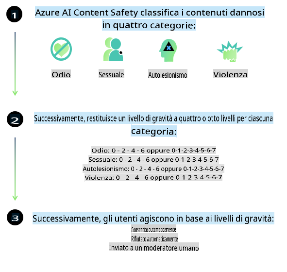
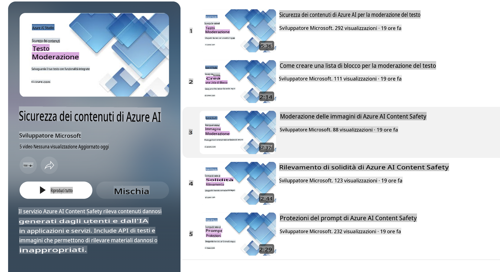

# Sicurezza AI per i modelli Phi

La famiglia di modelli Phi è stata sviluppata in conformità con il [Microsoft Responsible AI Standard](https://query.prod.cms.rt.microsoft.com/cms/api/am/binary/RE5cmFl), un insieme di requisiti aziendali basati sui seguenti sei principi: responsabilità, trasparenza, equità, affidabilità e sicurezza, privacy e sicurezza, e inclusività, che costituiscono i [principi di AI Responsabile di Microsoft](https://www.microsoft.com/ai/responsible-ai).

Come per i precedenti modelli Phi, è stato adottato un approccio di valutazione e formazione post-sviluppo multi-sfaccettato per la sicurezza, con ulteriori misure per tenere conto delle capacità multilingue di questa versione. Il nostro approccio alla formazione e valutazione della sicurezza, che include test in più lingue e categorie di rischio, è descritto nel [Phi Safety Post-Training Paper](https://arxiv.org/abs/2407.13833). Sebbene i modelli Phi traggano vantaggio da questo approccio, gli sviluppatori dovrebbero applicare le migliori pratiche di AI responsabile, inclusa la mappatura, misurazione e mitigazione dei rischi associati al loro specifico caso d'uso e contesto culturale e linguistico.

## Migliori pratiche

Come altri modelli, la famiglia di modelli Phi può potenzialmente comportarsi in modi ingiusti, inaffidabili o offensivi.

Alcuni dei comportamenti limitanti di SLM e LLM di cui essere consapevoli includono:

- **Qualità del servizio:** I modelli Phi sono addestrati principalmente su testi in inglese. Le lingue diverse dall'inglese avranno prestazioni inferiori. Le varianti della lingua inglese con minore rappresentazione nei dati di addestramento potrebbero avere prestazioni peggiori rispetto all'inglese americano standard.
- **Rappresentazione dei danni e perpetuazione degli stereotipi:** Questi modelli possono sovra- o sotto-rappresentare gruppi di persone, cancellare la rappresentazione di alcuni gruppi o rinforzare stereotipi negativi o degradanti. Nonostante la formazione post-sviluppo per la sicurezza, queste limitazioni possono essere ancora presenti a causa dei diversi livelli di rappresentazione dei vari gruppi o della prevalenza di esempi di stereotipi negativi nei dati di addestramento che riflettono schemi del mondo reale e pregiudizi sociali.
- **Contenuti inappropriati o offensivi:** Questi modelli possono produrre altri tipi di contenuti inappropriati o offensivi, che potrebbero renderli inadatti per contesti sensibili senza ulteriori mitigazioni specifiche per il caso d'uso.
- **Affidabilità delle informazioni:** I modelli linguistici possono generare contenuti privi di senso o inventare informazioni che potrebbero sembrare ragionevoli ma sono imprecise o obsolete.
- **Ambito limitato per il codice:** La maggior parte dei dati di addestramento di Phi-3 è basata su Python e utilizza pacchetti comuni come "typing, math, random, collections, datetime, itertools". Se il modello genera script Python che utilizzano altri pacchetti o script in altre lingue, si consiglia vivamente agli utenti di verificare manualmente tutte le API utilizzate.

Gli sviluppatori dovrebbero applicare le migliori pratiche di AI responsabile e sono responsabili di garantire che uno specifico caso d'uso sia conforme alle leggi e normative pertinenti (es. privacy, commercio, ecc.).

## Considerazioni sull'AI Responsabile

Come altri modelli linguistici, i modelli della serie Phi possono potenzialmente comportarsi in modi ingiusti, inaffidabili o offensivi. Alcuni dei comportamenti limitanti di cui essere consapevoli includono:

**Qualità del servizio:** I modelli Phi sono addestrati principalmente su testi in inglese. Le lingue diverse dall'inglese avranno prestazioni inferiori. Le varianti della lingua inglese con minore rappresentazione nei dati di addestramento potrebbero avere prestazioni peggiori rispetto all'inglese americano standard.

**Rappresentazione dei danni e perpetuazione degli stereotipi:** Questi modelli possono sovra- o sotto-rappresentare gruppi di persone, cancellare la rappresentazione di alcuni gruppi o rinforzare stereotipi negativi o degradanti. Nonostante la formazione post-sviluppo per la sicurezza, queste limitazioni possono essere ancora presenti a causa dei diversi livelli di rappresentazione dei vari gruppi o della prevalenza di esempi di stereotipi negativi nei dati di addestramento che riflettono schemi del mondo reale e pregiudizi sociali.

**Contenuti inappropriati o offensivi:** Questi modelli possono produrre altri tipi di contenuti inappropriati o offensivi, che potrebbero renderli inadatti per contesti sensibili senza ulteriori mitigazioni specifiche per il caso d'uso.

**Affidabilità delle informazioni:** I modelli linguistici possono generare contenuti privi di senso o inventare informazioni che potrebbero sembrare ragionevoli ma sono imprecise o obsolete.

**Ambito limitato per il codice:** La maggior parte dei dati di addestramento di Phi-3 è basata su Python e utilizza pacchetti comuni come "typing, math, random, collections, datetime, itertools". Se il modello genera script Python che utilizzano altri pacchetti o script in altre lingue, si consiglia vivamente agli utenti di verificare manualmente tutte le API utilizzate.

Gli sviluppatori dovrebbero applicare le migliori pratiche di AI responsabile e sono responsabili di garantire che uno specifico caso d'uso sia conforme alle leggi e normative pertinenti (es. privacy, commercio, ecc.). Le aree importanti da considerare includono:

**Allocazione:** I modelli potrebbero non essere adatti per scenari che potrebbero avere un impatto significativo sullo status legale o sull'allocazione di risorse o opportunità di vita (es: abitazione, occupazione, credito, ecc.) senza ulteriori valutazioni e tecniche di debiasing aggiuntive.

**Scenari ad alto rischio:** Gli sviluppatori dovrebbero valutare l'idoneità dell'uso dei modelli in scenari ad alto rischio in cui output ingiusti, inaffidabili o offensivi potrebbero essere estremamente costosi o causare danni. Ciò include fornire consigli in contesti sensibili o domini esperti in cui accuratezza e affidabilità sono fondamentali (es: consulenza legale o sanitaria). Dovrebbero essere implementate salvaguardie aggiuntive a livello di applicazione in base al contesto di distribuzione.

**Disinformazione:** I modelli potrebbero produrre informazioni imprecise. Gli sviluppatori dovrebbero seguire le migliori pratiche di trasparenza e informare gli utenti finali che stanno interagendo con un sistema AI. A livello di applicazione, gli sviluppatori possono costruire meccanismi di feedback e pipeline per ancorare le risposte a informazioni contestuali e specifiche per il caso d'uso, una tecnica nota come Retrieval Augmented Generation (RAG).

**Generazione di contenuti dannosi:** Gli sviluppatori dovrebbero valutare gli output in base al loro contesto e utilizzare classificatori di sicurezza disponibili o soluzioni personalizzate appropriate per il loro caso d'uso.

**Uso improprio:** Altre forme di uso improprio, come frodi, spam o produzione di malware, potrebbero essere possibili, e gli sviluppatori dovrebbero garantire che le loro applicazioni non violino leggi e regolamenti applicabili.

### Fine-tuning e sicurezza dei contenuti AI

Dopo aver effettuato il fine-tuning di un modello, raccomandiamo vivamente di utilizzare le misure di [Azure AI Content Safety](https://learn.microsoft.com/azure/ai-services/content-safety/overview) per monitorare i contenuti generati dai modelli, identificare e bloccare potenziali rischi, minacce e problemi di qualità.

[Azure AI Content Safety](https://learn.microsoft.com/azure/ai-services/content-safety/overview) supporta contenuti sia testuali che visivi. Può essere distribuito nel cloud, in container disconnessi e su dispositivi edge/embedded.

## Panoramica di Azure AI Content Safety

Azure AI Content Safety non è una soluzione universale; può essere personalizzata per allinearsi alle politiche specifiche delle aziende. Inoltre, i suoi modelli multilingue gli consentono di comprendere più lingue contemporaneamente.

- **Azure AI Content Safety**
- **Microsoft Developer**
- **5 video**

Il servizio Azure AI Content Safety rileva contenuti dannosi generati dagli utenti e dall'AI in applicazioni e servizi. Include API per testo e immagini che consentono di rilevare materiale dannoso o inappropriato.

[AI Content Safety Playlist](https://www.youtube.com/playlist?list=PLlrxD0HtieHjaQ9bJjyp1T7FeCbmVcPkQ)

**Disclaimer (Avvertenza):**  
Questo documento è stato tradotto utilizzando servizi di traduzione automatica basati su intelligenza artificiale. Sebbene ci impegniamo per garantire l'accuratezza, si prega di tenere presente che le traduzioni automatiche possono contenere errori o imprecisioni. Il documento originale nella sua lingua nativa dovrebbe essere considerato la fonte autorevole. Per informazioni critiche, si raccomanda una traduzione professionale eseguita da un traduttore umano. Non siamo responsabili per eventuali malintesi o interpretazioni errate derivanti dall'uso di questa traduzione.