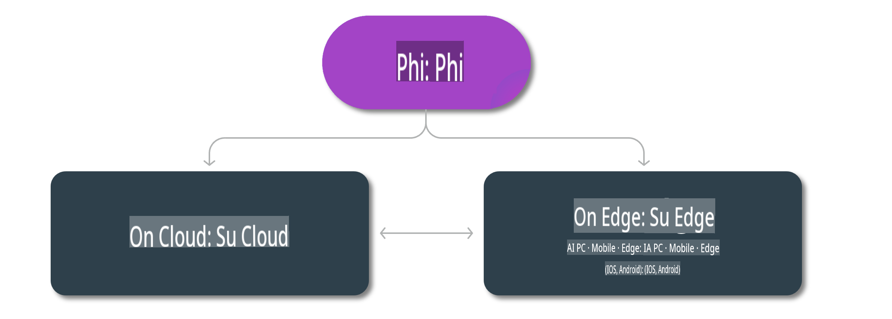

# Modelli Phi e Disponibilità sulle piattaforme

## Scenari Edge & Cloud

## Disponibilità dei modelli e risorse

| | | | | | | | | |
|-|-|-|-|-|-|-|-|-|
|Modello|Input|Lunghezza contenuto|Azure AI (MaaS)|Azure ML (MaaP)|ONNX|Hugging Face|Ollama|Nvidia NIM|
|Phi-3-vision-128k-instruct|Testo+Immagine|128k|[Playground e Distribuzione](https://ai.azure.com/explore/models/Phi-3-vision-128k-instruct/version/2/registry/azureml)|[Playground, Distribuzione e Personalizzazione](https://ml.azure.com/registries/azureml/models/Phi-3-vision-128k-instruct/version/2)|[CUDA](https://huggingface.co/microsoft/Phi-3-vision-128k-instruct-onnx-cuda/tree/main),[CPU](https://huggingface.co/microsoft/Phi-3-vision-128k-instruct-onnx-cpu/tree/main), [DirectML](https://huggingface.co/microsoft/Phi-3-vision-128k-instruct-onnx-directml/tree/main)|[Scarica](https://huggingface.co/microsoft/Phi-3-vision-128k-instruct)|-NA-|[NIM APIs](https://build.nvidia.com/microsoft/phi-3-vision-128k-instruct)|
|Phi-3-mini-4k-instruct|Testo|4k|[Playground e Distribuzione](https://aka.ms/phi3-mini-4k-azure-ml)|[Playground, Distribuzione](https://aka.ms/phi3-mini-4k-azure-ml) e Personalizzazione|[CUDA](https://huggingface.co/microsoft/Phi-3-mini-4k-instruct-onnx), [Web](https://huggingface.co/microsoft/Phi-3-mini-4k-instruct-onnx)|[Playground e Scarica](https://huggingface.co/chat/models/microsoft/Phi-3-mini-4k-instruct)|[GGUF](https://huggingface.co/microsoft/Phi-3-mini-4k-instruct-gguf)|[NIM APIs](https://build.nvidia.com/microsoft/phi-3-mini-4k)|
|Phi-3-mini-128k-instruct|Testo|128k|[Playground e Distribuzione](https://ai.azure.com/explore/models/Phi-3-mini-128k-instruct/version/9/registry/azureml)|[Playground, Distribuzione](https://ai.azure.com/explore/models/Phi-3-mini-128k-instruct/version/9/registry/azureml) e Personalizzazione|[CUDA](https://huggingface.co/microsoft/Phi-3-mini-128k-instruct-onnx)|[Scarica](https://huggingface.co/microsoft/Phi-3-mini-128k-instruct-onnx)|-NA-|[NIM APIs](https://build.nvidia.com/microsoft/phi-3-mini)|
|Phi-3-small-8k-instruct|Testo|8k|[Playground e Distribuzione](https://ml.azure.com/registries/azureml/models/Phi-3-small-8k-instruct/version/2)|[Playground, Distribuzione](https://ai.azure.com/explore/models/Phi-3-small-8k-instruct/version/2/registry/azureml) e Personalizzazione|[CUDA](https://huggingface.co/microsoft/Phi-3-small-8k-instruct-onnx-cuda)|[Scarica](https://huggingface.co/microsoft/Phi-3-small-8k-instruct-onnx-cuda)|-NA-|[NIM APIs](https://build.nvidia.com/microsoft/phi-3-small-8k-instruct?docker=false)|
|Phi-3-small-128k-instruct|Testo|128k|[Playground e Distribuzione](https://ai.azure.com/explore/models/Phi-3-small-128k-instruct/version/2/registry/azureml)|[Playground, Distribuzione](https://ml.azure.com/registries/azureml/models/Phi-3-small-128k-instruct/version/2) e Personalizzazione|[CUDA](https://huggingface.co/microsoft/Phi-3-medium-128k-instruct-onnx-cuda)|[Scarica](https://huggingface.co/microsoft/Phi-3-small-128k-instruct)|-NA-|[NIM APIs](https://build.nvidia.com/microsoft/phi-3-small-128k-instruct?docker=false)|
|Phi-3-medium-4k-instruct|Testo|4k|[Playground e Distribuzione](https://huggingface.co/microsoft/Phi-3-medium-4k-instruct)|[Playground, Distribuzione](https://ml.azure.com/registries/azureml/models/Phi-3-medium-4k-instruct/version/2) e Fine-tuning|[CUDA](https://huggingface.co/microsoft/Phi-3-medium-4k-instruct-onnx-cuda/tree/main), [CPU](https://huggingface.co/microsoft/Phi-3-medium-4k-instruct-onnx-cpu/tree/main), [DirectML](https://huggingface.co/microsoft/Phi-3-medium-4k-instruct-onnx-directml/tree/main)|[Scarica](https://huggingface.co/microsoft/Phi-3-medium-4k-instruct)|-NA-|[NIM APIs](https://build.nvidia.com/microsoft/phi-3-medium-4k-instruct?docker=false)|
|Phi-3-medium-128k-instruct|Testo|128k|[Playground e Distribuzione](https://ai.azure.com/explore/models/Phi-3-medium-128k-instruct/version/2)|[Playground, Distribuzione](https://ml.azure.com/registries/azureml/models/Phi-3-medium-128k-instruct/version/2) e Fine-tuning|[CUDA](https://huggingface.co/microsoft/Phi-3-medium-128k-instruct-onnx-cuda/tree/main), [CPU](https://huggingface.co/microsoft/Phi-3-medium-128k-instruct-onnx-cpu/tree/main), [DirectML](https://huggingface.co/microsoft/Phi-3-medium-128k-instruct-onnx-directml/tree/main)|[Scarica](https://huggingface.co/microsoft/Phi-3-medium-128k-instruct)|-NA-|-NA-|

**Disclaimer**:  
Questo documento è stato tradotto utilizzando servizi di traduzione automatica basati sull'intelligenza artificiale. Sebbene ci impegniamo per garantire l'accuratezza, si prega di notare che le traduzioni automatiche potrebbero contenere errori o imprecisioni. Il documento originale nella sua lingua nativa dovrebbe essere considerato la fonte autorevole. Per informazioni critiche, si raccomanda una traduzione professionale effettuata da un essere umano. Non siamo responsabili per eventuali incomprensioni o interpretazioni errate derivanti dall'uso di questa traduzione.