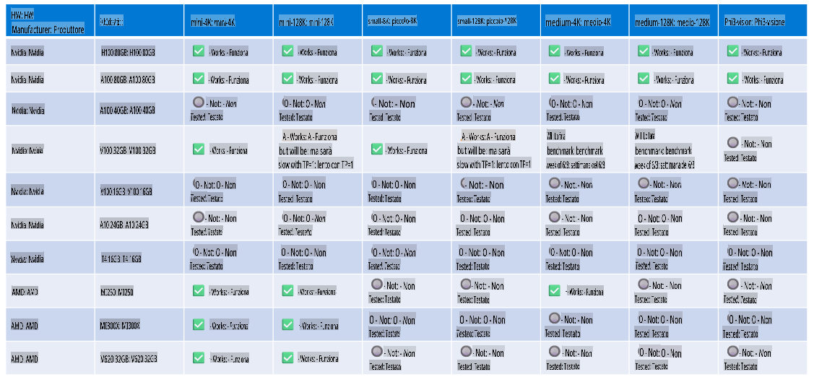

# Supporto Hardware Phi

Microsoft Phi è stato ottimizzato per ONNX Runtime e supporta Windows DirectML. Funziona bene su diversi tipi di hardware, inclusi GPU, CPU e persino dispositivi mobili.

## Hardware del Dispositivo  
In particolare, l'hardware supportato include:

- GPU SKU: RTX 4090 (DirectML)
- GPU SKU: 1 A100 80GB (CUDA)
- CPU SKU: Standard F64s v2 (64 vCPU, 128 GiB di memoria)

## SKU Mobile

- Android - Samsung Galaxy S21
- Apple iPhone 14 o superiore con Processore A16/A17

## Specifiche Hardware Phi

- Configurazione minima richiesta.
- Windows: GPU compatibile con DirectX 12 e almeno 4GB di RAM complessiva

CUDA: GPU NVIDIA con Compute Capability >= 7.02



## Esecuzione di onnxruntime su più GPU

Attualmente, i modelli Phi ONNX disponibili sono solo per 1 GPU. È possibile supportare più GPU per i modelli Phi, ma ORT con 2 GPU non garantisce un throughput maggiore rispetto a 2 istanze di ORT. Consultare [ONNX Runtime](https://onnxruntime.ai/) per gli aggiornamenti più recenti.

Al [Build 2024 il team GenAI ONNX](https://youtu.be/WLW4SE8M9i8?si=EtG04UwDvcjunyfC) ha annunciato di aver abilitato l'utilizzo di più istanze anziché più GPU per i modelli Phi.

Attualmente ciò consente di eseguire un'istanza di onnxruntime o onnxruntime-genai utilizzando la variabile di ambiente CUDA_VISIBLE_DEVICES in questo modo.

```Python
CUDA_VISIBLE_DEVICES=0 python infer.py
CUDA_VISIBLE_DEVICES=1 python infer.py
```

Sentiti libero di esplorare ulteriormente Phi su [Azure AI Foundry](https://ai.azure.com)

**Disclaimer (Avvertenza):**  
Questo documento è stato tradotto utilizzando servizi di traduzione automatizzati basati su intelligenza artificiale. Sebbene ci impegniamo per garantire l'accuratezza, si prega di notare che le traduzioni automatiche possono contenere errori o imprecisioni. Il documento originale nella sua lingua madre dovrebbe essere considerato la fonte autorevole. Per informazioni critiche, si raccomanda una traduzione professionale effettuata da un traduttore umano. Non siamo responsabili per eventuali malintesi o interpretazioni errate derivanti dall'uso di questa traduzione.