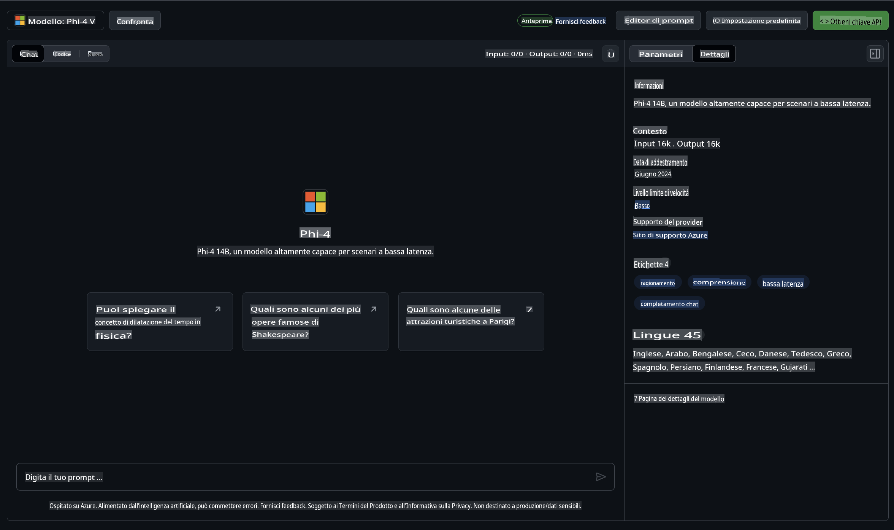

## Famiglia Phi nel Catalogo Modelli di GitHub

Benvenuto su [GitHub Models](https://github.com/marketplace/models)! Siamo pronti per farti esplorare i Modelli AI ospitati su Azure AI.


Per maggiori informazioni sui Modelli disponibili su GitHub Models, visita il [GitHub Model Marketplace](https://github.com/marketplace/models).

## Modelli Disponibili

Ogni modello ha un playground dedicato e codice di esempio.



### Famiglia Phi nel Catalogo Modelli di GitHub

- [Phi-4](https://github.com/marketplace/models/azureml/Phi-4)

- [Phi-3.5-MoE instruct (128k)](https://github.com/marketplace/models/azureml/Phi-3-5-MoE-instruct)

- [Phi-3.5-vision instruct (128k)](https://github.com/marketplace/models/azureml/Phi-3-5-vision-instruct)

- [Phi-3.5-mini instruct (128k)](https://github.com/marketplace/models/azureml/Phi-3-5-mini-instruct)

- [Phi-3-Medium-128k-Instruct](https://github.com/marketplace/models/azureml/Phi-3-medium-128k-instruct)

- [Phi-3-medium-4k-instruct](https://github.com/marketplace/models/azureml/Phi-3-medium-4k-instruct)

- [Phi-3-mini-128k-instruct](https://github.com/marketplace/models/azureml/Phi-3-mini-128k-instruct)

- [Phi-3-mini-4k-instruct](https://github.com/marketplace/models/azureml/Phi-3-mini-4k-instruct)

- [Phi-3-small-128k-instruct](https://github.com/marketplace/models/azureml/Phi-3-small-128k-instruct)

- [Phi-3-small-8k-instruct](https://github.com/marketplace/models/azureml/Phi-3-small-8k-instruct)

## Per Iniziare

Ci sono alcuni esempi base pronti per essere eseguiti. Puoi trovarli nella directory dei campioni. Se vuoi passare subito al tuo linguaggio preferito, puoi trovare gli esempi nei seguenti linguaggi:

- Python  
- JavaScript  
- C#  
- Java  
- cURL  

Esiste anche un ambiente Codespaces dedicato per eseguire i campioni e i modelli.


## Codice di Esempio

Di seguito trovi frammenti di codice per alcuni casi d'uso. Per ulteriori informazioni sull'Azure AI Inference SDK, consulta la documentazione completa e gli esempi.

## Configurazione

1. Crea un token di accesso personale  
Non è necessario assegnare permessi al token. Nota che il token sarà inviato a un servizio Microsoft.

Per utilizzare i frammenti di codice riportati di seguito, crea una variabile d'ambiente per impostare il tuo token come chiave per il codice client.

Se utilizzi bash:  
```
export GITHUB_TOKEN="<your-github-token-goes-here>"
```  
Se utilizzi powershell:  

```
$Env:GITHUB_TOKEN="<your-github-token-goes-here>"
```  

Se utilizzi il prompt dei comandi di Windows:  

```
set GITHUB_TOKEN=<your-github-token-goes-here>
```  

## Esempio Python

### Installa le dipendenze  
Installa l'Azure AI Inference SDK utilizzando pip (Requisiti: Python >=3.8):  

```
pip install azure-ai-inference
```  

### Esegui un esempio base di codice  

Questo esempio dimostra una chiamata base all'API di completamento chat. Utilizza l'endpoint di inferenza del modello AI di GitHub e il tuo token GitHub. La chiamata è sincrona.

```python
import os
from azure.ai.inference import ChatCompletionsClient
from azure.ai.inference.models import SystemMessage, UserMessage
from azure.core.credentials import AzureKeyCredential

endpoint = "https://models.inference.ai.azure.com"
model_name = "Phi-4"
token = os.environ["GITHUB_TOKEN"]

client = ChatCompletionsClient(
    endpoint=endpoint,
    credential=AzureKeyCredential(token),
)

response = client.complete(
    messages=[
        UserMessage(content="I have $20,000 in my savings account, where I receive a 4% profit per year and payments twice a year. Can you please tell me how long it will take for me to become a millionaire? Also, can you please explain the math step by step as if you were explaining it to an uneducated person?"),
    ],
    temperature=0.4,
    top_p=1.0,
    max_tokens=2048,
    model=model_name
)

print(response.choices[0].message.content)
```  

### Esegui una conversazione multi-turno  

Questo esempio dimostra una conversazione multi-turno con l'API di completamento chat. Quando utilizzi il modello per un'applicazione di chat, dovrai gestire lo storico della conversazione e inviare i messaggi più recenti al modello.

```
import os
from azure.ai.inference import ChatCompletionsClient
from azure.ai.inference.models import AssistantMessage, SystemMessage, UserMessage
from azure.core.credentials import AzureKeyCredential

token = os.environ["GITHUB_TOKEN"]
endpoint = "https://models.inference.ai.azure.com"
# Replace Model_Name
model_name = "Phi-4"

client = ChatCompletionsClient(
    endpoint=endpoint,
    credential=AzureKeyCredential(token),
)

messages = [
    SystemMessage(content="You are a helpful assistant."),
    UserMessage(content="What is the capital of France?"),
    AssistantMessage(content="The capital of France is Paris."),
    UserMessage(content="What about Spain?"),
]

response = client.complete(messages=messages, model=model_name)

print(response.choices[0].message.content)
```  

### Trasmetti l'output  

Per un'esperienza utente migliore, potresti voler trasmettere la risposta del modello in modo che il primo token appaia subito, evitando di attendere risposte lunghe.

```
import os
from azure.ai.inference import ChatCompletionsClient
from azure.ai.inference.models import SystemMessage, UserMessage
from azure.core.credentials import AzureKeyCredential

token = os.environ["GITHUB_TOKEN"]
endpoint = "https://models.inference.ai.azure.com"
# Replace Model_Name
model_name = "Phi-4"

client = ChatCompletionsClient(
    endpoint=endpoint,
    credential=AzureKeyCredential(token),
)

response = client.complete(
    stream=True,
    messages=[
        SystemMessage(content="You are a helpful assistant."),
        UserMessage(content="Give me 5 good reasons why I should exercise every day."),
    ],
    model=model_name,
)

for update in response:
    if update.choices:
        print(update.choices[0].delta.content or "", end="")

client.close()
```  

## Uso GRATUITO e Limiti di Rate per i Modelli di GitHub


I [limiti di utilizzo gratuito e del playground](https://docs.github.com/en/github-models/prototyping-with-ai-models#rate-limits) sono pensati per aiutarti a sperimentare con i modelli e prototipare la tua applicazione AI. Per utilizzi oltre questi limiti, e per scalare la tua applicazione, devi approvvigionare risorse da un account Azure e autenticarti da lì invece che con il tuo token di accesso personale GitHub. Non è necessario modificare nient'altro nel codice. Usa questo link per scoprire come superare i limiti del livello gratuito in Azure AI.

### Informazioni Importanti

Ricorda che, interagendo con un modello, stai sperimentando con l'AI, quindi sono possibili errori nei contenuti.

La funzionalità è soggetta a vari limiti (inclusi richieste per minuto, richieste per giorno, token per richiesta e richieste simultanee) e non è progettata per casi d'uso in produzione.

GitHub Models utilizza Azure AI Content Safety. Questi filtri non possono essere disattivati come parte dell'esperienza GitHub Models. Se decidi di utilizzare i modelli tramite un servizio a pagamento, configura i tuoi filtri di contenuto per soddisfare le tue esigenze.

Questo servizio è soggetto ai Termini di Pre-rilascio di GitHub.

**Disclaimer**:  
Questo documento è stato tradotto utilizzando servizi di traduzione automatica basati sull'intelligenza artificiale. Sebbene ci impegniamo per garantire l'accuratezza, si prega di notare che le traduzioni automatiche potrebbero contenere errori o imprecisioni. Il documento originale nella sua lingua nativa deve essere considerato la fonte autorevole. Per informazioni critiche, si raccomanda una traduzione professionale effettuata da un essere umano. Non siamo responsabili per eventuali incomprensioni o interpretazioni errate derivanti dall'uso di questa traduzione.