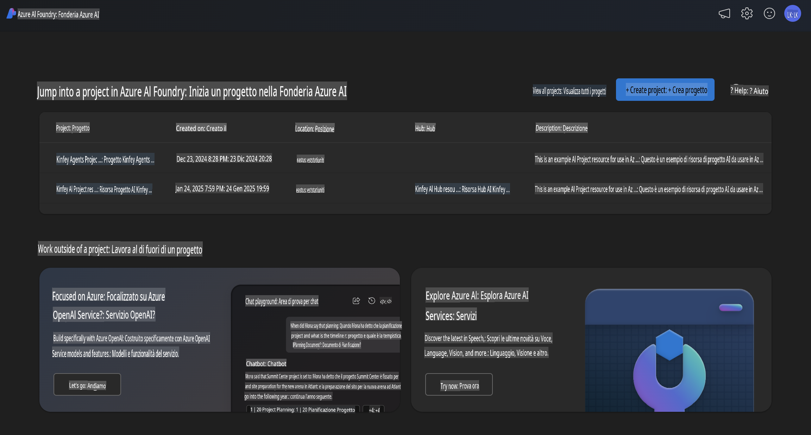
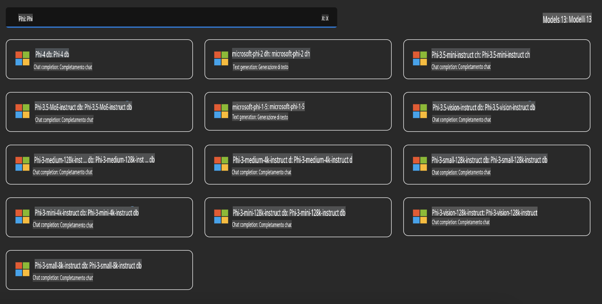
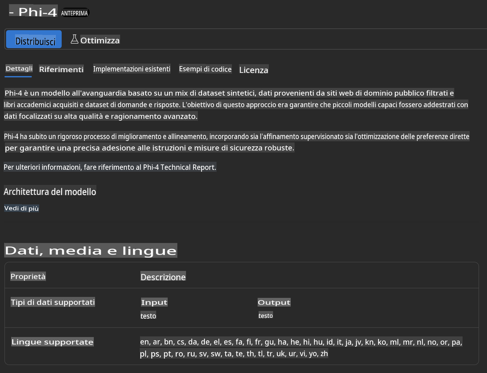
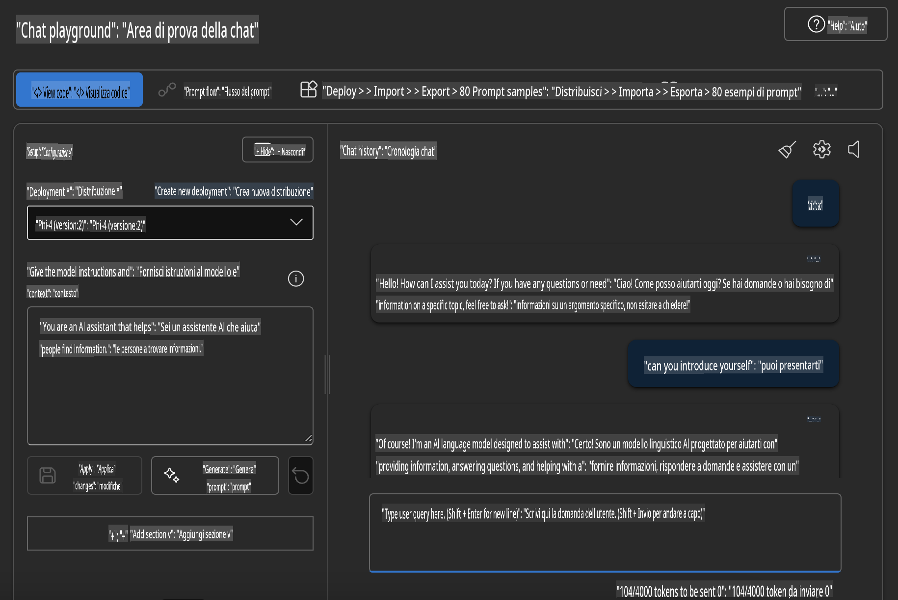

## Famiglia Phi in Azure AI Foundry

[Azure AI Foundry](https://ai.azure.com) è una piattaforma affidabile che consente agli sviluppatori di promuovere l'innovazione e plasmare il futuro con l'AI in modo sicuro, protetto e responsabile.

[Azure AI Foundry](https://ai.azure.com) è progettata per gli sviluppatori per:

- Creare applicazioni di AI generativa su una piattaforma di livello enterprise.
- Esplorare, costruire, testare e distribuire utilizzando strumenti di AI all'avanguardia e modelli di ML, basati su pratiche di AI responsabile.
- Collaborare con un team per l'intero ciclo di vita dello sviluppo delle applicazioni.

Con Azure AI Foundry, puoi esplorare una vasta gamma di modelli, servizi e funzionalità, e iniziare a sviluppare applicazioni AI che meglio soddisfano i tuoi obiettivi. La piattaforma Azure AI Foundry facilita la scalabilità, trasformando proof of concept in applicazioni di produzione complete con facilità. Il monitoraggio continuo e il perfezionamento supportano il successo a lungo termine.



Oltre a utilizzare il servizio Azure AOAI in Azure AI Foundry, puoi anche utilizzare modelli di terze parti presenti nel Catalogo Modelli di Azure AI Foundry. Questa è un'ottima scelta se desideri utilizzare Azure AI Foundry come piattaforma per la tua soluzione AI.

Possiamo distribuire rapidamente i Modelli della Famiglia Phi attraverso il Catalogo Modelli in Azure AI Foundry.



### **Distribuire Phi-4 in Azure AI Foundry**



### **Testare Phi-4 nel Playground di Azure AI Foundry**



### **Eseguire codice Python per chiamare Azure AI Foundry Phi-4**

```python

import os  
import base64
from openai import AzureOpenAI  
from azure.identity import DefaultAzureCredential, get_bearer_token_provider  
        
endpoint = os.getenv("ENDPOINT_URL", "Your Azure AOAI Service Endpoint")  
deployment = os.getenv("DEPLOYMENT_NAME", "Phi-4")  
      
token_provider = get_bearer_token_provider(  
    DefaultAzureCredential(),  
    "https://cognitiveservices.azure.com/.default"  
)  
  
client = AzureOpenAI(  
    azure_endpoint=endpoint,  
    azure_ad_token_provider=token_provider,  
    api_version="2024-05-01-preview",  
)  
  

chat_prompt = [
    {
        "role": "system",
        "content": "You are an AI assistant that helps people find information."
    },
    {
        "role": "user",
        "content": "can you introduce yourself"
    }
] 
    
# Include speech result if speech is enabled  
messages = chat_prompt 

completion = client.chat.completions.create(  
    model=deployment,  
    messages=messages,
    max_tokens=800,  
    temperature=0.7,  
    top_p=0.95,  
    frequency_penalty=0,  
    presence_penalty=0,
    stop=None,  
    stream=False  
)  
  
print(completion.to_json())  

```

**Disclaimer (Avvertenza):**  
Questo documento è stato tradotto utilizzando servizi di traduzione automatica basati sull'intelligenza artificiale. Sebbene ci impegniamo per garantire l'accuratezza, si prega di tenere presente che le traduzioni automatiche possono contenere errori o imprecisioni. Il documento originale nella sua lingua nativa dovrebbe essere considerato la fonte autorevole. Per informazioni critiche, si raccomanda una traduzione professionale effettuata da un traduttore umano. Non siamo responsabili per eventuali incomprensioni o interpretazioni errate derivanti dall'uso di questa traduzione.