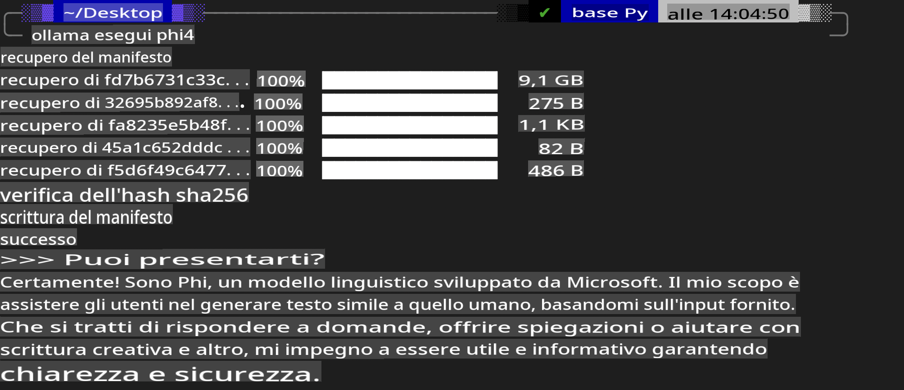
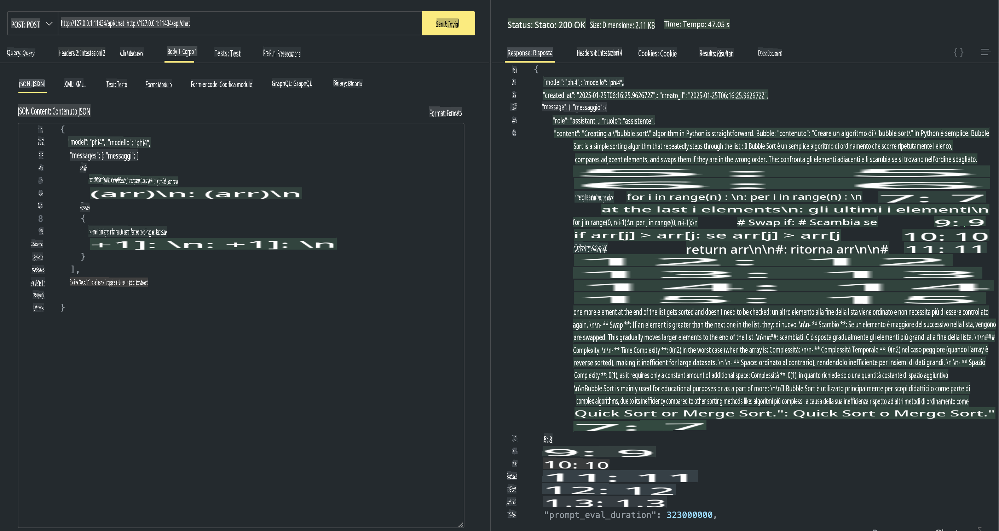

## Famiglia Phi in Ollama

[Ollama](https://ollama.com) consente a più persone di implementare direttamente LLM o SLM open source attraverso semplici script e permette anche di costruire API per supportare scenari applicativi locali come Copilot.

## **1. Installazione**

Ollama è compatibile con Windows, macOS e Linux. Puoi installare Ollama tramite questo link ([https://ollama.com/download](https://ollama.com/download)). Dopo un'installazione riuscita, puoi utilizzare direttamente lo script Ollama per richiamare Phi-3 tramite una finestra terminale. Puoi consultare tutte le [librerie disponibili in Ollama](https://ollama.com/library). Se apri questo repository in un Codespace, Ollama sarà già installato.

```bash

ollama run phi4

```

> [!NOTE]
> Il modello verrà scaricato al primo utilizzo. Naturalmente, puoi anche specificare direttamente il modello Phi-4 già scaricato. Prendiamo WSL come esempio per eseguire il comando. Una volta completato il download del modello, potrai interagire direttamente dal terminale.



## **2. Richiamare l'API phi-4 da Ollama**

Se desideri utilizzare l'API Phi-4 generata da Ollama, puoi avviare il server Ollama eseguendo questo comando nel terminale.

```bash

ollama serve

```

> [!NOTE]
> Se stai utilizzando macOS o Linux, potresti riscontrare il seguente errore **"Error: listen tcp 127.0.0.1:11434: bind: address already in use"**. Questo errore si verifica quando il comando viene eseguito mentre il server è già in esecuzione. Puoi ignorare l'errore, poiché indica che il server è già attivo, oppure puoi fermarlo e riavviare Ollama:

**macOS**

```bash

brew services restart ollama

```

**Linux**

```bash

sudo systemctl stop ollama

```

Ollama supporta due API: generate e chat. Puoi utilizzare l'API del modello fornita da Ollama in base alle tue necessità, inviando richieste al servizio locale in esecuzione sulla porta 11434.

**Chat**

```bash

curl http://127.0.0.1:11434/api/chat -d '{
  "model": "phi3",
  "messages": [
    {
      "role": "system",
      "content": "Your are a python developer."
    },
    {
      "role": "user",
      "content": "Help me generate a bubble algorithm"
    }
  ],
  "stream": false
  
}'

This is the result in Postman



## Additional Resources

Check the list of available models in Ollama in [their library](https://ollama.com/library).

Pull your model from the Ollama server using this command

```bash
ollama pull phi4
```

Run the model using this command

```bash
ollama run phi4
```

***Note:*** Visit this link [https://github.com/ollama/ollama/blob/main/docs/api.md](https://github.com/ollama/ollama/blob/main/docs/api.md) to learn more

## Calling Ollama from Python

You can use `requests` or `urllib3` to make requests to the local server endpoints used above. However, a popular way to use Ollama in Python is via the [openai](https://pypi.org/project/openai/) SDK, since Ollama provides OpenAI-compatible server endpoints as well.

Here is an example for phi3-mini:

```python
import openai

client = openai.OpenAI(
    base_url="http://localhost:11434/v1",
    api_key="nokeyneeded",
)

response = client.chat.completions.create(
    model="phi4",
    temperature=0.7,
    n=1,
    messages=[
        {"role": "system", "content": "Sei un assistente utile."},
        {"role": "user", "content": "Scrivi un haiku su un gatto affamato"},
    ],
)

print("Risposta:")
print(response.choices[0].message.content)
```

## Calling Ollama from JavaScript 

```javascript
// Esempio di riassunto di un file con Phi-4
script({
    model: "ollama:phi4",
    title: "Riassumi con Phi-4",
    system: ["system"],
})

// Esempio di riassunto
const file = def("FILE", env.files)
$`Riassumi ${file} in un unico paragrafo.`
```

## Calling Ollama from C#

Create a new C# Console application and add the following NuGet package:

```bash
dotnet add package Microsoft.SemanticKernel --version 1.34.0
```

Then replace this code in the `Program.cs` file

```csharp
using Microsoft.SemanticKernel;
using Microsoft.SemanticKernel.ChatCompletion;

// aggiungi il servizio di completamento chat utilizzando l'endpoint del server locale Ollama
#pragma warning disable SKEXP0001, SKEXP0003, SKEXP0010, SKEXP0011, SKEXP0050, SKEXP0052
builder.AddOpenAIChatCompletion(
    modelId: "phi4",
    endpoint: new Uri("http://localhost:11434/"),
    apiKey: "non required");

// invoca un semplice prompt al servizio di chat
string prompt = "Scrivi una barzelletta sui gattini";
var response = await kernel.InvokePromptAsync(prompt);
Console.WriteLine(response.GetValue<string>());
```

Run the app with the command:

```bash
dotnet run

**Disclaimer**:  
Questo documento è stato tradotto utilizzando servizi di traduzione automatica basati sull'intelligenza artificiale. Sebbene ci impegniamo per garantire l'accuratezza, si prega di notare che le traduzioni automatiche possono contenere errori o imprecisioni. Il documento originale nella sua lingua nativa deve essere considerato la fonte autorevole. Per informazioni critiche, si raccomanda una traduzione professionale umana. Non siamo responsabili per eventuali incomprensioni o interpretazioni errate derivanti dall'uso di questa traduzione.