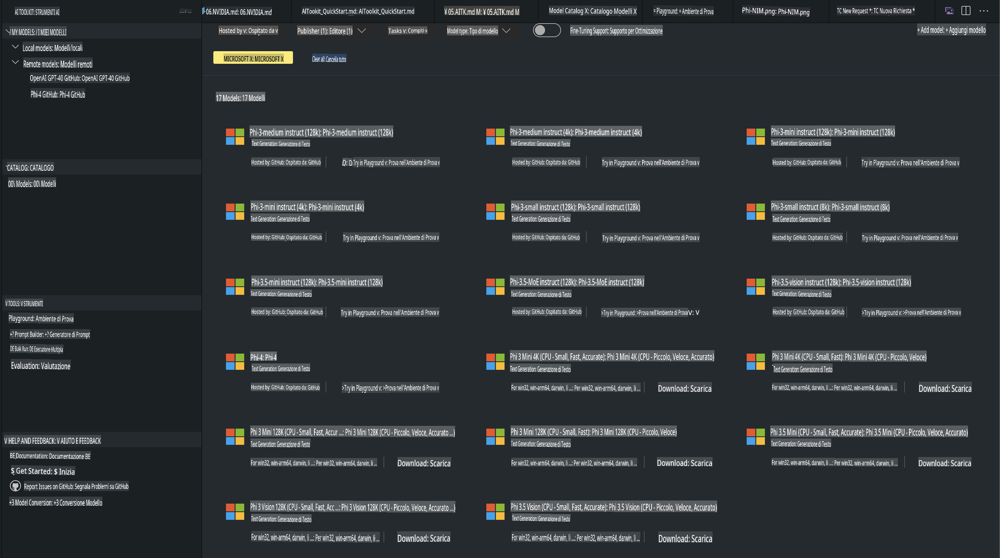
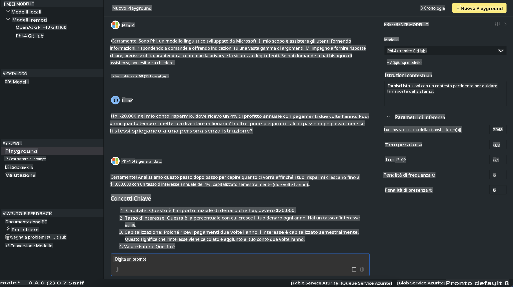

# Famiglia Phi in AITK

[AI Toolkit per VS Code](https://marketplace.visualstudio.com/items?itemName=ms-windows-ai-studio.windows-ai-studio) semplifica lo sviluppo di applicazioni basate su AI generativa, riunendo strumenti avanzati per lo sviluppo AI e modelli dal catalogo Azure AI Foundry e da altri cataloghi come Hugging Face. Potrai esplorare il catalogo dei modelli AI alimentato dai cataloghi di GitHub Models e Azure AI Foundry, scaricarli localmente o in remoto, affinarli, testarli e utilizzarli nella tua applicazione.

La versione Preview di AI Toolkit funziona in locale. L'inferenza locale o l'affinamento dipendono dal modello selezionato: potrebbe essere necessario avere una GPU, come una NVIDIA CUDA GPU. Puoi anche eseguire i modelli GitHub direttamente con AITK.

## Per iniziare

[Scopri di più su come installare il sottosistema Windows per Linux](https://learn.microsoft.com/windows/wsl/install?WT.mc_id=aiml-137032-kinfeylo)

e [cambiare la distribuzione predefinita](https://learn.microsoft.com/windows/wsl/install#change-the-default-linux-distribution-installed).

[Repository GitHub di AI Toolkit](https://github.com/microsoft/vscode-ai-toolkit/)

- Windows, Linux, macOS
  
- Per effettuare l'affinamento sia su Windows che su Linux, avrai bisogno di una GPU Nvidia. Inoltre, **Windows** richiede il sottosistema Windows per Linux con una distribuzione Ubuntu 18.4 o successiva. [Scopri di più su come installare il sottosistema Windows per Linux](https://learn.microsoft.com/windows/wsl/install) e [cambiare la distribuzione predefinita](https://learn.microsoft.com/windows/wsl/install#change-the-default-linux-distribution-installed).

### Installare AI Toolkit

AI Toolkit viene distribuito come [estensione di Visual Studio Code](https://code.visualstudio.com/docs/setup/additional-components#_vs-code-extensions), quindi è necessario installare prima [VS Code](https://code.visualstudio.com/docs/setup/windows?WT.mc_id=aiml-137032-kinfeylo) e scaricare AI Toolkit dal [VS Marketplace](https://marketplace.visualstudio.com/items?itemName=ms-windows-ai-studio.windows-ai-studio).  
[AI Toolkit è disponibile nel Visual Studio Marketplace](https://marketplace.visualstudio.com/items?itemName=ms-windows-ai-studio.windows-ai-studio) e può essere installato come qualsiasi altra estensione di VS Code. 

Se non hai familiarità con l'installazione delle estensioni di VS Code, segui questi passaggi:

### Accedi

1. Nella barra delle attività di VS Code, seleziona **Estensioni**.
1. Nella barra di ricerca delle estensioni, digita "AI Toolkit".
1. Seleziona "AI Toolkit for Visual Studio Code".
1. Seleziona **Installa**.

Ora sei pronto per utilizzare l'estensione!

Ti verrà richiesto di accedere a GitHub, quindi clicca su "Consenti" per continuare. Sarai reindirizzato alla pagina di accesso di GitHub.

Effettua l'accesso e segui i passaggi indicati. Dopo il completamento con successo, sarai reindirizzato a VS Code.

Una volta installata l'estensione, vedrai l'icona di AI Toolkit apparire nella barra delle attività.

Esploriamo le azioni disponibili!

### Azioni disponibili

La barra laterale principale di AI Toolkit è organizzata in  

- **Modelli**
- **Risorse**
- **Playground**  
- **Affinamento**
- **Valutazione**

Queste opzioni sono disponibili nella sezione Risorse. Per iniziare, seleziona **Catalogo Modelli**.

### Scaricare un modello dal catalogo

Avviando AI Toolkit dalla barra laterale di VS Code, puoi scegliere tra le seguenti opzioni:



- Trova un modello supportato nel **Catalogo Modelli** e scaricalo localmente.
- Testa l'inferenza del modello nel **Model Playground**.
- Affina il modello localmente o in remoto in **Model Fine-tuning**.
- Distribuisci i modelli affinati nel cloud tramite il command palette di AI Toolkit.
- Valuta i modelli.

> [!NOTE]
>
> **GPU Vs CPU**
>
> Noterai che le schede dei modelli mostrano la dimensione del modello, la piattaforma e il tipo di acceleratore (CPU, GPU). Per prestazioni ottimizzate su **dispositivi Windows con almeno una GPU**, seleziona versioni di modelli che supportano solo Windows.
>
> Questo garantisce un modello ottimizzato per l'acceleratore DirectML.
>
> I nomi dei modelli seguono il formato:
>
> - `{model_name}-{accelerator}-{quantization}-{format}`.
>
>Per verificare se hai una GPU sul tuo dispositivo Windows, apri **Task Manager** e seleziona la scheda **Prestazioni**. Se hai GPU, saranno elencate con nomi come "GPU 0" o "GPU 1".

### Eseguire il modello nel playground

Dopo aver impostato tutti i parametri, clicca su **Genera Progetto**.

Una volta scaricato il modello, seleziona **Load in Playground** sulla scheda del modello nel catalogo:

- Avvia il download del modello.
- Installa tutti i prerequisiti e le dipendenze.
- Crea un workspace in VS Code.



### Utilizzare la REST API nella tua applicazione 

AI Toolkit include un server web REST API locale **sulla porta 5272** che utilizza il [formato chat completions di OpenAI](https://platform.openai.com/docs/api-reference/chat/create). 

Questo ti consente di testare la tua applicazione localmente senza dover fare affidamento su un servizio cloud di modelli AI. Ad esempio, il seguente file JSON mostra come configurare il corpo della richiesta:

```json
{
    "model": "Phi-4",
    "messages": [
        {
            "role": "user",
            "content": "what is the golden ratio?"
        }
    ],
    "temperature": 0.7,
    "top_p": 1,
    "top_k": 10,
    "max_tokens": 100,
    "stream": true
}
```

Puoi testare la REST API utilizzando (ad esempio) [Postman](https://www.postman.com/) o l'utility CURL (Client URL):

```bash
curl -vX POST http://127.0.0.1:5272/v1/chat/completions -H 'Content-Type: application/json' -d @body.json
```

### Utilizzare la libreria client OpenAI per Python

```python
from openai import OpenAI

client = OpenAI(
    base_url="http://127.0.0.1:5272/v1/", 
    api_key="x" # required for the API but not used
)

chat_completion = client.chat.completions.create(
    messages=[
        {
            "role": "user",
            "content": "what is the golden ratio?",
        }
    ],
    model="Phi-4",
)

print(chat_completion.choices[0].message.content)
```

### Utilizzare la libreria client Azure OpenAI per .NET

Aggiungi la [libreria client Azure OpenAI per .NET](https://www.nuget.org/packages/Azure.AI.OpenAI/) al tuo progetto utilizzando NuGet:

```bash
dotnet add {project_name} package Azure.AI.OpenAI --version 1.0.0-beta.17
```

Aggiungi un file C# chiamato **OverridePolicy.cs** al tuo progetto e incolla il seguente codice:

```csharp
// OverridePolicy.cs
using Azure.Core.Pipeline;
using Azure.Core;

internal partial class OverrideRequestUriPolicy(Uri overrideUri)
    : HttpPipelineSynchronousPolicy
{
    private readonly Uri _overrideUri = overrideUri;

    public override void OnSendingRequest(HttpMessage message)
    {
        message.Request.Uri.Reset(_overrideUri);
    }
}
```

Successivamente, incolla il seguente codice nel tuo file **Program.cs**:

```csharp
// Program.cs
using Azure.AI.OpenAI;

Uri localhostUri = new("http://localhost:5272/v1/chat/completions");

OpenAIClientOptions clientOptions = new();
clientOptions.AddPolicy(
    new OverrideRequestUriPolicy(localhostUri),
    Azure.Core.HttpPipelinePosition.BeforeTransport);
OpenAIClient client = new(openAIApiKey: "unused", clientOptions);

ChatCompletionsOptions options = new()
{
    DeploymentName = "Phi-4",
    Messages =
    {
        new ChatRequestSystemMessage("You are a helpful assistant. Be brief and succinct."),
        new ChatRequestUserMessage("What is the golden ratio?"),
    }
};

StreamingResponse<StreamingChatCompletionsUpdate> streamingChatResponse
    = await client.GetChatCompletionsStreamingAsync(options);

await foreach (StreamingChatCompletionsUpdate chatChunk in streamingChatResponse)
{
    Console.Write(chatChunk.ContentUpdate);
}
```

## Affinamento con AI Toolkit

- Inizia con la scoperta dei modelli e il playground.
- Affinamento dei modelli e inferenza utilizzando risorse di calcolo locali.
- Affinamento e inferenza remoti utilizzando risorse Azure.

[Affinamento con AI Toolkit](../../03.FineTuning/Finetuning_VSCodeaitoolkit.md)

## Risorse di Q&A per AI Toolkit

Consulta la nostra [pagina Q&A](https://github.com/microsoft/vscode-ai-toolkit/blob/main/archive/QA.md) per le problematiche più comuni e le relative soluzioni.

**Disclaimer (Avvertenza)**:  
Questo documento è stato tradotto utilizzando servizi di traduzione automatica basati su intelligenza artificiale. Sebbene ci impegniamo per garantire l'accuratezza, si prega di notare che le traduzioni automatiche possono contenere errori o imprecisioni. Il documento originale nella sua lingua madre dovrebbe essere considerato la fonte autorevole. Per informazioni critiche, si consiglia una traduzione professionale effettuata da un traduttore umano. Non siamo responsabili per eventuali fraintendimenti o interpretazioni errate derivanti dall'uso di questa traduzione.