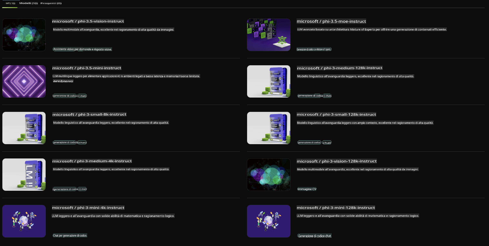

## Famiglia Phi in NVIDIA NIM

NVIDIA NIM è un insieme di microservizi facili da usare progettati per accelerare il deployment di modelli di intelligenza artificiale generativa su cloud, data center e workstation. I NIM sono categorizzati per famiglia di modelli e su base per modello. Ad esempio, NVIDIA NIM per modelli di linguaggio di grandi dimensioni (LLM) porta la potenza degli LLM più avanzati nelle applicazioni aziendali, offrendo capacità senza pari di elaborazione e comprensione del linguaggio naturale.

NIM semplifica il compito per i team IT e DevOps di ospitare autonomamente modelli di linguaggio di grandi dimensioni (LLM) nei propri ambienti gestiti, fornendo al contempo agli sviluppatori API standard di settore che consentono loro di creare potenti copiloti, chatbot e assistenti AI in grado di trasformare il loro business. Grazie all'accelerazione GPU all'avanguardia di NVIDIA e al deployment scalabile, NIM offre il percorso più rapido per l'inferenza con prestazioni senza eguali.

Puoi utilizzare NVIDIA NIM per inferenza con i modelli della Famiglia Phi.



### **Esempi - Phi-3-Vision in NVIDIA NIM**

Immagina di avere un'immagine (`demo.png`) e di voler generare del codice Python che elabori questa immagine e ne salvi una nuova versione (`phi-3-vision.jpg`).

Il codice sopra automatizza questo processo attraverso:

1. Configurazione dell'ambiente e delle impostazioni necessarie.
2. Creazione di un prompt che istruisca il modello a generare il codice Python richiesto.
3. Invio del prompt al modello e raccolta del codice generato.
4. Estrazione ed esecuzione del codice generato.
5. Visualizzazione dell'immagine originale e di quella elaborata.

Questo approccio sfrutta la potenza dell'AI per automatizzare i compiti di elaborazione delle immagini, rendendo più facile e veloce il raggiungimento dei tuoi obiettivi.

[Soluzione Codice di Esempio](../../../../../code/06.E2E/E2E_Nvidia_NIM_Phi3_Vision.ipynb)

Ecco una spiegazione passo per passo di cosa fa l'intero codice:

1. **Installazione del Pacchetto Necessario**:
    ```python
    !pip install langchain_nvidia_ai_endpoints -U
    ```
    Questo comando installa il pacchetto `langchain_nvidia_ai_endpoints`, assicurandosi che sia l'ultima versione.

2. **Importazione dei Moduli Necessari**:
    ```python
    from langchain_nvidia_ai_endpoints import ChatNVIDIA
    import getpass
    import os
    import base64
    ```
    Questi import portano i moduli necessari per interagire con gli endpoint NVIDIA AI, gestire le password in modo sicuro, interagire con il sistema operativo e codificare/decodificare dati in formato base64.

3. **Configurazione della Chiave API**:
    ```python
    if not os.getenv("NVIDIA_API_KEY"):
        os.environ["NVIDIA_API_KEY"] = getpass.getpass("Enter your NVIDIA API key: ")
    ```
    Questo codice verifica se la variabile di ambiente `NVIDIA_API_KEY` è impostata. In caso contrario, richiede all'utente di inserire la chiave API in modo sicuro.

4. **Definizione del Modello e del Percorso dell'Immagine**:
    ```python
    model = 'microsoft/phi-3-vision-128k-instruct'
    chat = ChatNVIDIA(model=model)
    img_path = './imgs/demo.png'
    ```
    Questo definisce il modello da utilizzare, crea un'istanza di `ChatNVIDIA` con il modello specificato e definisce il percorso del file immagine.

5. **Creazione del Prompt Testuale**:
    ```python
    text = "Please create Python code for image, and use plt to save the new picture under imgs/ and name it phi-3-vision.jpg."
    ```
    Questo definisce un prompt testuale che istruisce il modello a generare codice Python per elaborare un'immagine.

6. **Codifica dell'Immagine in Base64**:
    ```python
    with open(img_path, "rb") as f:
        image_b64 = base64.b64encode(f.read()).decode()
    image = f''
    ```
    Questo codice legge il file immagine, lo codifica in base64 e crea un tag immagine HTML con i dati codificati.

7. **Combinazione di Testo e Immagine nel Prompt**:
    ```python
    prompt = f"{text} {image}"
    ```
    Questo combina il prompt testuale e il tag immagine HTML in una singola stringa.

8. **Generazione del Codice Usando ChatNVIDIA**:
    ```python
    code = ""
    for chunk in chat.stream(prompt):
        print(chunk.content, end="")
        code += chunk.content
    ```
    Questo codice invia il prompt a `ChatNVIDIA` model and collects the generated code in chunks, printing and appending each chunk to the `code` string.

9. **Estrazione del Codice Python dal Contenuto Generato**:
    ```python
    begin = code.index('```python') + 9
    code = code[begin:]
    end = code.index('```')
    code = code[:end]
    ```
    Questo estrae il codice Python effettivo dal contenuto generato rimuovendo la formattazione markdown.

10. **Esecuzione del Codice Generato**:
    ```python
    import subprocess
    result = subprocess.run(["python", "-c", code], capture_output=True)
    ```
    Questo esegue il codice Python estratto come un sottoprocesso e ne cattura l'output.

11. **Visualizzazione delle Immagini**:
    ```python
    from IPython.display import Image, display
    display(Image(filename='./imgs/phi-3-vision.jpg'))
    display(Image(filename='./imgs/demo.png'))
    ```
    Queste righe visualizzano le immagini utilizzando il modulo `IPython.display`.

**Disclaimer (Avvertenza):**  
Questo documento è stato tradotto utilizzando servizi di traduzione automatizzati basati sull'intelligenza artificiale. Sebbene ci impegniamo per garantire l'accuratezza, si prega di tenere presente che le traduzioni automatiche possono contenere errori o imprecisioni. Il documento originale nella sua lingua nativa deve essere considerato la fonte autorevole. Per informazioni critiche, si consiglia una traduzione professionale umana. Non siamo responsabili per eventuali malintesi o interpretazioni errate derivanti dall'uso di questa traduzione.