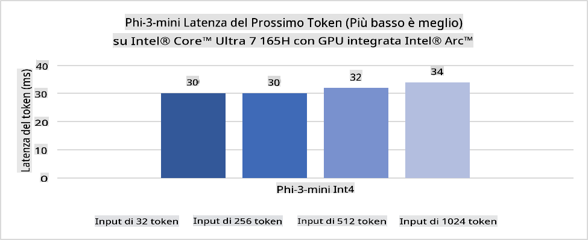
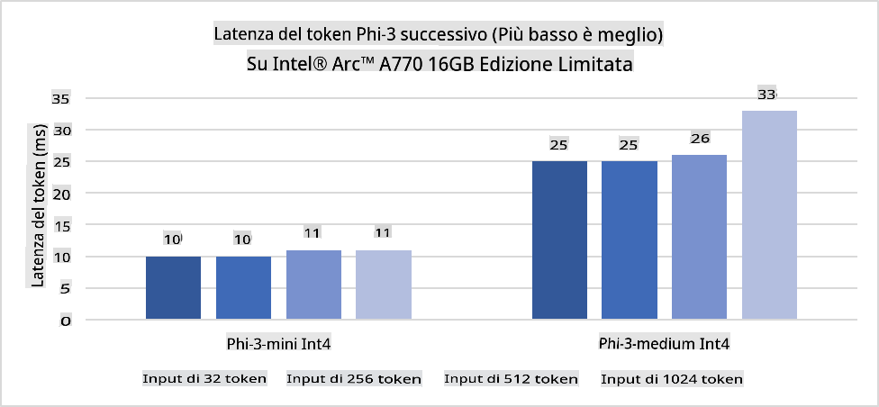
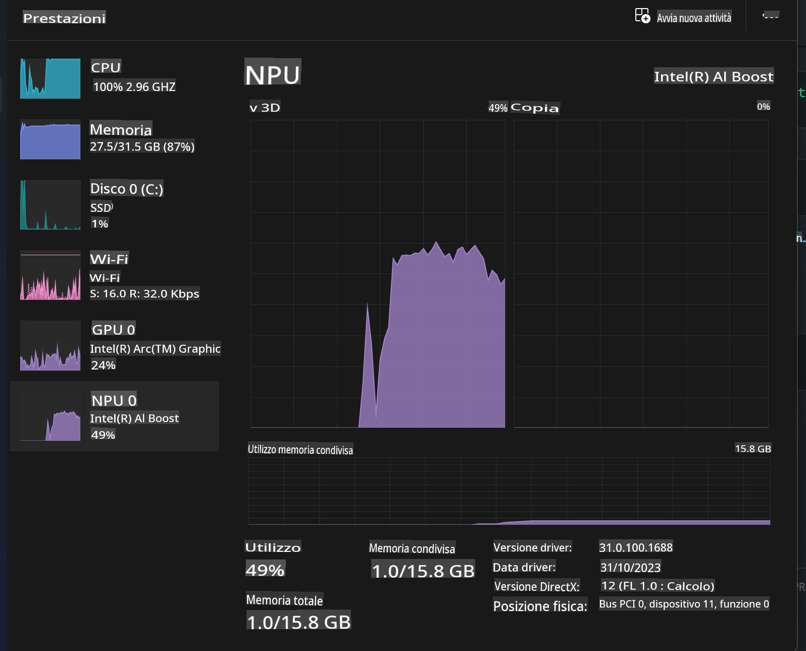
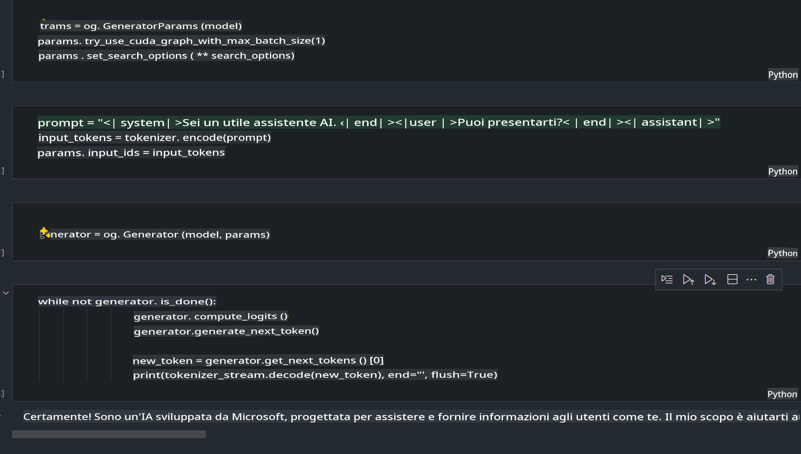
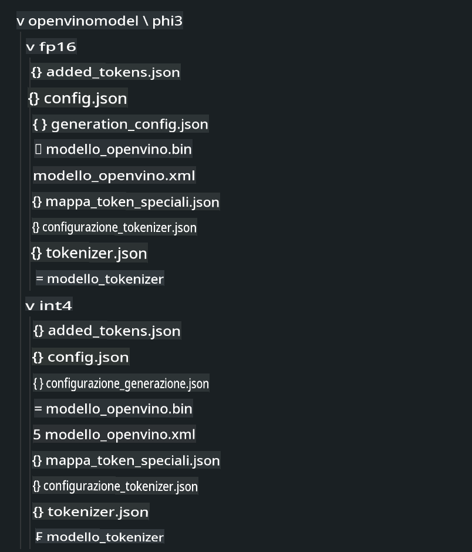
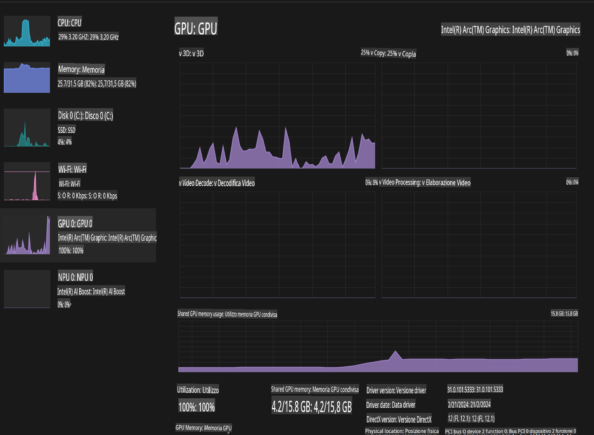

# **Inferenza di Phi-3 su AI PC**

Con l'avanzamento dell'AI generativa e il miglioramento delle capacità hardware dei dispositivi edge, un numero crescente di modelli di AI generativa può ora essere integrato nei dispositivi Bring Your Own Device (BYOD) degli utenti. Gli AI PC rientrano tra questi modelli. A partire dal 2024, Intel, AMD e Qualcomm hanno collaborato con i produttori di PC per introdurre gli AI PC, che permettono il deployment di modelli di AI generativa localizzati attraverso modifiche hardware. In questa discussione ci concentreremo sugli AI PC Intel e analizzeremo come implementare Phi-3 su un AI PC Intel.

### Cos'è un NPU

Un NPU (Neural Processing Unit) è un processore dedicato o un'unità di elaborazione su un SoC più grande, progettato specificamente per accelerare le operazioni delle reti neurali e i compiti di AI. A differenza delle CPU e GPU generiche, gli NPU sono ottimizzati per un'elaborazione parallela orientata ai dati, rendendoli estremamente efficienti nel gestire grandi quantità di dati multimediali come video e immagini e nell'elaborazione di dati per reti neurali. Sono particolarmente abili nell'eseguire attività legate all'AI, come il riconoscimento vocale, la sfocatura dello sfondo nelle videochiamate e i processi di editing foto o video, come il rilevamento di oggetti.

## NPU vs GPU

Sebbene molti carichi di lavoro di AI e machine learning vengano eseguiti su GPU, esiste una distinzione fondamentale tra GPU e NPU.  
Le GPU sono note per le loro capacità di elaborazione parallela, ma non tutte le GPU sono altrettanto efficienti oltre l'elaborazione grafica. Gli NPU, invece, sono progettati appositamente per i calcoli complessi delle operazioni di reti neurali, rendendoli estremamente efficaci per i compiti di AI.

In sintesi, gli NPU sono i "geni della matematica" che accelerano i calcoli di AI e svolgono un ruolo chiave nella nuova era degli AI PC!

***Questo esempio si basa sull'ultimo Intel Core Ultra Processor***

## **1. Utilizzare l'NPU per eseguire il modello Phi-3**

Il dispositivo Intel® NPU è un acceleratore di inferenza AI integrato nelle CPU client Intel, a partire dalla generazione di CPU Intel® Core™ Ultra (precedentemente nota come Meteor Lake). Consente l'esecuzione efficiente in termini di energia di compiti di reti neurali artificiali.





**Intel NPU Acceleration Library**

La Intel NPU Acceleration Library [https://github.com/intel/intel-npu-acceleration-library](https://github.com/intel/intel-npu-acceleration-library) è una libreria Python progettata per aumentare l'efficienza delle applicazioni sfruttando la potenza dell'Intel Neural Processing Unit (NPU) per eseguire calcoli ad alta velocità su hardware compatibile.

Esempio di Phi-3-mini su un AI PC alimentato da processori Intel® Core™ Ultra.


Installa la libreria Python con pip

```bash

   pip install intel-npu-acceleration-library

```

***Nota*** Il progetto è ancora in fase di sviluppo, ma il modello di riferimento è già molto completo.

### **Eseguire Phi-3 con Intel NPU Acceleration Library**

Utilizzando l'accelerazione Intel NPU, questa libreria non influenza il processo di codifica tradizionale. È sufficiente utilizzare questa libreria per quantizzare il modello Phi-3 originale, ad esempio FP16, INT8, INT4, come mostrato di seguito:

```python
from transformers import AutoTokenizer, pipeline,TextStreamer
from intel_npu_acceleration_library import NPUModelForCausalLM, int4
from intel_npu_acceleration_library.compiler import CompilerConfig
import warnings

model_id = "microsoft/Phi-3-mini-4k-instruct"

compiler_conf = CompilerConfig(dtype=int4)
model = NPUModelForCausalLM.from_pretrained(
    model_id, use_cache=True, config=compiler_conf, attn_implementation="sdpa"
).eval()

tokenizer = AutoTokenizer.from_pretrained(model_id)

text_streamer = TextStreamer(tokenizer, skip_prompt=True)
```

Dopo il successo della quantizzazione, continua l'esecuzione per chiamare l'NPU ed eseguire il modello Phi-3.

```python
generation_args = {
   "max_new_tokens": 1024,
   "return_full_text": False,
   "temperature": 0.3,
   "do_sample": False,
   "streamer": text_streamer,
}

pipe = pipeline(
   "text-generation",
   model=model,
   tokenizer=tokenizer,
)

query = "<|system|>You are a helpful AI assistant.<|end|><|user|>Can you introduce yourself?<|end|><|assistant|>"

with warnings.catch_warnings():
    warnings.simplefilter("ignore")
    pipe(query, **generation_args)
```

Durante l'esecuzione del codice, possiamo visualizzare lo stato di funzionamento dell'NPU tramite il Task Manager.



***Esempi*** : [AIPC_NPU_DEMO.ipynb](../../../../../code/03.Inference/AIPC/AIPC_NPU_DEMO.ipynb)

## **2. Utilizzare DirectML + ONNX Runtime per eseguire il modello Phi-3**

### **Cos'è DirectML**

[DirectML](https://github.com/microsoft/DirectML) è una libreria DirectX 12 ad alte prestazioni e hardware-accelerata per il machine learning. DirectML fornisce accelerazione GPU per compiti comuni di machine learning su un'ampia gamma di hardware e driver supportati, inclusi tutti i GPU compatibili con DirectX 12 di fornitori come AMD, Intel, NVIDIA e Qualcomm.

Quando utilizzata in modo autonomo, l'API DirectML è una libreria DirectX 12 di basso livello ed è adatta per applicazioni ad alte prestazioni e bassa latenza come framework, giochi e altre applicazioni in tempo reale. L'interoperabilità senza soluzione di continuità di DirectML con Direct3D 12, oltre al suo basso overhead e alla conformità tra hardware, rende DirectML ideale per accelerare il machine learning quando si desiderano alte prestazioni e affidabilità nei risultati su hardware diversi.

***Nota*** : L'ultima versione di DirectML supporta già l'NPU (https://devblogs.microsoft.com/directx/introducing-neural-processor-unit-npu-support-in-directml-developer-preview/)

### DirectML e CUDA in termini di capacità e prestazioni:

**DirectML** è una libreria di machine learning sviluppata da Microsoft. È progettata per accelerare i carichi di lavoro di machine learning su dispositivi Windows, inclusi desktop, laptop e dispositivi edge.
- Basato su DX12: DirectML è costruito sopra DirectX 12 (DX12), che offre un'ampia gamma di supporto hardware tra GPU, incluse NVIDIA e AMD.
- Supporto più ampio: Poiché sfrutta DX12, DirectML può funzionare con qualsiasi GPU che supporta DX12, anche GPU integrate.
- Elaborazione delle immagini: DirectML elabora immagini e altri dati utilizzando reti neurali, rendendolo adatto per compiti come il riconoscimento di immagini, il rilevamento di oggetti e altro.
- Facilità di configurazione: Configurare DirectML è semplice e non richiede SDK o librerie specifiche dai produttori di GPU.
- Prestazioni: In alcuni casi, DirectML offre buone prestazioni e può essere più veloce di CUDA, specialmente per determinati carichi di lavoro.
- Limitazioni: Tuttavia, ci sono situazioni in cui DirectML può essere più lento, in particolare per batch di grandi dimensioni in float16.

**CUDA** è la piattaforma di calcolo parallelo e il modello di programmazione di NVIDIA. Consente agli sviluppatori di sfruttare la potenza delle GPU NVIDIA per il calcolo generico, incluso il machine learning e le simulazioni scientifiche.
- Specifico per NVIDIA: CUDA è strettamente integrato con le GPU NVIDIA ed è progettato specificamente per esse.
- Altamente ottimizzato: Fornisce prestazioni eccellenti per i compiti accelerati dalla GPU, specialmente quando si utilizzano GPU NVIDIA.
- Ampiamente utilizzato: Molti framework e librerie di machine learning (come TensorFlow e PyTorch) supportano CUDA.
- Personalizzazione: Gli sviluppatori possono ottimizzare le impostazioni CUDA per compiti specifici, il che può portare a prestazioni ottimali.
- Limitazioni: Tuttavia, la dipendenza dall'hardware NVIDIA può essere limitante se si desidera una compatibilità più ampia tra GPU diverse.

### Scegliere tra DirectML e CUDA

La scelta tra DirectML e CUDA dipende dal caso d'uso specifico, dalla disponibilità dell'hardware e dalle preferenze.  
Se si cerca una compatibilità più ampia e una configurazione semplice, DirectML potrebbe essere una buona scelta. Tuttavia, se si dispone di GPU NVIDIA e si necessita di prestazioni altamente ottimizzate, CUDA rimane un'opzione valida. In sintesi, sia DirectML che CUDA hanno i loro punti di forza e debolezze, quindi considera i tuoi requisiti e l'hardware disponibile per prendere una decisione.

### **AI generativa con ONNX Runtime**

Nell'era dell'AI, la portabilità dei modelli di AI è molto importante. ONNX Runtime consente di implementare facilmente modelli addestrati su dispositivi diversi. Gli sviluppatori non devono preoccuparsi del framework di inferenza e possono utilizzare un'API unificata per completare l'inferenza del modello. Nell'era dell'AI generativa, ONNX Runtime ha anche effettuato ottimizzazioni del codice (https://onnxruntime.ai/docs/genai/). Attraverso l'ONNX Runtime ottimizzato, il modello di AI generativa quantizzato può essere eseguito su terminali diversi. Con ONNX Runtime per l'AI generativa, puoi utilizzare l'API del modello di AI con Python, C#, C / C++. Ovviamente, il deployment su iPhone può sfruttare l'API di ONNX Runtime in C++.

[Codice di esempio](https://github.com/Azure-Samples/Phi-3MiniSamples/tree/main/onnx)

***Compilare l'AI generativa con la libreria ONNX Runtime***

```bash

winget install --id=Kitware.CMake  -e

git clone https://github.com/microsoft/onnxruntime.git

cd .\onnxruntime\

./build.bat --build_shared_lib --skip_tests --parallel --use_dml --config Release

cd ../

git clone https://github.com/microsoft/onnxruntime-genai.git

cd .\onnxruntime-genai\

mkdir ort

cd ort

mkdir include

mkdir lib

copy ..\onnxruntime\include\onnxruntime\core\providers\dml\dml_provider_factory.h ort\include

copy ..\onnxruntime\include\onnxruntime\core\session\onnxruntime_c_api.h ort\include

copy ..\onnxruntime\build\Windows\Release\Release\*.dll ort\lib

copy ..\onnxruntime\build\Windows\Release\Release\onnxruntime.lib ort\lib

python build.py --use_dml


```

**Installare la libreria**

```bash

pip install .\onnxruntime_genai_directml-0.3.0.dev0-cp310-cp310-win_amd64.whl

```

Questo è il risultato dell'esecuzione.



***Esempi*** : [AIPC_DirectML_DEMO.ipynb](../../../../../code/03.Inference/AIPC/AIPC_DirectML_DEMO.ipynb)

## **3. Utilizzare Intel OpenVINO per eseguire il modello Phi-3**

### **Cos'è OpenVINO**

[OpenVINO](https://github.com/openvinotoolkit/openvino) è un toolkit open-source per ottimizzare e implementare modelli di deep learning. Fornisce prestazioni migliorate per modelli di deep learning per visione, audio e linguaggio provenienti da framework popolari come TensorFlow, PyTorch e altri. OpenVINO può anche essere utilizzato in combinazione con CPU e GPU per eseguire il modello Phi-3.

***Nota***: Al momento, OpenVINO non supporta l'NPU.

### **Installare la libreria OpenVINO**

```bash

 pip install git+https://github.com/huggingface/optimum-intel.git

 pip install git+https://github.com/openvinotoolkit/nncf.git

 pip install openvino-nightly

```

### **Eseguire Phi-3 con OpenVINO**

Come l'NPU, OpenVINO completa l'esecuzione dei modelli di AI generativa eseguendo modelli quantizzati. È necessario quantizzare il modello Phi-3 e completare la quantizzazione del modello tramite la riga di comando utilizzando optimum-cli.

**INT4**

```bash

optimum-cli export openvino --model "microsoft/Phi-3-mini-4k-instruct" --task text-generation-with-past --weight-format int4 --group-size 128 --ratio 0.6  --sym  --trust-remote-code ./openvinomodel/phi3/int4

```

**FP16**

```bash

optimum-cli export openvino --model "microsoft/Phi-3-mini-4k-instruct" --task text-generation-with-past --weight-format fp16 --trust-remote-code ./openvinomodel/phi3/fp16

```

Il formato convertito appare così:



Carica i percorsi del modello (model_dir), le configurazioni correlate (ov_config = {"PERFORMANCE_HINT": "LATENCY", "NUM_STREAMS": "1", "CACHE_DIR": ""}) e i dispositivi hardware accelerati (GPU.0) tramite OVModelForCausalLM.

```python

ov_model = OVModelForCausalLM.from_pretrained(
     model_dir,
     device='GPU.0',
     ov_config=ov_config,
     config=AutoConfig.from_pretrained(model_dir, trust_remote_code=True),
     trust_remote_code=True,
)

```

Durante l'esecuzione del codice, possiamo visualizzare lo stato di funzionamento della GPU tramite il Task Manager.



***Esempi*** : [AIPC_OpenVino_Demo.ipynb](../../../../../code/03.Inference/AIPC/AIPC_OpenVino_Demo.ipynb)

### ***Nota*** : I tre metodi sopra descritti hanno ciascuno i propri vantaggi, ma si consiglia di utilizzare l'accelerazione NPU per l'inferenza su AI PC.

**Disclaimer (Avvertenza)**:  
Questo documento è stato tradotto utilizzando servizi di traduzione automatica basati sull'intelligenza artificiale. Sebbene ci impegniamo per garantire l'accuratezza, si prega di tenere presente che le traduzioni automatiche possono contenere errori o imprecisioni. Il documento originale nella sua lingua madre dovrebbe essere considerato la fonte autorevole. Per informazioni critiche, si raccomanda una traduzione professionale umana. Non siamo responsabili per eventuali incomprensioni o interpretazioni errate derivanti dall'uso di questa traduzione.