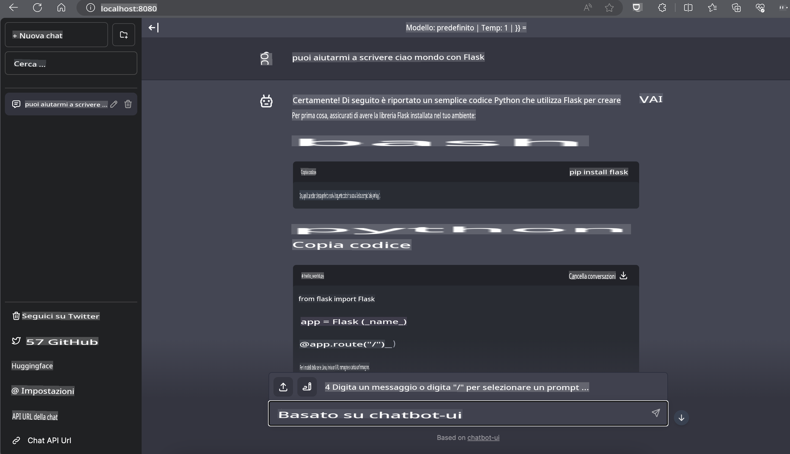

# **Inferenza di Phi-3 su Nvidia Jetson**

Nvidia Jetson è una serie di schede per il calcolo embedded sviluppate da Nvidia. I modelli Jetson TK1, TX1 e TX2 sono tutti dotati di un processore Tegra (o SoC) di Nvidia che integra una CPU con architettura ARM. Jetson è un sistema a basso consumo energetico progettato per accelerare le applicazioni di machine learning. Nvidia Jetson viene utilizzato da sviluppatori professionisti per creare prodotti AI rivoluzionari in tutti i settori, nonché da studenti e appassionati per apprendere e sperimentare l'intelligenza artificiale attraverso progetti pratici. SLM viene implementato in dispositivi edge come Jetson, consentendo una migliore realizzazione di scenari applicativi di intelligenza artificiale generativa industriale.

## Distribuzione su NVIDIA Jetson:
Gli sviluppatori che lavorano su robotica autonoma e dispositivi embedded possono sfruttare Phi-3 Mini. Le dimensioni relativamente ridotte di Phi-3 lo rendono ideale per l'implementazione edge. I parametri sono stati attentamente ottimizzati durante l'addestramento, garantendo un'elevata precisione nelle risposte.

### Ottimizzazione TensorRT-LLM:
La [libreria TensorRT-LLM di NVIDIA](https://github.com/NVIDIA/TensorRT-LLM?WT.mc_id=aiml-138114-kinfeylo) ottimizza l'inferenza di grandi modelli linguistici. Supporta la lunga finestra di contesto di Phi-3 Mini, migliorando sia la velocità di elaborazione che la latenza. Le ottimizzazioni includono tecniche come LongRoPE, FP8 e inflight batching.

### Disponibilità e Distribuzione:
Gli sviluppatori possono esplorare Phi-3 Mini con una finestra di contesto da 128K su [NVIDIA's AI](https://www.nvidia.com/en-us/ai-data-science/generative-ai/). È distribuito come un NVIDIA NIM, un microservizio con un'API standard che può essere implementato ovunque. Inoltre, sono disponibili le [implementazioni TensorRT-LLM su GitHub](https://github.com/NVIDIA/TensorRT-LLM).

## **1. Preparazione**

a. Jetson Orin NX / Jetson NX

b. JetPack 5.1.2+
   
c. Cuda 11.8
   
d. Python 3.8+

## **2. Esecuzione di Phi-3 su Jetson**

Possiamo scegliere tra [Ollama](https://ollama.com) o [LlamaEdge](https://llamaedge.com).

Se desideri utilizzare gguf sia nel cloud che nei dispositivi edge contemporaneamente, LlamaEdge può essere visto come WasmEdge (WasmEdge è un runtime WebAssembly leggero, ad alte prestazioni e scalabile, adatto per applicazioni cloud native, edge e decentralizzate. Supporta applicazioni serverless, funzioni embedded, microservizi, smart contract e dispositivi IoT). Puoi distribuire il modello quantizzato di gguf sui dispositivi edge e nel cloud tramite LlamaEdge.


Ecco i passaggi per utilizzarlo:

1. Installa e scarica le librerie e i file correlati

```bash

curl -sSf https://raw.githubusercontent.com/WasmEdge/WasmEdge/master/utils/install.sh | bash -s -- --plugin wasi_nn-ggml

curl -LO https://github.com/LlamaEdge/LlamaEdge/releases/latest/download/llama-api-server.wasm

curl -LO https://github.com/LlamaEdge/chatbot-ui/releases/latest/download/chatbot-ui.tar.gz

tar xzf chatbot-ui.tar.gz

```

**Nota**: llama-api-server.wasm e chatbot-ui devono trovarsi nella stessa directory

2. Esegui gli script nel terminale

```bash

wasmedge --dir .:. --nn-preload default:GGML:AUTO:{Your gguf path} llama-api-server.wasm -p phi-3-chat

```

Ecco il risultato dell'esecuzione:



***Codice di esempio*** [Phi-3 mini WASM Notebook Sample](https://github.com/Azure-Samples/Phi-3MiniSamples/tree/main/wasm)

In sintesi, Phi-3 Mini rappresenta un notevole passo avanti nella modellazione linguistica, combinando efficienza, consapevolezza del contesto e le capacità di ottimizzazione di NVIDIA. Che tu stia sviluppando robot o applicazioni edge, Phi-3 Mini è uno strumento potente da tenere in considerazione.

**Disclaimer (Avvertenza):**  
Questo documento è stato tradotto utilizzando servizi di traduzione automatica basati sull'intelligenza artificiale. Sebbene ci impegniamo per garantire l'accuratezza, si prega di tenere presente che le traduzioni automatizzate possono contenere errori o imprecisioni. Il documento originale nella sua lingua nativa deve essere considerato la fonte autorevole. Per informazioni critiche, si raccomanda una traduzione professionale effettuata da un traduttore umano. Non siamo responsabili per eventuali incomprensioni o interpretazioni errate derivanti dall'uso di questa traduzione.