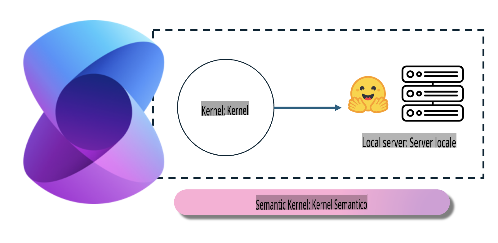
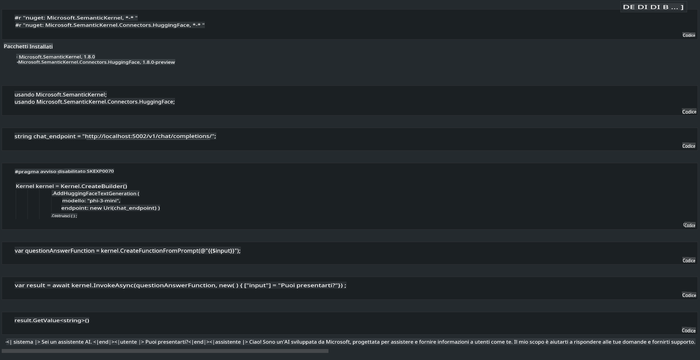

# **Inferenza Phi-3 su Server Locale**

Possiamo distribuire Phi-3 su un server locale. Gli utenti possono scegliere le soluzioni [Ollama](https://ollama.com) o [LM Studio](https://llamaedge.com), oppure possono scrivere il proprio codice. È possibile connettere i servizi locali di Phi-3 tramite [Semantic Kernel](https://github.com/microsoft/semantic-kernel?WT.mc_id=aiml-138114-kinfeylo) o [Langchain](https://www.langchain.com/) per creare applicazioni Copilot.

## **Utilizzare Semantic Kernel per accedere a Phi-3-mini**

Nell'applicazione Copilot, creiamo applicazioni tramite Semantic Kernel / LangChain. Questo tipo di framework applicativo è generalmente compatibile con Azure OpenAI Service / modelli OpenAI, e può anche supportare modelli open source su Hugging Face e modelli locali. Cosa dobbiamo fare se vogliamo utilizzare Semantic Kernel per accedere a Phi-3-mini? Usando .NET come esempio, possiamo combinarlo con il connettore Hugging Face in Semantic Kernel. Per impostazione predefinita, può corrispondere all'id del modello su Hugging Face (la prima volta che lo si utilizza, il modello verrà scaricato da Hugging Face, il che richiede molto tempo). È anche possibile connettersi al servizio locale creato autonomamente. Confrontando le due opzioni, raccomandiamo di utilizzare quest'ultima perché offre un maggiore grado di autonomia, specialmente nelle applicazioni aziendali.

Dalla figura si può vedere come accedere ai servizi locali tramite Semantic Kernel per connettersi facilmente al server del modello Phi-3-mini creato autonomamente. Qui sotto è mostrato il risultato dell'esecuzione.

***Codice di esempio*** https://github.com/kinfey/Phi3MiniSamples/tree/main/semantickernel

**Disclaimer**:  
Questo documento è stato tradotto utilizzando servizi di traduzione automatica basati sull'intelligenza artificiale. Sebbene ci impegniamo per garantire l'accuratezza, si prega di notare che le traduzioni automatiche possono contenere errori o imprecisioni. Il documento originale nella sua lingua nativa dovrebbe essere considerato la fonte autorevole. Per informazioni critiche, si consiglia una traduzione professionale eseguita da un essere umano. Non siamo responsabili per eventuali incomprensioni o interpretazioni errate derivanti dall'uso di questa traduzione.