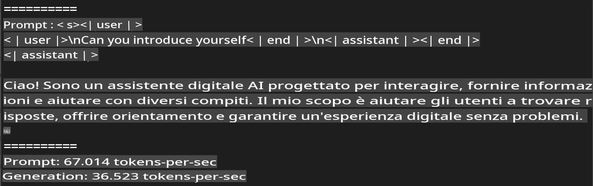
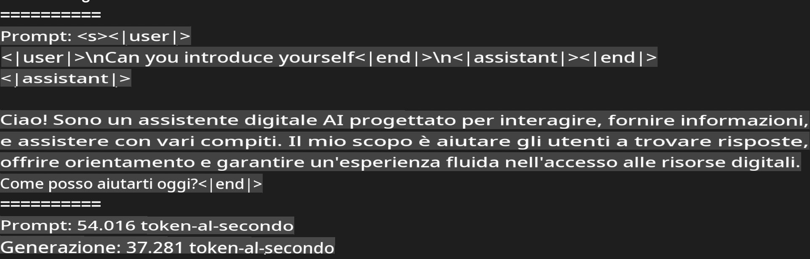
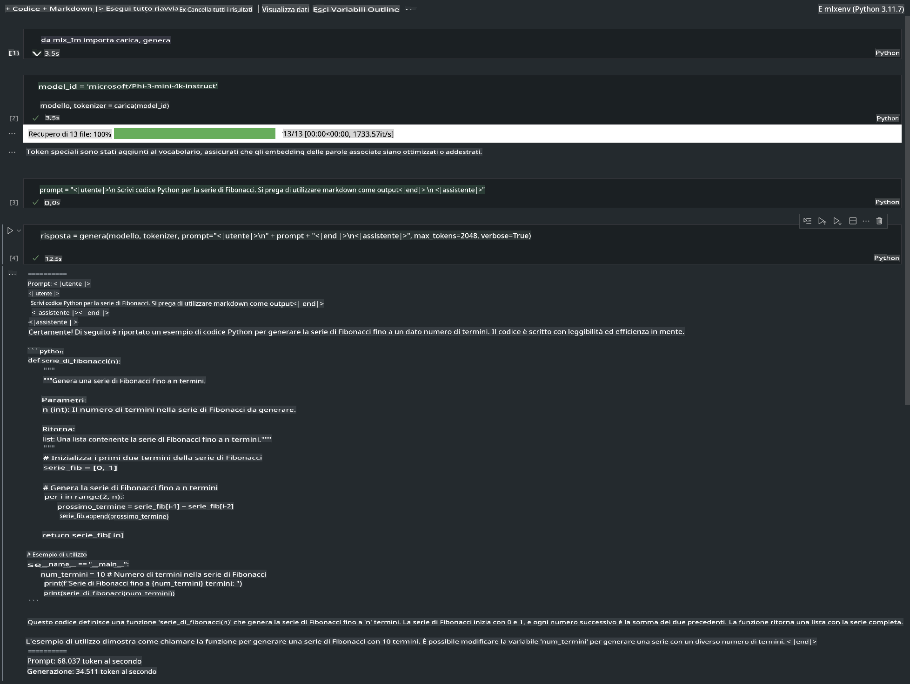

# **Inferenza di Phi-3 con il framework Apple MLX**

## **Cos'è il framework MLX**

MLX è un framework per array destinato alla ricerca nel campo del machine learning su Apple Silicon, sviluppato dal team di ricerca sul machine learning di Apple.

MLX è stato progettato da ricercatori di machine learning per altri ricercatori. Il framework è pensato per essere intuitivo da usare, ma comunque efficiente nel training e nel deployment dei modelli. Anche il design del framework è concettualmente semplice, con l'obiettivo di facilitare l'estensione e il miglioramento di MLX da parte dei ricercatori per esplorare rapidamente nuove idee.

Gli LLM possono essere accelerati sui dispositivi Apple Silicon tramite MLX, consentendo di eseguire i modelli localmente in modo molto comodo.

## **Utilizzo di MLX per l'inferenza di Phi-3-mini**

### **1. Configura il tuo ambiente MLX**

1. Python 3.11.x  
2. Installa la libreria MLX  

```bash

pip install mlx-lm

```

### **2. Eseguire Phi-3-mini nel terminale con MLX**

```bash

python -m mlx_lm.generate --model microsoft/Phi-3-mini-4k-instruct --max-token 2048 --prompt  "<|user|>\nCan you introduce yourself<|end|>\n<|assistant|>"

```

Il risultato (il mio ambiente è Apple M1 Max, 64GB) è il seguente:



### **3. Quantizzare Phi-3-mini con MLX nel terminale**

```bash

python -m mlx_lm.convert --hf-path microsoft/Phi-3-mini-4k-instruct

```

***Nota:*** Il modello può essere quantizzato tramite `mlx_lm.convert`, e la quantizzazione predefinita è INT4. In questo esempio, Phi-3-mini viene quantizzato in INT4.

Il modello, una volta quantizzato tramite `mlx_lm.convert`, sarà salvato nella directory predefinita `./mlx_model`. In questo esempio, il modello Phi-3-mini viene quantizzato in INT4. Dopo la quantizzazione, sarà archiviato nella directory predefinita.

Possiamo testare il modello quantizzato con MLX direttamente dal terminale.

```bash

python -m mlx_lm.generate --model ./mlx_model/ --max-token 2048 --prompt  "<|user|>\nCan you introduce yourself<|end|>\n<|assistant|>"

```

Il risultato è il seguente:



### **4. Eseguire Phi-3-mini con MLX in Jupyter Notebook**



***Nota:*** Consulta questo esempio [cliccando su questo link](../../../../../code/03.Inference/MLX/MLX_DEMO.ipynb)

## **Risorse**

1. Scopri di più sul framework Apple MLX [https://ml-explore.github.io](https://ml-explore.github.io/mlx/build/html/index.html)

2. Repository GitHub di Apple MLX [https://github.com/ml-explore](https://github.com/ml-explore)

**Disclaimer (Avvertenza)**:  
Questo documento è stato tradotto utilizzando servizi di traduzione automatica basati sull'intelligenza artificiale. Sebbene ci impegniamo per garantire l'accuratezza, si prega di tenere presente che le traduzioni automatiche possono contenere errori o imprecisioni. Il documento originale nella sua lingua madre dovrebbe essere considerato la fonte autorevole. Per informazioni critiche, si raccomanda una traduzione professionale eseguita da un traduttore umano. Non siamo responsabili per eventuali malintesi o interpretazioni errate derivanti dall'uso di questa traduzione.