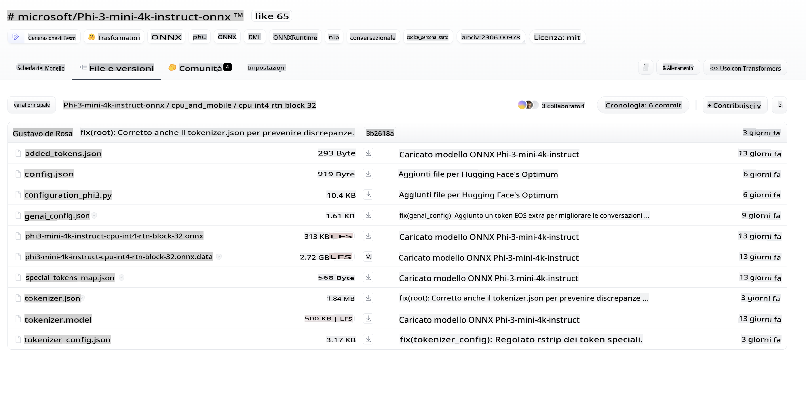
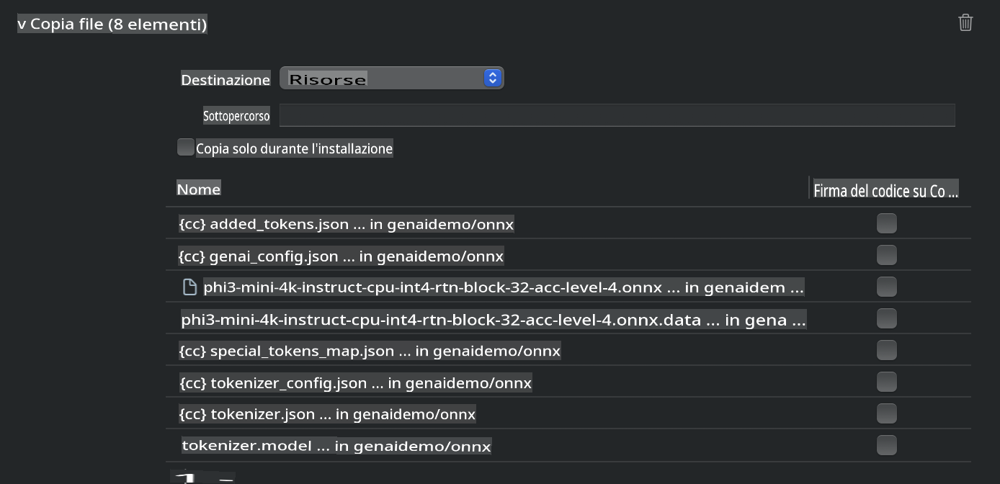
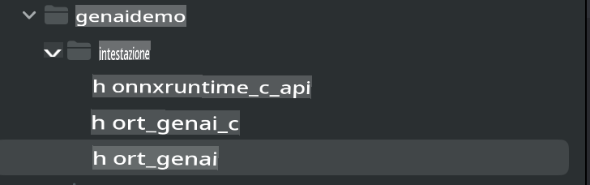
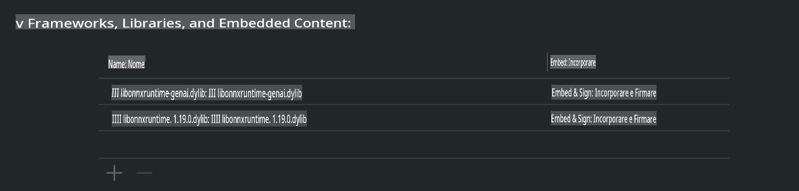
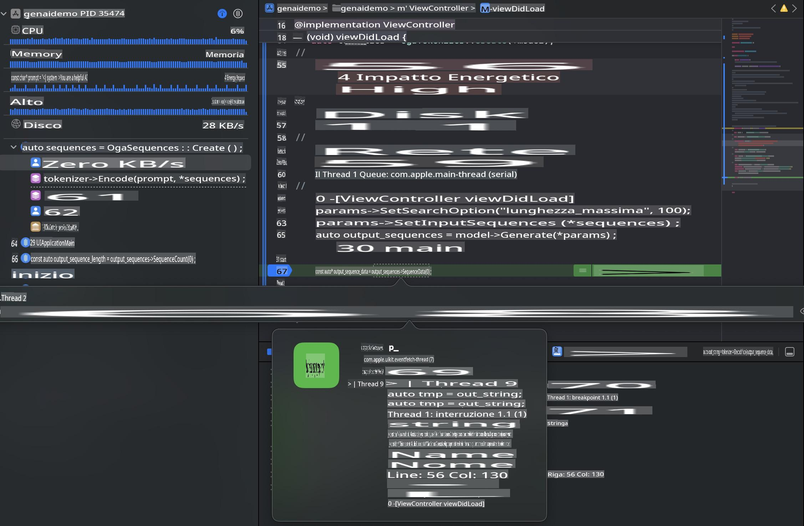

# **Inferenza di Phi-3 su iOS**

Phi-3-mini è una nuova serie di modelli di Microsoft che consente il deployment di Large Language Models (LLMs) su dispositivi edge e IoT. Phi-3-mini è disponibile per iOS, Android e dispositivi edge, permettendo di implementare l'AI generativa in ambienti BYOD. L'esempio seguente mostra come distribuire Phi-3-mini su iOS.

## **1. Preparazione**

- **a.** macOS 14+
- **b.** Xcode 15+
- **c.** iOS SDK 17.x (iPhone 14 A16 o superiore)
- **d.** Installare Python 3.10+ (si consiglia Conda)
- **e.** Installare la libreria Python: `python-flatbuffers`
- **f.** Installare CMake

### Semantic Kernel e Inferenza

Semantic Kernel è un framework applicativo che consente di creare applicazioni compatibili con Azure OpenAI Service, modelli OpenAI e persino modelli locali. Accedere ai servizi locali tramite Semantic Kernel permette una facile integrazione con il tuo server di modelli Phi-3-mini self-hosted.

### Esecuzione di Modelli Quantizzati con Ollama o LlamaEdge

Molti utenti preferiscono utilizzare modelli quantizzati per eseguire i modelli localmente. [Ollama](https://ollama.com) e [LlamaEdge](https://llamaedge.com) consentono agli utenti di eseguire diversi modelli quantizzati:

#### **Ollama**

Puoi eseguire `ollama run phi3` direttamente o configurarlo offline. Crea un Modelfile con il percorso al tuo file `gguf`. Esempio di codice per eseguire il modello quantizzato Phi-3-mini:

```gguf
FROM {Add your gguf file path}
TEMPLATE \"\"\"<|user|> .Prompt<|end|> <|assistant|>\"\"\"
PARAMETER stop <|end|>
PARAMETER num_ctx 4096
```

#### **LlamaEdge**

Se desideri utilizzare `gguf` sia su cloud che su dispositivi edge contemporaneamente, LlamaEdge è un'ottima opzione.

## **2. Compilazione di ONNX Runtime per iOS**

```bash

git clone https://github.com/microsoft/onnxruntime.git

cd onnxruntime

./build.sh --build_shared_lib --ios --skip_tests --parallel --build_dir ./build_ios --ios --apple_sysroot iphoneos --osx_arch arm64 --apple_deploy_target 17.5 --cmake_generator Xcode --config Release

cd ../

```

### **Avviso**

- **a.** Prima di compilare, assicurati che Xcode sia configurato correttamente e impostalo come directory sviluppatore attiva nel terminale:

    ```bash
    sudo xcode-select -switch /Applications/Xcode.app/Contents/Developer
    ```

- **b.** ONNX Runtime deve essere compilato per piattaforme diverse. Per iOS, puoi compilare per `arm64` or `x86_64`.

- **c.** Si consiglia di utilizzare l'ultima versione di iOS SDK per la compilazione. Tuttavia, è possibile utilizzare una versione precedente se necessiti di compatibilità con SDK più vecchi.

## **3. Compilazione di Generative AI con ONNX Runtime per iOS**

> **Nota:** Poiché Generative AI con ONNX Runtime è in anteprima, tieni presente che potrebbero esserci modifiche.

```bash

git clone https://github.com/microsoft/onnxruntime-genai
 
cd onnxruntime-genai
 
mkdir ort
 
cd ort
 
mkdir include
 
mkdir lib
 
cd ../
 
cp ../onnxruntime/include/onnxruntime/core/session/onnxruntime_c_api.h ort/include
 
cp ../onnxruntime/build_ios/Release/Release-iphoneos/libonnxruntime*.dylib* ort/lib
 
export OPENCV_SKIP_XCODEBUILD_FORCE_TRYCOMPILE_DEBUG=1
 
python3 build.py --parallel --build_dir ./build_ios --ios --ios_sysroot iphoneos --ios_arch arm64 --ios_deployment_target 17.5 --cmake_generator Xcode --cmake_extra_defines CMAKE_XCODE_ATTRIBUTE_CODE_SIGNING_ALLOWED=NO

```

## **4. Creare un'applicazione App in Xcode**

Ho scelto Objective-C come metodo di sviluppo dell'App, poiché utilizzando Generative AI con l'API C++ di ONNX Runtime, Objective-C offre una migliore compatibilità. Naturalmente, puoi anche completare le chiamate relative tramite il bridging con Swift.


## **5. Copiare il modello INT4 quantizzato di ONNX nel progetto dell'applicazione**

Dobbiamo importare il modello quantizzato INT4 in formato ONNX, che deve essere prima scaricato.



Dopo il download, è necessario aggiungerlo alla directory Resources del progetto in Xcode.



## **6. Aggiungere l'API C++ nei ViewControllers**

> **Avviso:**

- **a.** Aggiungi i file header C++ corrispondenti al progetto.

  

- **b.** Includi `onnxruntime-genai` dynamic library in Xcode.

  

- **c.** Use the C Samples code for testing. You can also add additional features like ChatUI for more functionality.

- **d.** Since you need to use C++ in your project, rename `ViewController.m` to `ViewController.mm` per abilitare il supporto Objective-C++.

```objc

    NSString *llmPath = [[NSBundle mainBundle] resourcePath];
    char const *modelPath = llmPath.cString;

    auto model =  OgaModel::Create(modelPath);

    auto tokenizer = OgaTokenizer::Create(*model);

    const char* prompt = "<|system|>You are a helpful AI assistant.<|end|><|user|>Can you introduce yourself?<|end|><|assistant|>";

    auto sequences = OgaSequences::Create();
    tokenizer->Encode(prompt, *sequences);

    auto params = OgaGeneratorParams::Create(*model);
    params->SetSearchOption("max_length", 100);
    params->SetInputSequences(*sequences);

    auto output_sequences = model->Generate(*params);
    const auto output_sequence_length = output_sequences->SequenceCount(0);
    const auto* output_sequence_data = output_sequences->SequenceData(0);
    auto out_string = tokenizer->Decode(output_sequence_data, output_sequence_length);
    
    auto tmp = out_string;

```

## **7. Esecuzione dell'applicazione**

Una volta completata la configurazione, puoi eseguire l'applicazione per vedere i risultati dell'inferenza del modello Phi-3-mini.



Per ulteriori esempi di codice e istruzioni dettagliate, visita il [repository Phi-3 Mini Samples](https://github.com/Azure-Samples/Phi-3MiniSamples/tree/main/ios).

**Disclaimer**:  
Questo documento è stato tradotto utilizzando servizi di traduzione automatizzati basati sull'intelligenza artificiale. Sebbene ci impegniamo per garantire l'accuratezza, si prega di notare che le traduzioni automatiche possono contenere errori o imprecisioni. Il documento originale nella sua lingua nativa dovrebbe essere considerato la fonte autorevole. Per informazioni critiche, si raccomanda una traduzione professionale effettuata da un umano. Non siamo responsabili per eventuali incomprensioni o interpretazioni errate derivanti dall'uso di questa traduzione.