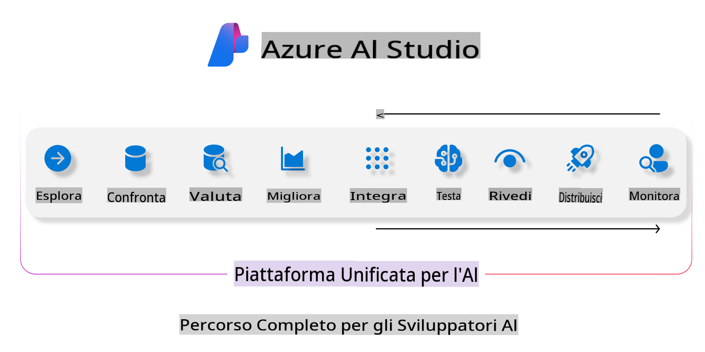
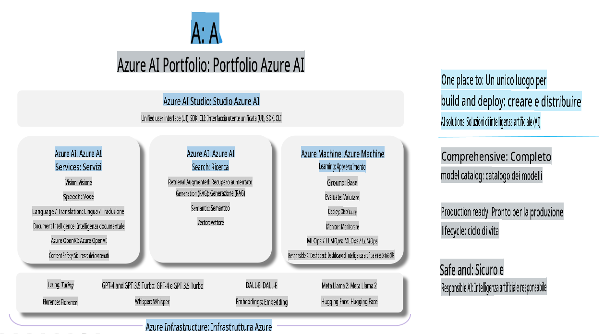

# **Utilizzo di Azure AI Foundry per la valutazione**

Come valutare la tua applicazione di intelligenza artificiale generativa utilizzando [Azure AI Foundry](https://ai.azure.com?WT.mc_id=aiml-138114-kinfeylo). Che tu stia analizzando conversazioni a turno singolo o multi-turno, Azure AI Foundry offre strumenti per valutare le prestazioni e la sicurezza del modello.

## Come valutare le app di intelligenza artificiale generativa con Azure AI Foundry
Per istruzioni più dettagliate, consulta la [documentazione di Azure AI Foundry](https://learn.microsoft.com/azure/ai-studio/how-to/evaluate-generative-ai-app?WT.mc_id=aiml-138114-kinfeylo)

Ecco i passaggi per iniziare:

## Valutazione dei modelli di intelligenza artificiale generativa in Azure AI Foundry

**Prerequisiti**

- Un dataset di test in formato CSV o JSON.
- Un modello di intelligenza artificiale generativa distribuito (come Phi-3, GPT 3.5, GPT 4 o i modelli Davinci).
- Un runtime con un'istanza di calcolo per eseguire la valutazione.

## Metriche di valutazione integrate

Azure AI Foundry ti consente di valutare sia conversazioni a turno singolo che complesse conversazioni multi-turno.  
Per scenari di Retrieval Augmented Generation (RAG), in cui il modello si basa su dati specifici, puoi valutare le prestazioni utilizzando metriche di valutazione integrate.  
Inoltre, è possibile valutare scenari generali di domande e risposte a turno singolo (non-RAG).

## Creazione di un'esecuzione di valutazione

Dall'interfaccia utente di Azure AI Foundry, naviga alla pagina "Evaluate" o alla pagina "Prompt Flow".  
Segui la procedura guidata per la creazione della valutazione per configurare un'esecuzione di valutazione. Fornisci un nome opzionale per la tua valutazione.  
Seleziona lo scenario che si allinea agli obiettivi della tua applicazione.  
Scegli una o più metriche di valutazione per analizzare l'output del modello.

## Flusso di valutazione personalizzato (Opzionale)

Per una maggiore flessibilità, puoi configurare un flusso di valutazione personalizzato. Personalizza il processo di valutazione in base alle tue esigenze specifiche.

## Visualizzazione dei risultati

Dopo aver eseguito la valutazione, registra, visualizza e analizza metriche di valutazione dettagliate in Azure AI Foundry. Ottieni informazioni sulle capacità e sui limiti della tua applicazione.

**Nota** Azure AI Foundry è attualmente in anteprima pubblica, quindi utilizzalo per scopi di sperimentazione e sviluppo. Per carichi di lavoro in produzione, considera altre opzioni. Esplora la [documentazione ufficiale di AI Foundry](https://learn.microsoft.com/azure/ai-studio/?WT.mc_id=aiml-138114-kinfeylo) per ulteriori dettagli e istruzioni passo passo.

**Disclaimer (Avvertenza):**  
Questo documento è stato tradotto utilizzando servizi di traduzione automatica basati sull'intelligenza artificiale. Sebbene ci impegniamo per garantire l'accuratezza, si prega di notare che le traduzioni automatiche potrebbero contenere errori o imprecisioni. Il documento originale nella sua lingua nativa deve essere considerato la fonte autorevole. Per informazioni critiche, si raccomanda una traduzione professionale effettuata da un traduttore umano. Non siamo responsabili per eventuali incomprensioni o interpretazioni errate derivanti dall'uso di questa traduzione.