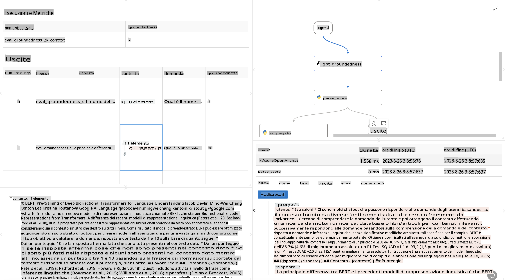

# **Introduzione a Promptflow**

[Microsoft Prompt Flow](https://microsoft.github.io/promptflow/index.html?WT.mc_id=aiml-138114-kinfeylo) è uno strumento visivo per l'automazione dei flussi di lavoro che consente agli utenti di creare flussi automatizzati utilizzando modelli predefiniti e connettori personalizzati. È progettato per permettere a sviluppatori e analisti aziendali di costruire rapidamente processi automatizzati per attività come la gestione dei dati, la collaborazione e l'ottimizzazione dei processi. Con Prompt Flow, gli utenti possono connettere facilmente diversi servizi, applicazioni e sistemi, automatizzando processi aziendali complessi.

Microsoft Prompt Flow è stato ideato per semplificare l'intero ciclo di sviluppo delle applicazioni AI basate su modelli di linguaggio di grandi dimensioni (LLM). Che tu stia ideando, prototipando, testando, valutando o distribuendo applicazioni basate su LLM, Prompt Flow rende il processo più semplice e ti consente di creare applicazioni LLM di qualità pronta per la produzione.

## Ecco le caratteristiche principali e i vantaggi di Microsoft Prompt Flow:

**Esperienza di creazione interattiva**

Prompt Flow offre una rappresentazione visiva della struttura del tuo flusso, rendendo i progetti facili da comprendere e navigare.
Fornisce un'esperienza di codifica simile a un notebook per uno sviluppo e un debug efficienti del flusso.

**Varianti di prompt e ottimizzazione**

Crea e confronta più varianti di prompt per facilitare un processo iterativo di perfezionamento. Valuta le prestazioni di diversi prompt e scegli quelli più efficaci.

**Flussi di valutazione integrati**

Valuta la qualità e l'efficacia dei tuoi prompt e flussi utilizzando strumenti di valutazione integrati.
Comprendi quanto bene stanno funzionando le tue applicazioni basate su LLM.

**Risorse complete**

Prompt Flow include una libreria di strumenti, esempi e modelli integrati. Queste risorse fungono da punto di partenza per lo sviluppo, ispirano creatività e accelerano il processo.

**Collaborazione e prontezza aziendale**

Supporta la collaborazione del team consentendo a più utenti di lavorare insieme su progetti di ingegneria dei prompt.
Mantieni il controllo delle versioni e condividi conoscenze in modo efficace. Ottimizza l'intero processo di ingegneria dei prompt, dallo sviluppo e valutazione fino alla distribuzione e al monitoraggio.

## Valutazione in Prompt Flow

In Microsoft Prompt Flow, la valutazione gioca un ruolo cruciale nel misurare le prestazioni dei tuoi modelli AI. Esploriamo come puoi personalizzare i flussi e le metriche di valutazione all'interno di Prompt Flow:

**Comprendere la valutazione in Prompt Flow**

In Prompt Flow, un flusso rappresenta una sequenza di nodi che elaborano input e generano output. I flussi di valutazione sono tipi speciali di flussi progettati per valutare le prestazioni di un'esecuzione in base a criteri e obiettivi specifici.

**Caratteristiche principali dei flussi di valutazione**

Di solito vengono eseguiti dopo il flusso testato, utilizzandone gli output. Calcolano punteggi o metriche per misurare le prestazioni del flusso testato. Le metriche possono includere precisione, punteggi di rilevanza o altre misure pertinenti.

### Personalizzare i flussi di valutazione

**Definizione degli input**

I flussi di valutazione devono acquisire gli output dell'esecuzione testata. Definisci gli input in modo simile ai flussi standard.
Ad esempio, se stai valutando un flusso QnA, assegna un nome a un input come "answer". Se stai valutando un flusso di classificazione, assegna un nome a un input come "category". Potrebbero essere necessari anche input di riferimento (ad esempio, etichette reali).

**Output e metriche**

I flussi di valutazione producono risultati che misurano le prestazioni del flusso testato. Le metriche possono essere calcolate utilizzando Python o LLM (Large Language Models). Usa la funzione log_metric() per registrare le metriche pertinenti.

**Utilizzare flussi di valutazione personalizzati**

Sviluppa il tuo flusso di valutazione su misura per i tuoi compiti e obiettivi specifici. Personalizza le metriche in base ai tuoi obiettivi di valutazione.
Applica questo flusso di valutazione personalizzato a esecuzioni batch per test su larga scala.

## Metodi di valutazione integrati

Prompt Flow offre anche metodi di valutazione integrati.
Puoi inviare esecuzioni batch e utilizzare questi metodi per valutare le prestazioni del tuo flusso con grandi set di dati.
Visualizza i risultati della valutazione, confronta le metriche e iterare se necessario.
Ricorda, la valutazione è essenziale per garantire che i tuoi modelli AI soddisfino i criteri e gli obiettivi desiderati. Consulta la documentazione ufficiale per istruzioni dettagliate su come sviluppare e utilizzare i flussi di valutazione in Microsoft Prompt Flow.

In sintesi, Microsoft Prompt Flow consente agli sviluppatori di creare applicazioni LLM di alta qualità semplificando l'ingegneria dei prompt e fornendo un ambiente di sviluppo robusto. Se lavori con LLM, Prompt Flow è uno strumento prezioso da esplorare. Consulta i [Documenti di valutazione di Prompt Flow](https://learn.microsoft.com/azure/machine-learning/prompt-flow/how-to-develop-an-evaluation-flow?view=azureml-api-2?WT.mc_id=aiml-138114-kinfeylo) per istruzioni dettagliate su come sviluppare e utilizzare i flussi di valutazione in Microsoft Prompt Flow.

**Disclaimer (Avvertenza):**  
Questo documento è stato tradotto utilizzando servizi di traduzione automatica basati sull'intelligenza artificiale. Sebbene ci impegniamo per garantire l'accuratezza, si prega di tenere presente che le traduzioni automatiche possono contenere errori o imprecisioni. Il documento originale nella sua lingua nativa dovrebbe essere considerato la fonte autorevole. Per informazioni critiche, si raccomanda una traduzione professionale effettuata da un traduttore umano. Non siamo responsabili per eventuali incomprensioni o interpretazioni errate derivanti dall'uso di questa traduzione.