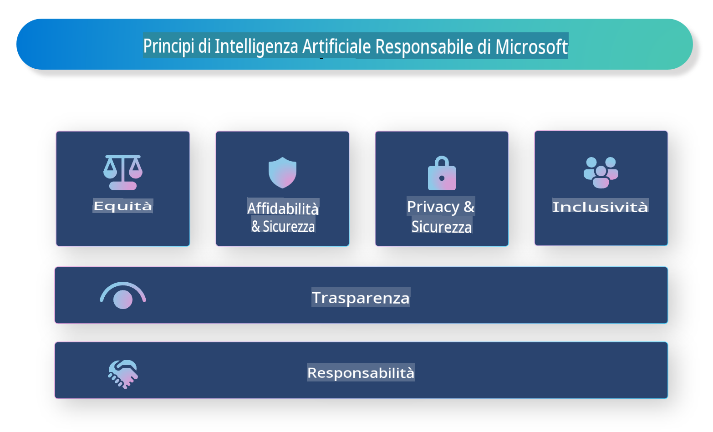

# **Introduzione all'AI Responsabile**

[Microsoft Responsible AI](https://www.microsoft.com/ai/responsible-ai?WT.mc_id=aiml-138114-kinfeylo) è un'iniziativa che mira ad aiutare sviluppatori e organizzazioni a creare sistemi di intelligenza artificiale che siano trasparenti, affidabili e responsabili. L'iniziativa fornisce linee guida e risorse per sviluppare soluzioni di AI responsabile che rispettino principi etici, come privacy, equità e trasparenza. Esploreremo anche alcune delle sfide e delle migliori pratiche associate alla costruzione di sistemi di AI responsabile.

## Panoramica di Microsoft Responsible AI 

**Principi etici**

Microsoft Responsible AI si basa su una serie di principi etici, come privacy, equità, trasparenza, responsabilità e sicurezza. Questi principi sono progettati per garantire che i sistemi di AI siano sviluppati in modo etico e responsabile.

**AI trasparente**

Microsoft Responsible AI sottolinea l'importanza della trasparenza nei sistemi di AI. Questo include fornire spiegazioni chiare su come funzionano i modelli di AI, oltre a garantire che le fonti di dati e gli algoritmi siano pubblicamente disponibili.

**AI responsabile**

[Microsoft Responsible AI](https://www.microsoft.com/ai/responsible-ai?WT.mc_id=aiml-138114-kinfeylo) promuove lo sviluppo di sistemi di AI responsabili, che possano fornire informazioni su come i modelli di AI prendono decisioni. Questo può aiutare gli utenti a comprendere e fidarsi dei risultati prodotti dai sistemi di AI.

**Inclusività**

I sistemi di AI dovrebbero essere progettati per apportare benefici a tutti. Microsoft mira a creare un'AI inclusiva che consideri prospettive diverse ed eviti pregiudizi o discriminazioni.

**Affidabilità e sicurezza**

Garantire che i sistemi di AI siano affidabili e sicuri è fondamentale. Microsoft si concentra sulla costruzione di modelli robusti che funzionino in modo coerente ed evitino esiti dannosi.

**Equità nell'AI**

Microsoft Responsible AI riconosce che i sistemi di AI possono perpetuare pregiudizi se addestrati su dati o algoritmi di parte. L'iniziativa fornisce linee guida per sviluppare sistemi di AI equi che non discriminino in base a fattori come razza, genere o età.

**Privacy e sicurezza**

Microsoft Responsible AI enfatizza l'importanza di proteggere la privacy degli utenti e la sicurezza dei dati nei sistemi di AI. Questo include l'implementazione di una forte crittografia dei dati e controlli di accesso, oltre a verifiche regolari per identificare vulnerabilità.

**Responsabilità e consapevolezza**

Microsoft Responsible AI promuove la responsabilità e la consapevolezza nello sviluppo e nella distribuzione dell'AI. Ciò include garantire che sviluppatori e organizzazioni siano consapevoli dei rischi potenziali associati ai sistemi di AI e adottino misure per mitigarli.

## Migliori pratiche per costruire sistemi di AI responsabile

**Sviluppare modelli di AI utilizzando set di dati diversificati**

Per evitare pregiudizi nei sistemi di AI, è importante utilizzare set di dati diversificati che rappresentino una gamma di prospettive ed esperienze.

**Utilizzare tecniche di AI spiegabile**

Le tecniche di AI spiegabile possono aiutare gli utenti a comprendere come i modelli di AI prendono decisioni, aumentando la fiducia nel sistema.

**Eseguire audit regolari sui sistemi di AI per identificare vulnerabilità**

Audit regolari dei sistemi di AI possono aiutare a identificare rischi e vulnerabilità che necessitano di essere affrontati.

**Implementare una forte crittografia dei dati e controlli di accesso**

La crittografia dei dati e i controlli di accesso possono aiutare a proteggere la privacy e la sicurezza degli utenti nei sistemi di AI.

**Seguire principi etici nello sviluppo dell'AI**

Seguire principi etici, come equità, trasparenza e responsabilità, può contribuire a costruire fiducia nei sistemi di AI e garantire che siano sviluppati in modo responsabile.

## Utilizzo di AI Foundry per l'AI responsabile

[Azure AI Foundry](https://ai.azure.com?WT.mc_id=aiml-138114-kinfeylo) è una piattaforma potente che consente a sviluppatori e organizzazioni di creare rapidamente applicazioni intelligenti, all'avanguardia, pronte per il mercato e responsabili. Ecco alcune delle principali funzionalità e capacità di Azure AI Foundry:

**API e modelli preconfigurati**

Azure AI Foundry offre API e modelli preconfigurati e personalizzabili. Questi coprono un'ampia gamma di attività di AI, tra cui AI generativa, elaborazione del linguaggio naturale per conversazioni, ricerca, monitoraggio, traduzione, voce, visione e decision-making.

**Prompt Flow**

Il prompt flow in Azure AI Foundry consente di creare esperienze di AI conversazionale. Permette di progettare e gestire flussi conversazionali, semplificando la creazione di chatbot, assistenti virtuali e altre applicazioni interattive.

**Retrieval Augmented Generation (RAG)**

RAG è una tecnica che combina approcci basati sul recupero e sulla generazione. Migliora la qualità delle risposte generate sfruttando sia conoscenze preesistenti (recupero) che generazione creativa (generazione).

**Metriche di valutazione e monitoraggio per l'AI generativa**

Azure AI Foundry fornisce strumenti per valutare e monitorare i modelli di AI generativa. È possibile analizzarne le prestazioni, l'equità e altre metriche importanti per garantire una distribuzione responsabile. Inoltre, se hai creato un dashboard, puoi utilizzare l'interfaccia utente senza codice in Azure Machine Learning Studio per personalizzare e generare un Responsible AI Dashboard e una scorecard associata basata sulle librerie Python del [Responsible AI Toolbox](https://responsibleaitoolbox.ai/?WT.mc_id=aiml-138114-kinfeylo). Questa scorecard aiuta a condividere informazioni chiave relative a equità, importanza delle caratteristiche e altre considerazioni di distribuzione responsabile con stakeholder tecnici e non tecnici.

Per utilizzare AI Foundry con un'AI responsabile, puoi seguire queste migliori pratiche:

**Definire il problema e gli obiettivi del tuo sistema di AI**

Prima di iniziare lo sviluppo, è importante definire chiaramente il problema o l'obiettivo che il tuo sistema di AI intende risolvere. Questo ti aiuterà a identificare i dati, gli algoritmi e le risorse necessari per costruire un modello efficace.

**Raccogliere e pre-elaborare dati pertinenti**

La qualità e la quantità dei dati utilizzati per addestrare un sistema di AI possono avere un impatto significativo sulle sue prestazioni. È quindi importante raccogliere dati pertinenti, pulirli, pre-elaborarli e garantire che siano rappresentativi della popolazione o del problema che si intende affrontare.

**Scegliere una valutazione adeguata**

Esistono vari algoritmi di valutazione disponibili. È importante scegliere l'algoritmo più adatto in base ai tuoi dati e al problema.

**Valutare e interpretare il modello**

Una volta costruito un modello di AI, è importante valutarne le prestazioni utilizzando metriche appropriate e interpretare i risultati in modo trasparente. Questo ti aiuterà a identificare eventuali pregiudizi o limitazioni nel modello e a migliorarlo dove necessario.

**Garantire trasparenza e spiegabilità**

I sistemi di AI dovrebbero essere trasparenti e spiegabili, in modo che gli utenti possano comprendere come funzionano e come vengono prese le decisioni. Questo è particolarmente importante per applicazioni che hanno un impatto significativo sulla vita umana, come sanità, finanza e sistemi legali.

**Monitorare e aggiornare il modello**

I sistemi di AI dovrebbero essere continuamente monitorati e aggiornati per garantire che rimangano accurati ed efficaci nel tempo. Questo richiede manutenzione continua, test e riaddestramento del modello.

In conclusione, Microsoft Responsible AI è un'iniziativa che mira ad aiutare sviluppatori e organizzazioni a costruire sistemi di AI che siano trasparenti, affidabili e responsabili. Ricorda che l'implementazione dell'AI responsabile è cruciale, e Azure AI Foundry mira a renderla pratica per le organizzazioni. Seguendo principi etici e migliori pratiche, possiamo garantire che i sistemi di AI siano sviluppati e distribuiti in modo responsabile per il beneficio della società nel suo complesso.

**Disclaimer (Avvertenza):**  
Questo documento è stato tradotto utilizzando servizi di traduzione automatica basati sull'intelligenza artificiale. Sebbene ci impegniamo per garantire l'accuratezza, si prega di notare che le traduzioni automatiche potrebbero contenere errori o imprecisioni. Il documento originale nella sua lingua nativa deve essere considerato la fonte autorevole. Per informazioni critiche, si raccomanda una traduzione professionale eseguita da un essere umano. Non siamo responsabili per eventuali incomprensioni o interpretazioni errate derivanti dall'uso di questa traduzione.