# Affina e integra modelli Phi-3 personalizzati con Prompt Flow

Questo esempio end-to-end (E2E) si basa sulla guida "[Affina e integra modelli Phi-3 personalizzati con Prompt Flow: Guida passo-passo](https://techcommunity.microsoft.com/t5/educator-developer-blog/fine-tune-and-integrate-custom-phi-3-models-with-prompt-flow/ba-p/4178612?WT.mc_id=aiml-137032-kinfeylo)" della Microsoft Tech Community. Introduce i processi di affinamento, distribuzione e integrazione di modelli Phi-3 personalizzati con Prompt Flow.

## Panoramica

In questo esempio E2E, imparerai come affinare il modello Phi-3 e integrarlo con Prompt Flow. Sfruttando Azure Machine Learning e Prompt Flow, stabilirai un workflow per distribuire e utilizzare modelli di intelligenza artificiale personalizzati. Questo esempio E2E è suddiviso in tre scenari:

**Scenario 1: Configura le risorse di Azure e preparati per l'affinamento**

**Scenario 2: Affina il modello Phi-3 e distribuiscilo in Azure Machine Learning Studio**

**Scenario 3: Integra con Prompt Flow e interagisci con il tuo modello personalizzato**

Ecco una panoramica di questo esempio E2E.

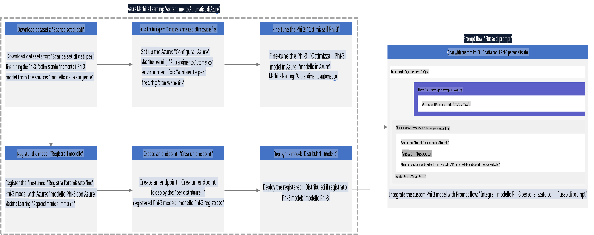

### Indice

1. **[Scenario 1: Configura le risorse di Azure e preparati per l'affinamento](../../../../../../md/02.Application/01.TextAndChat/Phi3)**
    - [Crea uno spazio di lavoro Azure Machine Learning](../../../../../../md/02.Application/01.TextAndChat/Phi3)
    - [Richiedi quote GPU nell'abbonamento Azure](../../../../../../md/02.Application/01.TextAndChat/Phi3)
    - [Aggiungi assegnazione di ruolo](../../../../../../md/02.Application/01.TextAndChat/Phi3)
    - [Configura il progetto](../../../../../../md/02.Application/01.TextAndChat/Phi3)
    - [Prepara il dataset per l'affinamento](../../../../../../md/02.Application/01.TextAndChat/Phi3)

1. **[Scenario 2: Affina il modello Phi-3 e distribuiscilo in Azure Machine Learning Studio](../../../../../../md/02.Application/01.TextAndChat/Phi3)**
    - [Configura Azure CLI](../../../../../../md/02.Application/01.TextAndChat/Phi3)
    - [Affina il modello Phi-3](../../../../../../md/02.Application/01.TextAndChat/Phi3)
    - [Distribuisci il modello affinato](../../../../../../md/02.Application/01.TextAndChat/Phi3)

1. **[Scenario 3: Integra con Prompt Flow e interagisci con il tuo modello personalizzato](../../../../../../md/02.Application/01.TextAndChat/Phi3)**
    - [Integra il modello Phi-3 personalizzato con Prompt Flow](../../../../../../md/02.Application/01.TextAndChat/Phi3)
    - [Interagisci con il tuo modello personalizzato](../../../../../../md/02.Application/01.TextAndChat/Phi3)

## Scenario 1: Configura le risorse di Azure e preparati per l'affinamento

### Crea uno spazio di lavoro Azure Machine Learning

1. Digita *azure machine learning* nella **barra di ricerca** in alto nella pagina del portale e seleziona **Azure Machine Learning** dalle opzioni che appaiono.

    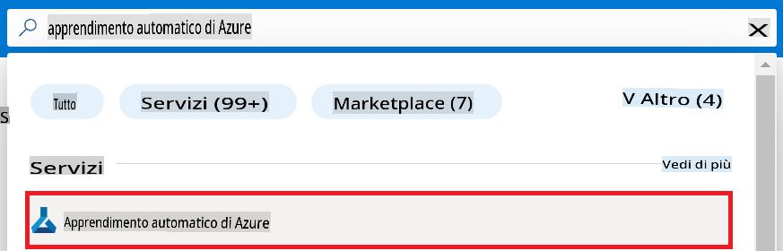

1. Seleziona **+ Crea** dal menu di navigazione.

1. Seleziona **Nuovo spazio di lavoro** dal menu di navigazione.

    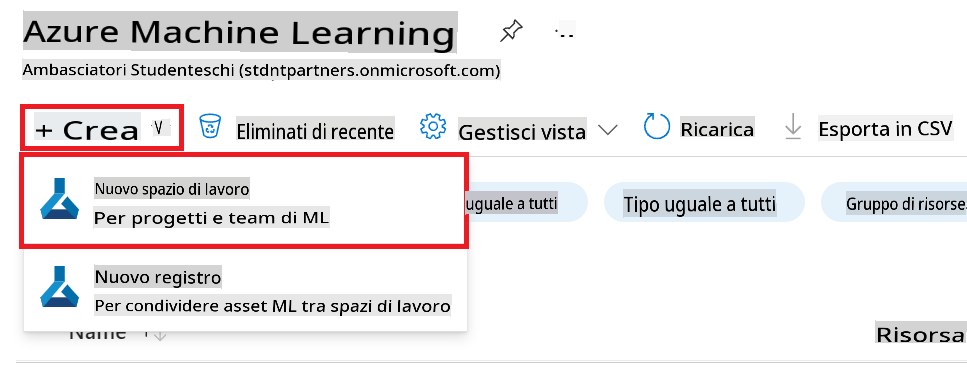

1. Esegui le seguenti operazioni:

    - Seleziona il tuo **Abbonamento Azure**.
    - Seleziona il **Gruppo di risorse** da utilizzare (creane uno nuovo se necessario).
    - Inserisci il **Nome dello spazio di lavoro**. Deve essere un valore univoco.
    - Seleziona la **Regione** che desideri utilizzare.
    - Seleziona l'**Account di archiviazione** da utilizzare (creane uno nuovo se necessario).
    - Seleziona il **Key Vault** da utilizzare (creane uno nuovo se necessario).
    - Seleziona **Application Insights** da utilizzare (creane uno nuovo se necessario).
    - Seleziona il **Container Registry** da utilizzare (creane uno nuovo se necessario).

    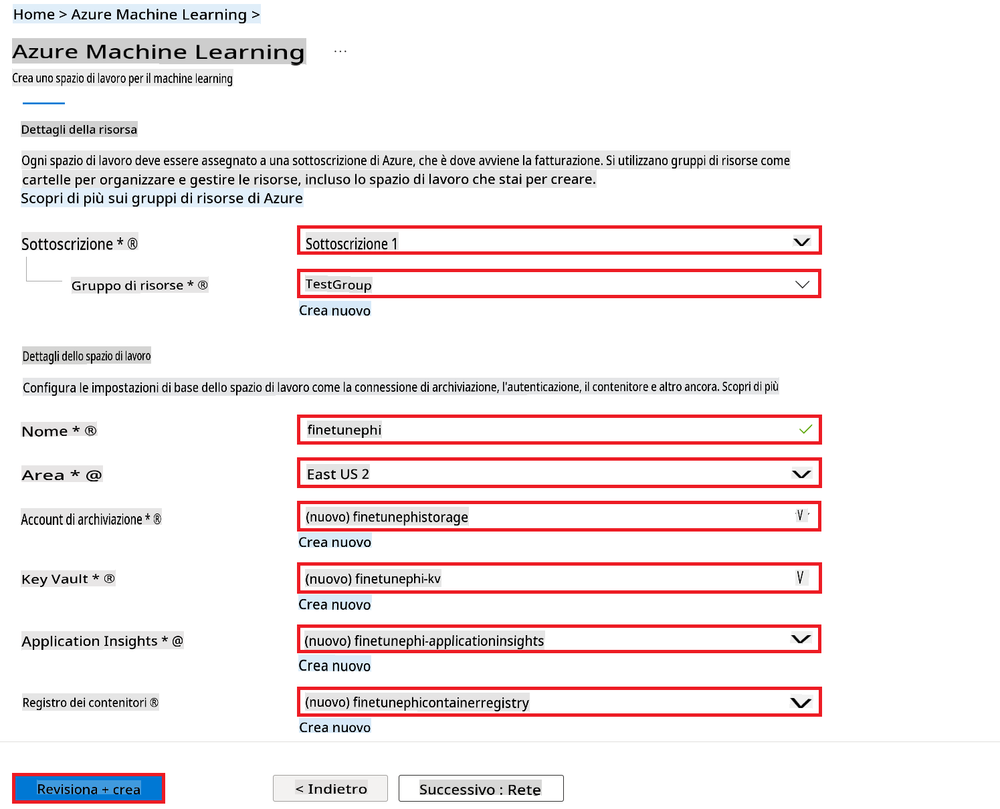

1. Seleziona **Revisiona + Crea**.

1. Seleziona **Crea**.

### Richiedi quote GPU nell'abbonamento Azure

In questo esempio E2E, utilizzerai la GPU *Standard_NC24ads_A100_v4* per l'affinamento, che richiede una richiesta di quota, e la CPU *Standard_E4s_v3* per la distribuzione, che non richiede una richiesta di quota.

> [!NOTE]
>
> Solo gli abbonamenti Pay-As-You-Go (il tipo di abbonamento standard) sono idonei per l'allocazione GPU; gli abbonamenti con benefit non sono attualmente supportati.
>
> Per coloro che utilizzano abbonamenti con benefit (come Visual Studio Enterprise Subscription) o che desiderano testare rapidamente il processo di affinamento e distribuzione, questo tutorial fornisce anche indicazioni per l'affinamento con un dataset minimo utilizzando una CPU. Tuttavia, è importante notare che i risultati dell'affinamento sono significativamente migliori quando si utilizza una GPU con dataset più grandi.

1. Visita [Azure ML Studio](https://ml.azure.com/home?wt.mc_id=studentamb_279723).

1. Esegui le seguenti operazioni per richiedere la quota *Standard NCADSA100v4 Family*:

    - Seleziona **Quota** dalla barra laterale sinistra.
    - Seleziona la **Famiglia di macchine virtuali** da utilizzare. Ad esempio, seleziona **Standard NCADSA100v4 Family Cluster Dedicated vCPUs**, che include la GPU *Standard_NC24ads_A100_v4*.
    - Seleziona **Richiedi quota** dal menu di navigazione.

        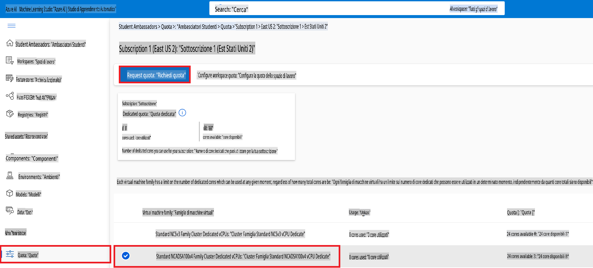

    - Nella pagina Richiedi quota, inserisci il **Nuovo limite di core** che desideri utilizzare. Ad esempio, 24.
    - Nella pagina Richiedi quota, seleziona **Invia** per richiedere la quota GPU.

> [!NOTE]
> Puoi selezionare la GPU o CPU più adatta alle tue esigenze consultando il documento [Dimensioni per macchine virtuali in Azure](https://learn.microsoft.com/azure/virtual-machines/sizes/overview?tabs=breakdownseries%2Cgeneralsizelist%2Ccomputesizelist%2Cmemorysizelist%2Cstoragesizelist%2Cgpusizelist%2Cfpgasizelist%2Chpcsizelist).

### Aggiungi assegnazione di ruolo

Per affinare e distribuire i tuoi modelli, devi prima creare un'Identità Gestita Assegnata dall'Utente (UAI) e assegnarle i permessi appropriati. Questa UAI sarà utilizzata per l'autenticazione durante la distribuzione.

#### Crea Identità Gestita Assegnata dall'Utente (UAI)

1. Digita *managed identities* nella **barra di ricerca** in alto nella pagina del portale e seleziona **Managed Identities** dalle opzioni che appaiono.

    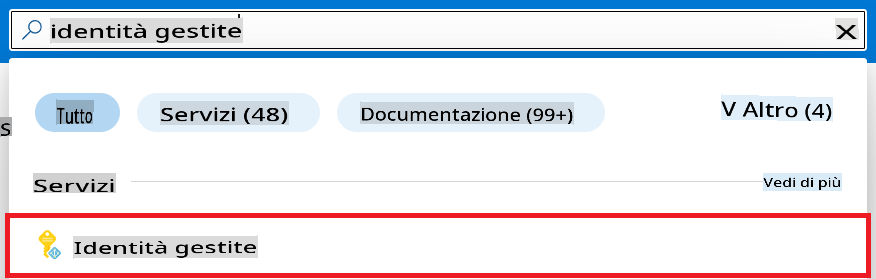

1. Seleziona **+ Crea**.

    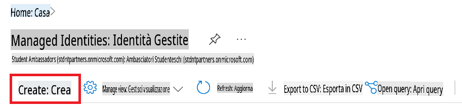

1. Esegui le seguenti operazioni:

    - Seleziona il tuo **Abbonamento Azure**.
    - Seleziona il **Gruppo di risorse** da utilizzare (creane uno nuovo se necessario).
    - Seleziona la **Regione** che desideri utilizzare.
    - Inserisci il **Nome**. Deve essere un valore univoco.

1. Seleziona **Revisiona + crea**.

1. Seleziona **+ Crea**.

#### Aggiungi assegnazione ruolo Contributor all'Identità Gestita

1. Vai alla risorsa Identità Gestita che hai creato.

1. Seleziona **Assegnazioni ruolo di Azure** dalla barra laterale sinistra.

1. Seleziona **+ Aggiungi assegnazione ruolo** dal menu di navigazione.

1. Nella pagina Aggiungi assegnazione ruolo, esegui le seguenti operazioni:
    - Seleziona l'**Ambito** su **Gruppo di risorse**.
    - Seleziona il tuo **Abbonamento Azure**.
    - Seleziona il **Gruppo di risorse** da utilizzare.
    - Seleziona il **Ruolo** su **Contributor**.

    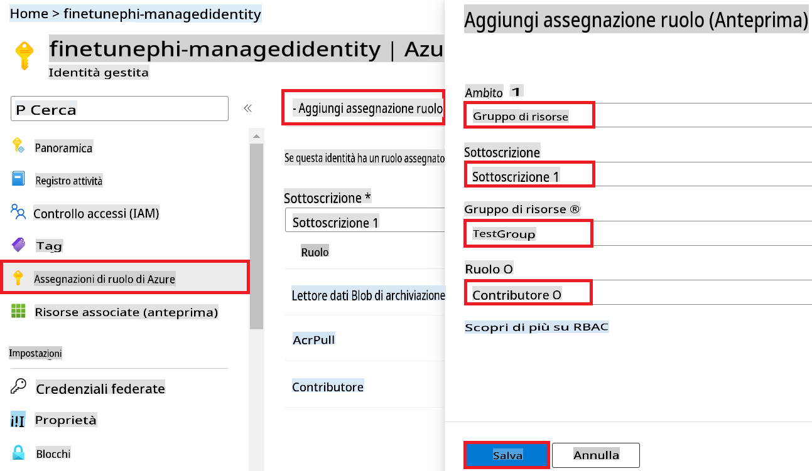

1. Seleziona **Salva**.

#### Aggiungi assegnazione ruolo Lettore Dati Blob di Archiviazione all'Identità Gestita

1. Digita *storage accounts* nella **barra di ricerca** in alto nella pagina del portale e seleziona **Storage accounts** dalle opzioni che appaiono.

    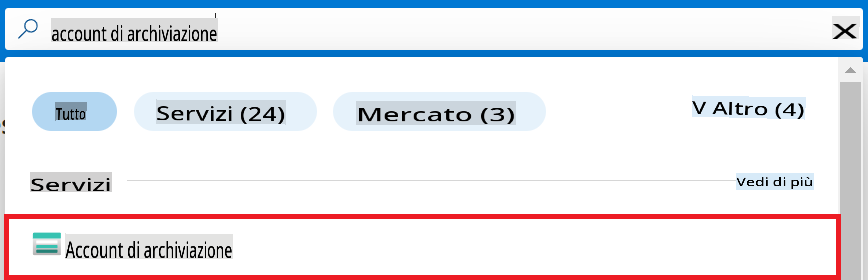

1. Seleziona l'account di archiviazione associato allo spazio di lavoro Azure Machine Learning che hai creato. Ad esempio, *finetunephistorage*.

1. Esegui le seguenti operazioni per navigare alla pagina Aggiungi assegnazione ruolo:

    - Vai all'account di archiviazione Azure che hai creato.
    - Seleziona **Controllo di Accesso (IAM)** dalla barra laterale sinistra.
    - Seleziona **+ Aggiungi** dal menu di navigazione.
    - Seleziona **Aggiungi assegnazione ruolo** dal menu di navigazione.

    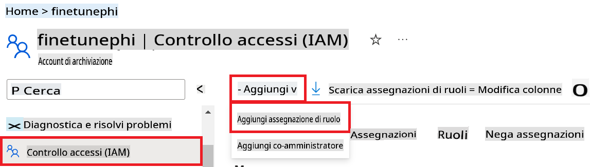

1. Nella pagina Aggiungi assegnazione ruolo, esegui le seguenti operazioni:

    - Nella pagina Ruolo, digita *Storage Blob Data Reader* nella **barra di ricerca** e seleziona **Storage Blob Data Reader** dalle opzioni che appaiono.
    - Nella pagina Ruolo, seleziona **Avanti**.
    - Nella pagina Membri, seleziona **Assegna accesso a** **Managed identity**.
    - Nella pagina Membri, seleziona **+ Seleziona membri**.
    - Nella pagina Seleziona identità gestite, seleziona il tuo **Abbonamento Azure**.
    - Nella pagina Seleziona identità gestite, seleziona l'**Identità Gestita** su **Manage Identity**.
    - Nella pagina Seleziona identità gestite, seleziona l'Identità Gestita che hai creato. Ad esempio, *finetunephi-managedidentity*.
    - Nella pagina Seleziona identità gestite, seleziona **Seleziona**.

    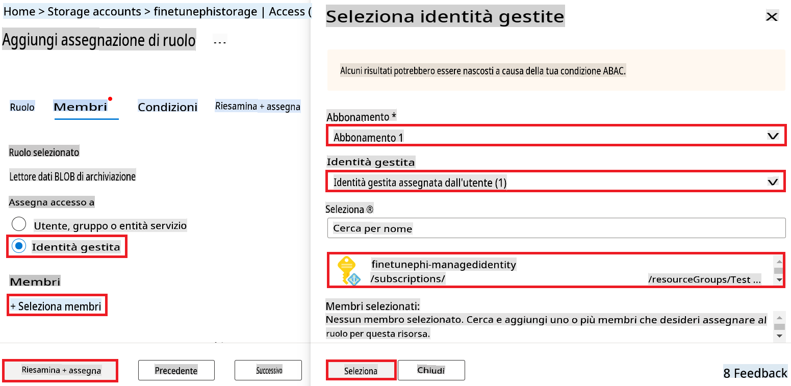

1. Seleziona **Revisiona + assegna**.

#### Aggiungi assegnazione ruolo AcrPull all'Identità Gestita

1. Digita *container registries* nella **barra di ricerca** in alto nella pagina del portale e seleziona **Container registries** dalle opzioni che appaiono.

    

1. Seleziona il container registry associato allo spazio di lavoro Azure Machine Learning. Ad esempio, *finetunephicontainerregistries*.

1. Esegui le seguenti operazioni per navigare alla pagina Aggiungi assegnazione ruolo:

    - Seleziona **Controllo di Accesso (IAM)** dalla barra laterale sinistra.
    - Seleziona **+ Aggiungi** dal menu di navigazione.
    - Seleziona **Aggiungi assegnazione ruolo** dal menu di navigazione.

1. Nella pagina Aggiungi assegnazione ruolo, esegui le seguenti operazioni:

    - Nella pagina Ruolo, digita *AcrPull* nella **barra di ricerca** e seleziona **AcrPull** dalle opzioni che appaiono.
    - Nella pagina Ruolo, seleziona **Avanti**.
    - Nella pagina Membri, seleziona **Assegna accesso a** **Managed identity**.
    - Nella pagina Membri, seleziona **+ Seleziona membri**.
    - Nella pagina Seleziona identità gestite, seleziona il tuo **Abbonamento Azure**.
    - Nella pagina Seleziona identità gestite, seleziona l'**Identità Gestita** su **Manage Identity**.
    - Nella pagina Seleziona identità gestite, seleziona l'Identità Gestita che hai creato. Ad esempio, *finetunephi-managedidentity*.
    - Nella pagina Seleziona identità gestite, seleziona **Seleziona**.
    - Seleziona **Revisiona + assegna**.

### Configura il progetto

Ora creerai una cartella di lavoro e imposterai un ambiente virtuale per sviluppare un programma che interagisca con gli utenti e utilizzi la cronologia delle chat memorizzata in Azure Cosmos DB per informare le sue risposte.

#### Crea una cartella di lavoro

1. Apri una finestra del terminale e digita il seguente comando per creare una cartella denominata *finetune-phi* nel percorso predefinito.

    ```console
    mkdir finetune-phi
    ```

1. Digita il seguente comando nel terminale per navigare nella cartella *finetune-phi* che hai creato.

    ```console
    cd finetune-phi
    ```

#### Crea un ambiente virtuale

1. Digita il seguente comando nel terminale per creare un ambiente virtuale denominato *.venv*.

    ```console
    python -m venv .venv
    ```

1. Digita il seguente comando nel terminale per attivare l'ambiente virtuale.

    ```console
    .venv\Scripts\activate.bat
    ```

> [!NOTE]
>
> Se il comando ha funzionato, dovresti vedere *(.venv)* prima del prompt dei comandi.

#### Installa i pacchetti richiesti

1. Digita i seguenti comandi nel terminale per installare i pacchetti richiesti.

    ```console
    pip install datasets==2.19.1
    pip install transformers==4.41.1
    pip install azure-ai-ml==1.16.0
    pip install torch==2.3.1
    pip install trl==0.9.4
    pip install promptflow==1.12.0
    ```

#### Crea i file del progetto

In questo esercizio, creerai i file essenziali per il progetto. Questi file includono script per scaricare il dataset, configurare l'ambiente Azure Machine Learning, affinare il modello Phi-3 e distribuire il modello affinato. Creerai anche un file *conda.yml* per configurare l'ambiente di affinamento.

In questo esercizio, farai quanto segue:

- Crea un file *download_dataset.py* per scaricare il dataset.
- Crea un file *setup_ml.py* per configurare l'ambiente Azure Machine Learning.
- Crea un file *fine_tune.py* nella cartella *finetuning_dir* per affinare il modello Phi-3 utilizzando il dataset.
- Crea un file *conda.yml* per configurare l'ambiente di affinamento.
- Crea un file *deploy_model.py* per distribuire il modello affinato.
- Crea un file *integrate_with_promptflow.py* per integrare il modello affinato ed eseguire il modello utilizzando Prompt Flow.
- Crea un file *flow.dag.yml* per configurare la struttura del workflow per Prompt Flow.
- Crea un file *config.py* per inserire le informazioni di Azure.

> [!NOTE]
>
> Struttura completa della cartella:
>
> ```text
> └── YourUserName
> .    └── finetune-phi
> .        ├── finetuning_dir
> .        │      └── fine_tune.py
> .        ├── conda.yml
> .        ├── config.py
> .        ├── deploy_model.py
> .        ├── download_dataset.py
> .        ├── flow.dag.yml
> .        ├── integrate_with_promptflow.py
> .        └── setup_ml.py
> ```

1. Apri **Visual Studio Code**.

1. Seleziona **File** dalla barra dei menu.

1. Seleziona **Apri cartella**.

1. Seleziona la cartella *finetune-phi* che hai creato, situata in *C:\Users\yourUserName\finetune-phi*.

    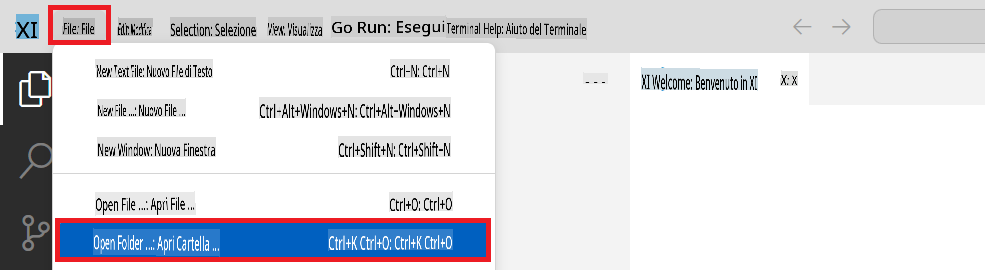

1. Nel pannello sinistro di Visual Studio Code, fai clic con il tasto destro e seleziona **Nuovo file** per creare un nuovo file denominato *download_dataset.py*.

1. Nel pannello sinistro di Visual Studio Code, fai clic con il tasto destro e seleziona **Nuovo file** per creare un nuovo file denominato *setup_ml.py*.

1. Nel pannello sinistro di Visual Studio Code, fai clic con il tasto destro e seleziona **Nuovo file** per creare un nuovo file denominato *deploy_model.py*.

    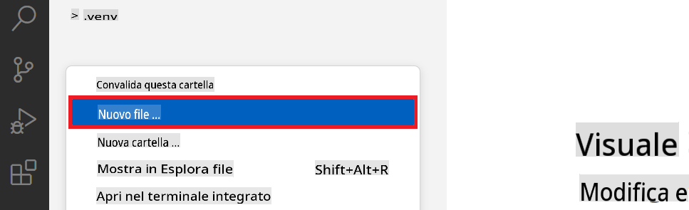

1. Nel pannello sinistro di Visual Studio Code, fai clic con il tasto destro e seleziona **Nuova cartella** per creare una nuova cartella denominata *finetuning_dir*.

1. Nella cartella *finetuning_dir*, crea un nuovo file denominato *fine_tune.py*.

#### Crea e configura il file *conda.yml*

1. Nel pannello sinistro di Visual Studio Code, fai clic con il tasto destro e seleziona **Nuovo file** per creare un nuovo file denominato *conda.yml*.

1. Aggiungi il seguente codice al file *conda.yml* per configurare l'ambiente di affinamento per il modello
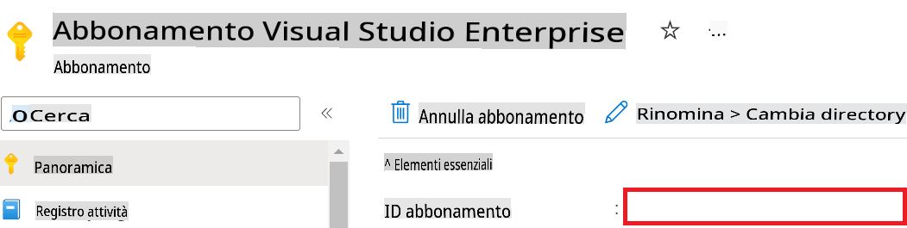

1. Esegui le seguenti operazioni per aggiungere il nome dell'Azure Workspace:

    - Vai alla risorsa di Azure Machine Learning che hai creato.
    - Copia e incolla il nome del tuo account nel file *config.py*.

    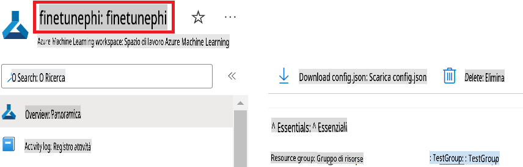

1. Esegui le seguenti operazioni per aggiungere il nome del gruppo di risorse di Azure:

    - Vai alla risorsa di Azure Machine Learning che hai creato.
    - Copia e incolla il nome del tuo gruppo di risorse di Azure nel file *config.py*.

    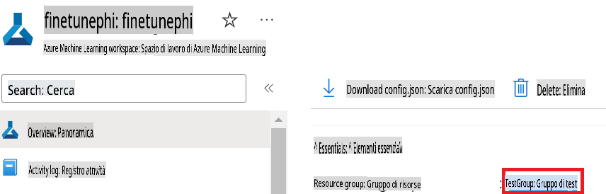

2. Esegui le seguenti operazioni per aggiungere il nome dell'identità gestita di Azure:

    - Vai alla risorsa delle identità gestite che hai creato.
    - Copia e incolla il nome della tua identità gestita di Azure nel file *config.py*.

    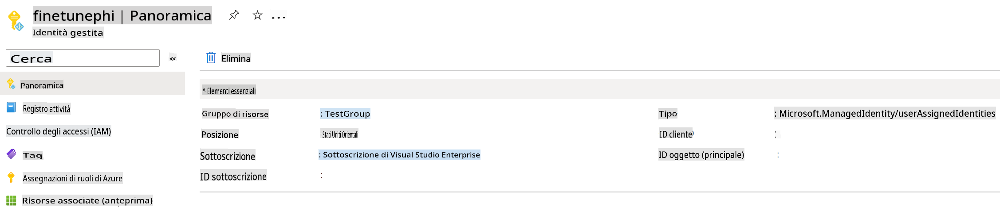

### Preparare il dataset per il fine-tuning

In questo esercizio, eseguirai il file *download_dataset.py* per scaricare i dataset *ULTRACHAT_200k* nel tuo ambiente locale. Successivamente utilizzerai questi dataset per il fine-tuning del modello Phi-3 in Azure Machine Learning.

#### Scarica il dataset utilizzando *download_dataset.py*

1. Apri il file *download_dataset.py* in Visual Studio Code.

1. Aggiungi il seguente codice nel file *download_dataset.py*.

    ```python
    import json
    import os
    from datasets import load_dataset
    from config import (
        TRAIN_DATA_PATH,
        TEST_DATA_PATH)

    def load_and_split_dataset(dataset_name, config_name, split_ratio):
        """
        Load and split a dataset.
        """
        # Load the dataset with the specified name, configuration, and split ratio
        dataset = load_dataset(dataset_name, config_name, split=split_ratio)
        print(f"Original dataset size: {len(dataset)}")
        
        # Split the dataset into train and test sets (80% train, 20% test)
        split_dataset = dataset.train_test_split(test_size=0.2)
        print(f"Train dataset size: {len(split_dataset['train'])}")
        print(f"Test dataset size: {len(split_dataset['test'])}")
        
        return split_dataset

    def save_dataset_to_jsonl(dataset, filepath):
        """
        Save a dataset to a JSONL file.
        """
        # Create the directory if it does not exist
        os.makedirs(os.path.dirname(filepath), exist_ok=True)
        
        # Open the file in write mode
        with open(filepath, 'w', encoding='utf-8') as f:
            # Iterate over each record in the dataset
            for record in dataset:
                # Dump the record as a JSON object and write it to the file
                json.dump(record, f)
                # Write a newline character to separate records
                f.write('\n')
        
        print(f"Dataset saved to {filepath}")

    def main():
        """
        Main function to load, split, and save the dataset.
        """
        # Load and split the ULTRACHAT_200k dataset with a specific configuration and split ratio
        dataset = load_and_split_dataset("HuggingFaceH4/ultrachat_200k", 'default', 'train_sft[:1%]')
        
        # Extract the train and test datasets from the split
        train_dataset = dataset['train']
        test_dataset = dataset['test']

        # Save the train dataset to a JSONL file
        save_dataset_to_jsonl(train_dataset, TRAIN_DATA_PATH)
        
        # Save the test dataset to a separate JSONL file
        save_dataset_to_jsonl(test_dataset, TEST_DATA_PATH)

    if __name__ == "__main__":
        main()

    ```

> [!TIP]
>
> **Guida per il fine-tuning con un dataset minimo utilizzando una CPU**
>
> Se vuoi utilizzare una CPU per il fine-tuning, questo approccio è ideale per chi dispone di sottoscrizioni con vantaggi (come la Visual Studio Enterprise Subscription) o per testare rapidamente il processo di fine-tuning e distribuzione.
>
> Sostituisci `dataset = load_and_split_dataset("HuggingFaceH4/ultrachat_200k", 'default', 'train_sft[:1%]')` with `dataset = load_and_split_dataset("HuggingFaceH4/ultrachat_200k", 'default', 'train_sft[:10]')`
>

1. Digita il seguente comando nel terminale per eseguire lo script e scaricare il dataset nel tuo ambiente locale.

    ```console
    python download_data.py
    ```

1. Verifica che i dataset siano stati salvati correttamente nella directory locale *finetune-phi/data*.

> [!NOTE]
>
> **Dimensione del dataset e tempo di fine-tuning**
>
> In questo esempio E2E, utilizzi solo l'1% del dataset (`train_sft[:1%]`). Questo riduce significativamente la quantità di dati, velocizzando sia il caricamento che i processi di fine-tuning. Puoi regolare la percentuale per trovare il giusto equilibrio tra il tempo di addestramento e le prestazioni del modello. Utilizzare un sottoinsieme più piccolo del dataset riduce il tempo necessario per il fine-tuning, rendendo il processo più gestibile per un esempio E2E.

## Scenario 2: Fine-tuning del modello Phi-3 e distribuzione in Azure Machine Learning Studio

### Configurare Azure CLI

Devi configurare Azure CLI per autenticare il tuo ambiente. Azure CLI ti consente di gestire le risorse Azure direttamente dalla riga di comando e fornisce le credenziali necessarie affinché Azure Machine Learning possa accedere a queste risorse. Per iniziare, installa [Azure CLI](https://learn.microsoft.com/cli/azure/install-azure-cli).

1. Apri una finestra del terminale e digita il seguente comando per accedere al tuo account Azure.

    ```console
    az login
    ```

1. Seleziona l'account Azure da utilizzare.

1. Seleziona la sottoscrizione Azure da utilizzare.

    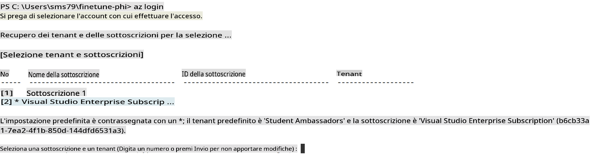

> [!TIP]
>
> Se hai problemi ad accedere ad Azure, prova a utilizzare un codice dispositivo. Apri una finestra del terminale e digita il seguente comando per accedere al tuo account Azure:
>
> ```console
> az login --use-device-code
> ```
>

### Fine-tuning del modello Phi-3

In questo esercizio, eseguirai il fine-tuning del modello Phi-3 utilizzando il dataset fornito. Prima definirai il processo di fine-tuning nel file *fine_tune.py*. Successivamente, configurerai l'ambiente di Azure Machine Learning e avvierai il processo di fine-tuning eseguendo il file *setup_ml.py*. Questo script garantisce che il fine-tuning avvenga all'interno dell'ambiente di Azure Machine Learning.

Eseguendo *setup_ml.py*, avvierai il processo di fine-tuning nell'ambiente di Azure Machine Learning.

#### Aggiungi codice al file *fine_tune.py*

1. Vai alla cartella *finetuning_dir* e apri il file *fine_tune.py* in Visual Studio Code.

1. Aggiungi il seguente codice nel file *fine_tune.py*.

    ```python
    import argparse
    import sys
    import logging
    import os
    from datasets import load_dataset
    import torch
    import mlflow
    from transformers import AutoModelForCausalLM, AutoTokenizer, TrainingArguments
    from trl import SFTTrainer

    # To avoid the INVALID_PARAMETER_VALUE error in MLflow, disable MLflow integration
    os.environ["DISABLE_MLFLOW_INTEGRATION"] = "True"

    # Logging setup
    logging.basicConfig(
        format="%(asctime)s - %(levelname)s - %(name)s - %(message)s",
        datefmt="%Y-%m-%d %H:%M:%S",
        handlers=[logging.StreamHandler(sys.stdout)],
        level=logging.WARNING
    )
    logger = logging.getLogger(__name__)

    def initialize_model_and_tokenizer(model_name, model_kwargs):
        """
        Initialize the model and tokenizer with the given pretrained model name and arguments.
        """
        model = AutoModelForCausalLM.from_pretrained(model_name, **model_kwargs)
        tokenizer = AutoTokenizer.from_pretrained(model_name)
        tokenizer.model_max_length = 2048
        tokenizer.pad_token = tokenizer.unk_token
        tokenizer.pad_token_id = tokenizer.convert_tokens_to_ids(tokenizer.pad_token)
        tokenizer.padding_side = 'right'
        return model, tokenizer

    def apply_chat_template(example, tokenizer):
        """
        Apply a chat template to tokenize messages in the example.
        """
        messages = example["messages"]
        if messages[0]["role"] != "system":
            messages.insert(0, {"role": "system", "content": ""})
        example["text"] = tokenizer.apply_chat_template(
            messages, tokenize=False, add_generation_prompt=False
        )
        return example

    def load_and_preprocess_data(train_filepath, test_filepath, tokenizer):
        """
        Load and preprocess the dataset.
        """
        train_dataset = load_dataset('json', data_files=train_filepath, split='train')
        test_dataset = load_dataset('json', data_files=test_filepath, split='train')
        column_names = list(train_dataset.features)

        train_dataset = train_dataset.map(
            apply_chat_template,
            fn_kwargs={"tokenizer": tokenizer},
            num_proc=10,
            remove_columns=column_names,
            desc="Applying chat template to train dataset",
        )

        test_dataset = test_dataset.map(
            apply_chat_template,
            fn_kwargs={"tokenizer": tokenizer},
            num_proc=10,
            remove_columns=column_names,
            desc="Applying chat template to test dataset",
        )

        return train_dataset, test_dataset

    def train_and_evaluate_model(train_dataset, test_dataset, model, tokenizer, output_dir):
        """
        Train and evaluate the model.
        """
        training_args = TrainingArguments(
            bf16=True,
            do_eval=True,
            output_dir=output_dir,
            eval_strategy="epoch",
            learning_rate=5.0e-06,
            logging_steps=20,
            lr_scheduler_type="cosine",
            num_train_epochs=3,
            overwrite_output_dir=True,
            per_device_eval_batch_size=4,
            per_device_train_batch_size=4,
            remove_unused_columns=True,
            save_steps=500,
            seed=0,
            gradient_checkpointing=True,
            gradient_accumulation_steps=1,
            warmup_ratio=0.2,
        )

        trainer = SFTTrainer(
            model=model,
            args=training_args,
            train_dataset=train_dataset,
            eval_dataset=test_dataset,
            max_seq_length=2048,
            dataset_text_field="text",
            tokenizer=tokenizer,
            packing=True
        )

        train_result = trainer.train()
        trainer.log_metrics("train", train_result.metrics)

        mlflow.transformers.log_model(
            transformers_model={"model": trainer.model, "tokenizer": tokenizer},
            artifact_path=output_dir,
        )

        tokenizer.padding_side = 'left'
        eval_metrics = trainer.evaluate()
        eval_metrics["eval_samples"] = len(test_dataset)
        trainer.log_metrics("eval", eval_metrics)

    def main(train_file, eval_file, model_output_dir):
        """
        Main function to fine-tune the model.
        """
        model_kwargs = {
            "use_cache": False,
            "trust_remote_code": True,
            "torch_dtype": torch.bfloat16,
            "device_map": None,
            "attn_implementation": "eager"
        }

        # pretrained_model_name = "microsoft/Phi-3-mini-4k-instruct"
        pretrained_model_name = "microsoft/Phi-3.5-mini-instruct"

        with mlflow.start_run():
            model, tokenizer = initialize_model_and_tokenizer(pretrained_model_name, model_kwargs)
            train_dataset, test_dataset = load_and_preprocess_data(train_file, eval_file, tokenizer)
            train_and_evaluate_model(train_dataset, test_dataset, model, tokenizer, model_output_dir)

    if __name__ == "__main__":
        parser = argparse.ArgumentParser()
        parser.add_argument("--train-file", type=str, required=True, help="Path to the training data")
        parser.add_argument("--eval-file", type=str, required=True, help="Path to the evaluation data")
        parser.add_argument("--model_output_dir", type=str, required=True, help="Directory to save the fine-tuned model")
        args = parser.parse_args()
        main(args.train_file, args.eval_file, args.model_output_dir)

    ```

1. Salva e chiudi il file *fine_tune.py*.

> [!TIP]
> **Puoi fare il fine-tuning del modello Phi-3.5**
>
> Nel file *fine_tune.py*, puoi cambiare il campo `pretrained_model_name` from `"microsoft/Phi-3-mini-4k-instruct"` to any model you want to fine-tune. For example, if you change it to `"microsoft/Phi-3.5-mini-instruct"`, you'll be using the Phi-3.5-mini-instruct model for fine-tuning. To find and use the model name you prefer, visit [Hugging Face](https://huggingface.co/), search for the model you're interested in, and then copy and paste its name into the `pretrained_model_name` nel tuo script.
>
> :::image type="content" source="../../imgs/03/FineTuning-PromptFlow/finetunephi3.5.png" alt-text="Fine tuning Phi-3.5.":::
>

#### Aggiungi codice al file *setup_ml.py*

1. Apri il file *setup_ml.py* in Visual Studio Code.

1. Aggiungi il seguente codice nel file *setup_ml.py*.

    ```python
    import logging
    from azure.ai.ml import MLClient, command, Input
    from azure.ai.ml.entities import Environment, AmlCompute
    from azure.identity import AzureCliCredential
    from config import (
        AZURE_SUBSCRIPTION_ID,
        AZURE_RESOURCE_GROUP_NAME,
        AZURE_ML_WORKSPACE_NAME,
        TRAIN_DATA_PATH,
        TEST_DATA_PATH
    )

    # Constants

    # Uncomment the following lines to use a CPU instance for training
    # COMPUTE_INSTANCE_TYPE = "Standard_E16s_v3" # cpu
    # COMPUTE_NAME = "cpu-e16s-v3"
    # DOCKER_IMAGE_NAME = "mcr.microsoft.com/azureml/openmpi4.1.0-ubuntu20.04:latest"

    # Uncomment the following lines to use a GPU instance for training
    COMPUTE_INSTANCE_TYPE = "Standard_NC24ads_A100_v4"
    COMPUTE_NAME = "gpu-nc24s-a100-v4"
    DOCKER_IMAGE_NAME = "mcr.microsoft.com/azureml/curated/acft-hf-nlp-gpu:59"

    CONDA_FILE = "conda.yml"
    LOCATION = "eastus2" # Replace with the location of your compute cluster
    FINETUNING_DIR = "./finetuning_dir" # Path to the fine-tuning script
    TRAINING_ENV_NAME = "phi-3-training-environment" # Name of the training environment
    MODEL_OUTPUT_DIR = "./model_output" # Path to the model output directory in azure ml

    # Logging setup to track the process
    logger = logging.getLogger(__name__)
    logging.basicConfig(
        format="%(asctime)s - %(levelname)s - %(name)s - %(message)s",
        datefmt="%Y-%m-%d %H:%M:%S",
        level=logging.WARNING
    )

    def get_ml_client():
        """
        Initialize the ML Client using Azure CLI credentials.
        """
        credential = AzureCliCredential()
        return MLClient(credential, AZURE_SUBSCRIPTION_ID, AZURE_RESOURCE_GROUP_NAME, AZURE_ML_WORKSPACE_NAME)

    def create_or_get_environment(ml_client):
        """
        Create or update the training environment in Azure ML.
        """
        env = Environment(
            image=DOCKER_IMAGE_NAME,  # Docker image for the environment
            conda_file=CONDA_FILE,  # Conda environment file
            name=TRAINING_ENV_NAME,  # Name of the environment
        )
        return ml_client.environments.create_or_update(env)

    def create_or_get_compute_cluster(ml_client, compute_name, COMPUTE_INSTANCE_TYPE, location):
        """
        Create or update the compute cluster in Azure ML.
        """
        try:
            compute_cluster = ml_client.compute.get(compute_name)
            logger.info(f"Compute cluster '{compute_name}' already exists. Reusing it for the current run.")
        except Exception:
            logger.info(f"Compute cluster '{compute_name}' does not exist. Creating a new one with size {COMPUTE_INSTANCE_TYPE}.")
            compute_cluster = AmlCompute(
                name=compute_name,
                size=COMPUTE_INSTANCE_TYPE,
                location=location,
                tier="Dedicated",  # Tier of the compute cluster
                min_instances=0,  # Minimum number of instances
                max_instances=1  # Maximum number of instances
            )
            ml_client.compute.begin_create_or_update(compute_cluster).wait()  # Wait for the cluster to be created
        return compute_cluster

    def create_fine_tuning_job(env, compute_name):
        """
        Set up the fine-tuning job in Azure ML.
        """
        return command(
            code=FINETUNING_DIR,  # Path to fine_tune.py
            command=(
                "python fine_tune.py "
                "--train-file ${{inputs.train_file}} "
                "--eval-file ${{inputs.eval_file}} "
                "--model_output_dir ${{inputs.model_output}}"
            ),
            environment=env,  # Training environment
            compute=compute_name,  # Compute cluster to use
            inputs={
                "train_file": Input(type="uri_file", path=TRAIN_DATA_PATH),  # Path to the training data file
                "eval_file": Input(type="uri_file", path=TEST_DATA_PATH),  # Path to the evaluation data file
                "model_output": MODEL_OUTPUT_DIR
            }
        )

    def main():
        """
        Main function to set up and run the fine-tuning job in Azure ML.
        """
        # Initialize ML Client
        ml_client = get_ml_client()

        # Create Environment
        env = create_or_get_environment(ml_client)
        
        # Create or get existing compute cluster
        create_or_get_compute_cluster(ml_client, COMPUTE_NAME, COMPUTE_INSTANCE_TYPE, LOCATION)

        # Create and Submit Fine-Tuning Job
        job = create_fine_tuning_job(env, COMPUTE_NAME)
        returned_job = ml_client.jobs.create_or_update(job)  # Submit the job
        ml_client.jobs.stream(returned_job.name)  # Stream the job logs
        
        # Capture the job name
        job_name = returned_job.name
        print(f"Job name: {job_name}")

    if __name__ == "__main__":
        main()

    ```

1. Sostituisci `COMPUTE_INSTANCE_TYPE`, `COMPUTE_NAME`, and `LOCATION` con i tuoi dettagli specifici.

    ```python
   # Uncomment the following lines to use a GPU instance for training
    COMPUTE_INSTANCE_TYPE = "Standard_NC24ads_A100_v4"
    COMPUTE_NAME = "gpu-nc24s-a100-v4"
    ...
    LOCATION = "eastus2" # Replace with the location of your compute cluster
    ```

> [!TIP]
>
> **Guida per il fine-tuning con un dataset minimo utilizzando una CPU**
>
> Se vuoi utilizzare una CPU per il fine-tuning, questo approccio è ideale per chi dispone di sottoscrizioni con vantaggi (come la Visual Studio Enterprise Subscription) o per testare rapidamente il processo di fine-tuning e distribuzione.
>
> 1. Apri il file *setup_ml*.
> 1. Sostituisci `COMPUTE_INSTANCE_TYPE`, `COMPUTE_NAME`, and `DOCKER_IMAGE_NAME` with the following. If you do not have access to *Standard_E16s_v3*, you can use an equivalent CPU instance or request a new quota.
> 1. Replace `LOCATION` con i tuoi dettagli specifici.
>
>    ```python
>    # Uncomment the following lines to use a CPU instance for training
>    COMPUTE_INSTANCE_TYPE = "Standard_E16s_v3" # cpu
>    COMPUTE_NAME = "cpu-e16s-v3"
>    DOCKER_IMAGE_NAME = "mcr.microsoft.com/azureml/openmpi4.1.0-ubuntu20.04:latest"
>    LOCATION = "eastus2" # Replace with the location of your compute cluster
>    ```
>

1. Digita il seguente comando per eseguire lo script *setup_ml.py* e avviare il processo di fine-tuning in Azure Machine Learning.

    ```python
    python setup_ml.py
    ```

1. In questo esercizio, hai eseguito con successo il fine-tuning del modello Phi-3 utilizzando Azure Machine Learning. Eseguendo lo script *setup_ml.py*, hai configurato l'ambiente di Azure Machine Learning e avviato il processo di fine-tuning definito nel file *fine_tune.py*. Nota che il processo di fine-tuning può richiedere un tempo considerevole. Dopo aver eseguito il comando `python setup_ml.py` command, you need to wait for the process to complete. You can monitor the status of the fine-tuning job by following the link provided in the terminal to the Azure Machine Learning portal.

    

### Deploy the fine-tuned model

To integrate the fine-tuned Phi-3 model with Prompt Flow, you need to deploy the model to make it accessible for real-time inference. This process involves registering the model, creating an online endpoint, and deploying the model.

#### Set the model name, endpoint name, and deployment name for deployment

1. Open *config.py* file.

1. Replace `AZURE_MODEL_NAME = "your_fine_tuned_model_name"` with the desired name for your model.

1. Replace `AZURE_ENDPOINT_NAME = "your_fine_tuned_model_endpoint_name"` with the desired name for your endpoint.

1. Replace `AZURE_DEPLOYMENT_NAME = "your_fine_tuned_model_deployment_name"` assegna il nome desiderato alla tua distribuzione.

#### Aggiungi codice al file *deploy_model.py*

Eseguire il file *deploy_model.py* automatizza l'intero processo di distribuzione. Registra il modello, crea un endpoint ed esegue la distribuzione in base alle impostazioni specificate nel file config.py, che include il nome del modello, il nome dell'endpoint e il nome della distribuzione.

1. Apri il file *deploy_model.py* in Visual Studio Code.

1. Aggiungi il seguente codice nel file *deploy_model.py*.

    ```python
    import logging
    from azure.identity import AzureCliCredential
    from azure.ai.ml import MLClient
    from azure.ai.ml.entities import Model, ProbeSettings, ManagedOnlineEndpoint, ManagedOnlineDeployment, IdentityConfiguration, ManagedIdentityConfiguration, OnlineRequestSettings
    from azure.ai.ml.constants import AssetTypes

    # Configuration imports
    from config import (
        AZURE_SUBSCRIPTION_ID,
        AZURE_RESOURCE_GROUP_NAME,
        AZURE_ML_WORKSPACE_NAME,
        AZURE_MANAGED_IDENTITY_RESOURCE_ID,
        AZURE_MANAGED_IDENTITY_CLIENT_ID,
        AZURE_MODEL_NAME,
        AZURE_ENDPOINT_NAME,
        AZURE_DEPLOYMENT_NAME
    )

    # Constants
    JOB_NAME = "your-job-name"
    COMPUTE_INSTANCE_TYPE = "Standard_E4s_v3"

    deployment_env_vars = {
        "SUBSCRIPTION_ID": AZURE_SUBSCRIPTION_ID,
        "RESOURCE_GROUP_NAME": AZURE_RESOURCE_GROUP_NAME,
        "UAI_CLIENT_ID": AZURE_MANAGED_IDENTITY_CLIENT_ID,
    }

    # Logging setup
    logging.basicConfig(
        format="%(asctime)s - %(levelname)s - %(name)s - %(message)s",
        datefmt="%Y-%m-%d %H:%M:%S",
        level=logging.DEBUG
    )
    logger = logging.getLogger(__name__)

    def get_ml_client():
        """Initialize and return the ML Client."""
        credential = AzureCliCredential()
        return MLClient(credential, AZURE_SUBSCRIPTION_ID, AZURE_RESOURCE_GROUP_NAME, AZURE_ML_WORKSPACE_NAME)

    def register_model(ml_client, model_name, job_name):
        """Register a new model."""
        model_path = f"azureml://jobs/{job_name}/outputs/artifacts/paths/model_output"
        logger.info(f"Registering model {model_name} from job {job_name} at path {model_path}.")
        run_model = Model(
            path=model_path,
            name=model_name,
            description="Model created from run.",
            type=AssetTypes.MLFLOW_MODEL,
        )
        model = ml_client.models.create_or_update(run_model)
        logger.info(f"Registered model ID: {model.id}")
        return model

    def delete_existing_endpoint(ml_client, endpoint_name):
        """Delete existing endpoint if it exists."""
        try:
            endpoint_result = ml_client.online_endpoints.get(name=endpoint_name)
            logger.info(f"Deleting existing endpoint {endpoint_name}.")
            ml_client.online_endpoints.begin_delete(name=endpoint_name).result()
            logger.info(f"Deleted existing endpoint {endpoint_name}.")
        except Exception as e:
            logger.info(f"No existing endpoint {endpoint_name} found to delete: {e}")

    def create_or_update_endpoint(ml_client, endpoint_name, description=""):
        """Create or update an endpoint."""
        delete_existing_endpoint(ml_client, endpoint_name)
        logger.info(f"Creating new endpoint {endpoint_name}.")
        endpoint = ManagedOnlineEndpoint(
            name=endpoint_name,
            description=description,
            identity=IdentityConfiguration(
                type="user_assigned",
                user_assigned_identities=[ManagedIdentityConfiguration(resource_id=AZURE_MANAGED_IDENTITY_RESOURCE_ID)]
            )
        )
        endpoint_result = ml_client.online_endpoints.begin_create_or_update(endpoint).result()
        logger.info(f"Created new endpoint {endpoint_name}.")
        return endpoint_result

    def create_or_update_deployment(ml_client, endpoint_name, deployment_name, model):
        """Create or update a deployment."""

        logger.info(f"Creating deployment {deployment_name} for endpoint {endpoint_name}.")
        deployment = ManagedOnlineDeployment(
            name=deployment_name,
            endpoint_name=endpoint_name,
            model=model.id,
            instance_type=COMPUTE_INSTANCE_TYPE,
            instance_count=1,
            environment_variables=deployment_env_vars,
            request_settings=OnlineRequestSettings(
                max_concurrent_requests_per_instance=3,
                request_timeout_ms=180000,
                max_queue_wait_ms=120000
            ),
            liveness_probe=ProbeSettings(
                failure_threshold=30,
                success_threshold=1,
                period=100,
                initial_delay=500,
            ),
            readiness_probe=ProbeSettings(
                failure_threshold=30,
                success_threshold=1,
                period=100,
                initial_delay=500,
            ),
        )
        deployment_result = ml_client.online_deployments.begin_create_or_update(deployment).result()
        logger.info(f"Created deployment {deployment.name} for endpoint {endpoint_name}.")
        return deployment_result

    def set_traffic_to_deployment(ml_client, endpoint_name, deployment_name):
        """Set traffic to the specified deployment."""
        try:
            # Fetch the current endpoint details
            endpoint = ml_client.online_endpoints.get(name=endpoint_name)
            
            # Log the current traffic allocation for debugging
            logger.info(f"Current traffic allocation: {endpoint.traffic}")
            
            # Set the traffic allocation for the deployment
            endpoint.traffic = {deployment_name: 100}
            
            # Update the endpoint with the new traffic allocation
            endpoint_poller = ml_client.online_endpoints.begin_create_or_update(endpoint)
            updated_endpoint = endpoint_poller.result()
            
            # Log the updated traffic allocation for debugging
            logger.info(f"Updated traffic allocation: {updated_endpoint.traffic}")
            logger.info(f"Set traffic to deployment {deployment_name} at endpoint {endpoint_name}.")
            return updated_endpoint
        except Exception as e:
            # Log any errors that occur during the process
            logger.error(f"Failed to set traffic to deployment: {e}")
            raise


    def main():
        ml_client = get_ml_client()

        registered_model = register_model(ml_client, AZURE_MODEL_NAME, JOB_NAME)
        logger.info(f"Registered model ID: {registered_model.id}")

        endpoint = create_or_update_endpoint(ml_client, AZURE_ENDPOINT_NAME, "Endpoint for finetuned Phi-3 model")
        logger.info(f"Endpoint {AZURE_ENDPOINT_NAME} is ready.")

        try:
            deployment = create_or_update_deployment(ml_client, AZURE_ENDPOINT_NAME, AZURE_DEPLOYMENT_NAME, registered_model)
            logger.info(f"Deployment {AZURE_DEPLOYMENT_NAME} is created for endpoint {AZURE_ENDPOINT_NAME}.")

            set_traffic_to_deployment(ml_client, AZURE_ENDPOINT_NAME, AZURE_DEPLOYMENT_NAME)
            logger.info(f"Traffic is set to deployment {AZURE_DEPLOYMENT_NAME} at endpoint {AZURE_ENDPOINT_NAME}.")
        except Exception as e:
            logger.error(f"Failed to create or update deployment: {e}")

    if __name__ == "__main__":
        main()

    ```

1. Esegui le seguenti operazioni per ottenere il `JOB_NAME`:

    - Navigate to Azure Machine Learning resource that you created.
    - Select **Studio web URL** to open the Azure Machine Learning workspace.
    - Select **Jobs** from the left side tab.
    - Select the experiment for fine-tuning. For example, *finetunephi*.
    - Select the job that you created.
    - Copy and paste your job Name into the `JOB_NAME = "your-job-name"` in *deploy_model.py* file.

1. Replace `COMPUTE_INSTANCE_TYPE` con i tuoi dettagli specifici.

1. Digita il seguente comando per eseguire lo script *deploy_model.py* e avviare il processo di distribuzione in Azure Machine Learning.

    ```python
    python deploy_model.py
    ```

> [!WARNING]
> Per evitare costi aggiuntivi al tuo account, assicurati di eliminare l'endpoint creato nello spazio di lavoro di Azure Machine Learning.
>

#### Controlla lo stato della distribuzione nello spazio di lavoro di Azure Machine Learning

1. Visita [Azure ML Studio](https://ml.azure.com/home?wt.mc_id=studentamb_279723).

1. Vai allo spazio di lavoro di Azure Machine Learning che hai creato.

1. Seleziona **Studio web URL** per aprire lo spazio di lavoro di Azure Machine Learning.

1. Seleziona **Endpoints** dalla barra laterale sinistra.

    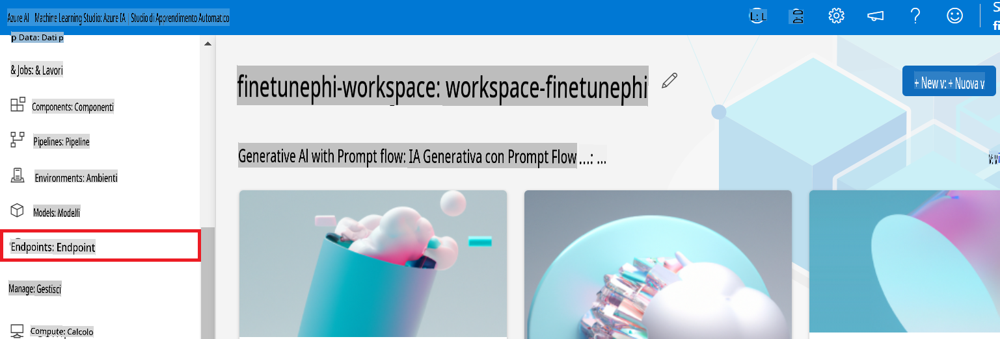

2. Seleziona l'endpoint che hai creato.

    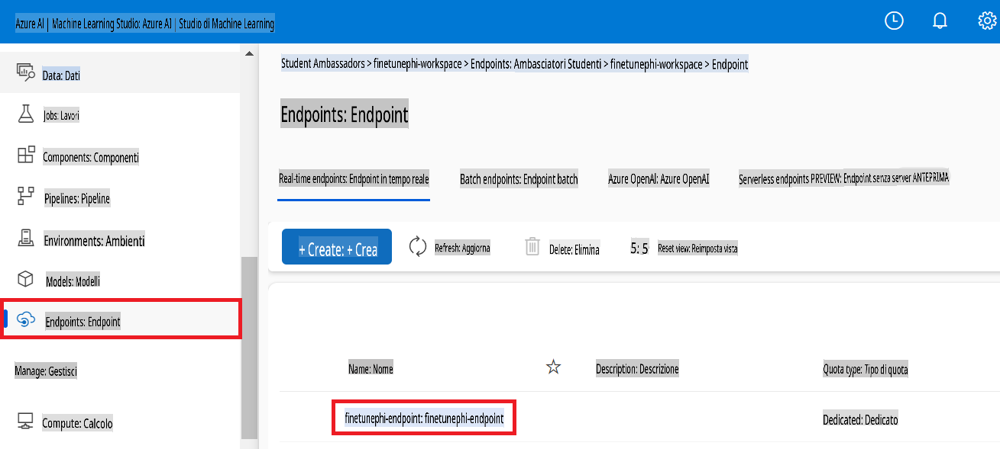

3. In questa pagina, puoi gestire gli endpoints creati durante il processo di distribuzione.

## Scenario 3: Integrazione con Prompt Flow e chat con il tuo modello personalizzato

### Integra il modello Phi-3 personalizzato con Prompt Flow

Dopo aver distribuito con successo il tuo modello fine-tuned, puoi ora integrarlo con Prompt Flow per utilizzarlo in applicazioni in tempo reale, consentendo una varietà di attività interattive con il tuo modello Phi-3 personalizzato.

#### Imposta la chiave API e l'URI dell'endpoint del modello Phi-3 fine-tuned

1. Vai allo spazio di lavoro di Azure Machine Learning che hai creato.
1. Seleziona **Endpoints** dalla barra laterale sinistra.
1. Seleziona l'endpoint che hai creato.
1. Seleziona **Consume** dal menu di navigazione.
1. Copia e incolla il tuo **REST endpoint** nel file *config.py*, sostituendo `AZURE_ML_ENDPOINT = "your_fine_tuned_model_endpoint_uri"` with your **REST endpoint**.
1. Copy and paste your **Primary key** into the *config.py* file, replacing `AZURE_ML_API_KEY = "your_fine_tuned_model_api_key"` con la tua **Primary key**.

    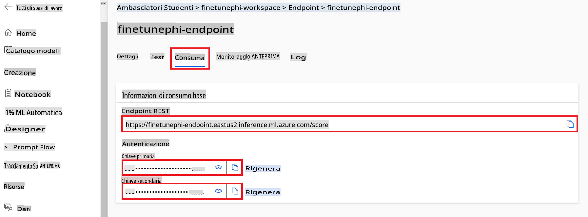

#### Aggiungi codice al file *flow.dag.yml*

1. Apri il file *flow.dag.yml* in Visual Studio Code.

1. Aggiungi il seguente codice nel file *flow.dag.yml*.

    ```yml
    inputs:
      input_data:
        type: string
        default: "Who founded Microsoft?"

    outputs:
      answer:
        type: string
        reference: ${integrate_with_promptflow.output}

    nodes:
    - name: integrate_with_promptflow
      type: python
      source:
        type: code
        path: integrate_with_promptflow.py
      inputs:
        input_data: ${inputs.input_data}
    ```

#### Aggiungi codice al file *integrate_with_promptflow.py*

1. Apri il file *integrate_with_promptflow.py* in Visual Studio Code.

1. Aggiungi il seguente codice nel file *integrate_with_promptflow.py*.

    ```python
    import logging
    import requests
    from promptflow.core import tool
    import asyncio
    import platform
    from config import (
        AZURE_ML_ENDPOINT,
        AZURE_ML_API_KEY
    )

    # Logging setup
    logging.basicConfig(
        format="%(asctime)s - %(levelname)s - %(name)s - %(message)s",
        datefmt="%Y-%m-%d %H:%M:%S",
        level=logging.DEBUG
    )
    logger = logging.getLogger(__name__)

    def query_azml_endpoint(input_data: list, endpoint_url: str, api_key: str) -> str:
        """
        Send a request to the Azure ML endpoint with the given input data.
        """
        headers = {
            "Content-Type": "application/json",
            "Authorization": f"Bearer {api_key}"
        }
        data = {
            "input_data": [input_data],
            "params": {
                "temperature": 0.7,
                "max_new_tokens": 128,
                "do_sample": True,
                "return_full_text": True
            }
        }
        try:
            response = requests.post(endpoint_url, json=data, headers=headers)
            response.raise_for_status()
            result = response.json()[0]
            logger.info("Successfully received response from Azure ML Endpoint.")
            return result
        except requests.exceptions.RequestException as e:
            logger.error(f"Error querying Azure ML Endpoint: {e}")
            raise

    def setup_asyncio_policy():
        """
        Setup asyncio event loop policy for Windows.
        """
        if platform.system() == 'Windows':
            asyncio.set_event_loop_policy(asyncio.WindowsSelectorEventLoopPolicy())
            logger.info("Set Windows asyncio event loop policy.")

    @tool
    def my_python_tool(input_data: str) -> str:
        """
        Tool function to process input data and query the Azure ML endpoint.
        """
        setup_asyncio_policy()
        return query_azml_endpoint(input_data, AZURE_ML_ENDPOINT, AZURE_ML_API_KEY)

    ```

### Chatta con il tuo modello personalizzato

1. Digita il seguente comando per eseguire lo script *deploy_model.py* e avviare il processo di distribuzione in Azure Machine Learning.

    ```python
    pf flow serve --source ./ --port 8080 --host localhost
    ```

1. Ecco un esempio dei risultati: Ora puoi chattare con il tuo modello Phi-3 personalizzato. Si consiglia di fare domande basate sui dati utilizzati per il fine-tuning.

    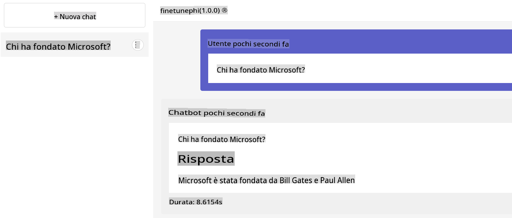

**Disclaimer**:  
Questo documento è stato tradotto utilizzando servizi di traduzione automatica basati sull'intelligenza artificiale. Sebbene ci impegniamo per garantire l'accuratezza, si prega di tenere presente che le traduzioni automatiche possono contenere errori o imprecisioni. Il documento originale nella sua lingua madre dovrebbe essere considerato la fonte autorevole. Per informazioni critiche, si raccomanda una traduzione professionale effettuata da un essere umano. Non siamo responsabili per eventuali incomprensioni o interpretazioni errate derivanti dall'uso di questa traduzione.