# Perfeziona e integra modelli personalizzati Phi-3 con Prompt Flow in Azure AI Foundry

Questo esempio end-to-end (E2E) si basa sulla guida "[Fine-Tune and Integrate Custom Phi-3 Models with Prompt Flow in Azure AI Foundry](https://techcommunity.microsoft.com/t5/educator-developer-blog/fine-tune-and-integrate-custom-phi-3-models-with-prompt-flow-in/ba-p/4191726?WT.mc_id=aiml-137032-kinfeylo)" della Microsoft Tech Community. Introduce i processi di perfezionamento, distribuzione e integrazione di modelli personalizzati Phi-3 con Prompt Flow in Azure AI Foundry.  
A differenza dell'esempio E2E, "[Fine-Tune and Integrate Custom Phi-3 Models with Prompt Flow](./E2E_Phi-3-FineTuning_PromptFlow_Integration.md)", che prevedeva l'esecuzione del codice in locale, questo tutorial si concentra interamente sul perfezionamento e l'integrazione del modello all'interno di Azure AI / ML Studio.

## Panoramica

In questo esempio E2E, imparerai a perfezionare il modello Phi-3 e integrarlo con Prompt Flow in Azure AI Foundry. Sfruttando Azure AI / ML Studio, stabilirai un flusso di lavoro per distribuire e utilizzare modelli AI personalizzati. Questo esempio E2E è suddiviso in tre scenari:

**Scenario 1: Configurare le risorse di Azure e prepararsi per il perfezionamento**

**Scenario 2: Perfezionare il modello Phi-3 e distribuirlo in Azure Machine Learning Studio**

**Scenario 3: Integrare con Prompt Flow e interagire con il tuo modello personalizzato in Azure AI Foundry**

Ecco una panoramica di questo esempio E2E.

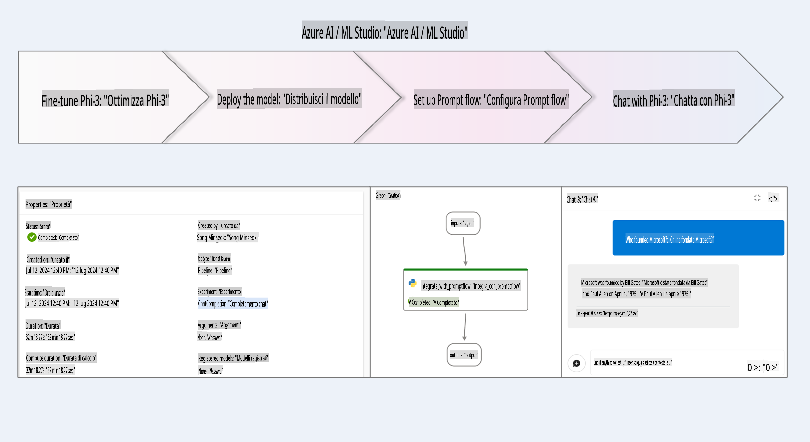

### Indice

1. **[Scenario 1: Configurare le risorse di Azure e prepararsi per il perfezionamento](../../../../../../md/02.Application/01.TextAndChat/Phi3)**  
   - [Creare uno spazio di lavoro di Azure Machine Learning](../../../../../../md/02.Application/01.TextAndChat/Phi3)  
   - [Richiedere quote GPU nella sottoscrizione Azure](../../../../../../md/02.Application/01.TextAndChat/Phi3)  
   - [Aggiungere assegnazione di ruoli](../../../../../../md/02.Application/01.TextAndChat/Phi3)  
   - [Impostare il progetto](../../../../../../md/02.Application/01.TextAndChat/Phi3)  
   - [Preparare il dataset per il perfezionamento](../../../../../../md/02.Application/01.TextAndChat/Phi3)

1. **[Scenario 2: Perfezionare il modello Phi-3 e distribuirlo in Azure Machine Learning Studio](../../../../../../md/02.Application/01.TextAndChat/Phi3)**  
   - [Perfezionare il modello Phi-3](../../../../../../md/02.Application/01.TextAndChat/Phi3)  
   - [Distribuire il modello Phi-3 perfezionato](../../../../../../md/02.Application/01.TextAndChat/Phi3)

1. **[Scenario 3: Integrare con Prompt Flow e interagire con il tuo modello personalizzato in Azure AI Foundry](../../../../../../md/02.Application/01.TextAndChat/Phi3)**  
   - [Integrare il modello personalizzato Phi-3 con Prompt Flow](../../../../../../md/02.Application/01.TextAndChat/Phi3)  
   - [Interagire con il tuo modello personalizzato Phi-3](../../../../../../md/02.Application/01.TextAndChat/Phi3)

## Scenario 1: Configurare le risorse di Azure e prepararsi per il perfezionamento

### Creare uno spazio di lavoro di Azure Machine Learning

1. Digita *azure machine learning* nella **barra di ricerca** in alto nella pagina del portale e seleziona **Azure Machine Learning** tra le opzioni che appaiono.

    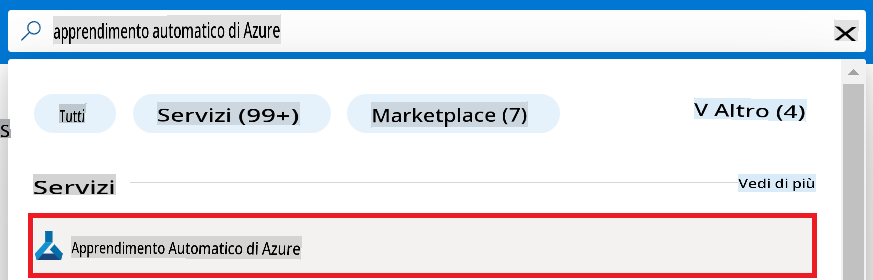

2. Seleziona **+ Crea** dal menu di navigazione.

3. Seleziona **Nuovo spazio di lavoro** dal menu di navigazione.

    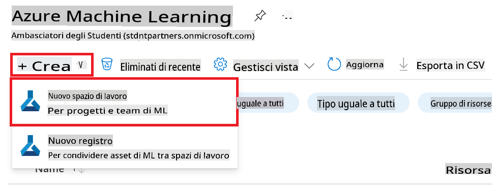

4. Esegui le seguenti operazioni:

    - Seleziona la tua **Sottoscrizione Azure**.  
    - Seleziona il **Gruppo di risorse** da utilizzare (creane uno nuovo, se necessario).  
    - Inserisci un **Nome dello spazio di lavoro** univoco.  
    - Seleziona la **Regione** da utilizzare.  
    - Seleziona l'**Account di archiviazione** da utilizzare (creane uno nuovo, se necessario).  
    - Seleziona il **Key vault** da utilizzare (creane uno nuovo, se necessario).  
    - Seleziona **Application Insights** da utilizzare (creane uno nuovo, se necessario).  
    - Seleziona il **Registro container** da utilizzare (creane uno nuovo, se necessario).  

    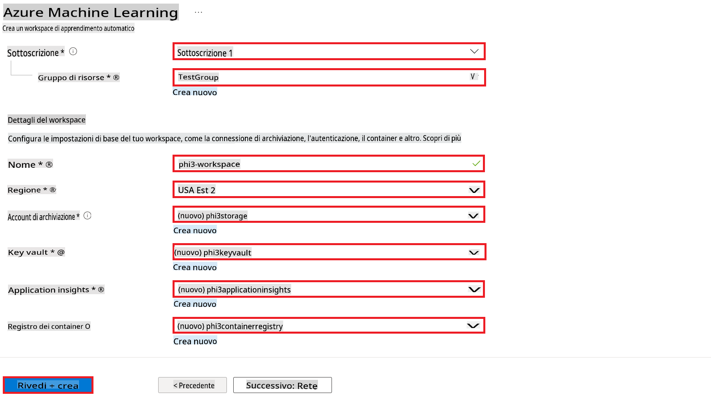

5. Seleziona **Rivedi + Crea**.

6. Seleziona **Crea**.

### Richiedere quote GPU nella sottoscrizione Azure

In questo tutorial, imparerai a perfezionare e distribuire un modello Phi-3 utilizzando GPU. Per il perfezionamento, utilizzerai la GPU *Standard_NC24ads_A100_v4*, che richiede una richiesta di quota. Per la distribuzione, utilizzerai la GPU *Standard_NC6s_v3*, che richiede anch'essa una richiesta di quota.

> [!NOTE]  
> Solo le sottoscrizioni Pay-As-You-Go (il tipo di sottoscrizione standard) sono idonee per l'allocazione GPU; le sottoscrizioni a beneficio non sono attualmente supportate.  

1. Visita [Azure ML Studio](https://ml.azure.com/home?wt.mc_id=studentamb_279723).

1. Esegui le seguenti operazioni per richiedere la quota *Standard NCADSA100v4 Family*:

    - Seleziona **Quota** dalla barra laterale sinistra.  
    - Seleziona la **Famiglia di macchine virtuali** da utilizzare. Ad esempio, seleziona **Standard NCADSA100v4 Family Cluster Dedicated vCPUs**, che include la GPU *Standard_NC24ads_A100_v4*.  
    - Seleziona **Richiedi quota** dal menu di navigazione.  

        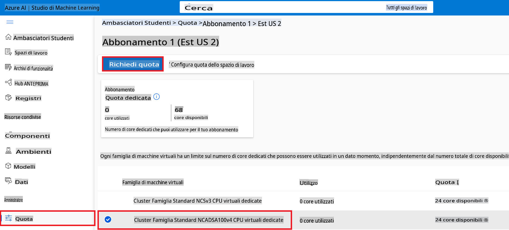

    - Nella pagina Richiedi quota, inserisci il **Nuovo limite di core** desiderato. Ad esempio, 24.  
    - Nella pagina Richiedi quota, seleziona **Invia** per richiedere la quota GPU.

1. Esegui le seguenti operazioni per richiedere la quota *Standard NCSv3 Family*:

    - Seleziona **Quota** dalla barra laterale sinistra.  
    - Seleziona la **Famiglia di macchine virtuali** da utilizzare. Ad esempio, seleziona **Standard NCSv3 Family Cluster Dedicated vCPUs**, che include la GPU *Standard_NC6s_v3*.  
    - Seleziona **Richiedi quota** dal menu di navigazione.  
    - Nella pagina Richiedi quota, inserisci il **Nuovo limite di core** desiderato. Ad esempio, 24.  
    - Nella pagina Richiedi quota, seleziona **Invia** per richiedere la quota GPU.

### Aggiungere assegnazione di ruoli

Per perfezionare e distribuire i tuoi modelli, devi prima creare un'Identità Gestita Assegnata dall'Utente (UAI) e assegnarle i permessi appropriati. Questa UAI verrà utilizzata per l'autenticazione durante la distribuzione.

#### Creare un'Identità Gestita Assegnata dall'Utente (UAI)

1. Digita *managed identities* nella **barra di ricerca** in alto nella pagina del portale e seleziona **Managed Identities** tra le opzioni che appaiono.

    

1. Seleziona **+ Crea**.

    

1. Esegui le seguenti operazioni:

    - Seleziona la tua **Sottoscrizione Azure**.  
    - Seleziona il **Gruppo di risorse** da utilizzare (creane uno nuovo, se necessario).  
    - Seleziona la **Regione** da utilizzare.  
    - Inserisci un **Nome** univoco.  

    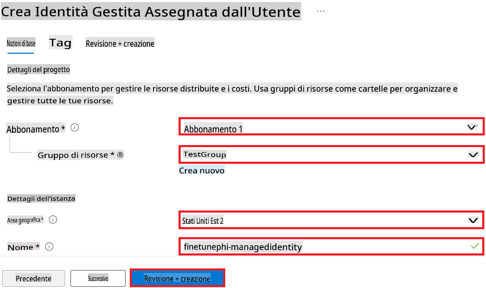

1. Seleziona **Rivedi + Crea**.

1. Seleziona **Crea**.

#### Aggiungere il ruolo di Contributor all'Identità Gestita

1. Vai alla risorsa di Identità Gestita che hai creato.

1. Seleziona **Assegnazioni di ruoli di Azure** dalla barra laterale sinistra.

1. Seleziona **+Aggiungi assegnazione di ruolo** dal menu di navigazione.

1. Nella pagina Aggiungi assegnazione di ruolo, esegui le seguenti operazioni:  
    - Seleziona l'**Ambito** come **Gruppo di risorse**.  
    - Seleziona la tua **Sottoscrizione Azure**.  
    - Seleziona il **Gruppo di risorse** da utilizzare.  
    - Seleziona il **Ruolo** come **Contributor**.  

    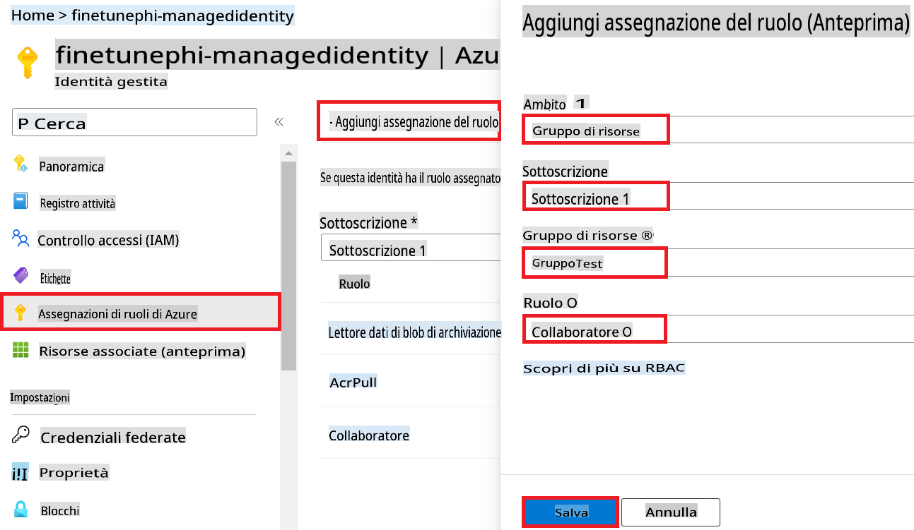

2. Seleziona **Salva**.

#### Aggiungere il ruolo di Storage Blob Data Reader all'Identità Gestita

1. Digita *storage accounts* nella **barra di ricerca** in alto nella pagina del portale e seleziona **Storage accounts** tra le opzioni che appaiono.

    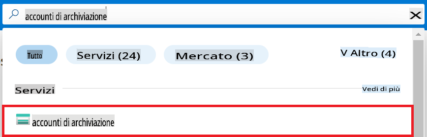

1. Seleziona l'account di archiviazione associato allo spazio di lavoro di Azure Machine Learning che hai creato. Ad esempio, *finetunephistorage*.  

1. Esegui le seguenti operazioni per navigare alla pagina Aggiungi assegnazione di ruolo:  
    - Vai all'account di archiviazione di Azure che hai creato.  
    - Seleziona **Controllo accessi (IAM)** dalla barra laterale sinistra.  
    - Seleziona **+ Aggiungi** dal menu di navigazione.  
    - Seleziona **Aggiungi assegnazione di ruolo** dal menu di navigazione.  

    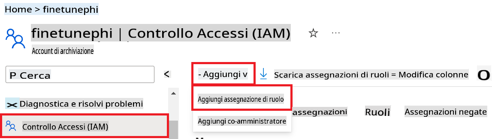

1. Nella pagina Aggiungi assegnazione di ruolo, esegui le seguenti operazioni:  
    - Nella pagina Ruolo, digita *Storage Blob Data Reader* nella **barra di ricerca** e seleziona **Storage Blob Data Reader** tra le opzioni che appaiono.  
    - Nella pagina Ruolo, seleziona **Avanti**.  
    - Nella pagina Membri, seleziona **Assegna accesso a** **Identità gestita**.  
    - Nella pagina Membri, seleziona **+ Seleziona membri**.  
    - Nella pagina Seleziona identità gestite, seleziona la tua **Sottoscrizione Azure**.  
    - Nella pagina Seleziona identità gestite, seleziona l'**Identità gestita** che hai creato. Ad esempio, *finetunephi-managedidentity*.  
    - Nella pagina Seleziona identità gestite, seleziona **Seleziona**.  

    

1. Seleziona **Rivedi + assegna**.

#### Aggiungere il ruolo di AcrPull all'Identità Gestita

1. Digita *container registries* nella **barra di ricerca** in alto nella pagina del portale e seleziona **Container registries** tra le opzioni che appaiono.

    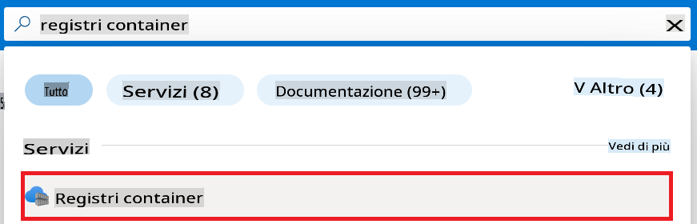

1. Seleziona il registro container associato allo spazio di lavoro di Azure Machine Learning. Ad esempio, *finetunephicontainerregistry*.  

1. Esegui le seguenti operazioni per navigare alla pagina Aggiungi assegnazione di ruolo:  
    - Seleziona **Controllo accessi (IAM)** dalla barra laterale sinistra.  
    - Seleziona **+ Aggiungi** dal menu di navigazione.  
    - Seleziona **Aggiungi assegnazione di ruolo** dal menu di navigazione.  

1. Nella pagina Aggiungi assegnazione di ruolo, esegui le seguenti operazioni:  
    - Nella pagina Ruolo, digita *AcrPull* nella **barra di ricerca** e seleziona **AcrPull** tra le opzioni che appaiono.  
    - Nella pagina Ruolo, seleziona **Avanti**.  
    - Nella pagina Membri, seleziona **Assegna accesso a** **Identità gestita**.  
    - Nella pagina Membri, seleziona **+ Seleziona membri**.  
    - Nella pagina Seleziona identità gestite, seleziona la tua **Sottoscrizione Azure**.  
    - Nella pagina Seleziona identità gestite, seleziona l'**Identità gestita** che hai creato. Ad esempio, *finetunephi-managedidentity*.  
    - Nella pagina Seleziona identità gestite, seleziona **Seleziona**.  
    - Seleziona **Rivedi + assegna**.

### Impostare il progetto

Per scaricare i dataset necessari per il perfezionamento, configurerai un ambiente locale.

In questo esercizio, eseguirai:  

- Creazione di una cartella di lavoro.  
- Creazione di un ambiente virtuale.  
- Installazione dei pacchetti necessari.  
- Creazione di un file *download_dataset.py* per scaricare il dataset.

#### Creare una cartella di lavoro

1. Apri una finestra del terminale e digita il seguente comando per creare una cartella chiamata *finetune-phi* nel percorso predefinito.

    ```console
    mkdir finetune-phi
    ```

2. Digita il seguente comando nel terminale per accedere alla cartella *finetune-phi* che hai creato.

    ```console
    cd finetune-phi
    ```

#### Creare un ambiente virtuale

1. Digita il seguente comando nel terminale per creare un ambiente virtuale chiamato *.venv*.

    ```console
    python -m venv .venv
    ```

2. Digita il seguente comando nel terminale per attivare l'ambiente virtuale.

    ```console
    .venv\Scripts\activate.bat
    ```

> [!NOTE]  
> Se ha funzionato, dovresti vedere *(.venv)* prima del prompt dei comandi.

#### Installare i pacchetti necessari

1. Digita i seguenti comandi nel terminale per installare i pacchetti richiesti.

    ```console
    pip install datasets==2.19.1
    ```

#### Creare `download_dataset.py`

> [!NOTE]  
> Struttura completa della cartella:  
> ```text
> └── YourUserName
> .    └── finetune-phi
> .        └── download_dataset.py
> ```

1. Apri **Visual Studio Code**.

1. Seleziona **File** dalla barra del menu.

1. Seleziona **Apri cartella**.

1. Seleziona la cartella *finetune-phi* che hai creato, situata in *C:\Users\yourUserName\finetune-phi*.

    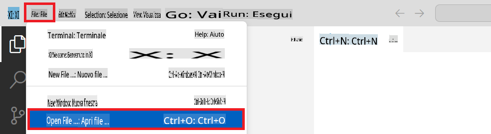

1. Nel riquadro sinistro di Visual Studio Code, fai clic con il tasto destro e seleziona **Nuovo File** per creare un nuovo file chiamato *download_dataset.py*.

    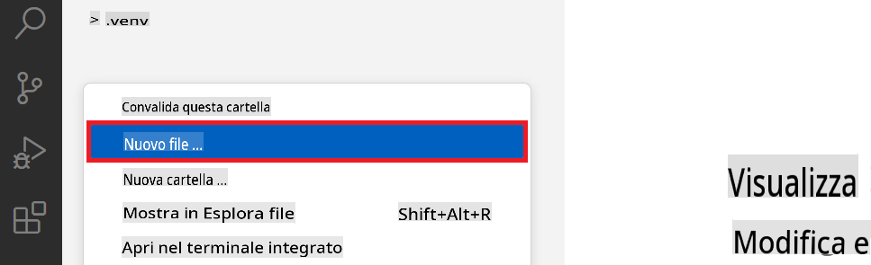

### Preparare il dataset per il perfezionamento

In questo esercizio, eseguirai il file *download_dataset.py* per scaricare i dataset *ultrachat_200k* nel tuo ambiente locale. Successivamente utilizzerai questi dataset per perfezionare il modello Phi-3 in Azure Machine Learning.

In questo esercizio, eseguirai:

- Aggiunta di codice al file *download_dataset.py* per scaricare i dataset.  
- Esecuzione del file *download_dataset.py* per scaricare i dataset nel tuo ambiente locale.

#### Scaricare il dataset usando *download_dataset.py*

1. Apri il file *download_dataset.py* in Visual Studio Code.

1. Aggiungi il seguente codice al file *download_dataset.py*.

    ```python
    import json
    import os
    from datasets import load_dataset

    def load_and_split_dataset(dataset_name, config_name, split_ratio):
        """
        Load and split a dataset.
        """
        # Load the dataset with the specified name, configuration, and split ratio
        dataset = load_dataset(dataset_name, config_name, split=split_ratio)
        print(f"Original dataset size: {len(dataset)}")
        
        # Split the dataset into train and test sets (80% train, 20% test)
        split_dataset = dataset.train_test_split(test_size=0.2)
        print(f"Train dataset size: {len(split_dataset['train'])}")
        print(f"Test dataset size: {len(split_dataset['test'])}")
        
        return split_dataset

    def save_dataset_to_jsonl(dataset, filepath):
        """
        Save a dataset to a JSONL file.
        """
        # Create the directory if it does not exist
        os.makedirs(os.path.dirname(filepath), exist_ok=True)
        
        # Open the file in write mode
        with open(filepath, 'w', encoding='utf-8') as f:
            # Iterate over each record in the dataset
            for record in dataset:
                # Dump the record as a JSON object and write it to the file
                json.dump(record, f)
                # Write a newline character to separate records
                f.write('\n')
        
        print(f"Dataset saved to {filepath}")

    def main():
        """
        Main function to load, split, and save the dataset.
        """
        # Load and split the ULTRACHAT_200k dataset with a specific configuration and split ratio
        dataset = load_and_split_dataset("HuggingFaceH4/ultrachat_200k", 'default', 'train_sft[:1%]')
        
        # Extract the train and test datasets from the split
        train_dataset = dataset['train']
        test_dataset = dataset['test']

        # Save the train dataset to a JSONL file
        save_dataset_to_jsonl(train_dataset, "data/train_data.jsonl")
        
        # Save the test dataset to a separate JSONL file
        save_dataset_to_jsonl(test_dataset, "data/test_data.jsonl")

    if __name__ == "__main__":
        main()

    ```

1. Digita il seguente comando nel terminale per eseguire lo script e scaricare il dataset nel tuo ambiente locale.

    ```console
    python download_dataset.py
    ```

1. Verifica che i dataset siano
1. Visita [Azure ML Studio](https://ml.azure.com/home?wt.mc_id=studentamb_279723).

1. Seleziona **Calcolo** dalla barra laterale sinistra.

1. Seleziona **Cluster di calcolo** dal menu di navigazione.

1. Seleziona **+ Nuovo**.

    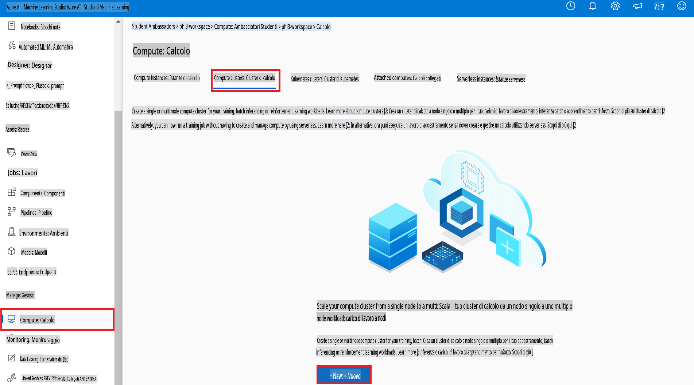

1. Esegui le seguenti operazioni:

    - Seleziona la **Regione** che desideri utilizzare.
    - Imposta il **Livello della macchina virtuale** su **Dedicato**.
    - Imposta il **Tipo di macchina virtuale** su **GPU**.
    - Filtra la **Dimensione della macchina virtuale** su **Seleziona da tutte le opzioni**.
    - Seleziona la **Dimensione della macchina virtuale** su **Standard_NC24ads_A100_v4**.

    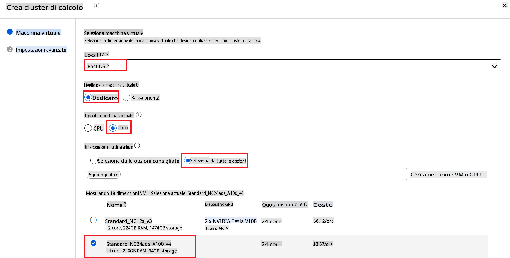

1. Seleziona **Avanti**.

1. Esegui le seguenti operazioni:

    - Inserisci il **Nome del calcolo**. Deve essere un valore univoco.
    - Imposta il **Numero minimo di nodi** su **0**.
    - Imposta il **Numero massimo di nodi** su **1**.
    - Imposta i **Secondi di inattività prima della riduzione scalare** su **120**.

    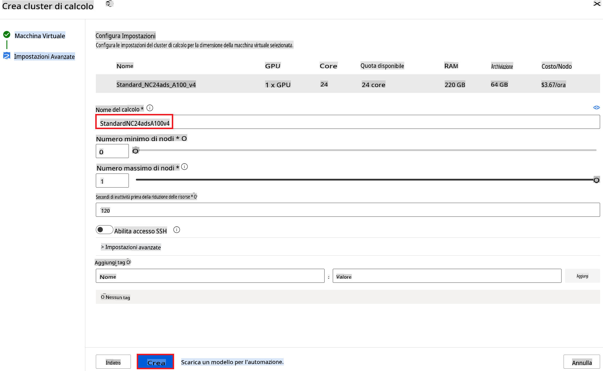

1. Seleziona **Crea**.

#### Ottimizza il modello Phi-3

1. Visita [Azure ML Studio](https://ml.azure.com/home?wt.mc_id=studentamb_279723).

1. Seleziona lo spazio di lavoro di Azure Machine Learning che hai creato.

    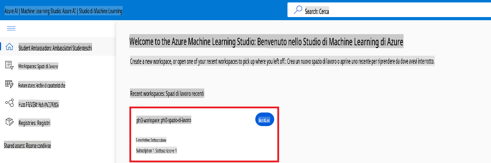

1. Esegui le seguenti operazioni:

    - Seleziona **Catalogo modelli** dalla barra laterale sinistra.
    - Digita *phi-3-mini-4k* nella **barra di ricerca** e seleziona **Phi-3-mini-4k-instruct** dalle opzioni disponibili.

    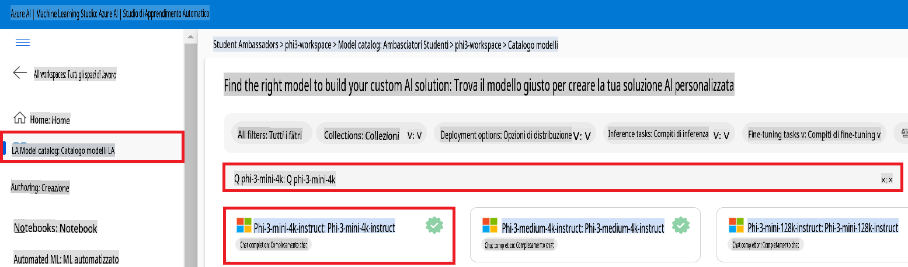

1. Seleziona **Ottimizza** dal menu di navigazione.

    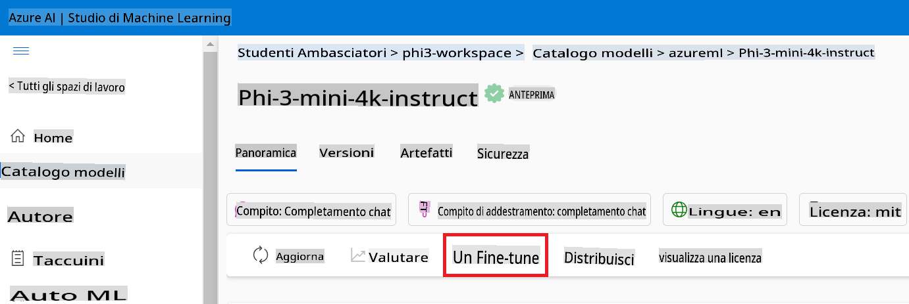

1. Esegui le seguenti operazioni:

    - Imposta **Seleziona tipo di attività** su **Chat completion**.
    - Seleziona **+ Seleziona dati** per caricare i **Dati di addestramento**.
    - Imposta il tipo di caricamento dei dati di convalida su **Fornire dati di convalida differenti**.
    - Seleziona **+ Seleziona dati** per caricare i **Dati di convalida**.

    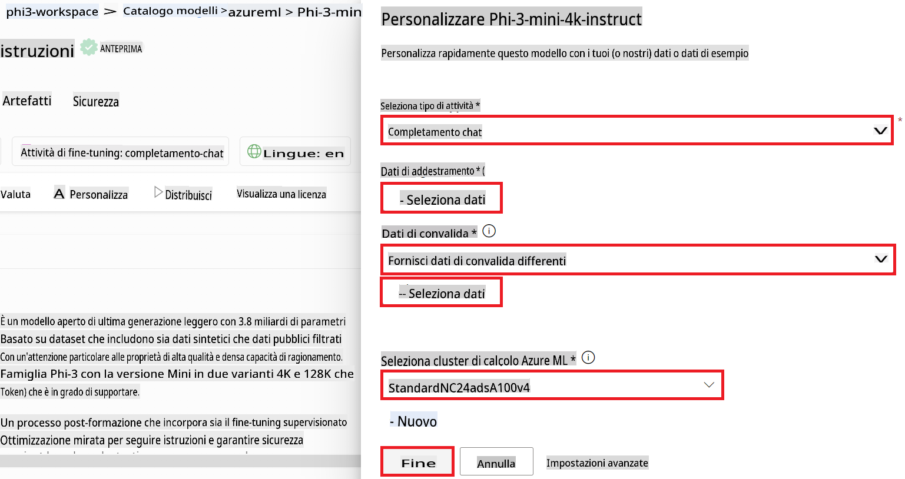

    > [!TIP]
    >
    > Puoi selezionare **Impostazioni avanzate** per personalizzare configurazioni come **learning_rate** e **lr_scheduler_type** per ottimizzare il processo di ottimizzazione in base alle tue esigenze specifiche.

1. Seleziona **Fine**.

1. In questo esercizio, hai ottimizzato con successo il modello Phi-3 utilizzando Azure Machine Learning. Nota che il processo di ottimizzazione può richiedere molto tempo. Dopo aver avviato il job di ottimizzazione, devi attendere il suo completamento. Puoi monitorare lo stato del job di ottimizzazione accedendo alla scheda Job nella barra laterale sinistra dello spazio di lavoro di Azure Machine Learning. Nella prossima serie di esercizi, distribuirai il modello ottimizzato e lo integrerai con Prompt flow.

    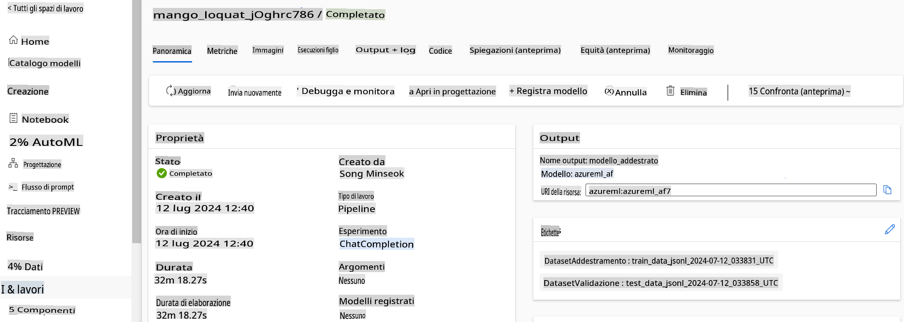

### Distribuisci il modello Phi-3 ottimizzato

Per integrare il modello Phi-3 ottimizzato con Prompt flow, è necessario distribuire il modello per renderlo accessibile per inferenze in tempo reale. Questo processo comprende la registrazione del modello, la creazione di un endpoint online e la distribuzione del modello.

In questo esercizio, farai quanto segue:

- Registra il modello ottimizzato nello spazio di lavoro di Azure Machine Learning.
- Crea un endpoint online.
- Distribuisci il modello Phi-3 ottimizzato registrato.

#### Registra il modello ottimizzato

1. Visita [Azure ML Studio](https://ml.azure.com/home?wt.mc_id=studentamb_279723).

1. Seleziona lo spazio di lavoro di Azure Machine Learning che hai creato.

    

1. Seleziona **Modelli** dalla barra laterale sinistra.
1. Seleziona **+ Registra**.
1. Seleziona **Da un output di job**.

    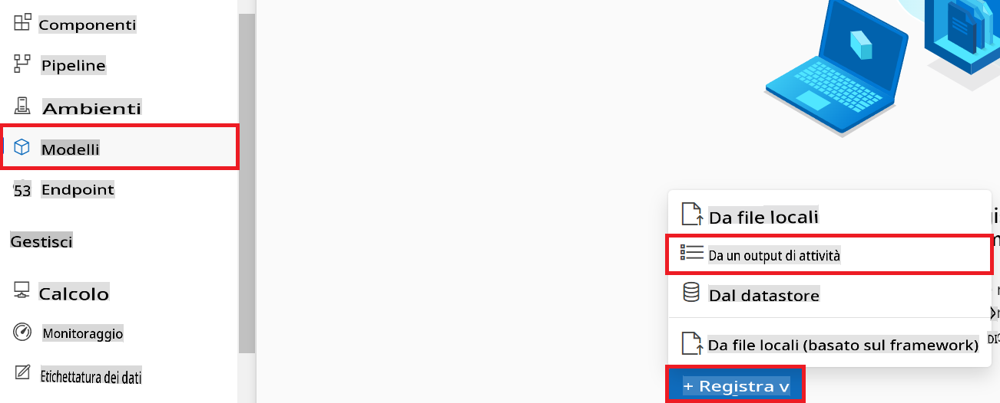

1. Seleziona il job che hai creato.

    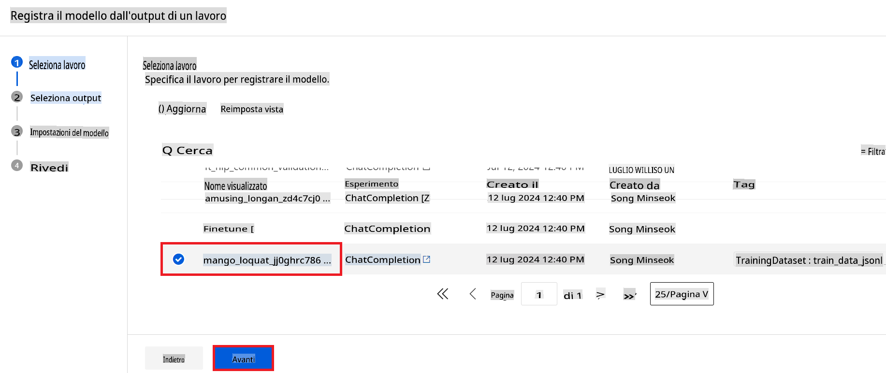

1. Seleziona **Avanti**.

1. Imposta **Tipo di modello** su **MLflow**.

1. Assicurati che **Output del job** sia selezionato automaticamente.

    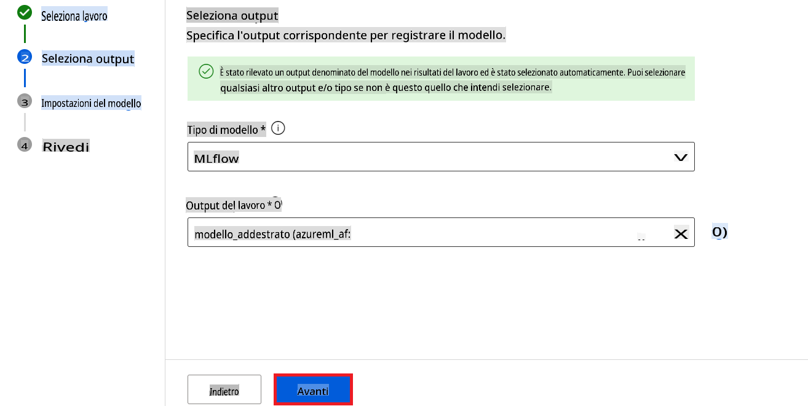

2. Seleziona **Avanti**.

3. Seleziona **Registra**.

    

4. Puoi visualizzare il tuo modello registrato accedendo al menu **Modelli** dalla barra laterale sinistra.

    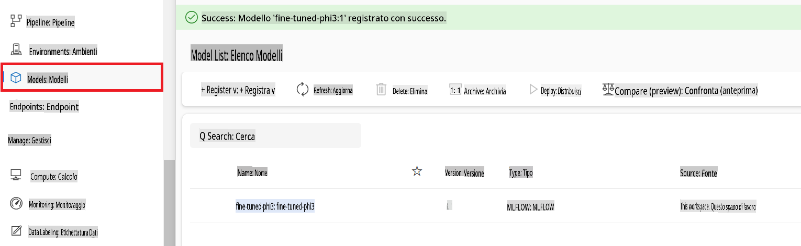

#### Distribuisci il modello ottimizzato

1. Accedi allo spazio di lavoro di Azure Machine Learning che hai creato.

1. Seleziona **Endpoint** dalla barra laterale sinistra.

1. Seleziona **Endpoint in tempo reale** dal menu di navigazione.

    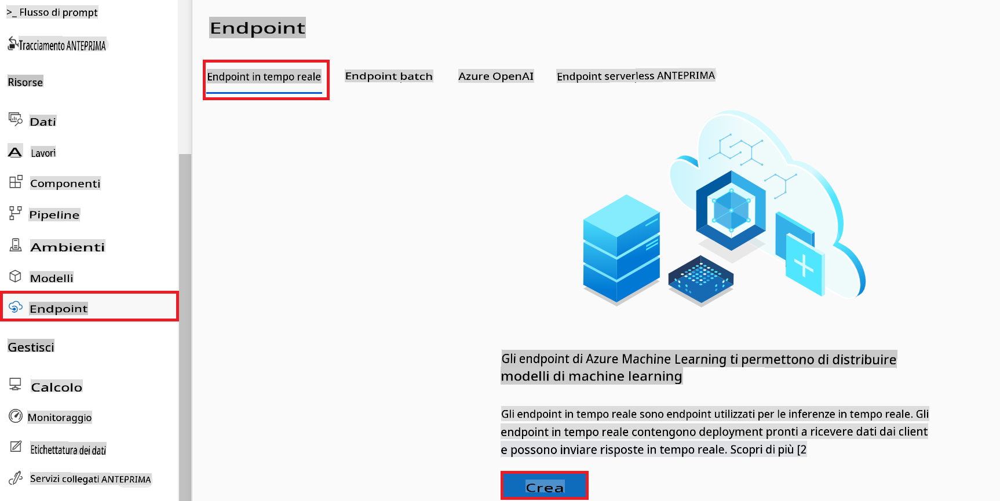

1. Seleziona **Crea**.

1. Seleziona il modello registrato che hai creato.

    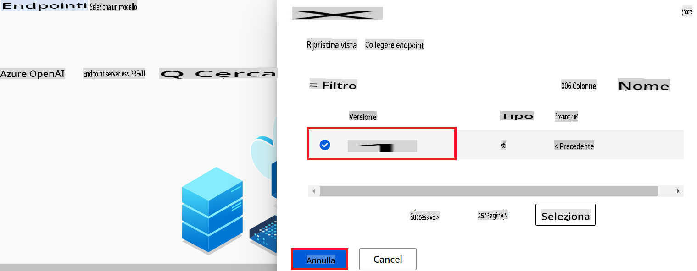

1. Seleziona **Seleziona**.

1. Esegui le seguenti operazioni:

    - Imposta **Macchina virtuale** su *Standard_NC6s_v3*.
    - Imposta il **Numero di istanze** da utilizzare, ad esempio *1*.
    - Imposta l'**Endpoint** su **Nuovo** per creare un endpoint.
    - Inserisci il **Nome dell'endpoint**. Deve essere un valore univoco.
    - Inserisci il **Nome della distribuzione**. Deve essere un valore univoco.

    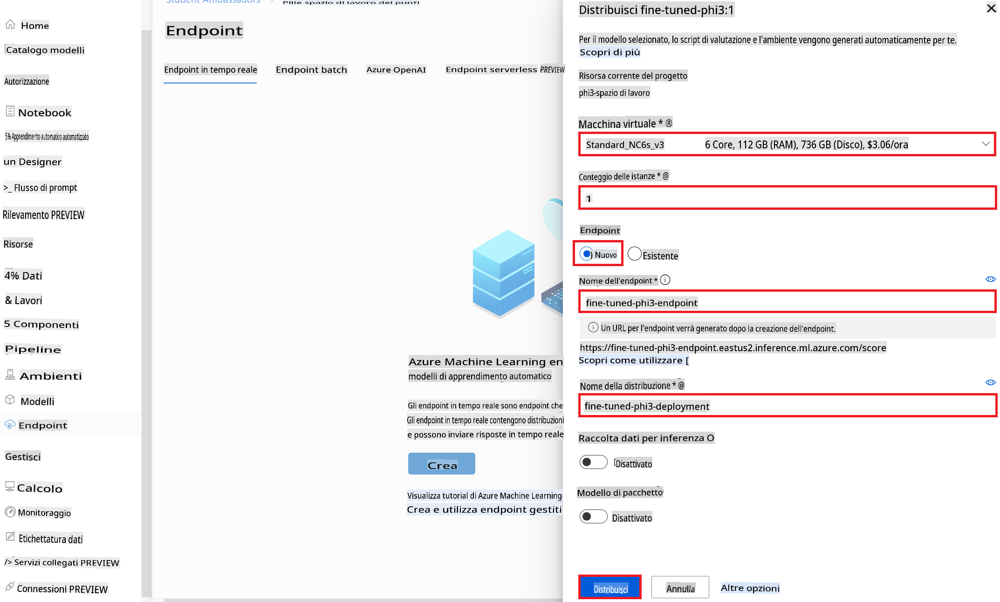

1. Seleziona **Distribuisci**.

> [!WARNING]
> Per evitare costi aggiuntivi sul tuo account, assicurati di eliminare l'endpoint creato nello spazio di lavoro di Azure Machine Learning.
>

#### Verifica lo stato della distribuzione nello spazio di lavoro di Azure Machine Learning

1. Accedi allo spazio di lavoro di Azure Machine Learning che hai creato.

1. Seleziona **Endpoint** dalla barra laterale sinistra.

1. Seleziona l'endpoint che hai creato.

    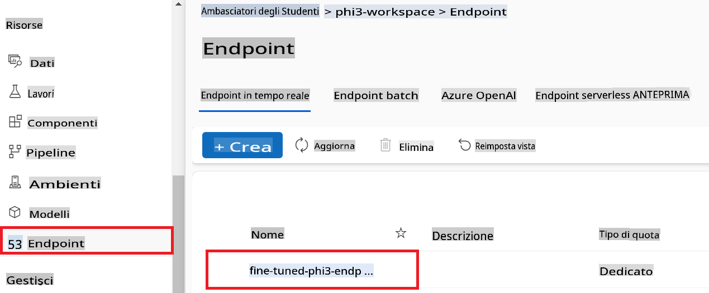

1. In questa pagina, puoi gestire gli endpoint durante il processo di distribuzione.

> [!NOTE]
> Una volta completata la distribuzione, assicurati che **Traffico live** sia impostato su **100%**. Se non lo è, seleziona **Aggiorna traffico** per regolare le impostazioni di traffico. Nota che non puoi testare il modello se il traffico è impostato su 0%.
>
> 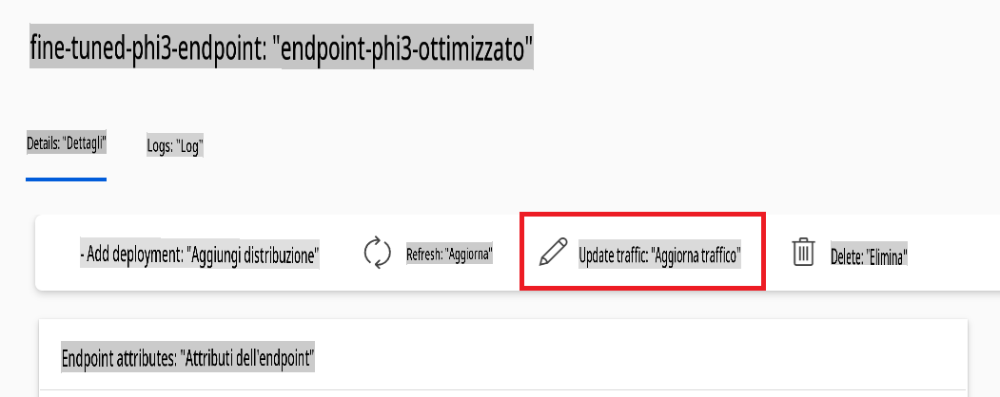
>

## Scenario 3: Integra con Prompt flow e chatta con il tuo modello personalizzato in Azure AI Foundry

### Integra il modello Phi-3 personalizzato con Prompt flow

Dopo aver distribuito con successo il tuo modello ottimizzato, puoi ora integrarlo con Prompt Flow per utilizzarlo in applicazioni in tempo reale, abilitando una varietà di attività interattive con il tuo modello Phi-3 personalizzato.

In questo esercizio, farai quanto segue:

- Crea un Hub di Azure AI Foundry.
- Crea un Progetto di Azure AI Foundry.
- Crea un Prompt flow.
- Aggiungi una connessione personalizzata per il modello Phi-3 ottimizzato.
- Configura Prompt flow per chattare con il tuo modello Phi-3 personalizzato.

> [!NOTE]
> Puoi anche integrare Promptflow utilizzando Azure ML Studio. Lo stesso processo di integrazione può essere applicato in Azure ML Studio.

#### Crea un Hub di Azure AI Foundry

Devi creare un Hub prima di creare il Progetto. Un Hub funziona come un Gruppo di Risorse, consentendoti di organizzare e gestire più Progetti all'interno di Azure AI Foundry.

1. Visita [Azure AI Foundry](https://ai.azure.com/?WT.mc_id=aiml-137032-kinfeylo).

1. Seleziona **Tutti gli hub** dalla barra laterale sinistra.

1. Seleziona **+ Nuovo hub** dal menu di navigazione.

    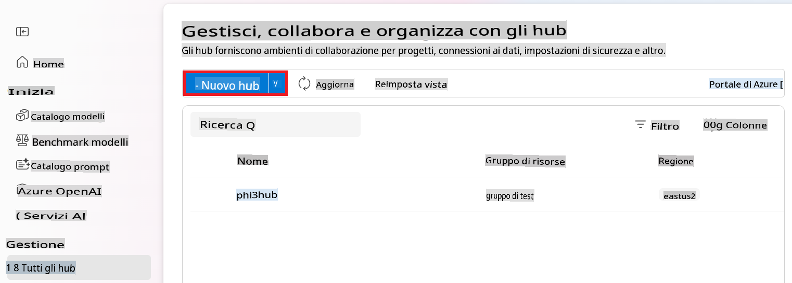

1. Esegui le seguenti operazioni:

    - Inserisci il **Nome dell'hub**. Deve essere un valore univoco.
    - Seleziona la tua **Sottoscrizione Azure**.
    - Seleziona il **Gruppo di risorse** da utilizzare (creane uno nuovo se necessario).
    - Seleziona la **Posizione** che desideri utilizzare.
    - Seleziona il **Connetti Servizi Azure AI** da utilizzare (creane uno nuovo se necessario).
    - Imposta **Connetti Azure AI Search** su **Salta connessione**.

    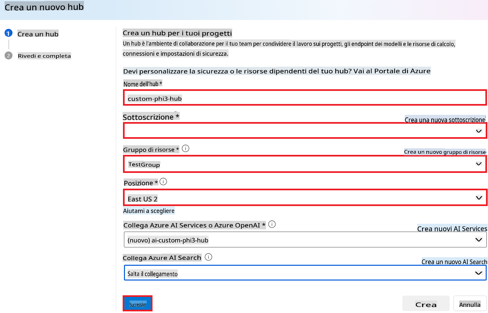

1. Seleziona **Avanti**.

#### Crea un Progetto di Azure AI Foundry

1. Nell'hub che hai creato, seleziona **Tutti i progetti** dalla barra laterale sinistra.

1. Seleziona **+ Nuovo progetto** dal menu di navigazione.

    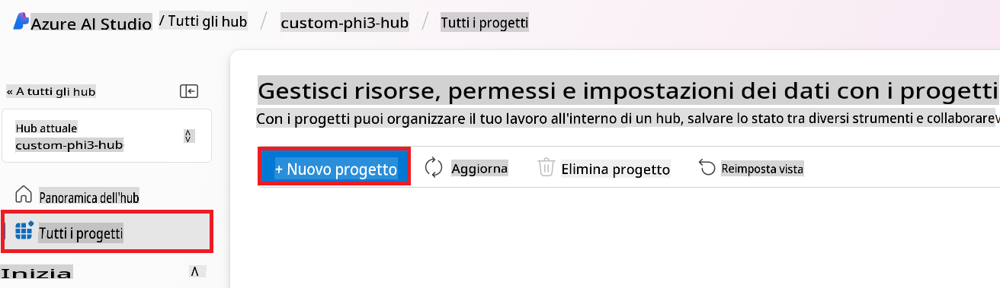

1. Inserisci il **Nome del progetto**. Deve essere un valore univoco.

    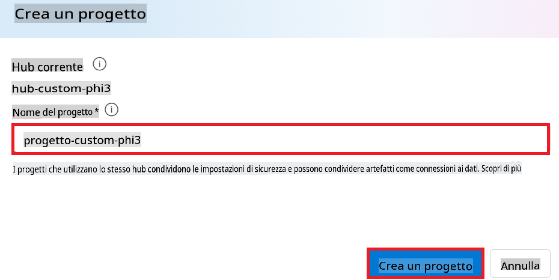

1. Seleziona **Crea un progetto**.

#### Aggiungi una connessione personalizzata per il modello Phi-3 ottimizzato

Per integrare il tuo modello Phi-3 personalizzato con Prompt flow, devi salvare l'endpoint del modello e la chiave in una connessione personalizzata. Questa configurazione garantisce l'accesso al tuo modello Phi-3 personalizzato in Prompt flow.

#### Imposta la chiave API e l'URI dell'endpoint del modello Phi-3 ottimizzato

1. Visita [Azure ML Studio](https://ml.azure.com/home?WT.mc_id=aiml-137032-kinfeylo).

1. Accedi allo spazio di lavoro di Azure Machine Learning che hai creato.

1. Seleziona **Endpoint** dalla barra laterale sinistra.

    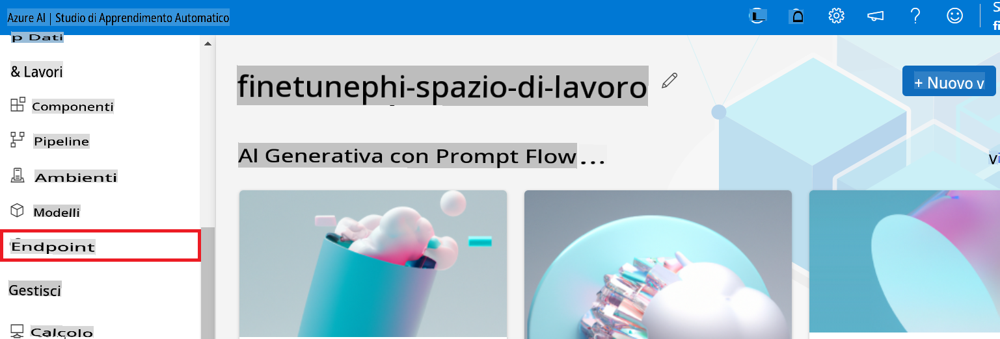

1. Seleziona l'endpoint che hai creato.

    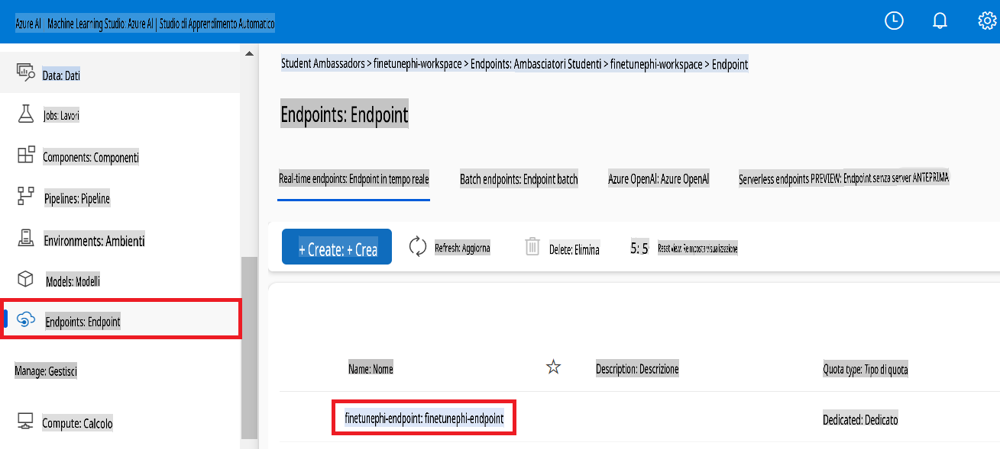

1. Seleziona **Consume** dal menu di navigazione.

1. Copia il tuo **Endpoint REST** e la **Chiave primaria**.
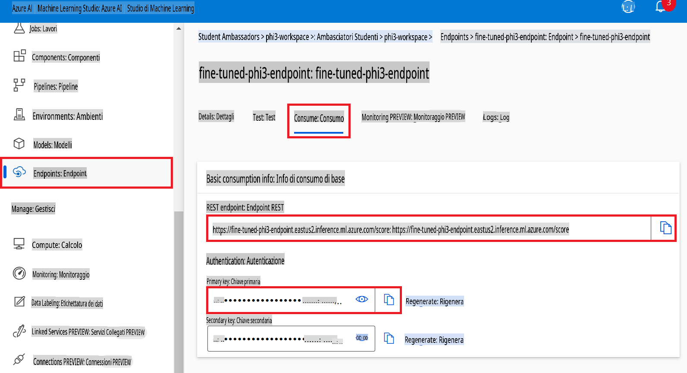

#### Aggiungi la Connessione Personalizzata

1. Visita [Azure AI Foundry](https://ai.azure.com/?WT.mc_id=aiml-137032-kinfeylo).

1. Vai al progetto di Azure AI Foundry che hai creato.

1. Nel progetto che hai creato, seleziona **Impostazioni** dalla barra laterale sinistra.

1. Seleziona **+ Nuova connessione**.

    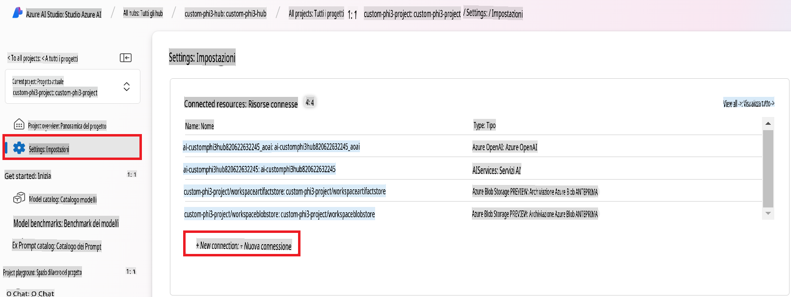

1. Seleziona **Chiavi personalizzate** dal menu di navigazione.

    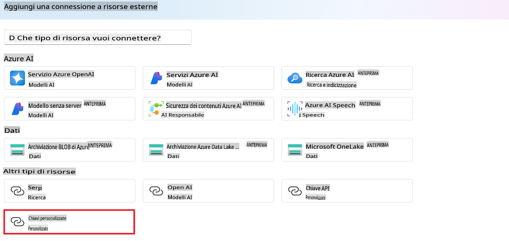

1. Esegui le seguenti operazioni:

    - Seleziona **+ Aggiungi coppie chiave-valore**.
    - Per il nome della chiave, inserisci **endpoint** e incolla l'endpoint copiato da Azure ML Studio nel campo valore.
    - Seleziona nuovamente **+ Aggiungi coppie chiave-valore**.
    - Per il nome della chiave, inserisci **key** e incolla la chiave copiata da Azure ML Studio nel campo valore.
    - Dopo aver aggiunto le chiavi, seleziona **è segreto** per evitare che la chiave venga esposta.

    

1. Seleziona **Aggiungi connessione**.

#### Crea Prompt flow

Hai aggiunto una connessione personalizzata in Azure AI Foundry. Ora, creiamo un Prompt flow seguendo i passaggi seguenti. Successivamente, collegherai questo Prompt flow alla connessione personalizzata per poter utilizzare il modello ottimizzato all'interno del Prompt flow.

1. Vai al progetto di Azure AI Foundry che hai creato.

1. Seleziona **Prompt flow** dalla barra laterale sinistra.

1. Seleziona **+ Crea** dal menu di navigazione.

    

1. Seleziona **Chat flow** dal menu di navigazione.

    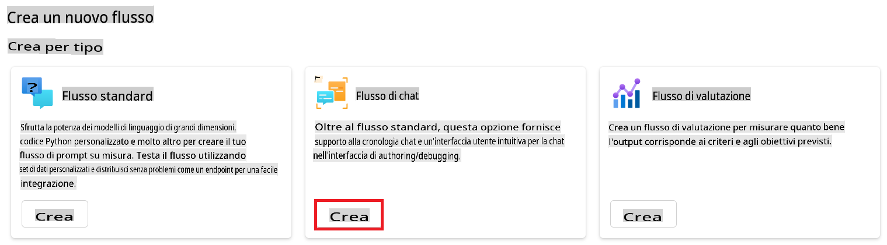

1. Inserisci **Nome cartella** da utilizzare.

    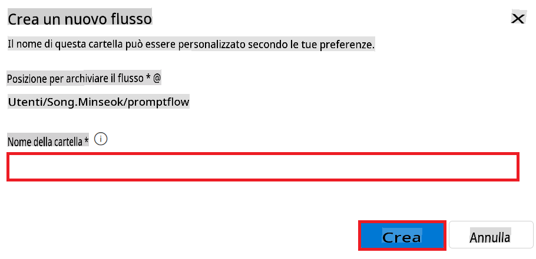

2. Seleziona **Crea**.

#### Configura il Prompt flow per chattare con il tuo modello personalizzato Phi-3

Devi integrare il modello Phi-3 ottimizzato in un Prompt flow. Tuttavia, il Prompt flow esistente fornito non è progettato per questo scopo. Pertanto, devi ridisegnare il Prompt flow per consentire l'integrazione del modello personalizzato.

1. Nel Prompt flow, esegui le seguenti operazioni per ricostruire il flusso esistente:

    - Seleziona **Modalità file grezzo**.
    - Elimina tutto il codice esistente nel file *flow.dag.yml*.
    - Aggiungi il seguente codice al file *flow.dag.yml*.

        ```yml
        inputs:
          input_data:
            type: string
            default: "Who founded Microsoft?"

        outputs:
          answer:
            type: string
            reference: ${integrate_with_promptflow.output}

        nodes:
        - name: integrate_with_promptflow
          type: python
          source:
            type: code
            path: integrate_with_promptflow.py
          inputs:
            input_data: ${inputs.input_data}
        ```

    - Seleziona **Salva**.

    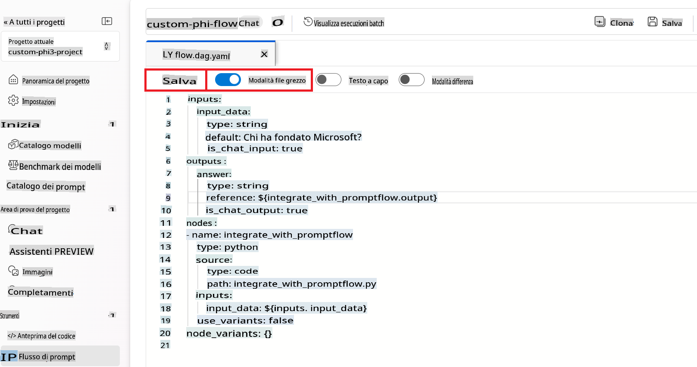

1. Aggiungi il seguente codice al file *integrate_with_promptflow.py* per utilizzare il modello personalizzato Phi-3 nel Prompt flow.

    ```python
    import logging
    import requests
    from promptflow import tool
    from promptflow.connections import CustomConnection

    # Logging setup
    logging.basicConfig(
        format="%(asctime)s - %(levelname)s - %(name)s - %(message)s",
        datefmt="%Y-%m-%d %H:%M:%S",
        level=logging.DEBUG
    )
    logger = logging.getLogger(__name__)

    def query_phi3_model(input_data: str, connection: CustomConnection) -> str:
        """
        Send a request to the Phi-3 model endpoint with the given input data using Custom Connection.
        """

        # "connection" is the name of the Custom Connection, "endpoint", "key" are the keys in the Custom Connection
        endpoint_url = connection.endpoint
        api_key = connection.key

        headers = {
            "Content-Type": "application/json",
            "Authorization": f"Bearer {api_key}"
        }
        data = {
            "input_data": {
                "input_string": [
                    {"role": "user", "content": input_data}
                ],
                "parameters": {
                    "temperature": 0.7,
                    "max_new_tokens": 128
                }
            }
        }
        try:
            response = requests.post(endpoint_url, json=data, headers=headers)
            response.raise_for_status()
            
            # Log the full JSON response
            logger.debug(f"Full JSON response: {response.json()}")

            result = response.json()["output"]
            logger.info("Successfully received response from Azure ML Endpoint.")
            return result
        except requests.exceptions.RequestException as e:
            logger.error(f"Error querying Azure ML Endpoint: {e}")
            raise

    @tool
    def my_python_tool(input_data: str, connection: CustomConnection) -> str:
        """
        Tool function to process input data and query the Phi-3 model.
        """
        return query_phi3_model(input_data, connection)

    ```

    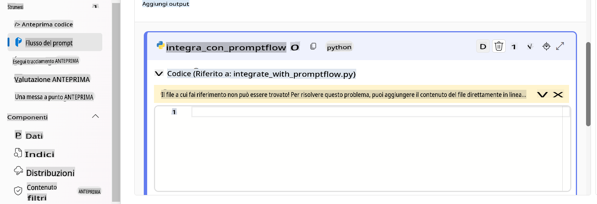

> [!NOTE]
> Per informazioni più dettagliate sull'uso di Prompt flow in Azure AI Foundry, puoi fare riferimento a [Prompt flow in Azure AI Foundry](https://learn.microsoft.com/azure/ai-studio/how-to/prompt-flow).

1. Seleziona **Input chat**, **Output chat** per abilitare la chat con il tuo modello.

    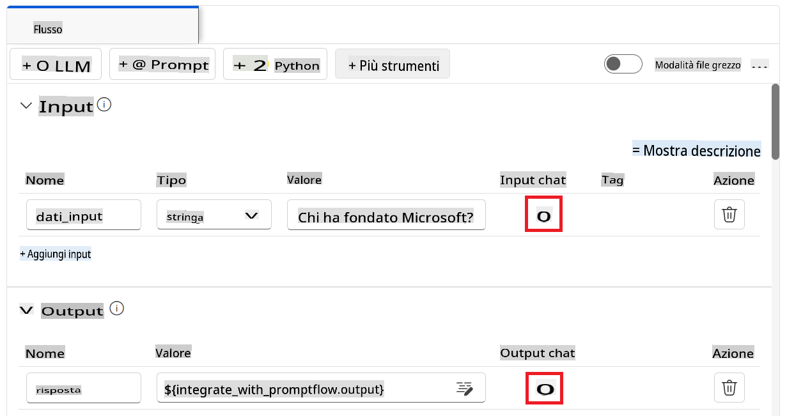

1. Ora sei pronto per chattare con il tuo modello personalizzato Phi-3. Nel prossimo esercizio, imparerai come avviare il Prompt flow e usarlo per chattare con il tuo modello ottimizzato Phi-3.

> [!NOTE]
>
> Il flusso ricostruito dovrebbe apparire come nell'immagine seguente:
>
> 
>

### Chatta con il tuo modello personalizzato Phi-3

Ora che hai ottimizzato e integrato il tuo modello personalizzato Phi-3 con Prompt flow, sei pronto per iniziare a interagire con esso. Questo esercizio ti guiderà attraverso il processo di configurazione e avvio di una chat con il tuo modello utilizzando Prompt flow. Seguendo questi passaggi, potrai sfruttare appieno le capacità del tuo modello ottimizzato Phi-3 per vari compiti e conversazioni.

- Chatta con il tuo modello personalizzato Phi-3 utilizzando Prompt flow.

#### Avvia Prompt flow

1. Seleziona **Avvia sessioni di calcolo** per avviare Prompt flow.

    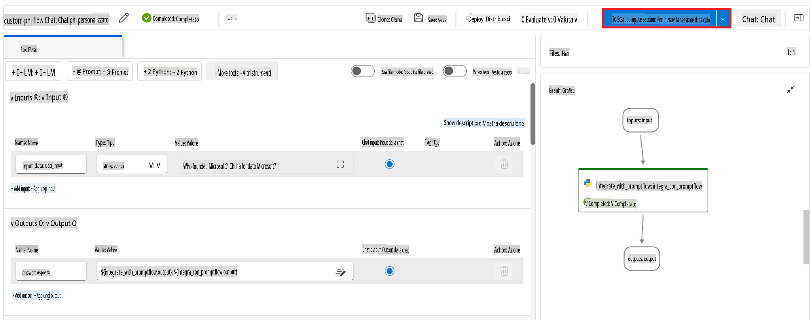

1. Seleziona **Convalida e analizza input** per rinnovare i parametri.

    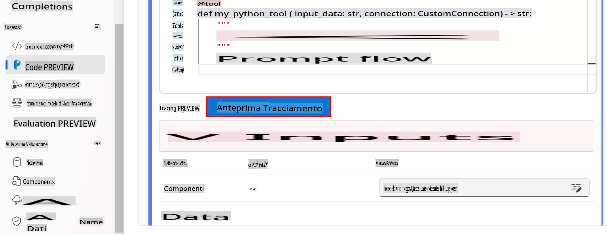

1. Seleziona il **Valore** della **connessione** alla connessione personalizzata che hai creato. Ad esempio, *connection*.

    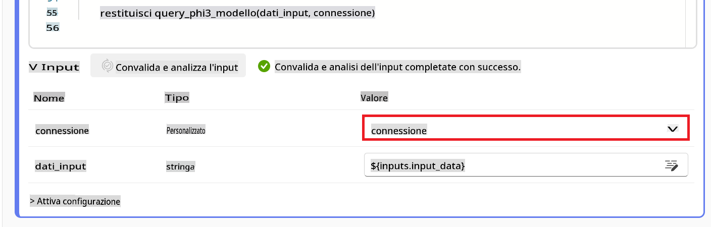

#### Chatta con il tuo modello personalizzato

1. Seleziona **Chat**.

    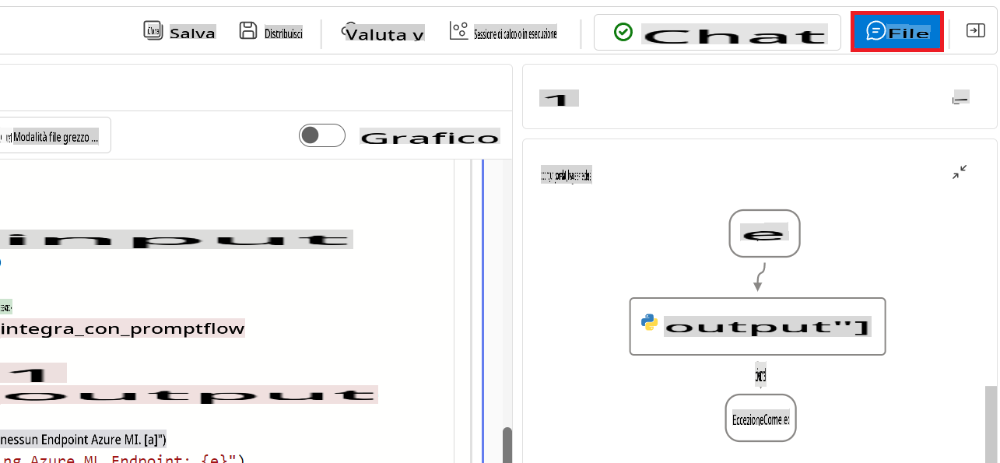

1. Ecco un esempio dei risultati: Ora puoi chattare con il tuo modello personalizzato Phi-3. Si consiglia di fare domande basate sui dati utilizzati per l'ottimizzazione.

    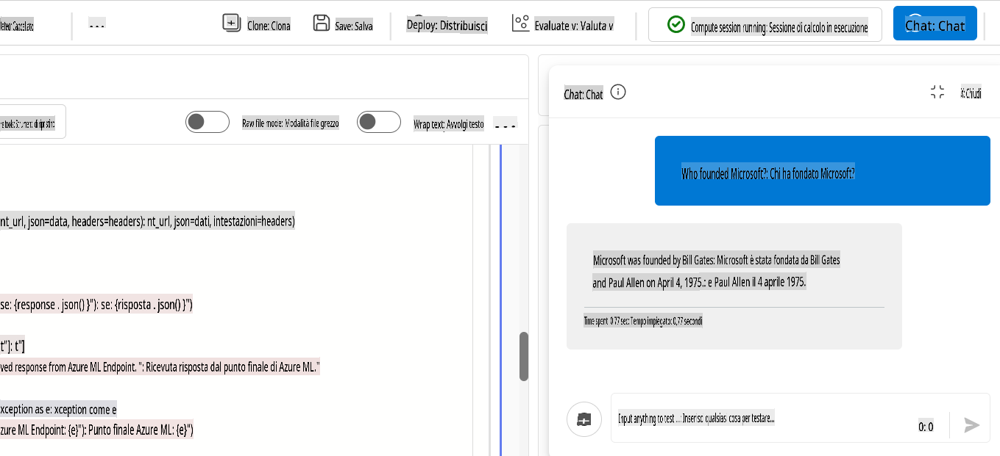

**Disclaimer (Avvertenza):**  
Questo documento è stato tradotto utilizzando servizi di traduzione automatica basati sull'intelligenza artificiale. Pur cercando di garantire la massima accuratezza, si prega di notare che le traduzioni automatiche potrebbero contenere errori o imprecisioni. Il documento originale nella sua lingua madre dovrebbe essere considerato la fonte autorevole. Per informazioni critiche, si raccomanda una traduzione professionale effettuata da un umano. Non siamo responsabili per eventuali malintesi o interpretazioni errate derivanti dall'uso di questa traduzione.