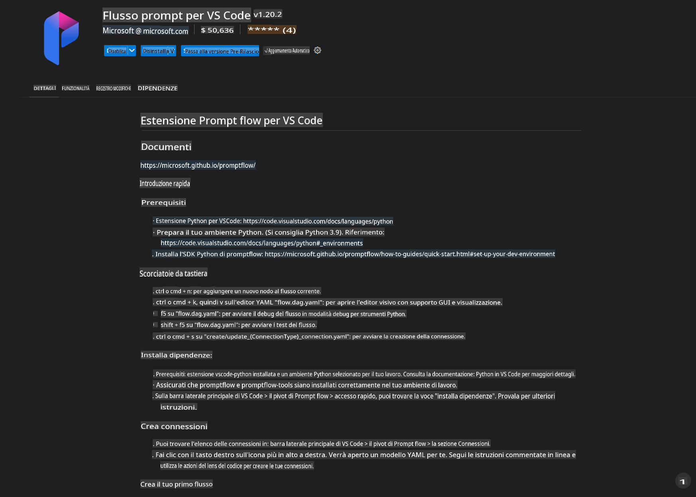
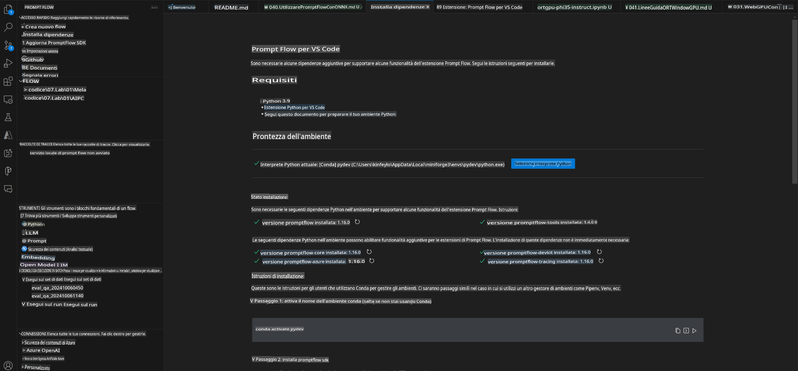
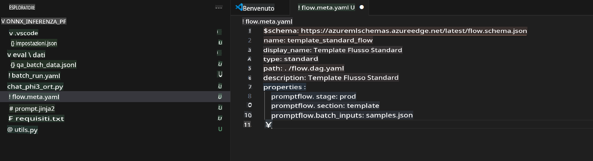
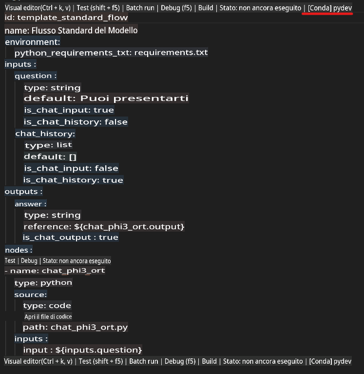
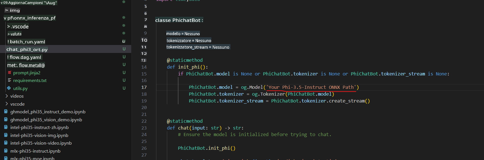
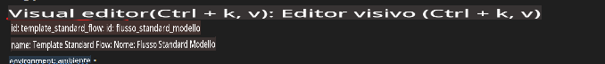
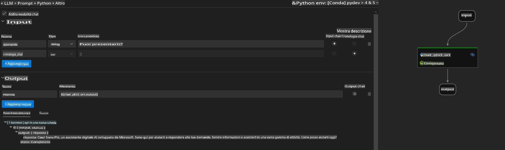
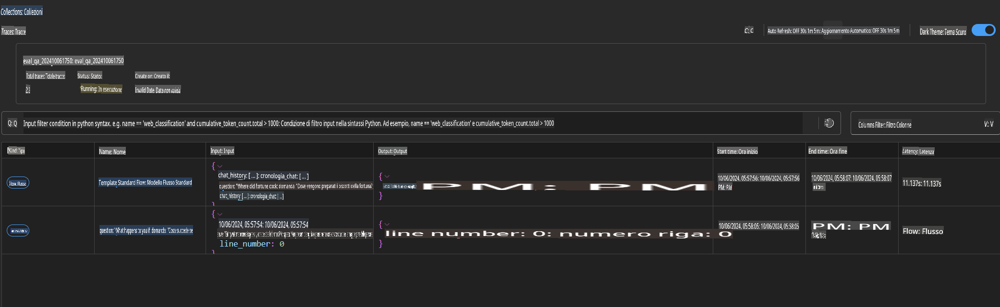

# Utilizzo della GPU di Windows per creare una soluzione Prompt Flow con Phi-3.5-Instruct ONNX

Il seguente documento è un esempio di come utilizzare PromptFlow con ONNX (Open Neural Network Exchange) per sviluppare applicazioni AI basate sui modelli Phi-3.

PromptFlow è una suite di strumenti di sviluppo progettata per semplificare l'intero ciclo di sviluppo delle applicazioni AI basate su LLM (Large Language Model), dalla fase di ideazione e prototipazione fino al testing e alla valutazione.

Integrando PromptFlow con ONNX, gli sviluppatori possono:

- **Ottimizzare le prestazioni del modello**: Sfruttare ONNX per un'inferenza e una distribuzione del modello più efficienti.
- **Semplificare lo sviluppo**: Utilizzare PromptFlow per gestire il flusso di lavoro e automatizzare le attività ripetitive.
- **Migliorare la collaborazione**: Facilitare una migliore collaborazione tra i membri del team grazie a un ambiente di sviluppo unificato.

**Prompt flow** è una suite di strumenti di sviluppo progettata per semplificare il ciclo di sviluppo end-to-end delle applicazioni AI basate su LLM, dalla fase di ideazione, prototipazione, testing, valutazione fino alla distribuzione in produzione e al monitoraggio. Rende l'ingegneria dei prompt molto più semplice e consente di creare applicazioni LLM di qualità professionale.

Prompt flow può connettersi a OpenAI, Azure OpenAI Service e modelli personalizzabili (Huggingface, LLM/SLM locali). L'obiettivo è distribuire il modello ONNX quantizzato di Phi-3.5 per applicazioni locali. Prompt flow può aiutarci a pianificare meglio il nostro business e a completare soluzioni locali basate su Phi-3.5. In questo esempio, combineremo la GenAI Library di ONNX Runtime per completare la soluzione Prompt flow basata su GPU Windows.

## **Installazione**

### **ONNX Runtime GenAI per GPU Windows**

Leggi questa guida per configurare ONNX Runtime GenAI per GPU Windows [clicca qui](./ORTWindowGPUGuideline.md)

### **Configurazione di Prompt flow in VSCode**

1. Installa l'estensione Prompt flow per VS Code



2. Dopo aver installato l'estensione Prompt flow per VS Code, clicca sull'estensione e scegli **Installation dependencies**. Segui questa guida per installare l'SDK di Prompt flow nel tuo ambiente.



3. Scarica il [Codice di esempio](../../../../../../code/09.UpdateSamples/Aug/pf/onnx_inference_pf) e utilizza VS Code per aprire questo esempio.



4. Apri **flow.dag.yaml** per scegliere il tuo ambiente Python.



   Apri **chat_phi3_ort.py** per modificare la posizione del tuo modello Phi-3.5-instruct ONNX.



5. Esegui il tuo prompt flow per effettuare il test.

Apri **flow.dag.yaml** e clicca su visual editor.



Dopo aver cliccato, esegui il flusso per testarlo.



1. Puoi eseguire batch nel terminale per verificare ulteriori risultati.

```bash

pf run create --file batch_run.yaml --stream --name 'Your eval qa name'    

```

Puoi controllare i risultati nel tuo browser predefinito.



**Disclaimer (Avvertenza):**  
Questo documento è stato tradotto utilizzando servizi di traduzione automatizzati basati sull'intelligenza artificiale. Sebbene ci impegniamo per garantire l'accuratezza, si prega di notare che le traduzioni automatiche possono contenere errori o imprecisioni. Il documento originale nella sua lingua madre dovrebbe essere considerato la fonte autorevole. Per informazioni critiche, si consiglia una traduzione professionale effettuata da un essere umano. Non siamo responsabili per eventuali fraintendimenti o interpretazioni errate derivanti dall'uso di questa traduzione.