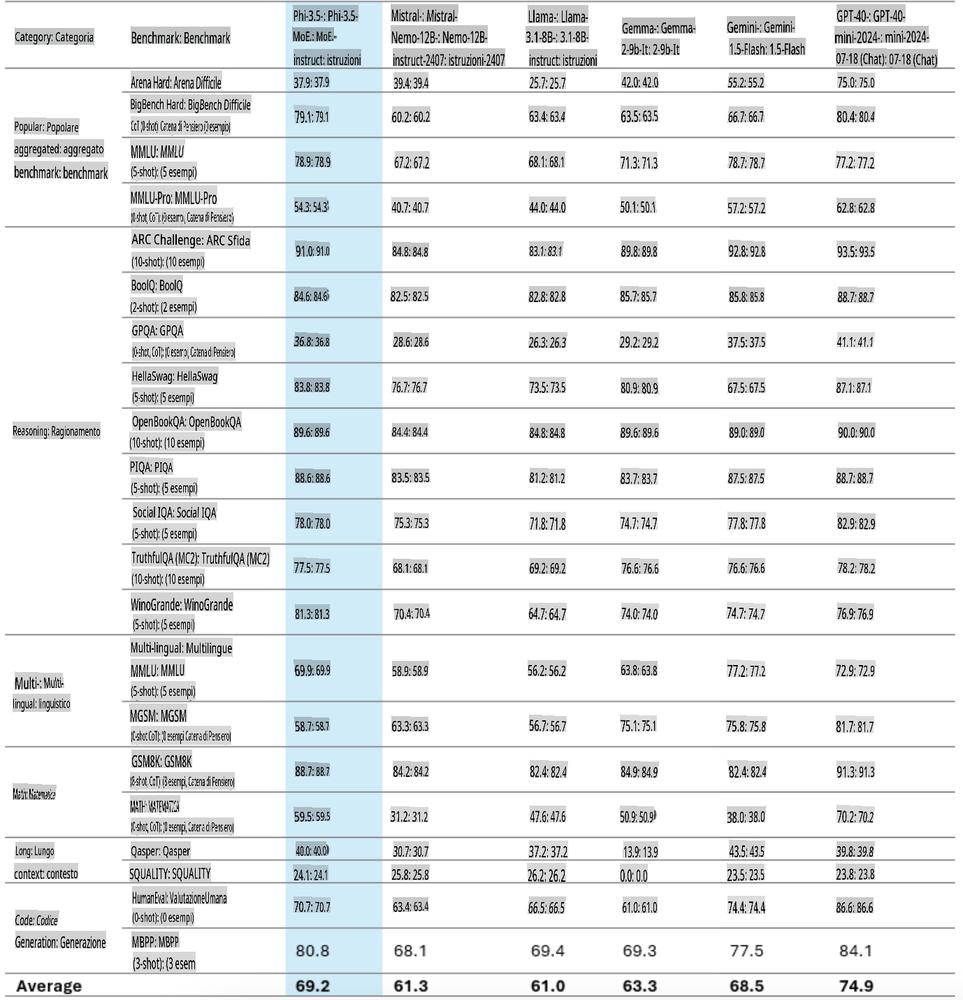
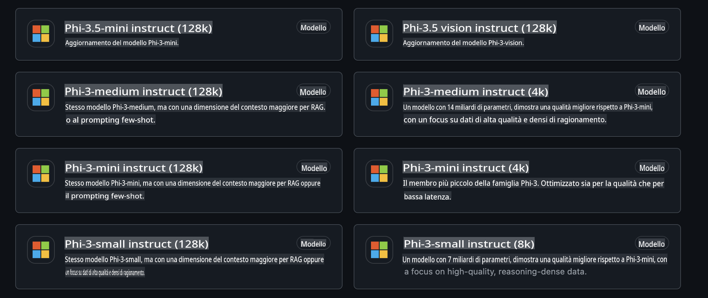
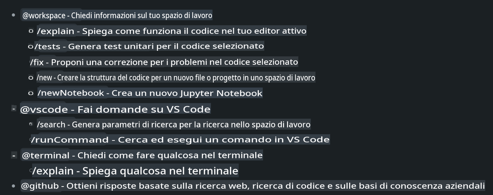
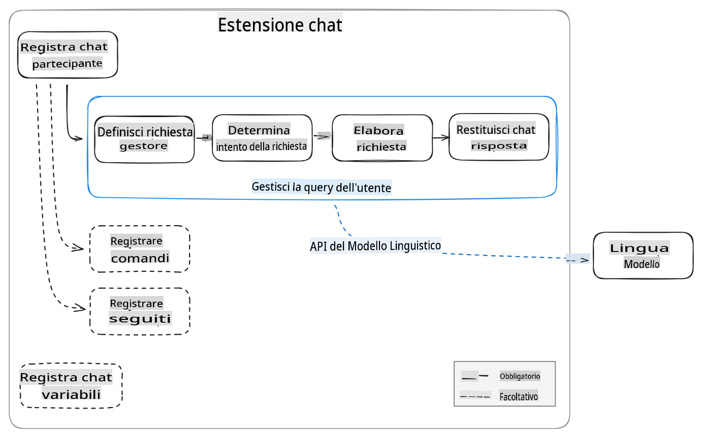
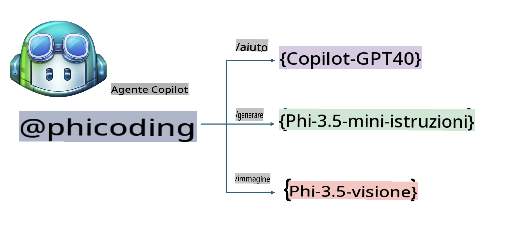
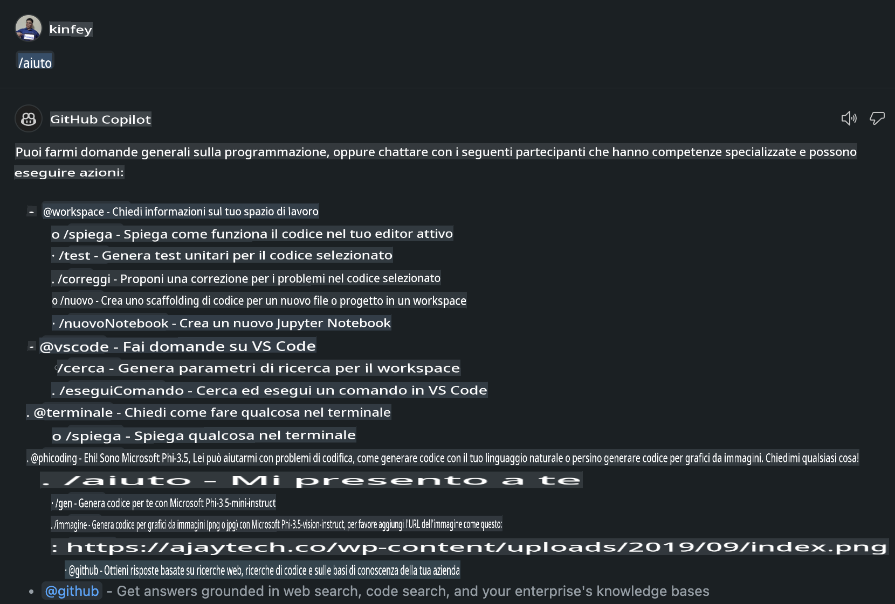
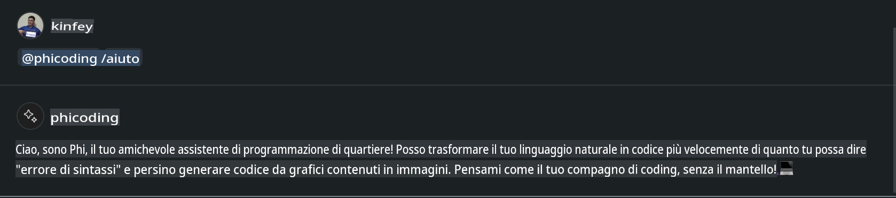
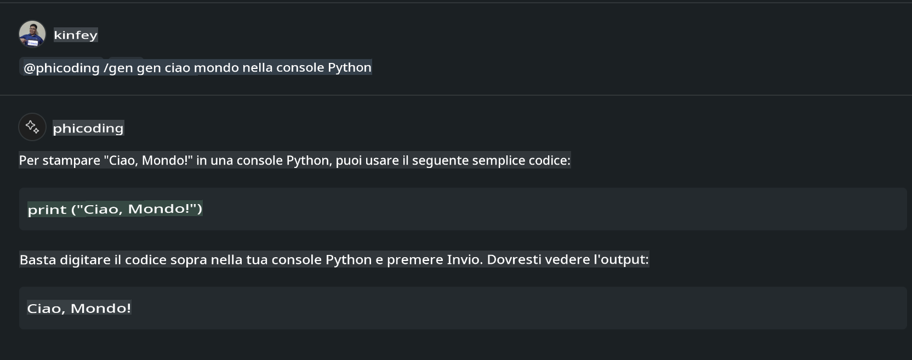
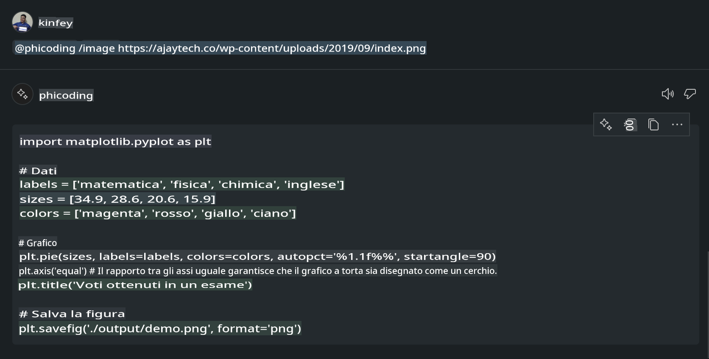

# **Crea il tuo Visual Studio Code Chat Copilot Agent con Phi-3.5 di GitHub Models**

Utilizzi Visual Studio Code Copilot? Soprattutto nella modalità Chat, puoi sfruttare diversi agenti per migliorare la capacità di creare, scrivere e gestire progetti in Visual Studio Code. Visual Studio Code offre un'API che consente a aziende e singoli sviluppatori di creare agenti personalizzati in base alle loro esigenze, espandendo le funzionalità in campi specifici. In questo articolo ci concentreremo su **Phi-3.5-mini-instruct (128k)** e **Phi-3.5-vision-instruct (128k)** di GitHub Models per creare il tuo Visual Studio Code Agent.

## **Informazioni su Phi-3.5 nei GitHub Models**

Sappiamo che Phi-3/3.5-mini-instruct della famiglia Phi-3/3.5 possiede potenti capacità di comprensione e generazione di codice, con vantaggi rispetto a Gemma-2-9b e Mistral-Nemo-12B-instruct-2407.



Gli ultimi GitHub Models offrono già l'accesso ai modelli Phi-3.5-mini-instruct (128k) e Phi-3.5-vision-instruct (128k). Gli sviluppatori possono accedervi tramite l'OpenAI SDK, l'Azure AI Inference SDK e l'API REST.



***Nota:*** Si consiglia di utilizzare l'Azure AI Inference SDK, poiché consente un'integrazione più fluida con l'Azure Model Catalog in ambienti di produzione.

Di seguito sono riportati i risultati di **Phi-3.5-mini-instruct (128k)** e **Phi-3.5-vision-instruct (128k)** nello scenario di generazione di codice dopo l'integrazione con GitHub Models, utili per gli esempi seguenti.

**Demo: GitHub Models Phi-3.5-mini-instruct (128k) genera codice da Prompt** ([clicca qui](../../../../../../code/09.UpdateSamples/Aug/ghmodel_phi35_instruct_demo.ipynb))

**Demo: GitHub Models Phi-3.5-vision-instruct (128k) genera codice da Immagine** ([clicca qui](../../../../../../code/09.UpdateSamples/Aug/ghmodel_phi35_vision_demo.ipynb))

## **Informazioni sul GitHub Copilot Chat Agent**

GitHub Copilot Chat Agent può svolgere diversi compiti in vari scenari di progetto basandosi sul codice. Il sistema dispone di quattro agenti: workspace, github, terminal, vscode.



Aggiungendo il nome dell'agente con '@', puoi completare rapidamente il lavoro corrispondente. Per le aziende, aggiungendo contenuti aziendali specifici come requisiti, codifica, specifiche di test e rilascio, è possibile ottenere funzionalità private aziendali più potenti basate su GitHub Copilot.

Visual Studio Code Chat Agent ha ora ufficialmente rilasciato la sua API, consentendo alle aziende o agli sviluppatori aziendali di creare agenti basati su diversi ecosistemi software. Seguendo il metodo di sviluppo delle estensioni di Visual Studio Code, è possibile accedere facilmente all'interfaccia dell'API di Visual Studio Code Chat Agent. Possiamo sviluppare seguendo questo processo.



Lo scenario di sviluppo supporta l'accesso a API di modelli di terze parti (come GitHub Models, Azure Model Catalog e servizi auto-ospitati basati su modelli open source) e consente anche l'uso dei modelli gpt-35-turbo, gpt-4 e gpt-4o forniti da GitHub Copilot.

## **Aggiungere un Agente @phicoding basato su Phi-3.5**

Proviamo a integrare le capacità di programmazione di Phi-3.5 per svolgere attività come la scrittura di codice, la generazione di codice da immagini e altro. Creiamo un agente basato su Phi-3.5 - @PHI, con le seguenti funzionalità:

1. Generare una presentazione utilizzando GPT-4o fornito da GitHub Copilot tramite il comando **@phicoding /help**.

2. Generare codice in diversi linguaggi di programmazione utilizzando **Phi-3.5-mini-instruct (128k)** tramite il comando **@phicoding /gen**.

3. Generare codice basato su **Phi-3.5-vision-instruct (128k)** e completare immagini tramite il comando **@phicoding /image**.



## **Passaggi correlati**

1. Installa il supporto per lo sviluppo di estensioni di Visual Studio Code utilizzando npm.

```bash

npm install --global yo generator-code 

```

2. Crea un plugin di estensione per Visual Studio Code (utilizzando la modalità di sviluppo Typescript, denominato phiext).

```bash

yo code 

```

3. Apri il progetto creato e modifica package.json. Qui vengono fornite istruzioni e configurazioni, oltre alla configurazione di GitHub Models. Nota: è necessario aggiungere il proprio token GitHub Models.

```json

{
  "name": "phiext",
  "displayName": "phiext",
  "description": "",
  "version": "0.0.1",
  "engines": {
    "vscode": "^1.93.0"
  },
  "categories": [
    "AI",
    "Chat"
  ],
  "activationEvents": [],
  "enabledApiProposals": [
      "chatVariableResolver"
  ],
  "main": "./dist/extension.js",
  "contributes": {
    "chatParticipants": [
        {
            "id": "chat.phicoding",
            "name": "phicoding",
            "description": "Hey! I am Microsoft Phi-3.5, She can help me with coding problems, such as generation code with your natural language, or even generation code about chart from images. Just ask me anything!",
            "isSticky": true,
            "commands": [
                {
                    "name": "help",
                    "description": "Introduce myself to you"
                },
                {
                    "name": "gen",
                    "description": "Generate code for you with Microsoft Phi-3.5-mini-instruct"
                },
                {
                    "name": "image",
                    "description": "Generate code for chart from image(png or jpg) with Microsoft Phi-3.5-vision-instruct, please add image url like this : https://ajaytech.co/wp-content/uploads/2019/09/index.png"
                }
            ]
        }
    ],
    "commands": [
        {
            "command": "phicoding.namesInEditor",
            "title": "Use Microsoft Phi 3.5 in Editor"
        }
    ],
    "configuration": {
      "type": "object",
      "title": "githubmodels",
      "properties": {
        "githubmodels.endpoint": {
          "type": "string",
          "default": "https://models.inference.ai.azure.com",
          "description": "Your GitHub Models Endpoint",
          "order": 0
        },
        "githubmodels.api_key": {
          "type": "string",
          "default": "Your GitHub Models Token",
          "description": "Your GitHub Models Token",
          "order": 1
        },
        "githubmodels.phi35instruct": {
          "type": "string",
          "default": "Phi-3.5-mini-instruct",
          "description": "Your Phi-35-Instruct Model",
          "order": 2
        },
        "githubmodels.phi35vision": {
          "type": "string",
          "default": "Phi-3.5-vision-instruct",
          "description": "Your Phi-35-Vision Model",
          "order": 3
        }
      }
    }
  },
  "scripts": {
    "vscode:prepublish": "npm run package",
    "compile": "webpack",
    "watch": "webpack --watch",
    "package": "webpack --mode production --devtool hidden-source-map",
    "compile-tests": "tsc -p . --outDir out",
    "watch-tests": "tsc -p . -w --outDir out",
    "pretest": "npm run compile-tests && npm run compile && npm run lint",
    "lint": "eslint src",
    "test": "vscode-test"
  },
  "devDependencies": {
    "@types/vscode": "^1.93.0",
    "@types/mocha": "^10.0.7",
    "@types/node": "20.x",
    "@typescript-eslint/eslint-plugin": "^8.3.0",
    "@typescript-eslint/parser": "^8.3.0",
    "eslint": "^9.9.1",
    "typescript": "^5.5.4",
    "ts-loader": "^9.5.1",
    "webpack": "^5.94.0",
    "webpack-cli": "^5.1.4",
    "@vscode/test-cli": "^0.0.10",
    "@vscode/test-electron": "^2.4.1"
  },
  "dependencies": {
    "@types/node-fetch": "^2.6.11",
    "node-fetch": "^3.3.2",
    "@azure-rest/ai-inference": "latest",
    "@azure/core-auth": "latest",
    "@azure/core-sse": "latest"
  }
}


```

4. Modifica src/extension.ts.

```typescript

// The module 'vscode' contains the VS Code extensibility API
// Import the module and reference it with the alias vscode in your code below
import * as vscode from 'vscode';
import ModelClient from "@azure-rest/ai-inference";
import { AzureKeyCredential } from "@azure/core-auth";


interface IPhiChatResult extends vscode.ChatResult {
    metadata: {
        command: string;
    };
}


const MODEL_SELECTOR: vscode.LanguageModelChatSelector = { vendor: 'copilot', family: 'gpt-4o' };

function isValidImageUrl(url: string): boolean {
    const regex = /^(https?:\/\/.*\.(?:png|jpg))$/i;
    return regex.test(url);
}
  

// This method is called when your extension is activated
// Your extension is activated the very first time the command is executed
export function activate(context: vscode.ExtensionContext) {

    const codinghandler: vscode.ChatRequestHandler = async (request: vscode.ChatRequest, context: vscode.ChatContext, stream: vscode.ChatResponseStream, token: vscode.CancellationToken): Promise<IPhiChatResult> => {


        const config : any = vscode.workspace.getConfiguration('githubmodels');
        const endPoint: string = config.get('endpoint');
        const apiKey: string = config.get('api_key');
        const phi35instruct: string = config.get('phi35instruct');
        const phi35vision: string = config.get('phi35vision');
        
        if (request.command === 'help') {

            const content = "Welcome to Coding assistant with Microsoft Phi-3.5"; 
            stream.progress(content);


            try {
                const [model] = await vscode.lm.selectChatModels(MODEL_SELECTOR);
                if (model) {
                    const messages = [
                        vscode.LanguageModelChatMessage.User("Please help me express this content in a humorous way: I am a programming assistant who can help you convert natural language into code and generate code based on the charts in the images. output format like this : Hey I am Phi ......")
                    ];
                    const chatResponse = await model.sendRequest(messages, {}, token);
                    for await (const fragment of chatResponse.text) {
                        stream.markdown(fragment);
                    }
                }
            } catch(err) {
                console.log(err);
            }


            return { metadata: { command: 'help' } };

        }

        
        if (request.command === 'gen') {

            const content = "Welcome to use phi-3.5 to generate code";

            stream.progress(content);

            const client = new ModelClient(endPoint, new AzureKeyCredential(apiKey));

            const response = await client.path("/chat/completions").post({
              body: {
                messages: [
                  { role:"system", content: "You are a coding assistant.Help answer all code generation questions." },
                  { role:"user", content: request.prompt }
                ],
                model: phi35instruct,
                temperature: 0.4,
                max_tokens: 1000,
                top_p: 1.
              }
            });

            stream.markdown(response.body.choices[0].message.content);

            return { metadata: { command: 'gen' } };

        }


        
        if (request.command === 'image') {


            const content = "Welcome to use phi-3.5 to generate code from image(png or jpg),image url like this:https://ajaytech.co/wp-content/uploads/2019/09/index.png";

            stream.progress(content);

            if (!isValidImageUrl(request.prompt)) {
                stream.markdown('Please provide a valid image URL');
                return { metadata: { command: 'image' } };
            }
            else
            {

                const client = new ModelClient(endPoint, new AzureKeyCredential(apiKey));
    
                const response = await client.path("/chat/completions").post({
                    body: {
                      messages: [
                        { role: "system", content: "You are a helpful assistant that describes images in details." },
                        { role: "user", content: [
                            { type: "text", text: "Please generate code according to the chart in the picture according to the following requirements\n1. Keep all information in the chart, including data and text\n2. Do not generate additional information that is not included in the chart\n3. Please extract data from the picture, do not generate it from csv\n4. Please save the regenerated chart as a chart and save it to ./output/demo.png"},
                            { type: "image_url", image_url: {url: request.prompt}
                            }
                          ]
                        }
                      ],
                      model: phi35vision,
                      temperature: 0.4,
                      max_tokens: 2048,
                      top_p: 1.
                    }
                  });
    
                
                stream.markdown(response.body.choices[0].message.content);
    
                return { metadata: { command: 'image' } };
            }


        }


        return { metadata: { command: '' } };
    };


    const phi_ext = vscode.chat.createChatParticipant("chat.phicoding", codinghandler);

    phi_ext.iconPath = new vscode.ThemeIcon('sparkle');


    phi_ext.followupProvider = {
        provideFollowups(result: IPhiChatResult, context: vscode.ChatContext, token: vscode.CancellationToken) {
            return [{
                prompt: 'Let us coding with Phi-3.5 😋😋😋😋',
                label: vscode.l10n.t('Enjoy coding with Phi-3.5'),
                command: 'help'
            } satisfies vscode.ChatFollowup];
        }
    };

    context.subscriptions.push(phi_ext);
}

// This method is called when your extension is deactivated
export function deactivate() {}


```

6. Esecuzione.

***/help***



***@phicoding /help***



***@phicoding /gen***



***@phicoding /image***



Puoi scaricare il codice di esempio: [clicca qui](../../../../../../code/09.UpdateSamples/Aug/vscode)

## **Risorse**

1. Registrati a GitHub Models [https://gh.io/models](https://gh.io/models)

2. Scopri lo sviluppo delle estensioni di Visual Studio Code [https://code.visualstudio.com/api/get-started/your-first-extension](https://code.visualstudio.com/api/get-started/your-first-extension)

3. Scopri l'API di Visual Studio Code Copilot Chat [https://code.visualstudio.com/api/extension-guides/chat](https://code.visualstudio.com/api/extension-guides/chat)

**Disclaimer (Avvertenza)**:  
Questo documento è stato tradotto utilizzando servizi di traduzione automatica basati sull'intelligenza artificiale. Sebbene ci impegniamo per garantire l'accuratezza, si prega di notare che le traduzioni automatiche potrebbero contenere errori o imprecisioni. Il documento originale nella sua lingua nativa deve essere considerato la fonte autorevole. Per informazioni critiche, si raccomanda una traduzione professionale effettuata da un essere umano. Non siamo responsabili per eventuali fraintendimenti o interpretazioni errate derivanti dall'uso di questa traduzione.