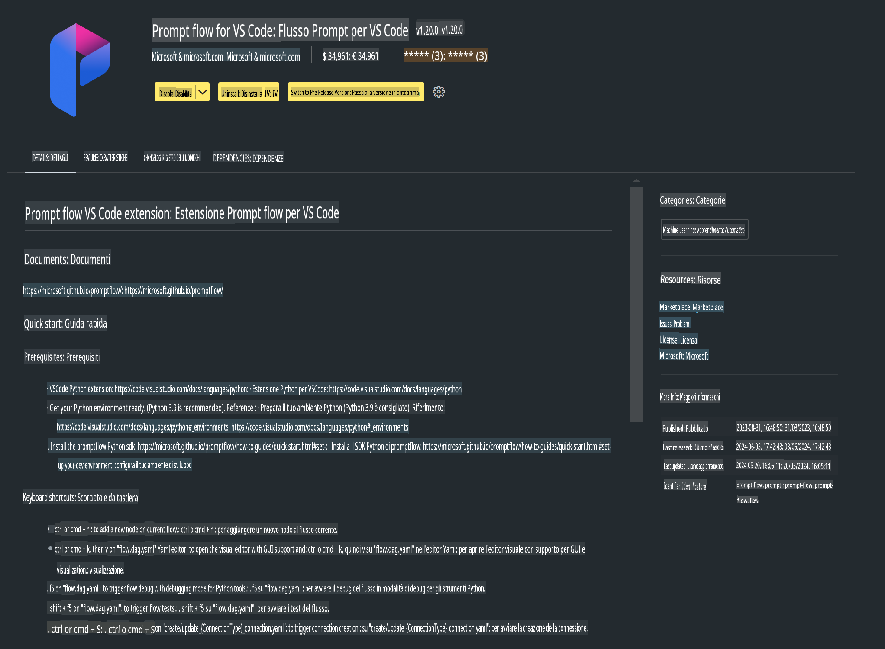

# **Lab 0 - Installazione**

Quando entriamo nel laboratorio, dobbiamo configurare l'ambiente pertinente:


### **1. Python 3.11+**

Si consiglia di utilizzare miniforge per configurare l'ambiente Python.

Per configurare miniforge, fai riferimento a [https://github.com/conda-forge/miniforge](https://github.com/conda-forge/miniforge).

Dopo aver configurato miniforge, esegui il seguente comando in Power Shell:

```bash

conda create -n pyenv python==3.11.8 -y

conda activate pyenv

```


### **2. Installare Prompt flow SDK**

Nel Lab 1 utilizzeremo Prompt flow, quindi è necessario configurare il Prompt flow SDK.

```bash

pip install promptflow --upgrade

```

Puoi verificare il Prompt flow SDK con questo comando:

```bash

pf --version

```


### **3. Installare l'estensione Prompt flow per Visual Studio Code**




### **4. Libreria di accelerazione Intel NPU**

I processori di nuova generazione di Intel supportano NPU. Se desideri utilizzare l'NPU per eseguire LLMs / SLMs localmente, puoi usare la ***Intel NPU Acceleration Library***. Per ulteriori informazioni, consulta [https://github.com/microsoft/PhiCookBook/blob/main/md/01.Introduction/03/AIPC_Inference.md](https://github.com/microsoft/PhiCookBook/blob/main/md/01.Introduction/03/AIPC_Inference.md).

Installa la libreria di accelerazione Intel NPU in bash:

```bash

pip install intel-npu-acceleration-library

```

***Nota***: Tieni presente che questa libreria supporta i transformers ***4.40.2***, verifica la versione.


### **5. Altre librerie Python**

Crea un file requirements.txt e aggiungi questo contenuto:

```txt

notebook
numpy 
scipy 
scikit-learn 
matplotlib 
pandas 
pillow 
graphviz

```


### **6. Installare NVM**

Installa nvm in Power Shell:

```bash

winget install -e --id CoreyButler.NVMforWindows

```

Installa Node.js 18.20:

```bash

nvm install 18.20.0

nvm use 18.20.0

```


### **7. Installare il supporto per lo sviluppo in Visual Studio Code**

```bash

npm install --global yo generator-code

```

Congratulazioni! Hai configurato con successo l'SDK. Ora puoi procedere con i passaggi pratici.

**Disclaimer (Avvertenza):**  
Questo documento è stato tradotto utilizzando servizi di traduzione automatica basati sull'intelligenza artificiale. Sebbene ci impegniamo per garantire l'accuratezza, si prega di tenere presente che le traduzioni automatiche possono contenere errori o imprecisioni. Il documento originale nella sua lingua madre dovrebbe essere considerato la fonte autorevole. Per informazioni critiche, si consiglia una traduzione professionale effettuata da un traduttore umano. Non siamo responsabili per eventuali malintesi o interpretazioni errate derivanti dall'uso di questa traduzione.