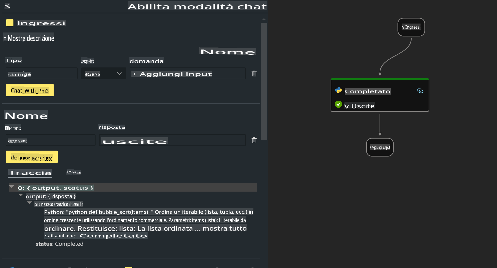
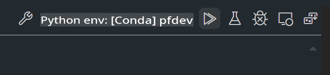

# **Lab 2 - Esegui Prompt flow con Phi-3-mini su AIPC**

## **Cos'è Prompt flow**

Prompt flow è un insieme di strumenti di sviluppo progettati per semplificare il ciclo di sviluppo end-to-end delle applicazioni AI basate su LLM, dalla fase di ideazione, prototipazione, test, valutazione fino alla distribuzione in produzione e al monitoraggio. Rende l'ingegneria dei prompt molto più semplice e consente di creare applicazioni LLM di qualità produttiva.

Con Prompt flow, potrai:

- Creare flussi che collegano LLM, prompt, codice Python e altri strumenti in un flusso di lavoro eseguibile.

- Eseguire il debug e iterare i tuoi flussi, semplificando in particolare l'interazione con i LLM.

- Valutare i tuoi flussi, calcolare metriche di qualità e prestazioni con dataset più ampi.

- Integrare i test e la valutazione nel tuo sistema CI/CD per garantire la qualità del flusso.

- Distribuire i tuoi flussi sulla piattaforma di servizio che preferisci o integrarli facilmente nel codice della tua applicazione.

- (Opzionale ma altamente consigliato) Collaborare con il tuo team utilizzando la versione cloud di Prompt flow in Azure AI.

## **Cos'è AIPC**

Un AI PC dispone di una CPU, una GPU e una NPU, ciascuna con specifiche capacità di accelerazione AI. Una NPU, o neural processing unit, è un acceleratore specializzato che gestisce compiti di intelligenza artificiale (AI) e machine learning (ML) direttamente sul tuo PC, invece di inviare i dati al cloud per l'elaborazione. Anche la GPU e la CPU possono gestire questi carichi di lavoro, ma la NPU è particolarmente efficace nei calcoli AI a basso consumo energetico. L'AI PC rappresenta un cambiamento fondamentale nel modo in cui i nostri computer operano. Non è una soluzione per un problema che non esisteva, ma promette un grande miglioramento per l'uso quotidiano dei PC.

Come funziona? Rispetto all'AI generativa e ai grandi modelli di linguaggio (LLM) addestrati su enormi quantità di dati pubblici, l'AI che si esegue sul tuo PC è più accessibile a tutti i livelli. Il concetto è più semplice da comprendere e, poiché è addestrato sui tuoi dati senza necessità di accedere al cloud, i benefici sono immediatamente più attraenti per un pubblico più ampio.

Nel breve termine, il mondo degli AI PC coinvolge assistenti personali e modelli AI più piccoli che funzionano direttamente sul tuo PC, utilizzando i tuoi dati per offrire miglioramenti AI personali, privati e più sicuri per attività che già svolgi ogni giorno, come prendere appunti durante le riunioni, organizzare una lega di fantasy football, automatizzare miglioramenti per l'editing di foto e video, o pianificare l'itinerario perfetto per una riunione di famiglia basandosi sugli orari di arrivo e partenza di tutti.

## **Costruire flussi di generazione di codice su AIPC**

***Nota***: Se non hai completato l'installazione dell'ambiente, visita [Lab 0 - Installazioni](./01.Installations.md)

1. Apri l'estensione Prompt flow in Visual Studio Code e crea un progetto di flusso vuoto.


2. Aggiungi parametri di Input e Output e inserisci codice Python come nuovo flusso.



Puoi fare riferimento a questa struttura (flow.dag.yaml) per costruire il tuo flusso.

```yaml

inputs:
  question:
    type: string
    default: how to write Bubble Algorithm
outputs:
  answer:
    type: string
    reference: ${Chat_With_Phi3.output}
nodes:
- name: Chat_With_Phi3
  type: python
  source:
    type: code
    path: Chat_With_Phi3.py
  inputs:
    question: ${inputs.question}


```

3. Aggiungi il codice in ***Chat_With_Phi3.py***.

```python


from promptflow.core import tool

# import torch
from transformers import AutoTokenizer, pipeline,TextStreamer
import intel_npu_acceleration_library as npu_lib

import warnings

import asyncio
import platform

class Phi3CodeAgent:
    
    model = None
    tokenizer = None
    text_streamer = None
    
    model_id = "microsoft/Phi-3-mini-4k-instruct"

    @staticmethod
    def init_phi3():
        
        if Phi3CodeAgent.model is None or Phi3CodeAgent.tokenizer is None or Phi3CodeAgent.text_streamer is None:
            Phi3CodeAgent.model = npu_lib.NPUModelForCausalLM.from_pretrained(
                                    Phi3CodeAgent.model_id,
                                    torch_dtype="auto",
                                    dtype=npu_lib.int4,
                                    trust_remote_code=True
                                )
            Phi3CodeAgent.tokenizer = AutoTokenizer.from_pretrained(Phi3CodeAgent.model_id)
            Phi3CodeAgent.text_streamer = TextStreamer(Phi3CodeAgent.tokenizer, skip_prompt=True)

    

    @staticmethod
    def chat_with_phi3(prompt):
        
        Phi3CodeAgent.init_phi3()

        messages = "<|system|>You are a AI Python coding assistant. Please help me to generate code in Python.The answer only genertated Python code, but any comments and instructions do not need to be generated<|end|><|user|>" + prompt +"<|end|><|assistant|>"


        generation_args = {
            "max_new_tokens": 1024,
            "return_full_text": False,
            "temperature": 0.3,
            "do_sample": False,
            "streamer": Phi3CodeAgent.text_streamer,
        }

        pipe = pipeline(
            "text-generation",
            model=Phi3CodeAgent.model,
            tokenizer=Phi3CodeAgent.tokenizer,
            # **generation_args
        )

        result = ''

        with warnings.catch_warnings():
            warnings.simplefilter("ignore")
            response = pipe(messages, **generation_args)
            result =response[0]['generated_text']
            return result


@tool
def my_python_tool(question: str) -> str:
    if platform.system() == 'Windows':
        asyncio.set_event_loop_policy(asyncio.WindowsSelectorEventLoopPolicy())
    return Phi3CodeAgent.chat_with_phi3(question)


```

4. Puoi testare il flusso utilizzando Debug o Run per verificare se la generazione del codice funziona correttamente.



5. Esegui il flusso come API di sviluppo nel terminale.

```

pf flow serve --source ./ --port 8080 --host localhost   

```

Puoi testarlo con Postman / Thunder Client.

### **Nota**

1. La prima esecuzione richiede molto tempo. Si consiglia di scaricare il modello phi-3 utilizzando Hugging Face CLI.

2. Considerando le limitate capacità di calcolo della NPU Intel, si consiglia di utilizzare Phi-3-mini-4k-instruct.

3. Usiamo l'accelerazione Intel NPU per la conversione quantizzata INT4, ma se riavvii il servizio, è necessario eliminare le cartelle cache e nc_workshop.

## **Risorse**

1. Scopri Promptflow [https://microsoft.github.io/promptflow/](https://microsoft.github.io/promptflow/)

2. Scopri l'accelerazione Intel NPU [https://github.com/intel/intel-npu-acceleration-library](https://github.com/intel/intel-npu-acceleration-library)

3. Codice di esempio, scarica [Codice di esempio per l'agente NPU locale](../../../../../../../../../code/07.Lab/01/AIPC)

**Disclaimer**:  
Questo documento è stato tradotto utilizzando servizi di traduzione automatizzati basati sull'intelligenza artificiale. Sebbene ci impegniamo per garantire l'accuratezza, si prega di notare che le traduzioni automatiche possono contenere errori o imprecisioni. Il documento originale nella sua lingua madre dovrebbe essere considerato la fonte autorevole. Per informazioni critiche, si raccomanda una traduzione professionale umana. Non siamo responsabili per eventuali malintesi o interpretazioni errate derivanti dall'uso di questa traduzione.