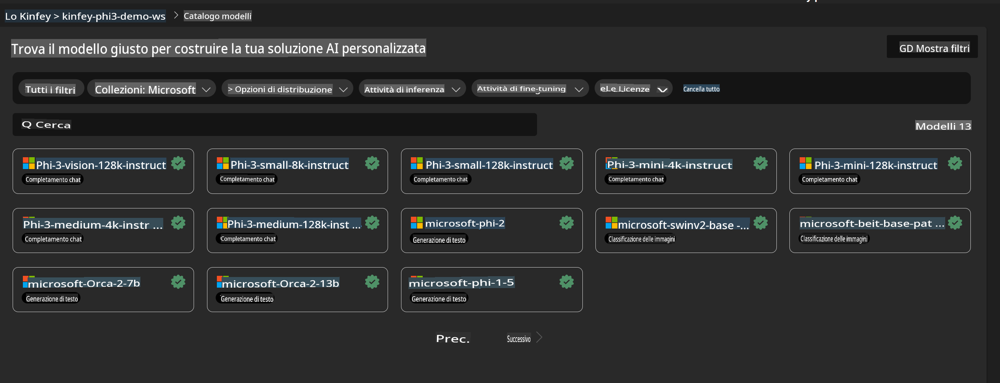
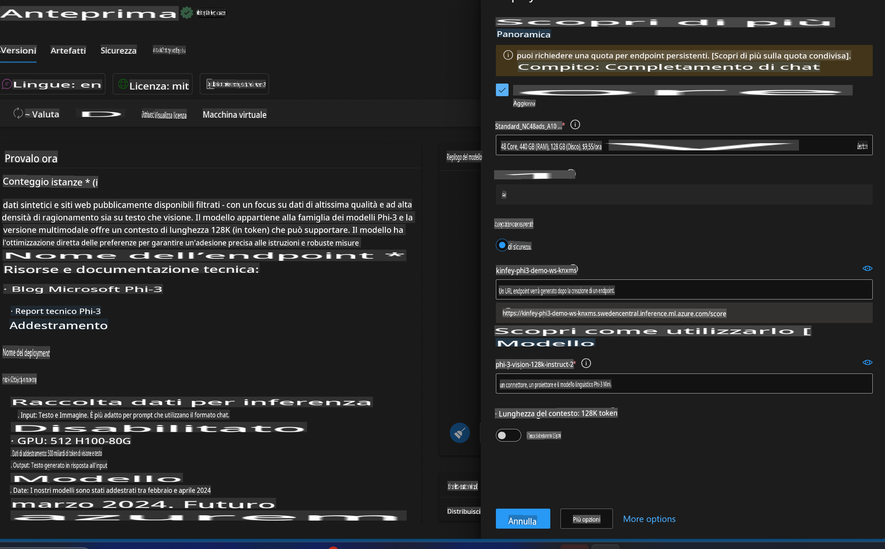
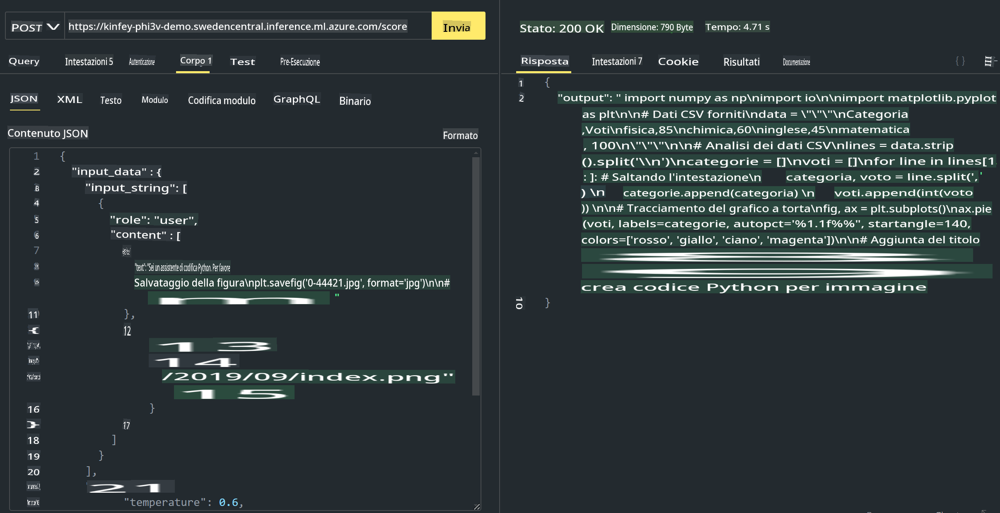

# **Lab 3 - Distribuire Phi-3-Vision su Azure Machine Learning Service**

Utilizziamo l'NPU per completare il deployment in produzione del codice locale e, successivamente, vogliamo introdurre la capacità di utilizzare PHI-3-VISION per trasformare immagini in codice.

In questa guida, vedremo come costruire rapidamente un servizio Phi-3 Vision come Model As Service su Azure Machine Learning Service.

***Nota***: Phi-3 Vision richiede potenza di calcolo per generare contenuti in modo più veloce. Abbiamo bisogno della potenza di calcolo del cloud per raggiungere questo obiettivo.

### **1. Creare Azure Machine Learning Service**

Dobbiamo creare un Azure Machine Learning Service nel portale di Azure. Se vuoi sapere come fare, visita questo link [https://learn.microsoft.com/azure/machine-learning/quickstart-create-resources?view=azureml-api-2](https://learn.microsoft.com/azure/machine-learning/quickstart-create-resources?view=azureml-api-2)

### **2. Scegliere Phi-3 Vision in Azure Machine Learning Service**



### **3. Distribuire Phi-3-Vision su Azure**



### **4. Testare l'Endpoint con Postman**



***Nota***

1. I parametri da trasmettere devono includere Authorization, azureml-model-deployment e Content-Type. È necessario verificare le informazioni sul deployment per ottenerli.

2. Per trasmettere i parametri, Phi-3-Vision richiede un link a un'immagine. Fai riferimento al metodo GPT-4-Vision per trasmettere i parametri, ad esempio:

```json

{
  "input_data":{
    "input_string":[
      {
        "role":"user",
        "content":[ 
          {
            "type": "text",
            "text": "You are a Python coding assistant.Please create Python code for image "
          },
          {
              "type": "image_url",
              "image_url": {
                "url": "https://ajaytech.co/wp-content/uploads/2019/09/index.png"
              }
          }
        ]
      }
    ],
    "parameters":{
          "temperature": 0.6,
          "top_p": 0.9,
          "do_sample": false,
          "max_new_tokens": 2048
    }
  }
}

```

3. Utilizzare il metodo Post per chiamare **/score**.

**Congratulazioni**! Hai completato il deployment rapido di PHI-3-VISION e provato come utilizzare immagini per generare codice. Ora possiamo costruire applicazioni combinando NPU e cloud.

**Disclaimer**:  
Questo documento è stato tradotto utilizzando servizi di traduzione automatica basati sull'intelligenza artificiale. Sebbene ci impegniamo per garantire l'accuratezza, si prega di tenere presente che le traduzioni automatiche possono contenere errori o imprecisioni. Il documento originale nella sua lingua madre dovrebbe essere considerato la fonte autorevole. Per informazioni critiche, si consiglia una traduzione professionale effettuata da un esperto umano. Non siamo responsabili per eventuali incomprensioni o interpretazioni errate derivanti dall'uso di questa traduzione.