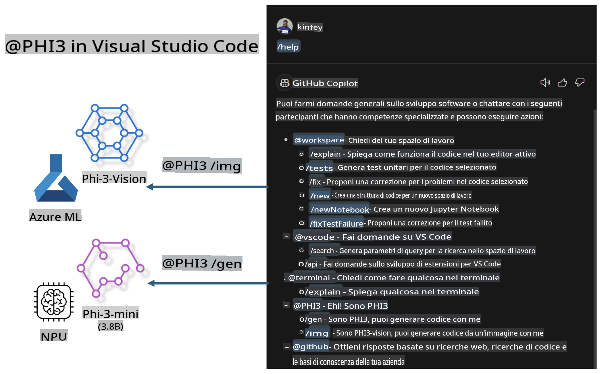

# **Crea il tuo Visual Studio Code GitHub Copilot Chat con la famiglia Microsoft Phi-3**

Hai mai utilizzato l'agente workspace in GitHub Copilot Chat? Vuoi creare un agente per il codice del tuo team? Questo laboratorio pratico mira a combinare il modello open source per costruire un agente aziendale per il codice a livello enterprise.

## **Fondamenti**

### **Perché scegliere Microsoft Phi-3**

Phi-3 è una serie di modelli che include phi-3-mini, phi-3-small e phi-3-medium, basati su diversi parametri di addestramento per la generazione di testo, il completamento di dialoghi e la generazione di codice. Esiste anche phi-3-vision basato su Vision. È adatto per aziende o team diversi per creare soluzioni AI generative offline.

Si consiglia di leggere questo link [https://github.com/microsoft/PhiCookBook/blob/main/md/01.Introduction/01/01.PhiFamily.md](https://github.com/microsoft/PhiCookBook/blob/main/md/01.Introduction/01/01.PhiFamily.md)

### **Microsoft GitHub Copilot Chat**

L'estensione GitHub Copilot Chat ti offre un'interfaccia di chat che ti consente di interagire con GitHub Copilot e ricevere risposte a domande relative al codice direttamente all'interno di VS Code, senza dover navigare nella documentazione o cercare nei forum online.

Copilot Chat può utilizzare evidenziazione della sintassi, indentazione e altre funzionalità di formattazione per rendere più chiara la risposta generata. A seconda del tipo di domanda posta dall'utente, il risultato può contenere link al contesto utilizzato da Copilot per generare una risposta, come file di codice sorgente o documentazione, o pulsanti per accedere a funzionalità di VS Code.

- Copilot Chat si integra nel tuo flusso di lavoro da sviluppatore e ti offre assistenza dove ne hai bisogno:

- Avvia una conversazione di chat inline direttamente dall'editor o dal terminale per ricevere aiuto mentre stai scrivendo codice

- Usa la vista Chat per avere un assistente AI sempre a disposizione

- Avvia Quick Chat per fare una domanda veloce e tornare subito a ciò che stavi facendo

Puoi utilizzare GitHub Copilot Chat in diversi scenari, come:

- Rispondere a domande di programmazione su come risolvere al meglio un problema

- Spiegare il codice di qualcun altro e suggerire miglioramenti

- Proporre correzioni al codice

- Generare casi di test unitari

- Generare documentazione per il codice

Si consiglia di leggere questo link [https://code.visualstudio.com/docs/copilot/copilot-chat](https://code.visualstudio.com/docs/copilot/copilot-chat?WT.mc_id=aiml-137032-kinfeylo)

### **Microsoft GitHub Copilot Chat @workspace**

Fare riferimento a **@workspace** in Copilot Chat ti consente di porre domande sull'intero codice del tuo progetto. In base alla domanda, Copilot recupera in modo intelligente i file e i simboli pertinenti, che poi utilizza nella sua risposta come link ed esempi di codice.

Per rispondere alla tua domanda, **@workspace** esamina le stesse fonti che uno sviluppatore userebbe navigando un progetto in VS Code:

- Tutti i file nel workspace, eccetto quelli ignorati da un file .gitignore

- La struttura delle directory con nomi di cartelle e file annidati

- L'indice di ricerca del codice di GitHub, se il workspace è un repository GitHub e indicizzato dalla ricerca del codice

- Simboli e definizioni nel workspace

- Testo attualmente selezionato o visibile nell'editor attivo

Nota: .gitignore viene ignorato se hai un file aperto o hai selezionato del testo all'interno di un file ignorato.

Si consiglia di leggere questo link [[https://code.visualstudio.com/docs/copilot/copilot-chat](https://code.visualstudio.com/docs/copilot/workspace-context?WT.mc_id=aiml-137032-kinfeylo)]

## **Scopri di più su questo laboratorio**

GitHub Copilot ha notevolmente migliorato l'efficienza nella programmazione per le aziende, e ogni azienda desidera personalizzare le funzionalità di GitHub Copilot in base alle proprie esigenze. Molte aziende hanno creato estensioni simili a GitHub Copilot basate sui propri scenari aziendali e modelli open source. Per le aziende, estensioni personalizzate sono più facili da controllare, ma ciò può influire sull'esperienza utente. Dopotutto, GitHub Copilot è più potente nel gestire scenari generali e professionali. Se si riesce a mantenere un'esperienza coerente, sarebbe meglio personalizzare l'estensione dell'azienda. GitHub Copilot Chat offre API pertinenti per consentire alle aziende di ampliare l'esperienza di chat. Mantenere un'esperienza coerente e avere funzionalità personalizzate offre un'esperienza utente migliore.

Questo laboratorio utilizza principalmente il modello Phi-3 combinato con il NPU locale e l'ibrido Azure per costruire un agente personalizzato in GitHub Copilot Chat ***@PHI3*** per assistere gli sviluppatori aziendali nel completamento della generazione di codice ***(@PHI3 /gen)*** e nella generazione di codice basata su immagini ***(@PHI3 /img)***.

### ***Nota:*** 

Questo laboratorio è attualmente implementato su AIPC con CPU Intel e Apple Silicon. Continueremo ad aggiornare la versione Qualcomm di NPU.

## **Laboratorio**

| Nome | Descrizione | AIPC | Apple |
| ------------ | ----------- | -------- |-------- |
| Lab0 - Installazioni(✅) | Configura e installa gli ambienti e gli strumenti necessari | [Vai](./HOL/AIPC/01.Installations.md) |[Vai](./HOL/Apple/01.Installations.md) |
| Lab1 - Esegui Prompt flow con Phi-3-mini (✅) | Combinato con AIPC / Apple Silicon, utilizza NPU locale per creare codice con Phi-3-mini | [Vai](./HOL/AIPC/02.PromptflowWithNPU.md) |  [Vai](./HOL/Apple/02.PromptflowWithMLX.md) |
| Lab2 - Distribuisci Phi-3-vision su Azure Machine Learning Service(✅) | Genera codice distribuendo Phi-3-vision da Model Catalog di Azure Machine Learning Service | [Vai](./HOL/AIPC/03.DeployPhi3VisionOnAzure.md) |[Vai](./HOL/Apple/03.DeployPhi3VisionOnAzure.md) |
| Lab3 - Crea un agente @phi-3 in GitHub Copilot Chat(✅)  | Crea un agente Phi-3 personalizzato in GitHub Copilot Chat per completare generazione di codice, codice grafico, RAG, ecc. | [Vai](./HOL/AIPC/04.CreatePhi3AgentInVSCode.md) | [Vai](./HOL/Apple/04.CreatePhi3AgentInVSCode.md) |
| Codice di esempio (✅)  | Scarica il codice di esempio | [Vai](../../../../../../../code/07.Lab/01/AIPC) | [Vai](../../../../../../../code/07.Lab/01/Apple) |

## **Risorse**

1. Phi-3 Cookbook [https://github.com/microsoft/Phi-3CookBook](https://github.com/microsoft/Phi-3CookBook)

2. Scopri di più su GitHub Copilot [https://learn.microsoft.com/training/paths/copilot/](https://learn.microsoft.com/training/paths/copilot/?WT.mc_id=aiml-137032-kinfeylo)

3. Scopri di più su GitHub Copilot Chat [https://learn.microsoft.com/training/paths/accelerate-app-development-using-github-copilot/](https://learn.microsoft.com/training/paths/accelerate-app-development-using-github-copilot/?WT.mc_id=aiml-137032-kinfeylo)

4. Scopri di più sull'API di GitHub Copilot Chat [https://code.visualstudio.com/api/extension-guides/chat](https://code.visualstudio.com/api/extension-guides/chat?WT.mc_id=aiml-137032-kinfeylo)

5. Scopri di più su Azure AI Foundry [https://learn.microsoft.com/training/paths/create-custom-copilots-ai-studio/](https://learn.microsoft.com/training/paths/create-custom-copilots-ai-studio/?WT.mc_id=aiml-137032-kinfeylo)

6. Scopri di più sul Model Catalog di Azure AI Foundry [https://learn.microsoft.com/azure/ai-studio/how-to/model-catalog-overview](https://learn.microsoft.com/azure/ai-studio/how-to/model-catalog-overview)

**Disclaimer (Avvertenza)**:  
Questo documento è stato tradotto utilizzando servizi di traduzione automatica basati su intelligenza artificiale. Sebbene ci impegniamo per garantire l'accuratezza, si prega di notare che le traduzioni automatiche potrebbero contenere errori o imprecisioni. Il documento originale nella sua lingua madre deve essere considerato la fonte autorevole. Per informazioni critiche, si consiglia una traduzione professionale effettuata da un umano. Non siamo responsabili per eventuali incomprensioni o interpretazioni errate derivanti dall'uso di questa traduzione.