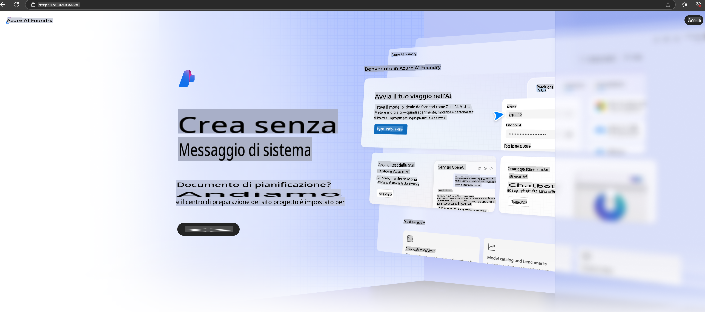

# **Utilizzo di Phi-3 in Azure AI Foundry**

Con lo sviluppo dell'Intelligenza Artificiale Generativa, puntiamo a utilizzare una piattaforma unificata per gestire diversi LLM e SLM, l'integrazione dei dati aziendali, le operazioni di fine-tuning/RAG e la valutazione di diversi scenari aziendali dopo l'integrazione di LLM e SLM, così da implementare meglio applicazioni intelligenti con l'AI generativa. [Azure AI Foundry](https://ai.azure.com) è una piattaforma di applicazioni di AI generativa a livello aziendale.

Con Azure AI Foundry, è possibile valutare le risposte dei modelli linguistici di grandi dimensioni (LLM) e orchestrare i componenti delle applicazioni prompt con il flusso di prompt per ottenere migliori prestazioni. La piattaforma facilita la scalabilità, trasformando con facilità i proof of concept in soluzioni di produzione complete. Il monitoraggio continuo e il miglioramento supportano il successo a lungo termine.

Possiamo distribuire rapidamente il modello Phi-3 su Azure AI Foundry seguendo semplici passaggi, e successivamente utilizzare Azure AI Foundry per svolgere attività correlate a Phi-3 come Playground/Chat, fine-tuning, valutazione e altro.

## **1. Preparazione**

Se hai già installato [Azure Developer CLI](https://learn.microsoft.com/azure/developer/azure-developer-cli/overview?WT.mc_id=aiml-138114-kinfeylo) sul tuo computer, utilizzare questo template è semplice come eseguire questo comando in una nuova directory.

## Creazione Manuale

Creare un progetto e un hub in Microsoft Azure AI Foundry è un ottimo modo per organizzare e gestire il tuo lavoro sull'AI. Ecco una guida passo-passo per iniziare:

### Creare un Progetto in Azure AI Foundry

1. **Accedi ad Azure AI Foundry**: Effettua l'accesso al portale di Azure AI Foundry.
2. **Crea un Progetto**:
   - Se ti trovi già in un progetto, seleziona "Azure AI Foundry" in alto a sinistra della pagina per tornare alla Home.
   - Seleziona "+ Crea progetto".
   - Inserisci un nome per il progetto.
   - Se hai un hub, verrà selezionato di default. Se hai accesso a più hub, puoi selezionarne un altro dal menu a tendina. Se desideri creare un nuovo hub, seleziona "Crea nuovo hub" e inserisci un nome.
   - Seleziona "Crea".

### Creare un Hub in Azure AI Foundry

1. **Accedi ad Azure AI Foundry**: Effettua l'accesso con il tuo account Azure.
2. **Crea un Hub**:
   - Seleziona il Centro di gestione dal menu a sinistra.
   - Seleziona "Tutte le risorse", quindi la freccia accanto a "+ Nuovo progetto" e seleziona "+ Nuovo hub".
   - Nella finestra di dialogo "Crea un nuovo hub", inserisci un nome per il tuo hub (ad esempio, contoso-hub) e modifica gli altri campi come desideri.
   - Seleziona "Avanti", verifica le informazioni, quindi seleziona "Crea".

Per istruzioni più dettagliate, puoi consultare la [documentazione ufficiale di Microsoft](https://learn.microsoft.com/azure/ai-studio/how-to/create-projects).

Dopo la creazione con successo, puoi accedere allo studio creato tramite [ai.azure.com](https://ai.azure.com/)

Su un AI Foundry possono esserci più progetti. Crea un progetto in AI Foundry per prepararti.

Consulta i [QuickStarts di Azure AI Foundry](https://learn.microsoft.com/azure/ai-studio/quickstarts/get-started-code)

## **2. Distribuire un modello Phi in Azure AI Foundry**

Clicca sull'opzione Esplora del progetto per accedere al Catalogo Modelli e selezionare Phi-3.

Seleziona Phi-3-mini-4k-instruct.

Clicca su 'Distribuisci' per distribuire il modello Phi-3-mini-4k-instruct.

> [!NOTE]
>
> Puoi selezionare la potenza di calcolo durante la distribuzione.

## **3. Playground Chat Phi in Azure AI Foundry**

Accedi alla pagina di distribuzione, seleziona Playground e chatta con Phi-3 di Azure AI Foundry.

## **4. Distribuire il Modello da Azure AI Foundry**

Per distribuire un modello dal Catalogo Modelli di Azure, puoi seguire questi passaggi:

- Accedi ad Azure AI Foundry.
- Scegli il modello che desideri distribuire dal catalogo dei modelli di Azure AI Foundry.
- Nella pagina dei Dettagli del modello, seleziona Distribuisci e poi seleziona API Serverless con Azure AI Content Safety.
- Seleziona il progetto in cui desideri distribuire i tuoi modelli. Per utilizzare l'offerta API Serverless, il tuo workspace deve appartenere alla regione East US 2 o Sweden Central. Puoi personalizzare il nome della Distribuzione.
- Nella procedura guidata di distribuzione, seleziona Prezzi e termini per conoscere i prezzi e i termini di utilizzo.
- Seleziona Distribuisci. Attendi fino a quando la distribuzione è pronta e vieni reindirizzato alla pagina delle Distribuzioni.
- Seleziona Apri in playground per iniziare a interagire con il modello.
- Puoi tornare alla pagina delle Distribuzioni, selezionare la distribuzione e annotare l'URL di destinazione dell'endpoint e la Chiave Segreta, che puoi utilizzare per chiamare la distribuzione e generare completamenti.
- Puoi sempre trovare i dettagli dell'endpoint, l'URL e le chiavi di accesso navigando nella scheda Build e selezionando Distribuzioni dalla sezione Componenti.

> [!NOTE]
> Tieni presente che il tuo account deve avere i permessi del ruolo Azure AI Developer sul Gruppo di Risorse per eseguire questi passaggi.

## **5. Utilizzo dell'API Phi in Azure AI Foundry**

Puoi accedere a https://{Il nome del tuo progetto}.region.inference.ml.azure.com/swagger.json tramite una richiesta GET in Postman e combinarla con la Chiave per esplorare le interfacce fornite.

Puoi ottenere con grande facilità i parametri di richiesta e i parametri di risposta.

**Disclaimer (Avvertenza)**:  
Questo documento è stato tradotto utilizzando servizi di traduzione automatica basati sull'intelligenza artificiale. Sebbene ci impegniamo per garantire l'accuratezza, si prega di tenere presente che le traduzioni automatiche possono contenere errori o imprecisioni. Il documento originale nella sua lingua nativa deve essere considerato la fonte autorevole. Per informazioni critiche, si raccomanda una traduzione professionale umana. Non siamo responsabili per eventuali fraintendimenti o interpretazioni errate derivanti dall'uso di questa traduzione.