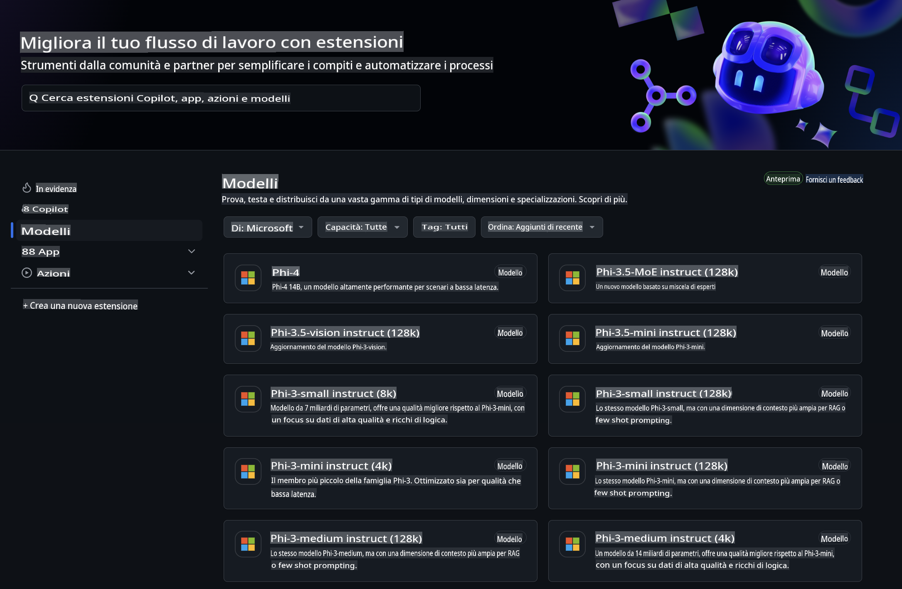
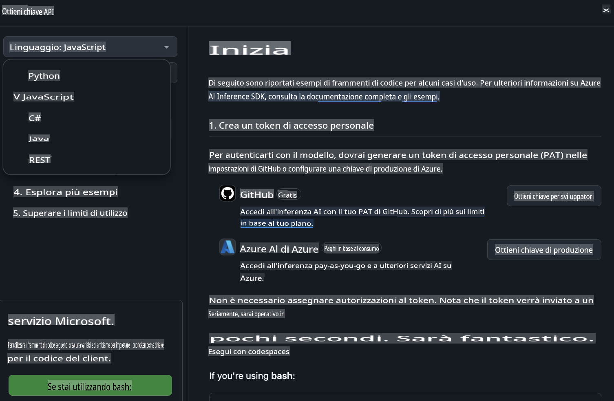
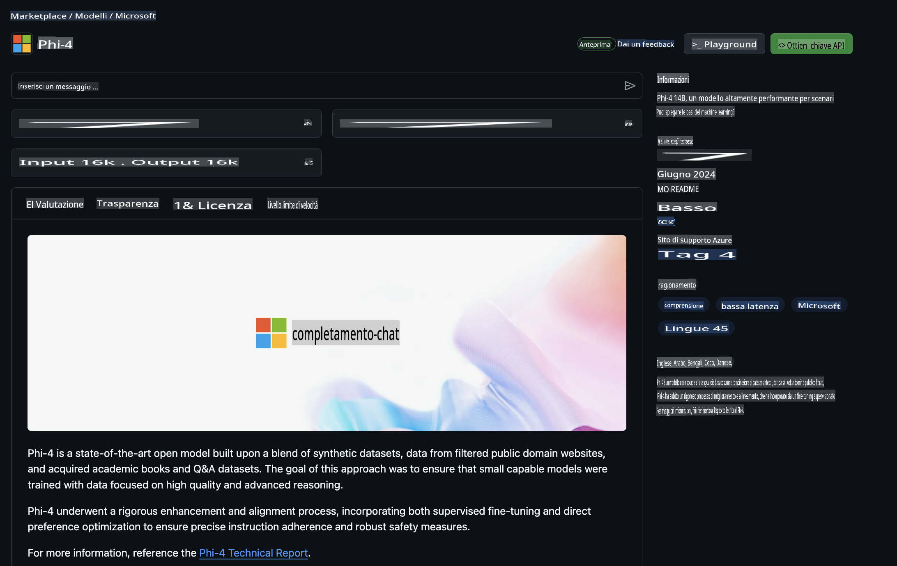

## Modelli GitHub - Beta Pubblica Limitata

Benvenuto su [GitHub Models](https://github.com/marketplace/models)! Siamo pronti per farti esplorare i Modelli AI ospitati su Azure AI.



Per ulteriori informazioni sui Modelli disponibili su GitHub Models, visita il [GitHub Model Marketplace](https://github.com/marketplace/models)

## Modelli Disponibili

Ogni modello dispone di un playground dedicato e di codice di esempio.


### Modelli Phi-3 nel Catalogo Modelli di GitHub

[Phi-3-Medium-128k-Instruct](https://github.com/marketplace/models/azureml/Phi-3-medium-128k-instruct)

[Phi-3-medium-4k-instruct](https://github.com/marketplace/models/azureml/Phi-3-medium-4k-instruct)

[Phi-3-mini-128k-instruct](https://github.com/marketplace/models/azureml/Phi-3-mini-128k-instruct)

[Phi-3-mini-4k-instruct](https://github.com/marketplace/models/azureml/Phi-3-mini-4k-instruct)

[Phi-3-small-128k-instruct](https://github.com/marketplace/models/azureml/Phi-3-small-128k-instruct)

[Phi-3-small-8k-instruct](https://github.com/marketplace/models/azureml/Phi-3-small-8k-instruct)

## Iniziare

Abbiamo preparato alcuni esempi di base pronti per essere eseguiti. Puoi trovarli nella directory dei campioni. Se desideri passare subito al tuo linguaggio preferito, puoi trovare gli esempi nei seguenti linguaggi:

- Python
- JavaScript
- cURL

C'è anche un ambiente dedicato in Codespaces per eseguire i campioni e i modelli.



## Codice di Esempio

Di seguito sono riportati frammenti di codice di esempio per alcuni casi d'uso. Per ulteriori informazioni sull'Azure AI Inference SDK, consulta la documentazione completa e gli esempi.

## Configurazione

1. Crea un token di accesso personale  
Non è necessario assegnare permessi al token. Nota che il token sarà inviato a un servizio Microsoft.

Per utilizzare i frammenti di codice riportati di seguito, crea una variabile d'ambiente per impostare il tuo token come chiave per il codice client.

Se stai usando bash:  
```
export GITHUB_TOKEN="<your-github-token-goes-here>"
```  
Se stai usando PowerShell:  
```
$Env:GITHUB_TOKEN="<your-github-token-goes-here>"
```  

Se stai usando il prompt dei comandi di Windows:  
```
set GITHUB_TOKEN=<your-github-token-goes-here>
```  

## Esempio Python

### Installa le dipendenze  
Installa l'Azure AI Inference SDK utilizzando pip (Richiede: Python >=3.8):  

```
pip install azure-ai-inference
```  

### Esegui un esempio di base  

Questo esempio dimostra una chiamata di base all'API di completamento chat. Utilizza l'endpoint di inferenza del modello AI di GitHub e il tuo token GitHub. La chiamata è sincrona.  

```
import os
from azure.ai.inference import ChatCompletionsClient
from azure.ai.inference.models import SystemMessage, UserMessage
from azure.core.credentials import AzureKeyCredential

endpoint = "https://models.inference.ai.azure.com"
# Replace Model_Name 
model_name = "Phi-3-small-8k-instruct"
token = os.environ["GITHUB_TOKEN"]

client = ChatCompletionsClient(
    endpoint=endpoint,
    credential=AzureKeyCredential(token),
)

response = client.complete(
    messages=[
        SystemMessage(content="You are a helpful assistant."),
        UserMessage(content="What is the capital of France?"),
    ],
    model=model_name,
    temperature=1.,
    max_tokens=1000,
    top_p=1.
)

print(response.choices[0].message.content)
```  

### Esegui una conversazione multi-turno  

Questo esempio dimostra una conversazione multi-turno con l'API di completamento chat. Quando utilizzi il modello per un'applicazione di chat, dovrai gestire la cronologia della conversazione e inviare i messaggi più recenti al modello.  

```
import os
from azure.ai.inference import ChatCompletionsClient
from azure.ai.inference.models import AssistantMessage, SystemMessage, UserMessage
from azure.core.credentials import AzureKeyCredential

token = os.environ["GITHUB_TOKEN"]
endpoint = "https://models.inference.ai.azure.com"
# Replace Model_Name
model_name = "Phi-3-small-8k-instruct"

client = ChatCompletionsClient(
    endpoint=endpoint,
    credential=AzureKeyCredential(token),
)

messages = [
    SystemMessage(content="You are a helpful assistant."),
    UserMessage(content="What is the capital of France?"),
    AssistantMessage(content="The capital of France is Paris."),
    UserMessage(content="What about Spain?"),
]

response = client.complete(messages=messages, model=model_name)

print(response.choices[0].message.content)
```  

### Stream dell'output  

Per migliorare l'esperienza utente, ti consigliamo di trasmettere in streaming la risposta del modello in modo che il primo token venga mostrato subito, evitando di attendere risposte lunghe.  

```
import os
from azure.ai.inference import ChatCompletionsClient
from azure.ai.inference.models import SystemMessage, UserMessage
from azure.core.credentials import AzureKeyCredential

token = os.environ["GITHUB_TOKEN"]
endpoint = "https://models.inference.ai.azure.com"
# Replace Model_Name
model_name = "Phi-3-small-8k-instruct"

client = ChatCompletionsClient(
    endpoint=endpoint,
    credential=AzureKeyCredential(token),
)

response = client.complete(
    stream=True,
    messages=[
        SystemMessage(content="You are a helpful assistant."),
        UserMessage(content="Give me 5 good reasons why I should exercise every day."),
    ],
    model=model_name,
)

for update in response:
    if update.choices:
        print(update.choices[0].delta.content or "", end="")

client.close()
```  

## JavaScript  

### Installa le dipendenze  

Installa Node.js.  

Copia le seguenti righe di testo e salvale come file package.json all'interno della tua cartella.  

```
{
  "type": "module",
  "dependencies": {
    "@azure-rest/ai-inference": "latest",
    "@azure/core-auth": "latest",
    "@azure/core-sse": "latest"
  }
}
```  

Nota: @azure/core-sse è necessario solo quando si trasmette in streaming la risposta dei completamenti chat.  

Apri una finestra del terminale in questa cartella ed esegui npm install.  

Per ciascuno dei frammenti di codice riportati di seguito, copia il contenuto in un file sample.js ed eseguilo con node sample.js.  

### Esegui un esempio di base  

Questo esempio dimostra una chiamata di base all'API di completamento chat. Utilizza l'endpoint di inferenza del modello AI di GitHub e il tuo token GitHub. La chiamata è sincrona.  

```
import ModelClient from "@azure-rest/ai-inference";
import { AzureKeyCredential } from "@azure/core-auth";

const token = process.env["GITHUB_TOKEN"];
const endpoint = "https://models.inference.ai.azure.com";
// Update your modelname
const modelName = "Phi-3-small-8k-instruct";

export async function main() {

  const client = new ModelClient(endpoint, new AzureKeyCredential(token));

  const response = await client.path("/chat/completions").post({
    body: {
      messages: [
        { role:"system", content: "You are a helpful assistant." },
        { role:"user", content: "What is the capital of France?" }
      ],
      model: modelName,
      temperature: 1.,
      max_tokens: 1000,
      top_p: 1.
    }
  });

  if (response.status !== "200") {
    throw response.body.error;
  }
  console.log(response.body.choices[0].message.content);
}

main().catch((err) => {
  console.error("The sample encountered an error:", err);
});
```  

### Esegui una conversazione multi-turno  

Questo esempio dimostra una conversazione multi-turno con l'API di completamento chat. Quando utilizzi il modello per un'applicazione di chat, dovrai gestire la cronologia della conversazione e inviare i messaggi più recenti al modello.  

```
import ModelClient from "@azure-rest/ai-inference";
import { AzureKeyCredential } from "@azure/core-auth";

const token = process.env["GITHUB_TOKEN"];
const endpoint = "https://models.inference.ai.azure.com";
// Update your modelname
const modelName = "Phi-3-small-8k-instruct";

export async function main() {

  const client = new ModelClient(endpoint, new AzureKeyCredential(token));

  const response = await client.path("/chat/completions").post({
    body: {
      messages: [
        { role: "system", content: "You are a helpful assistant." },
        { role: "user", content: "What is the capital of France?" },
        { role: "assistant", content: "The capital of France is Paris." },
        { role: "user", content: "What about Spain?" },
      ],
      model: modelName,
    }
  });

  if (response.status !== "200") {
    throw response.body.error;
  }

  for (const choice of response.body.choices) {
    console.log(choice.message.content);
  }
}

main().catch((err) => {
  console.error("The sample encountered an error:", err);
});
```  

### Stream dell'output  

Per migliorare l'esperienza utente, ti consigliamo di trasmettere in streaming la risposta del modello in modo che il primo token venga mostrato subito, evitando di attendere risposte lunghe.  

```
import ModelClient from "@azure-rest/ai-inference";
import { AzureKeyCredential } from "@azure/core-auth";
import { createSseStream } from "@azure/core-sse";

const token = process.env["GITHUB_TOKEN"];
const endpoint = "https://models.inference.ai.azure.com";
// Update your modelname
const modelName = "Phi-3-small-8k-instruct";

export async function main() {

  const client = new ModelClient(endpoint, new AzureKeyCredential(token));

  const response = await client.path("/chat/completions").post({
    body: {
      messages: [
        { role: "system", content: "You are a helpful assistant." },
        { role: "user", content: "Give me 5 good reasons why I should exercise every day." },
      ],
      model: modelName,
      stream: true
    }
  }).asNodeStream();

  const stream = response.body;
  if (!stream) {
    throw new Error("The response stream is undefined");
  }

  if (response.status !== "200") {
    stream.destroy();
    throw new Error(`Failed to get chat completions, http operation failed with ${response.status} code`);
  }

  const sseStream = createSseStream(stream);

  for await (const event of sseStream) {
    if (event.data === "[DONE]") {
      return;
    }
    for (const choice of (JSON.parse(event.data)).choices) {
        process.stdout.write(choice.delta?.content ?? ``);
    }
  }
}

main().catch((err) => {
  console.error("The sample encountered an error:", err);
});
```  

## REST  

### Esegui un esempio di base  

Incolla quanto segue in una shell:  

```
curl -X POST "https://models.inference.ai.azure.com/chat/completions" \
    -H "Content-Type: application/json" \
    -H "Authorization: Bearer $GITHUB_TOKEN" \
    -d '{
        "messages": [
            {
                "role": "system",
                "content": "You are a helpful assistant."
            },
            {
                "role": "user",
                "content": "What is the capital of France?"
            }
        ],
        "model": "Phi-3-small-8k-instruct"
    }'
```  

### Esegui una conversazione multi-turno  

Chiama l'API di completamento chat e passa la cronologia della chat:  

```
curl -X POST "https://models.inference.ai.azure.com/chat/completions" \
    -H "Content-Type: application/json" \
    -H "Authorization: Bearer $GITHUB_TOKEN" \
    -d '{
        "messages": [
            {
                "role": "system",
                "content": "You are a helpful assistant."
            },
            {
                "role": "user",
                "content": "What is the capital of France?"
            },
            {
                "role": "assistant",
                "content": "The capital of France is Paris."
            },
            {
                "role": "user",
                "content": "What about Spain?"
            }
        ],
        "model": "Phi-3-small-8k-instruct"
    }'
```  

### Stream dell'output  

Questo è un esempio di chiamata all'endpoint e di streaming della risposta.  

```
curl -X POST "https://models.inference.ai.azure.com/chat/completions" \
    -H "Content-Type: application/json" \
    -H "Authorization: Bearer $GITHUB_TOKEN" \
    -d '{
        "messages": [
            {
                "role": "system",
                "content": "You are a helpful assistant."
            },
            {
                "role": "user",
                "content": "Give me 5 good reasons why I should exercise every day."
            }
        ],
        "stream": true,
        "model": "Phi-3-small-8k-instruct"
    }'
```  

## Utilizzo GRATUITO e Limiti di Frequenza per i Modelli GitHub  

  

I [limiti di frequenza per il playground e l'utilizzo gratuito dell'API](https://docs.github.com/en/github-models/prototyping-with-ai-models#rate-limits) sono pensati per aiutarti a sperimentare con i modelli e prototipare la tua applicazione AI. Per utilizzi che superano questi limiti e per scalare la tua applicazione, devi fornire risorse da un account Azure e autenticarti da lì invece che con il tuo token di accesso personale GitHub. Non è necessario modificare nient'altro nel tuo codice. Usa questo link per scoprire come andare oltre i limiti del livello gratuito in Azure AI.  

### Informazioni  

Ricorda che quando interagisci con un modello stai sperimentando con l'AI, quindi sono possibili errori nei contenuti.  

La funzionalità è soggetta a vari limiti (inclusi richieste al minuto, richieste al giorno, token per richiesta e richieste simultanee) e non è progettata per casi d'uso in produzione.  

GitHub Models utilizza Azure AI Content Safety. Questi filtri non possono essere disattivati nell'ambito dell'esperienza GitHub Models. Se decidi di utilizzare i modelli tramite un servizio a pagamento, configura i tuoi filtri di contenuto in base alle tue esigenze.  

Questo servizio è soggetto ai Termini di Pre-rilascio di GitHub.  

**Disclaimer (Avvertenza)**:  
Questo documento è stato tradotto utilizzando servizi di traduzione automatica basati su intelligenza artificiale. Sebbene ci impegniamo per garantire l'accuratezza, si prega di tenere presente che le traduzioni automatiche possono contenere errori o imprecisioni. Il documento originale nella sua lingua nativa deve essere considerato la fonte autorevole. Per informazioni critiche, si raccomanda una traduzione professionale eseguita da un umano. Non siamo responsabili per eventuali malintesi o interpretazioni errate derivanti dall'uso di questa traduzione.