# Ottimizzazione di Phi-3 con Azure AI Foundry

Esploriamo come ottimizzare il modello linguistico Phi-3 Mini di Microsoft utilizzando Azure AI Foundry. L'ottimizzazione consente di adattare Phi-3 Mini a compiti specifici, rendendolo ancora più potente e contestualmente consapevole.

## Considerazioni

- **Capacità:** Quali modelli possono essere ottimizzati? A cosa può essere adattato il modello base?
- **Costo:** Qual è il modello di pricing per l'ottimizzazione?
- **Personalizzazione:** Quanto posso modificare il modello base e in che modo?
- **Comodità:** Come avviene l'ottimizzazione? Devo scrivere codice personalizzato? Devo fornire la mia infrastruttura?
- **Sicurezza:** I modelli ottimizzati possono presentare rischi per la sicurezza. Esistono misure di protezione contro danni non intenzionali?

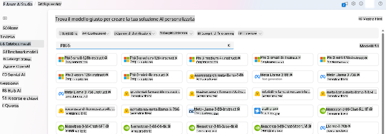

## Preparazione per l'ottimizzazione

### Prerequisiti

> [!NOTE]
> Per i modelli della famiglia Phi-3, l'offerta di ottimizzazione a consumo è disponibile solo con hub creati nelle regioni **East US 2**.

- Un abbonamento Azure. Se non hai un abbonamento Azure, crea un [account Azure a pagamento](https://azure.microsoft.com/pricing/purchase-options/pay-as-you-go) per iniziare.

- Un [progetto AI Foundry](https://ai.azure.com?WT.mc_id=aiml-138114-kinfeylo).
- I controlli di accesso basati sui ruoli di Azure (Azure RBAC) vengono utilizzati per concedere accesso alle operazioni in Azure AI Foundry. Per eseguire i passaggi di questo articolo, il tuo account utente deve avere il ruolo __Azure AI Developer__ assegnato al gruppo di risorse.

### Registrazione del provider di sottoscrizione

Verifica che la sottoscrizione sia registrata al provider di risorse `Microsoft.Network`.

1. Accedi al [portale di Azure](https://portal.azure.com).
1. Seleziona **Sottoscrizioni** dal menu a sinistra.
1. Seleziona la sottoscrizione che vuoi utilizzare.
1. Seleziona **Impostazioni progetto AI** > **Provider di risorse** dal menu a sinistra.
1. Conferma che **Microsoft.Network** sia nell'elenco dei provider di risorse. In caso contrario, aggiungilo.

### Preparazione dei dati

Prepara i tuoi dati di addestramento e validazione per ottimizzare il modello. I set di dati di addestramento e validazione devono includere esempi di input e output che rappresentano come desideri che il modello si comporti.

Assicurati che tutti gli esempi di addestramento seguano il formato previsto per l'inferenza. Per ottimizzare efficacemente i modelli, garantisci un dataset bilanciato e diversificato.

Questo implica mantenere l'equilibrio dei dati, includere vari scenari e affinare periodicamente i dati di addestramento per allinearli alle aspettative del mondo reale, portando infine a risposte del modello più accurate ed equilibrate.

Tipologie di modelli differenti richiedono formati di dati di addestramento differenti.

### Chat Completion

I dati di addestramento e validazione **devono** essere formattati come un documento JSON Lines (JSONL). Per `Phi-3-mini-128k-instruct`, il dataset di ottimizzazione deve essere formattato nel formato conversazionale utilizzato dall'API Chat completions.

### Formato file di esempio

```json
    {"messages": [{"role": "system", "content": "You are an Xbox customer support agent whose primary goal is to help users with issues they are experiencing with their Xbox devices. You are friendly and concise. You only provide factual answers to queries, and do not provide answers that are not related to Xbox."}, {"role": "user", "content": "Is Xbox better than PlayStation?"}, {"role": "assistant", "content": "I apologize, but I cannot provide personal opinions. My primary job is to assist you with any issues related to your Xbox device. Do you have any Xbox-related issues that need addressing?"}]}
    {"messages": [{"role": "system", "content": "You are an Xbox customer support agent whose primary goal is to help users with issues they are experiencing with their Xbox devices. You are friendly and concise. You only provide factual answers to queries, and do not provide answers that are not related to Xbox."}, {"role": "user", "content": "Can I play PC games on my Xbox?"}, {"role": "assistant", "content": "While Xbox consoles don't natively support PC games, they can play an array of Xbox games, many of which are also available on PC. Can I assist you with finding games compatible with your Xbox device?"}]}
    {"messages": [{"role": "system", "content": "You are an Xbox customer support agent whose primary goal is to help users with issues they are experiencing with their Xbox devices. You are friendly and concise. You only provide factual answers to queries, and do not provide answers that are not related to Xbox."}, {"role": "user", "content": "I'm having trouble connecting my Xbox to the Wi-Fi."}, {"role": "assistant", "content": "No worries, let's go through the network settings on your Xbox. Can you please tell me what happens when you try to connect it to the Wi-Fi?"}]}
```

Il tipo di file supportato è JSON Lines. I file vengono caricati nell'archivio dati predefinito e resi disponibili nel tuo progetto.

## Ottimizzazione di Phi-3 con Azure AI Foundry

Azure AI Foundry ti consente di personalizzare modelli linguistici di grandi dimensioni utilizzando un processo noto come ottimizzazione. L'ottimizzazione offre un valore significativo consentendo personalizzazione e ottimizzazione per compiti e applicazioni specifici. Questo porta a prestazioni migliorate, efficienza nei costi, riduzione della latenza e output personalizzati.

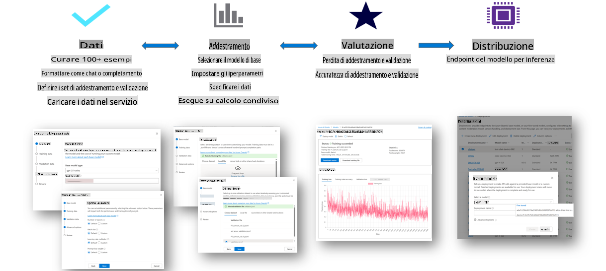

### Creazione di un nuovo progetto

1. Accedi a [Azure AI Foundry](https://ai.azure.com).

1. Seleziona **+Nuovo progetto** per creare un nuovo progetto in Azure AI Foundry.

    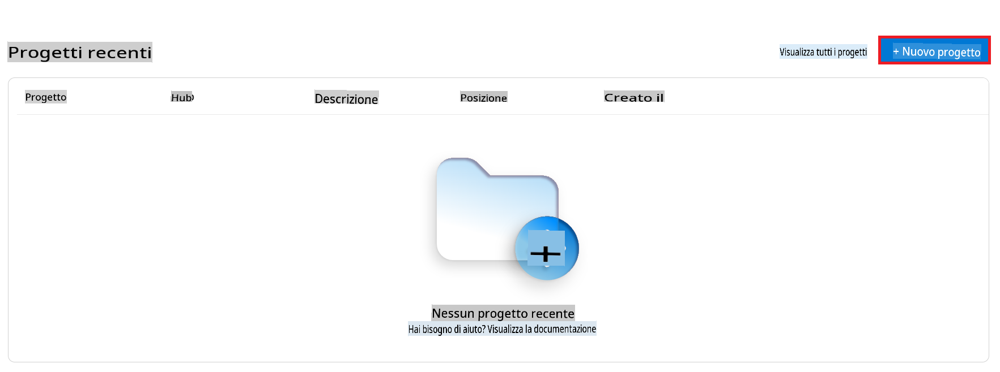

1. Esegui le seguenti operazioni:

    - **Nome hub del progetto.** Deve essere un valore univoco.
    - Seleziona l'**Hub** da utilizzare (creane uno nuovo se necessario).

    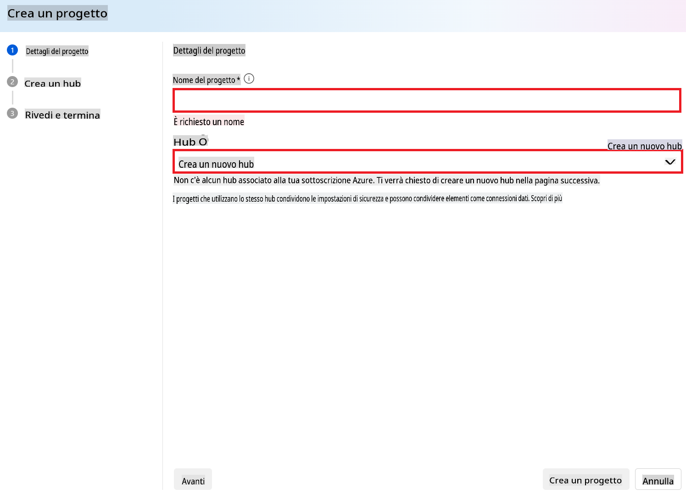

1. Esegui le seguenti operazioni per creare un nuovo hub:

    - Inserisci il **Nome hub.** Deve essere un valore univoco.
    - Seleziona la tua **Sottoscrizione Azure**.
    - Seleziona il **Gruppo di risorse** da utilizzare (creane uno nuovo se necessario).
    - Seleziona la **Posizione** che desideri utilizzare.
    - Seleziona **Connetti servizi Azure AI** da utilizzare (creane uno nuovo se necessario).
    - Seleziona **Connetti Azure AI Search** per **Ignora connessione**.

    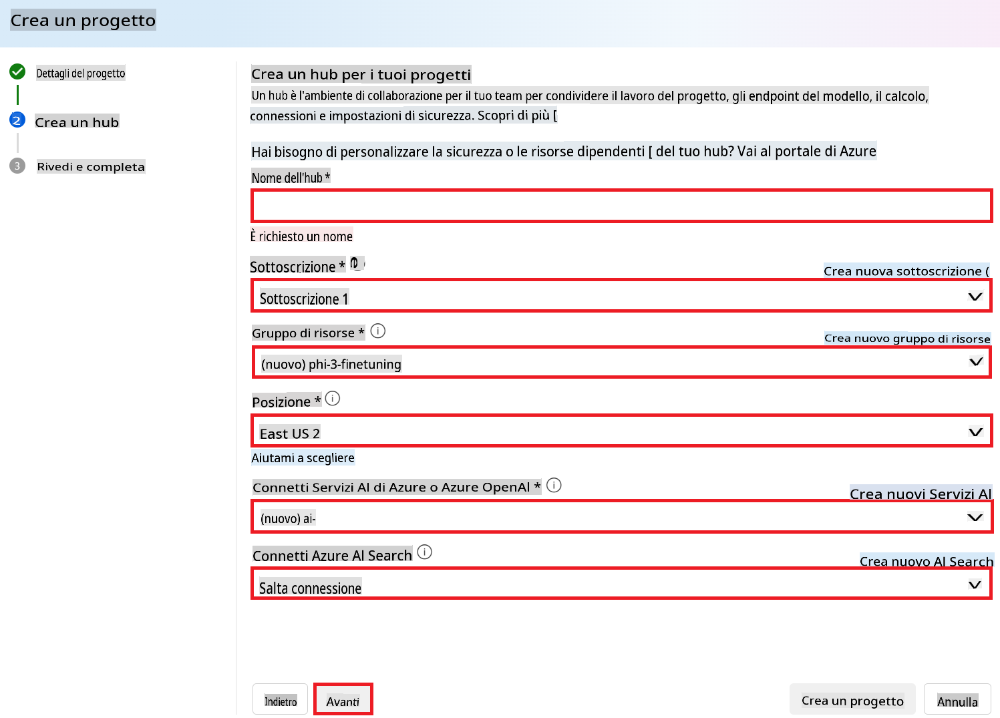

1. Seleziona **Avanti**.
1. Seleziona **Crea un progetto**.

### Preparazione dei dati

Prima dell'ottimizzazione, raccogli o crea un dataset rilevante per il tuo compito, come istruzioni per chat, coppie domanda-risposta o qualsiasi altro testo pertinente. Pulisci e pre-elabora questi dati rimuovendo rumore, gestendo valori mancanti e tokenizzando il testo.

### Ottimizzazione dei modelli Phi-3 in Azure AI Foundry

> [!NOTE]
> L'ottimizzazione dei modelli Phi-3 è attualmente supportata nei progetti situati in East US 2.

1. Seleziona **Catalogo modelli** dalla barra laterale sinistra.

1. Digita *phi-3* nella **barra di ricerca** e seleziona il modello phi-3 che desideri utilizzare.

    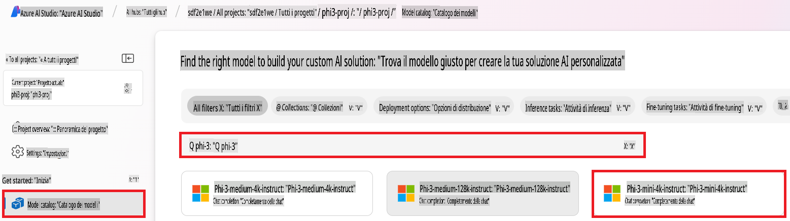

1. Seleziona **Ottimizza**.

    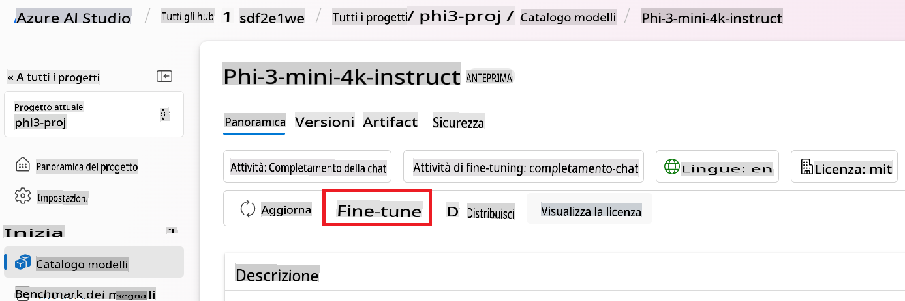

1. Inserisci il **Nome del modello ottimizzato**.

    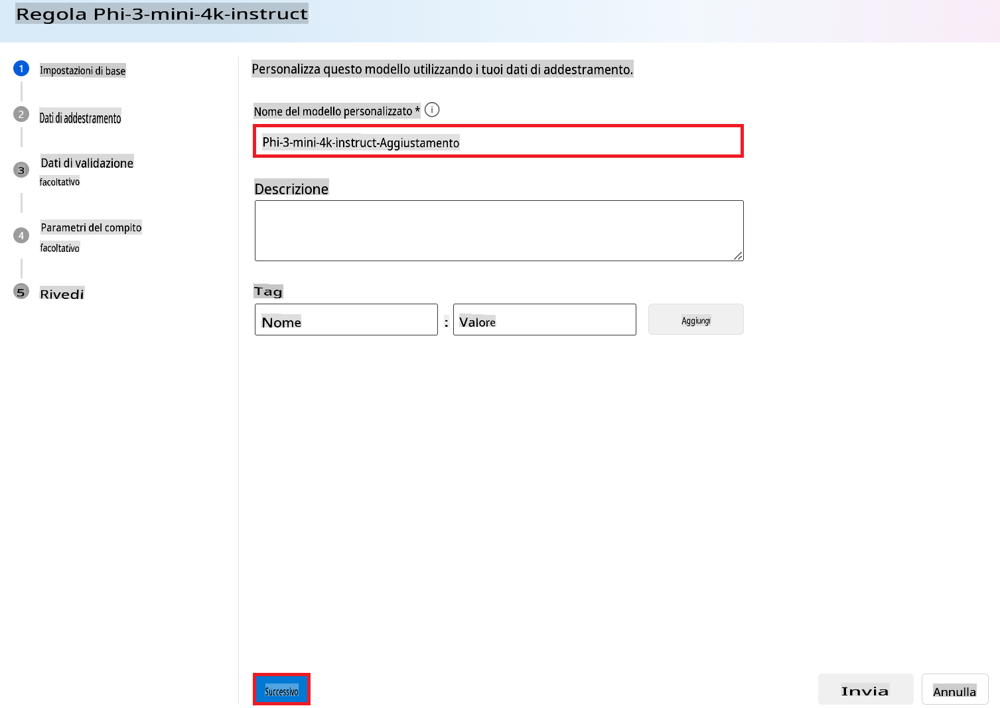

1. Seleziona **Avanti**.

1. Esegui le seguenti operazioni:

    - Seleziona il **Tipo di compito** su **Chat completion**.
    - Seleziona i **Dati di addestramento** che desideri utilizzare. Puoi caricarli tramite i dati di Azure AI Foundry o dal tuo ambiente locale.

    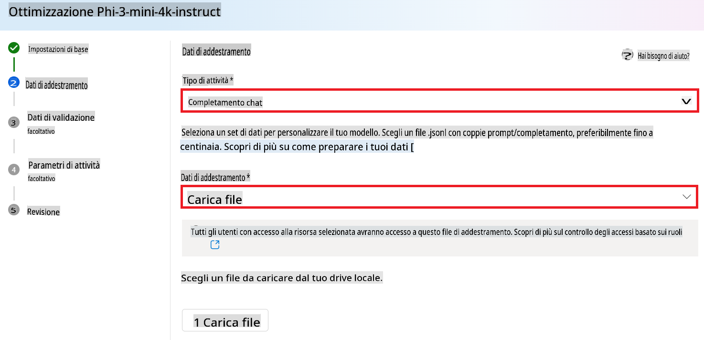

1. Seleziona **Avanti**.

1. Carica i **Dati di validazione** che desideri utilizzare oppure seleziona **Divisione automatica dei dati di addestramento**.

    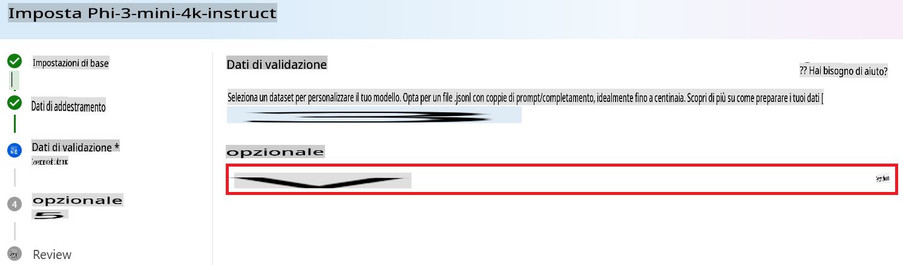

1. Seleziona **Avanti**.

1. Esegui le seguenti operazioni:

    - Seleziona il **Moltiplicatore della dimensione del batch** che desideri utilizzare.
    - Seleziona il **Tasso di apprendimento** che desideri utilizzare.
    - Seleziona il numero di **Epoche** che desideri utilizzare.

    

1. Seleziona **Invia** per avviare il processo di ottimizzazione.

    

1. Una volta che il tuo modello è ottimizzato, lo stato verrà mostrato come **Completato**, come illustrato nell'immagine sottostante. Ora puoi distribuire il modello e utilizzarlo nella tua applicazione, nel playground o in prompt flow. Per maggiori informazioni, consulta [Come distribuire i modelli della famiglia Phi-3 con Azure AI Foundry](https://learn.microsoft.com/azure/ai-studio/how-to/deploy-models-phi-3?tabs=phi-3-5&pivots=programming-language-python).

    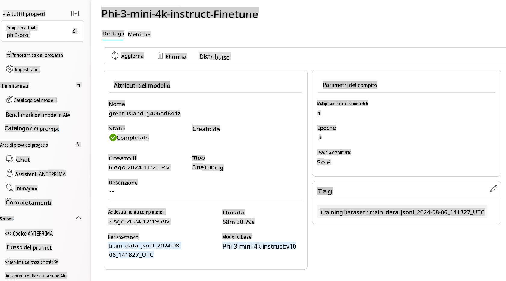

> [!NOTE]
> Per ulteriori informazioni sull'ottimizzazione di Phi-3, visita [Ottimizza i modelli Phi-3 in Azure AI Foundry](https://learn.microsoft.com/azure/ai-studio/how-to/fine-tune-phi-3?tabs=phi-3-mini).

## Pulizia dei modelli ottimizzati

Puoi eliminare un modello ottimizzato dall'elenco dei modelli di ottimizzazione in [Azure AI Foundry](https://ai.azure.com) o dalla pagina dei dettagli del modello. Seleziona il modello ottimizzato da eliminare dalla pagina di ottimizzazione, quindi seleziona il pulsante Elimina per rimuoverlo.

> [!NOTE]
> Non puoi eliminare un modello personalizzato se è già stato distribuito. Devi prima eliminare la distribuzione del modello prima di poter eliminare il modello personalizzato.

## Costi e quote

### Considerazioni su costi e quote per i modelli Phi-3 ottimizzati come servizio

I modelli Phi ottimizzati come servizio sono offerti da Microsoft e integrati con Azure AI Foundry per l'uso. Puoi trovare i prezzi quando [distribuisci](https://learn.microsoft.com/azure/ai-studio/how-to/deploy-models-phi-3?tabs=phi-3-5&pivots=programming-language-python) o ottimizzi i modelli nella scheda Prezzi e termini nella procedura guidata di distribuzione.

## Filtro dei contenuti

I modelli distribuiti come servizio con pagamento a consumo sono protetti da Azure AI Content Safety. Quando distribuiti su endpoint in tempo reale, puoi scegliere di disattivare questa funzionalità. Con Azure AI Content Safety attivato, sia il prompt che la risposta passano attraverso un insieme di modelli di classificazione progettati per rilevare e prevenire l'output di contenuti dannosi. Il sistema di filtro dei contenuti rileva e agisce su specifiche categorie di contenuti potenzialmente dannosi sia nei prompt di input che nelle risposte generate. Scopri di più su [Azure AI Content Safety](https://learn.microsoft.com/azure/ai-studio/concepts/content-filtering).

**Configurazione dell'Ottimizzazione**

Iperparametri: Definisci iperparametri come il tasso di apprendimento, la dimensione del batch e il numero di epoche di addestramento.

**Funzione di perdita**

Scegli una funzione di perdita appropriata per il tuo compito (ad esempio, cross-entropy).

**Ottimizzatore**

Seleziona un ottimizzatore (ad esempio, Adam) per gli aggiornamenti dei gradienti durante l'addestramento.

**Processo di Ottimizzazione**

- Carica il Modello Pre-addestrato: Carica il checkpoint di Phi-3 Mini.
- Aggiungi Livelli Personalizzati: Aggiungi livelli specifici per il compito (ad esempio, una testa di classificazione per istruzioni di chat).

**Addestra il Modello**
Ottimizza il modello utilizzando il tuo dataset preparato. Monitora i progressi dell'addestramento e regola gli iperparametri secondo necessità.

**Valutazione e Validazione**

Set di Validazione: Dividi i tuoi dati in set di addestramento e validazione.

**Valuta le Prestazioni**

Utilizza metriche come accuratezza, F1-score o perplessità per valutare le prestazioni del modello.

## Salva il Modello Ottimizzato

**Checkpoint**
Salva il checkpoint del modello ottimizzato per un utilizzo futuro.

## Distribuzione

- Distribuisci come Servizio Web: Distribuisci il tuo modello ottimizzato come servizio web in Azure AI Foundry.
- Testa l'Endpoint: Invia query di test all'endpoint distribuito per verificarne la funzionalità.

## Itera e Migliora

Itera: Se le prestazioni non sono soddisfacenti, itera regolando gli iperparametri, aggiungendo più dati o ottimizzando per ulteriori epoche.

## Monitora e Affina

Monitora continuamente il comportamento del modello e affinalo secondo necessità.

## Personalizza ed Estendi

Compiti Personalizzati: Phi-3 Mini può essere ottimizzato per vari compiti oltre alle istruzioni di chat. Esplora altri casi d'uso!
Sperimenta: Prova diverse architetture, combinazioni di livelli e tecniche per migliorare le prestazioni.

> [!NOTE]
> L'ottimizzazione è un processo iterativo. Sperimenta, impara e adatta il tuo modello per ottenere i migliori risultati per il tuo compito specifico!

**Disclaimer (Avvertenza)**:  
Questo documento è stato tradotto utilizzando servizi di traduzione automatica basati sull'intelligenza artificiale. Sebbene ci impegniamo per garantire l'accuratezza, si prega di notare che le traduzioni automatiche possono contenere errori o imprecisioni. Il documento originale nella sua lingua nativa dovrebbe essere considerato la fonte autorevole. Per informazioni critiche, si consiglia una traduzione professionale effettuata da un traduttore umano. Non siamo responsabili per eventuali fraintendimenti o interpretazioni errate derivanti dall'uso di questa traduzione.