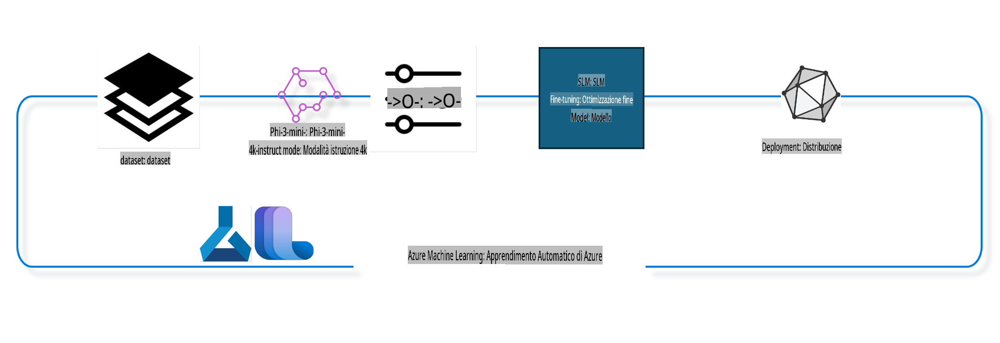

## Come utilizzare i componenti di chat-completion dal sistema di registro di Azure ML per il fine-tuning di un modello

In questo esempio, eseguiremo il fine-tuning del modello Phi-3-mini-4k-instruct per completare una conversazione tra due persone utilizzando il dataset ultrachat_200k.



L'esempio mostrerà come eseguire il fine-tuning utilizzando l'SDK di Azure ML e Python, per poi distribuire il modello ottimizzato in un endpoint online per inferenze in tempo reale.

### Dati di addestramento

Utilizzeremo il dataset ultrachat_200k. Si tratta di una versione fortemente filtrata del dataset UltraChat, utilizzata per addestrare Zephyr-7B-β, un modello di chat all'avanguardia con 7 miliardi di parametri.

### Modello

Utilizzeremo il modello Phi-3-mini-4k-instruct per mostrare come l'utente possa effettuare il fine-tuning di un modello per il task di chat-completion. Se hai aperto questo notebook da una specifica scheda modello, ricorda di sostituire il nome del modello specifico.

### Attività

- Scegliere un modello per il fine-tuning.
- Scegliere ed esplorare i dati di addestramento.
- Configurare il lavoro di fine-tuning.
- Eseguire il lavoro di fine-tuning.
- Rivedere le metriche di addestramento e valutazione.
- Registrare il modello ottimizzato.
- Distribuire il modello ottimizzato per inferenze in tempo reale.
- Pulire le risorse.

## 1. Configurare i prerequisiti

- Installare le dipendenze.
- Connettersi a un AzureML Workspace. Maggiori dettagli su come configurare l'autenticazione dell'SDK. Sostituire <WORKSPACE_NAME>, <RESOURCE_GROUP> e <SUBSCRIPTION_ID> qui sotto.
- Connettersi al registro di sistema di AzureML.
- Impostare un nome di esperimento opzionale.
- Verificare o creare un'istanza di calcolo.

> [!NOTE]
> I requisiti prevedono un singolo nodo GPU che può avere più schede GPU. Ad esempio, in un nodo Standard_NC24rs_v3 ci sono 4 GPU NVIDIA V100, mentre in uno Standard_NC12s_v3 ce ne sono 2. Fare riferimento alla documentazione per queste informazioni. Il numero di schede GPU per nodo è impostato nel parametro gpus_per_node qui sotto. Impostare correttamente questo valore garantirà l'utilizzo di tutte le GPU nel nodo. Gli SKU di calcolo GPU consigliati si trovano qui e qui.

### Librerie Python

Installare le dipendenze eseguendo la cella qui sotto. Questo passaggio non è opzionale se si lavora in un nuovo ambiente.

```bash
pip install azure-ai-ml
pip install azure-identity
pip install datasets==2.9.0
pip install mlflow
pip install azureml-mlflow
```

### Interagire con Azure ML

1. Questo script Python è utilizzato per interagire con il servizio Azure Machine Learning (Azure ML). Ecco una descrizione delle sue funzionalità:

    - Importa i moduli necessari da azure.ai.ml, azure.identity e azure.ai.ml.entities. Importa anche il modulo time.

    - Tenta di autenticarsi utilizzando DefaultAzureCredential(), che fornisce un'esperienza di autenticazione semplificata per iniziare rapidamente a sviluppare applicazioni nel cloud Azure. Se fallisce, passa a InteractiveBrowserCredential(), che fornisce un prompt di login interattivo.

    - Tenta quindi di creare un'istanza di MLClient utilizzando il metodo from_config, che legge la configurazione dal file di configurazione predefinito (config.json). Se fallisce, crea un'istanza di MLClient fornendo manualmente subscription_id, resource_group_name e workspace_name.

    - Crea un'altra istanza di MLClient, questa volta per il registro di Azure ML chiamato "azureml". Questo registro è dove sono archiviati modelli, pipeline di fine-tuning e ambienti.

    - Imposta experiment_name su "chat_completion_Phi-3-mini-4k-instruct".

    - Genera un timestamp univoco convertendo il tempo corrente (in secondi dall'epoca, come numero in virgola mobile) in un intero e poi in una stringa. Questo timestamp può essere utilizzato per creare nomi e versioni univoci.

    ```python
    # Import necessary modules from Azure ML and Azure Identity
    from azure.ai.ml import MLClient
    from azure.identity import (
        DefaultAzureCredential,
        InteractiveBrowserCredential,
    )
    from azure.ai.ml.entities import AmlCompute
    import time  # Import time module
    
    # Try to authenticate using DefaultAzureCredential
    try:
        credential = DefaultAzureCredential()
        credential.get_token("https://management.azure.com/.default")
    except Exception as ex:  # If DefaultAzureCredential fails, use InteractiveBrowserCredential
        credential = InteractiveBrowserCredential()
    
    # Try to create an MLClient instance using the default config file
    try:
        workspace_ml_client = MLClient.from_config(credential=credential)
    except:  # If that fails, create an MLClient instance by manually providing the details
        workspace_ml_client = MLClient(
            credential,
            subscription_id="<SUBSCRIPTION_ID>",
            resource_group_name="<RESOURCE_GROUP>",
            workspace_name="<WORKSPACE_NAME>",
        )
    
    # Create another MLClient instance for the Azure ML registry named "azureml"
    # This registry is where models, fine-tuning pipelines, and environments are stored
    registry_ml_client = MLClient(credential, registry_name="azureml")
    
    # Set the experiment name
    experiment_name = "chat_completion_Phi-3-mini-4k-instruct"
    
    # Generate a unique timestamp that can be used for names and versions that need to be unique
    timestamp = str(int(time.time()))
    ```

## 2. Scegliere un modello di base per il fine-tuning

1. Phi-3-mini-4k-instruct è un modello open-source leggero con 3,8 miliardi di parametri, costruito su dataset utilizzati per Phi-2. Il modello appartiene alla famiglia Phi-3, e la versione Mini è disponibile in due varianti: 4K e 128K, che rappresentano la lunghezza del contesto (in token) supportata. È necessario effettuare il fine-tuning del modello per il nostro scopo specifico. Puoi esplorare questi modelli nel catalogo dei modelli in AzureML Studio, filtrando per il task di chat-completion. In questo esempio, utilizziamo il modello Phi-3-mini-4k-instruct. Se hai aperto questo notebook per un modello diverso, sostituisci il nome e la versione del modello di conseguenza.

    > [!NOTE]
    > la proprietà id del modello. Questa sarà passata come input al lavoro di fine-tuning. È disponibile anche come campo Asset ID nella pagina dei dettagli del modello nel catalogo dei modelli di AzureML Studio.

2. Questo script Python interagisce con il servizio Azure Machine Learning (Azure ML). Ecco una descrizione delle sue funzionalità:

    - Imposta model_name su "Phi-3-mini-4k-instruct".

    - Utilizza il metodo get della proprietà models dell'oggetto registry_ml_client per recuperare l'ultima versione del modello con il nome specificato dal registro di Azure ML. Il metodo get viene chiamato con due argomenti: il nome del modello e un'etichetta che specifica che deve essere recuperata l'ultima versione.

    - Stampa un messaggio sulla console indicando il nome, la versione e l'id del modello che verrà utilizzato per il fine-tuning. Il metodo format della stringa viene utilizzato per inserire il nome, la versione e l'id del modello nel messaggio. Questi valori sono accessibili come proprietà dell'oggetto foundation_model.

    ```python
    # Set the model name
    model_name = "Phi-3-mini-4k-instruct"
    
    # Get the latest version of the model from the Azure ML registry
    foundation_model = registry_ml_client.models.get(model_name, label="latest")
    
    # Print the model name, version, and id
    # This information is useful for tracking and debugging
    print(
        "\n\nUsing model name: {0}, version: {1}, id: {2} for fine tuning".format(
            foundation_model.name, foundation_model.version, foundation_model.id
        )
    )
    ```

## 3. Creare un'istanza di calcolo da utilizzare con il lavoro

Il lavoro di fine-tuning funziona SOLO con calcolo GPU. La dimensione del calcolo dipende dalla grandezza del modello e, nella maggior parte dei casi, identificare il calcolo giusto può essere complicato. In questa cella, guidiamo l'utente nella selezione del calcolo appropriato.

> [!NOTE]
> I calcoli elencati di seguito funzionano con la configurazione più ottimizzata. Qualsiasi modifica alla configurazione potrebbe portare a errori di memoria insufficiente di CUDA. In questi casi, prova ad aggiornare il calcolo a una dimensione maggiore.

> [!NOTE]
> Quando selezioni compute_cluster_size qui sotto, assicurati che il calcolo sia disponibile nel tuo gruppo di risorse. Se un determinato calcolo non è disponibile, puoi fare richiesta per ottenere accesso alle risorse di calcolo.

### Verifica del supporto al fine-tuning del modello

1. Questo script Python interagisce con un modello di Azure Machine Learning (Azure ML). Ecco una descrizione delle sue funzionalità:

    - Importa il modulo ast, che fornisce funzioni per elaborare alberi della grammatica di sintassi astratta di Python.

    - Verifica se l'oggetto foundation_model (che rappresenta un modello in Azure ML) ha un tag chiamato finetune_compute_allow_list. I tag in Azure ML sono coppie chiave-valore che puoi creare e utilizzare per filtrare e ordinare i modelli.

    - Se il tag finetune_compute_allow_list è presente, utilizza la funzione ast.literal_eval per analizzare in modo sicuro il valore del tag (una stringa) in una lista Python. Questa lista viene quindi assegnata alla variabile computes_allow_list. Successivamente, stampa un messaggio che indica che un'istanza di calcolo deve essere creata dalla lista.

    - Se il tag finetune_compute_allow_list non è presente, imposta computes_allow_list su None e stampa un messaggio che indica che il tag finetune_compute_allow_list non fa parte dei tag del modello.

    - In sintesi, questo script verifica un tag specifico nei metadati del modello, converte il valore del tag in una lista se esiste e fornisce un feedback all'utente di conseguenza.

    ```python
    # Import the ast module, which provides functions to process trees of the Python abstract syntax grammar
    import ast
    
    # Check if the 'finetune_compute_allow_list' tag is present in the model's tags
    if "finetune_compute_allow_list" in foundation_model.tags:
        # If the tag is present, use ast.literal_eval to safely parse the tag's value (a string) into a Python list
        computes_allow_list = ast.literal_eval(
            foundation_model.tags["finetune_compute_allow_list"]
        )  # convert string to python list
        # Print a message indicating that a compute should be created from the list
        print(f"Please create a compute from the above list - {computes_allow_list}")
    else:
        # If the tag is not present, set computes_allow_list to None
        computes_allow_list = None
        # Print a message indicating that the 'finetune_compute_allow_list' tag is not part of the model's tags
        print("`finetune_compute_allow_list` is not part of model tags")
    ```

### Verifica dell'istanza di calcolo

1. Questo script Python interagisce con il servizio Azure Machine Learning (Azure ML) e svolge diverse verifiche su un'istanza di calcolo. Ecco una descrizione delle sue funzionalità:

    - Tenta di recuperare l'istanza di calcolo con il nome memorizzato in compute_cluster dal workspace di Azure ML. Se lo stato di provisioning dell'istanza di calcolo è "failed", solleva un ValueError.

    - Verifica se computes_allow_list non è None. Se non lo è, converte tutte le dimensioni di calcolo nella lista in minuscolo e verifica se la dimensione dell'istanza di calcolo corrente è nella lista. Se non lo è, solleva un ValueError.

    - Se computes_allow_list è None, verifica se la dimensione dell'istanza di calcolo è in una lista di dimensioni GPU non supportate. Se lo è, solleva un ValueError.

    - Recupera una lista di tutte le dimensioni di calcolo disponibili nel workspace. Quindi itera su questa lista e, per ogni dimensione di calcolo, verifica se il suo nome corrisponde alla dimensione dell'istanza di calcolo corrente. Se corrisponde, recupera il numero di GPU per quella dimensione di calcolo e imposta gpu_count_found su True.

    - Se gpu_count_found è True, stampa il numero di GPU nell'istanza di calcolo. Se gpu_count_found è False, solleva un ValueError.

    - In sintesi, questo script esegue diverse verifiche su un'istanza di calcolo in un workspace di Azure ML, tra cui il controllo dello stato di provisioning, della dimensione rispetto a una lista di permessi o divieti e del numero di GPU disponibili.

    ```python
    # Print the exception message
    print(e)
    # Raise a ValueError if the compute size is not available in the workspace
    raise ValueError(
        f"WARNING! Compute size {compute_cluster_size} not available in workspace"
    )
    
    # Retrieve the compute instance from the Azure ML workspace
    compute = workspace_ml_client.compute.get(compute_cluster)
    # Check if the provisioning state of the compute instance is "failed"
    if compute.provisioning_state.lower() == "failed":
        # Raise a ValueError if the provisioning state is "failed"
        raise ValueError(
            f"Provisioning failed, Compute '{compute_cluster}' is in failed state. "
            f"please try creating a different compute"
        )
    
    # Check if computes_allow_list is not None
    if computes_allow_list is not None:
        # Convert all compute sizes in computes_allow_list to lowercase
        computes_allow_list_lower_case = [x.lower() for x in computes_allow_list]
        # Check if the size of the compute instance is in computes_allow_list_lower_case
        if compute.size.lower() not in computes_allow_list_lower_case:
            # Raise a ValueError if the size of the compute instance is not in computes_allow_list_lower_case
            raise ValueError(
                f"VM size {compute.size} is not in the allow-listed computes for finetuning"
            )
    else:
        # Define a list of unsupported GPU VM sizes
        unsupported_gpu_vm_list = [
            "standard_nc6",
            "standard_nc12",
            "standard_nc24",
            "standard_nc24r",
        ]
        # Check if the size of the compute instance is in unsupported_gpu_vm_list
        if compute.size.lower() in unsupported_gpu_vm_list:
            # Raise a ValueError if the size of the compute instance is in unsupported_gpu_vm_list
            raise ValueError(
                f"VM size {compute.size} is currently not supported for finetuning"
            )
    
    # Initialize a flag to check if the number of GPUs in the compute instance has been found
    gpu_count_found = False
    # Retrieve a list of all available compute sizes in the workspace
    workspace_compute_sku_list = workspace_ml_client.compute.list_sizes()
    available_sku_sizes = []
    # Iterate over the list of available compute sizes
    for compute_sku in workspace_compute_sku_list:
        available_sku_sizes.append(compute_sku.name)
        # Check if the name of the compute size matches the size of the compute instance
        if compute_sku.name.lower() == compute.size.lower():
            # If it does, retrieve the number of GPUs for that compute size and set gpu_count_found to True
            gpus_per_node = compute_sku.gpus
            gpu_count_found = True
    # If gpu_count_found is True, print the number of GPUs in the compute instance
    if gpu_count_found:
        print(f"Number of GPU's in compute {compute.size}: {gpus_per_node}")
    else:
        # If gpu_count_found is False, raise a ValueError
        raise ValueError(
            f"Number of GPU's in compute {compute.size} not found. Available skus are: {available_sku_sizes}."
            f"This should not happen. Please check the selected compute cluster: {compute_cluster} and try again."
        )
    ```

## 4. Scegliere il dataset per il fine-tuning del modello

1. Utilizziamo il dataset ultrachat_200k. Il dataset è suddiviso in quattro parti, adatte per il fine-tuning supervisionato (sft) e il ranking della generazione (gen). Il numero di esempi per ogni parte è mostrato di seguito:

    ```bash
    train_sft test_sft  train_gen  test_gen
    207865  23110  256032  28304
    ```

1. Le prossime celle mostrano una preparazione di base dei dati per il fine-tuning:

### Visualizzare alcune righe di dati

Vogliamo che questo esempio venga eseguito rapidamente, quindi salviamo i file train_sft e test_sft contenenti il 5% delle righe già ridotte. Questo significa che il modello ottimizzato avrà una precisione inferiore e non dovrebbe essere utilizzato in scenari reali.  
Lo script download-dataset.py viene utilizzato per scaricare il dataset ultrachat_200k e trasformarlo in un formato consumabile dalla pipeline di fine-tuning. Inoltre, poiché il dataset è grande, qui utilizziamo solo una parte del dataset.

1. Eseguire lo script qui sotto scarica solo il 5% dei dati. Questo valore può essere aumentato modificando il parametro dataset_split_pc alla percentuale desiderata.

    > [!NOTE]
    > Alcuni modelli linguistici hanno codici linguistici diversi, quindi i nomi delle colonne nel dataset dovrebbero riflettere questa differenza.

1. Ecco un esempio di come dovrebbero apparire i dati:  
Il dataset di chat-completion è memorizzato in formato parquet, con ogni voce che segue lo schema seguente:

    - Si tratta di un documento JSON (JavaScript Object Notation), un formato popolare per lo scambio di dati. Non è codice eseguibile, ma un modo per memorizzare e trasportare dati. Ecco una descrizione della sua struttura:

    - "prompt": Questa chiave contiene una stringa che rappresenta un compito o una domanda posta a un assistente AI.

    - "messages": Questa chiave contiene un array di oggetti. Ogni oggetto rappresenta un messaggio in una conversazione tra un utente e un assistente AI. Ogni oggetto messaggio ha due chiavi:
        - "content": Questa chiave contiene una stringa che rappresenta il contenuto del messaggio.
        - "role": Questa chiave contiene una stringa che rappresenta il ruolo dell'entità che ha inviato il messaggio. Può essere "user" o "assistant".

    - "prompt_id": Questa chiave contiene una stringa che rappresenta un identificatore univoco per il prompt.

1. In questo specifico documento JSON, è rappresentata una conversazione in cui un utente chiede a un assistente AI di creare un protagonista per una storia distopica. L'assistente risponde, e l'utente poi chiede ulteriori dettagli. L'assistente accetta di fornire ulteriori dettagli. L'intera conversazione è associata a un ID prompt specifico.

    ```python
    {
        // The task or question posed to an AI assistant
        "prompt": "Create a fully-developed protagonist who is challenged to survive within a dystopian society under the rule of a tyrant. ...",
        
        // An array of objects, each representing a message in a conversation between a user and an AI assistant
        "messages":[
            {
                // The content of the user's message
                "content": "Create a fully-developed protagonist who is challenged to survive within a dystopian society under the rule of a tyrant. ...",
                // The role of the entity that sent the message
                "role": "user"
            },
            {
                // The content of the assistant's message
                "content": "Name: Ava\n\n Ava was just 16 years old when the world as she knew it came crashing down. The government had collapsed, leaving behind a chaotic and lawless society. ...",
                // The role of the entity that sent the message
                "role": "assistant"
            },
            {
                // The content of the user's message
                "content": "Wow, Ava's story is so intense and inspiring! Can you provide me with more details.  ...",
                // The role of the entity that sent the message
                "role": "user"
            }, 
            {
                // The content of the assistant's message
                "content": "Certainly! ....",
                // The role of the entity that sent the message
                "role": "assistant"
            }
        ],
        
        // A unique identifier for the prompt
        "prompt_id": "d938b65dfe31f05f80eb8572964c6673eddbd68eff3db6bd234d7f1e3b86c2af"
    }
    ```

### Scaricare i dati

1. Questo script Python viene utilizzato per scaricare un dataset utilizzando uno script helper chiamato download-dataset.py. Ecco una descrizione delle sue funzionalità:

    - Importa il modulo os, che fornisce un modo portabile per utilizzare funzionalità dipendenti dal sistema operativo.

    - Utilizza la funzione os.system per eseguire lo script download-dataset.py nella shell con argomenti specifici da riga di comando. Gli argomenti specificano il dataset da scaricare (HuggingFaceH4/ultrachat_200k), la directory in cui scaricarlo (ultrachat_200k_dataset) e la percentuale del dataset da suddividere (5). La funzione os.system restituisce lo stato di uscita del comando eseguito; questo stato è memorizzato nella variabile exit_status.

    - Verifica se exit_status è diverso da 0. Nei sistemi operativi simili a Unix, uno stato di uscita pari a 0 indica generalmente che un comando è riuscito, mentre qualsiasi altro numero indica un errore. Se exit_status è diverso da 0, solleva un'eccezione con un messaggio che indica che c'è stato un errore nel download del dataset.

    - In sintesi, questo script esegue un comando per scaricare un dataset utilizzando uno script helper e solleva un'eccezione se il comando fallisce.

    ```python
    # Import the os module, which provides a way of using operating system dependent functionality
    import os
    
    # Use the os.system function to run the download-dataset.py script in the shell with specific command-line arguments
    # The arguments specify the dataset to download (HuggingFaceH4/ultrachat_200k), the directory to download it to (ultrachat_200k_dataset), and the percentage of the dataset to split (5)
    # The os.system function returns the exit status of the command it executed; this status is stored in the exit_status variable
    exit_status = os.system(
        "python ./download-dataset.py --dataset HuggingFaceH4/ultrachat_200k --download_dir ultrachat_200k_dataset --dataset_split_pc 5"
    )
    
    # Check if exit_status is not 0
    # In Unix-like operating systems, an exit status of 0 usually indicates that a command has succeeded, while any other number indicates an error
    # If exit_status is not 0, raise an Exception with a message indicating that there was an error downloading the dataset
    if exit_status != 0:
        raise Exception("Error downloading dataset")
    ```

### Caricamento dei dati in un DataFrame

1. Questo script Python carica un file JSON Lines in un DataFrame pandas e visualizza le prime 5 righe. Ecco una descrizione delle sue funzionalità:

    - Importa la libreria pandas, che è una potente libreria per la manipolazione e l'analisi dei dati.

    - Imposta la larghezza massima delle colonne per le opzioni di visualizzazione di pandas su 0. Ciò significa che il testo completo di ogni colonna sarà visualizzato senza troncamenti quando il DataFrame viene stampato.

    - Utilizza la funzione pd.read_json per caricare il file train_sft.jsonl dalla directory ultrachat_200k_dataset in un DataFrame. L'argomento lines=True indica che il file è in formato JSON Lines, dove ogni riga è un oggetto JSON separato.

    - Utilizza il metodo head per visualizzare le prime 5 righe del DataFrame. Se il DataFrame ha meno di 5 righe, verranno visualizzate tutte.

    - In sintesi, questo script carica un file JSON Lines in un DataFrame e visualizza le prime 5 righe con il testo completo delle colonne.

    ```python
    # Import the pandas library, which is a powerful data manipulation and analysis library
    import pandas as pd
    
    # Set the maximum column width for pandas' display options to 0
    # This means that the full text of each column will be displayed without truncation when the DataFrame is printed
    pd.set_option("display.max_colwidth", 0)
    
    # Use the pd.read_json function to load the train_sft.jsonl file from the ultrachat_200k_dataset directory into a DataFrame
    # The lines=True argument indicates that the file is in JSON Lines format, where each line is a separate JSON object
    df = pd.read_json("./ultrachat_200k_dataset/train_sft.jsonl", lines=True)
    
    # Use the head method to display the first 5 rows of the DataFrame
    # If the DataFrame has less than 5 rows, it will display all of them
    df.head()
    ```

## 5. Inviare il lavoro di fine-tuning utilizzando modello e dati come input

Creare il lavoro che utilizza il componente della pipeline di chat-completion. Maggiori dettagli sui parametri supportati per il fine-tuning.

### Definire i parametri di fine-tuning

1. I parametri di fine-tuning possono essere raggruppati in due categorie: parametri di addestramento e parametri di ottimizzazione.

1. I parametri di addestramento definiscono gli aspetti dell'addestramento, come:

    - L'ottimizzatore e il programmatore da utilizzare.
    - La metrica da ottimizzare durante il fine-tuning.
    - Il numero di step di addestramento, la dimensione del batch, ecc.

1. I parametri di ottimizzazione aiutano a ottimizzare la memoria GPU e a utilizzare efficacemente le risorse di calcolo.

    - Abilitare DeepSpeed e LoRA.
    - Abilitare l'addestramento a precisione mista.
    - Abilitare l'addestramento multi-nodo.

> [!NOTE]
> Il fine-tuning supervisionato può causare perdita di allineamento o "catastrofic forgetting". Si consiglia di verificare questo problema ed eseguire una fase di riallineamento dopo il fine-tuning.

### Parametri di Fine-Tuning

1. Questo script Python imposta i parametri per il fine-tuning di un modello di machine learning. Ecco una descrizione delle sue funzionalità:

    - Imposta i parametri di addestramento predefiniti, come il numero di epoche di addestramento, le dimensioni dei batch per l'addestramento e la valutazione, il learning rate e il tipo di scheduler del learning rate.

    - Imposta i parametri di ottimizzazione predefiniti, come se applicare Layer-wise Relevance Propagation (LoRa) e DeepSpeed, e lo stage di DeepSpeed.

    - Combina i parametri di addestramento e ottimizzazione in un unico dizionario chiamato finetune_parameters.

    - Verifica se il foundation_model ha parametri predefiniti specifici del modello. Se sì, stampa un messaggio di avviso e aggiorna il dizionario finetune_parameters con questi valori predefiniti specifici del modello. La funzione ast.literal_eval viene utilizzata per convertire i valori predefiniti specifici del modello da una stringa a
pipeline di addestramento basata su vari parametri, e successivamente stampa questo nome visualizzato. ```python
    # Define a function to generate a display name for the training pipeline
    def get_pipeline_display_name():
        # Calculate the total batch size by multiplying the per-device batch size, the number of gradient accumulation steps, the number of GPUs per node, and the number of nodes used for fine-tuning
        batch_size = (
            int(finetune_parameters.get("per_device_train_batch_size", 1))
            * int(finetune_parameters.get("gradient_accumulation_steps", 1))
            * int(gpus_per_node)
            * int(finetune_parameters.get("num_nodes_finetune", 1))
        )
        # Retrieve the learning rate scheduler type
        scheduler = finetune_parameters.get("lr_scheduler_type", "linear")
        # Retrieve whether DeepSpeed is applied
        deepspeed = finetune_parameters.get("apply_deepspeed", "false")
        # Retrieve the DeepSpeed stage
        ds_stage = finetune_parameters.get("deepspeed_stage", "2")
        # If DeepSpeed is applied, include "ds" followed by the DeepSpeed stage in the display name; if not, include "nods"
        if deepspeed == "true":
            ds_string = f"ds{ds_stage}"
        else:
            ds_string = "nods"
        # Retrieve whether Layer-wise Relevance Propagation (LoRa) is applied
        lora = finetune_parameters.get("apply_lora", "false")
        # If LoRa is applied, include "lora" in the display name; if not, include "nolora"
        if lora == "true":
            lora_string = "lora"
        else:
            lora_string = "nolora"
        # Retrieve the limit on the number of model checkpoints to keep
        save_limit = finetune_parameters.get("save_total_limit", -1)
        # Retrieve the maximum sequence length
        seq_len = finetune_parameters.get("max_seq_length", -1)
        # Construct the display name by concatenating all these parameters, separated by hyphens
        return (
            model_name
            + "-"
            + "ultrachat"
            + "-"
            + f"bs{batch_size}"
            + "-"
            + f"{scheduler}"
            + "-"
            + ds_string
            + "-"
            + lora_string
            + f"-save_limit{save_limit}"
            + f"-seqlen{seq_len}"
        )
    
    # Call the function to generate the display name
    pipeline_display_name = get_pipeline_display_name()
    # Print the display name
    print(f"Display name used for the run: {pipeline_display_name}")
    ```

### Configurazione del Pipeline

Questo script Python definisce e configura un pipeline di machine learning utilizzando l'SDK di Azure Machine Learning. Ecco una panoramica di cosa fa:

1. Importa i moduli necessari dall'SDK Azure AI ML.
2. Recupera un componente del pipeline chiamato "chat_completion_pipeline" dal registro.
3. Definisce un job di pipeline utilizzando `@pipeline` decorator and the function `create_pipeline`. The name of the pipeline is set to `pipeline_display_name`.

1. Inside the `create_pipeline` function, it initializes the fetched pipeline component with various parameters, including the model path, compute clusters for different stages, dataset splits for training and testing, the number of GPUs to use for fine-tuning, and other fine-tuning parameters.

1. It maps the output of the fine-tuning job to the output of the pipeline job. This is done so that the fine-tuned model can be easily registered, which is required to deploy the model to an online or batch endpoint.

1. It creates an instance of the pipeline by calling the `create_pipeline` function.

1. It sets the `force_rerun` setting of the pipeline to `True`, meaning that cached results from previous jobs will not be used.

1. It sets the `continue_on_step_failure` setting of the pipeline to `False`, il che significa che il pipeline si fermerà se uno dei passaggi fallisce.
4. In sintesi, questo script definisce e configura un pipeline di machine learning per un task di completamento di chat utilizzando l'SDK di Azure Machine Learning.

```python
    # Import necessary modules from the Azure AI ML SDK
    from azure.ai.ml.dsl import pipeline
    from azure.ai.ml import Input
    
    # Fetch the pipeline component named "chat_completion_pipeline" from the registry
    pipeline_component_func = registry_ml_client.components.get(
        name="chat_completion_pipeline", label="latest"
    )
    
    # Define the pipeline job using the @pipeline decorator and the function create_pipeline
    # The name of the pipeline is set to pipeline_display_name
    @pipeline(name=pipeline_display_name)
    def create_pipeline():
        # Initialize the fetched pipeline component with various parameters
        # These include the model path, compute clusters for different stages, dataset splits for training and testing, the number of GPUs to use for fine-tuning, and other fine-tuning parameters
        chat_completion_pipeline = pipeline_component_func(
            mlflow_model_path=foundation_model.id,
            compute_model_import=compute_cluster,
            compute_preprocess=compute_cluster,
            compute_finetune=compute_cluster,
            compute_model_evaluation=compute_cluster,
            # Map the dataset splits to parameters
            train_file_path=Input(
                type="uri_file", path="./ultrachat_200k_dataset/train_sft.jsonl"
            ),
            test_file_path=Input(
                type="uri_file", path="./ultrachat_200k_dataset/test_sft.jsonl"
            ),
            # Training settings
            number_of_gpu_to_use_finetuning=gpus_per_node,  # Set to the number of GPUs available in the compute
            **finetune_parameters
        )
        return {
            # Map the output of the fine tuning job to the output of pipeline job
            # This is done so that we can easily register the fine tuned model
            # Registering the model is required to deploy the model to an online or batch endpoint
            "trained_model": chat_completion_pipeline.outputs.mlflow_model_folder
        }
    
    # Create an instance of the pipeline by calling the create_pipeline function
    pipeline_object = create_pipeline()
    
    # Don't use cached results from previous jobs
    pipeline_object.settings.force_rerun = True
    
    # Set continue on step failure to False
    # This means that the pipeline will stop if any step fails
    pipeline_object.settings.continue_on_step_failure = False
    ```

### Inviare il Job

1. Questo script Python invia un job di pipeline di machine learning a uno spazio di lavoro Azure Machine Learning e poi attende il completamento del job. Ecco una panoramica di cosa fa:

   - Utilizza il metodo create_or_update dell'oggetto jobs nel workspace_ml_client per inviare il job di pipeline. Il pipeline da eseguire è specificato da pipeline_object, e l'esperimento sotto cui il job viene eseguito è specificato da experiment_name.
   - Utilizza quindi il metodo stream dell'oggetto jobs nel workspace_ml_client per attendere il completamento del job di pipeline. Il job da attendere è specificato dall'attributo name dell'oggetto pipeline_job.
   - In sintesi, questo script invia un job di pipeline di machine learning a uno spazio di lavoro Azure Machine Learning e attende il completamento del job.

```python
    # Submit the pipeline job to the Azure Machine Learning workspace
    # The pipeline to be run is specified by pipeline_object
    # The experiment under which the job is run is specified by experiment_name
    pipeline_job = workspace_ml_client.jobs.create_or_update(
        pipeline_object, experiment_name=experiment_name
    )
    
    # Wait for the pipeline job to complete
    # The job to wait for is specified by the name attribute of the pipeline_job object
    workspace_ml_client.jobs.stream(pipeline_job.name)
    ```

## 6. Registrare il modello fine-tuned nello spazio di lavoro

Registreremo il modello dall'output del job di fine-tuning. Questo traccerà la linea di parentela tra il modello fine-tuned e il job di fine-tuning. Il job di fine-tuning, inoltre, traccia la parentela con il modello di base, i dati e il codice di addestramento.

### Registrazione del Modello di ML

1. Questo script Python registra un modello di machine learning addestrato in un pipeline di Azure Machine Learning. Ecco una panoramica di cosa fa:

   - Importa i moduli necessari dall'SDK Azure AI ML.
   - Controlla se l'output trained_model è disponibile dal job di pipeline chiamando il metodo get dell'oggetto jobs nel workspace_ml_client e accedendo al suo attributo outputs.
   - Costruisce un percorso al modello addestrato formattando una stringa con il nome del job di pipeline e il nome dell'output ("trained_model").
   - Definisce un nome per il modello fine-tuned aggiungendo "-ultrachat-200k" al nome del modello originale e sostituendo eventuali barre con trattini.
   - Prepara la registrazione del modello creando un oggetto Model con vari parametri, incluso il percorso al modello, il tipo di modello (modello MLflow), il nome e la versione del modello, e una descrizione del modello.
   - Registra il modello utilizzando il metodo create_or_update dell'oggetto models nel workspace_ml_client con l'oggetto Model come argomento.
   - Stampa il modello registrato.

   In sintesi, questo script registra un modello di machine learning addestrato in un pipeline di Azure Machine Learning.

```python
    # Import necessary modules from the Azure AI ML SDK
    from azure.ai.ml.entities import Model
    from azure.ai.ml.constants import AssetTypes
    
    # Check if the `trained_model` output is available from the pipeline job
    print("pipeline job outputs: ", workspace_ml_client.jobs.get(pipeline_job.name).outputs)
    
    # Construct a path to the trained model by formatting a string with the name of the pipeline job and the name of the output ("trained_model")
    model_path_from_job = "azureml://jobs/{0}/outputs/{1}".format(
        pipeline_job.name, "trained_model"
    )
    
    # Define a name for the fine-tuned model by appending "-ultrachat-200k" to the original model name and replacing any slashes with hyphens
    finetuned_model_name = model_name + "-ultrachat-200k"
    finetuned_model_name = finetuned_model_name.replace("/", "-")
    
    print("path to register model: ", model_path_from_job)
    
    # Prepare to register the model by creating a Model object with various parameters
    # These include the path to the model, the type of the model (MLflow model), the name and version of the model, and a description of the model
    prepare_to_register_model = Model(
        path=model_path_from_job,
        type=AssetTypes.MLFLOW_MODEL,
        name=finetuned_model_name,
        version=timestamp,  # Use timestamp as version to avoid version conflict
        description=model_name + " fine tuned model for ultrachat 200k chat-completion",
    )
    
    print("prepare to register model: \n", prepare_to_register_model)
    
    # Register the model by calling the create_or_update method of the models object in the workspace_ml_client with the Model object as the argument
    registered_model = workspace_ml_client.models.create_or_update(
        prepare_to_register_model
    )
    
    # Print the registered model
    print("registered model: \n", registered_model)
    ```

## 7. Distribuire il modello fine-tuned su un endpoint online

Gli endpoint online forniscono un'API REST durevole che può essere utilizzata per integrare il modello con applicazioni.

### Gestione dell'Endpoint

1. Questo script Python crea un endpoint online gestito in Azure Machine Learning per un modello registrato. Ecco una panoramica di cosa fa:

   - Importa i moduli necessari dall'SDK Azure AI ML.
   - Definisce un nome univoco per l'endpoint online aggiungendo un timestamp alla stringa "ultrachat-completion-".
   - Prepara la creazione dell'endpoint online creando un oggetto ManagedOnlineEndpoint con vari parametri, incluso il nome dell'endpoint, una descrizione dell'endpoint e la modalità di autenticazione ("key").
   - Crea l'endpoint online utilizzando il metodo begin_create_or_update del workspace_ml_client con l'oggetto ManagedOnlineEndpoint come argomento. Attende quindi che l'operazione di creazione sia completata chiamando il metodo wait.

   In sintesi, questo script crea un endpoint online gestito in Azure Machine Learning per un modello registrato.

```python
    # Import necessary modules from the Azure AI ML SDK
    from azure.ai.ml.entities import (
        ManagedOnlineEndpoint,
        ManagedOnlineDeployment,
        ProbeSettings,
        OnlineRequestSettings,
    )
    
    # Define a unique name for the online endpoint by appending a timestamp to the string "ultrachat-completion-"
    online_endpoint_name = "ultrachat-completion-" + timestamp
    
    # Prepare to create the online endpoint by creating a ManagedOnlineEndpoint object with various parameters
    # These include the name of the endpoint, a description of the endpoint, and the authentication mode ("key")
    endpoint = ManagedOnlineEndpoint(
        name=online_endpoint_name,
        description="Online endpoint for "
        + registered_model.name
        + ", fine tuned model for ultrachat-200k-chat-completion",
        auth_mode="key",
    )
    
    # Create the online endpoint by calling the begin_create_or_update method of the workspace_ml_client with the ManagedOnlineEndpoint object as the argument
    # Then wait for the creation operation to complete by calling the wait method
    workspace_ml_client.begin_create_or_update(endpoint).wait()
    ```

> [!NOTE]  
> Puoi trovare qui l'elenco delle SKU supportate per la distribuzione - [Managed online endpoints SKU list](https://learn.microsoft.com/azure/machine-learning/reference-managed-online-endpoints-vm-sku-list)

### Distribuzione del Modello di ML

1. Questo script Python distribuisce un modello di machine learning registrato su un endpoint online gestito in Azure Machine Learning. Ecco una panoramica di cosa fa:

   - Importa il modulo ast, che fornisce funzioni per elaborare alberi della grammatica astratta di Python.
   - Imposta il tipo di istanza per la distribuzione su "Standard_NC6s_v3".
   - Controlla se il tag inference_compute_allow_list è presente nel modello di base. Se presente, converte il valore del tag da stringa a lista Python e lo assegna a inference_computes_allow_list. Se non presente, lo imposta su None.
   - Controlla se il tipo di istanza specificato è nell'elenco consentito. Se non lo è, stampa un messaggio che invita l'utente a selezionare un tipo di istanza dall'elenco consentito.
   - Prepara la creazione della distribuzione creando un oggetto ManagedOnlineDeployment con vari parametri, incluso il nome della distribuzione, il nome dell'endpoint, l'ID del modello, il tipo e il numero di istanze, le impostazioni del liveness probe e le impostazioni della richiesta.
   - Crea la distribuzione utilizzando il metodo begin_create_or_update del workspace_ml_client con l'oggetto ManagedOnlineDeployment come argomento. Attende quindi che l'operazione di creazione sia completata chiamando il metodo wait.
   - Imposta il traffico dell'endpoint per indirizzare il 100% del traffico alla distribuzione "demo".
   - Aggiorna l'endpoint utilizzando il metodo begin_create_or_update del workspace_ml_client con l'oggetto endpoint come argomento. Attende quindi che l'operazione di aggiornamento sia completata chiamando il metodo result.

   In sintesi, questo script distribuisce un modello di machine learning registrato su un endpoint online gestito in Azure Machine Learning.

```python
    # Import the ast module, which provides functions to process trees of the Python abstract syntax grammar
    import ast
    
    # Set the instance type for the deployment
    instance_type = "Standard_NC6s_v3"
    
    # Check if the `inference_compute_allow_list` tag is present in the foundation model
    if "inference_compute_allow_list" in foundation_model.tags:
        # If it is, convert the tag value from a string to a Python list and assign it to `inference_computes_allow_list`
        inference_computes_allow_list = ast.literal_eval(
            foundation_model.tags["inference_compute_allow_list"]
        )
        print(f"Please create a compute from the above list - {computes_allow_list}")
    else:
        # If it's not, set `inference_computes_allow_list` to `None`
        inference_computes_allow_list = None
        print("`inference_compute_allow_list` is not part of model tags")
    
    # Check if the specified instance type is in the allow list
    if (
        inference_computes_allow_list is not None
        and instance_type not in inference_computes_allow_list
    ):
        print(
            f"`instance_type` is not in the allow listed compute. Please select a value from {inference_computes_allow_list}"
        )
    
    # Prepare to create the deployment by creating a `ManagedOnlineDeployment` object with various parameters
    demo_deployment = ManagedOnlineDeployment(
        name="demo",
        endpoint_name=online_endpoint_name,
        model=registered_model.id,
        instance_type=instance_type,
        instance_count=1,
        liveness_probe=ProbeSettings(initial_delay=600),
        request_settings=OnlineRequestSettings(request_timeout_ms=90000),
    )
    
    # Create the deployment by calling the `begin_create_or_update` method of the `workspace_ml_client` with the `ManagedOnlineDeployment` object as the argument
    # Then wait for the creation operation to complete by calling the `wait` method
    workspace_ml_client.online_deployments.begin_create_or_update(demo_deployment).wait()
    
    # Set the traffic of the endpoint to direct 100% of the traffic to the "demo" deployment
    endpoint.traffic = {"demo": 100}
    
    # Update the endpoint by calling the `begin_create_or_update` method of the `workspace_ml_client` with the `endpoint` object as the argument
    # Then wait for the update operation to complete by calling the `result` method
    workspace_ml_client.begin_create_or_update(endpoint).result()
    ```

## 8. Testare l'endpoint con dati di esempio

Recupereremo alcuni dati di esempio dal dataset di test e li invieremo all'endpoint online per l'inferenza. Mostreremo quindi le etichette previste accanto alle etichette di verità a terra.

### Lettura dei Risultati

1. Questo script Python legge un file JSON Lines in un DataFrame pandas, ne seleziona un campione casuale e reimposta l'indice. Ecco una panoramica di cosa fa:

   - Legge il file ./ultrachat_200k_dataset/test_gen.jsonl in un DataFrame pandas. La funzione read_json viene utilizzata con l'argomento lines=True perché il file è in formato JSON Lines, dove ogni riga è un oggetto JSON separato.
   - Seleziona un campione casuale di 1 riga dal DataFrame. La funzione sample è utilizzata con l'argomento n=1 per specificare il numero di righe casuali da selezionare.
   - Reimposta l'indice del DataFrame. La funzione reset_index è utilizzata con l'argomento drop=True per eliminare l'indice originale e sostituirlo con un nuovo indice di valori interi predefiniti.
   - Mostra le prime 2 righe del DataFrame utilizzando la funzione head con l'argomento 2. Tuttavia, poiché il DataFrame contiene solo una riga dopo il campionamento, verrà mostrata solo quella riga.

   In sintesi, questo script legge un file JSON Lines in un DataFrame pandas, seleziona un campione casuale di 1 riga, reimposta l'indice e mostra la prima riga.

```python
    # Import pandas library
    import pandas as pd
    
    # Read the JSON Lines file './ultrachat_200k_dataset/test_gen.jsonl' into a pandas DataFrame
    # The 'lines=True' argument indicates that the file is in JSON Lines format, where each line is a separate JSON object
    test_df = pd.read_json("./ultrachat_200k_dataset/test_gen.jsonl", lines=True)
    
    # Take a random sample of 1 row from the DataFrame
    # The 'n=1' argument specifies the number of random rows to select
    test_df = test_df.sample(n=1)
    
    # Reset the index of the DataFrame
    # The 'drop=True' argument indicates that the original index should be dropped and replaced with a new index of default integer values
    # The 'inplace=True' argument indicates that the DataFrame should be modified in place (without creating a new object)
    test_df.reset_index(drop=True, inplace=True)
    
    # Display the first 2 rows of the DataFrame
    # However, since the DataFrame only contains one row after the sampling, this will only display that one row
    test_df.head(2)
    ```

### Creare un Oggetto JSON

1. Questo script Python crea un oggetto JSON con parametri specifici e lo salva in un file. Ecco una panoramica di cosa fa:

   - Importa il modulo json, che fornisce funzioni per lavorare con dati JSON.
   - Crea un dizionario parameters con chiavi e valori che rappresentano parametri per un modello di machine learning. Le chiavi sono "temperature", "top_p", "do_sample" e "max_new_tokens", e i valori corrispondenti sono 0.6, 0.9, True e 200 rispettivamente.
   - Crea un altro dizionario test_json con due chiavi: "input_data" e "params". Il valore di "input_data" è un altro dizionario con chiavi "input_string" e "parameters". Il valore di "input_string" è una lista contenente il primo messaggio dal DataFrame test_df. Il valore di "parameters" è il dizionario parameters creato in precedenza. Il valore di "params" è un dizionario vuoto.
   - Apre un file chiamato sample_score.json.

```python
    # Import the json module, which provides functions to work with JSON data
    import json
    
    # Create a dictionary `parameters` with keys and values that represent parameters for a machine learning model
    # The keys are "temperature", "top_p", "do_sample", and "max_new_tokens", and their corresponding values are 0.6, 0.9, True, and 200 respectively
    parameters = {
        "temperature": 0.6,
        "top_p": 0.9,
        "do_sample": True,
        "max_new_tokens": 200,
    }
    
    # Create another dictionary `test_json` with two keys: "input_data" and "params"
    # The value of "input_data" is another dictionary with keys "input_string" and "parameters"
    # The value of "input_string" is a list containing the first message from the `test_df` DataFrame
    # The value of "parameters" is the `parameters` dictionary created earlier
    # The value of "params" is an empty dictionary
    test_json = {
        "input_data": {
            "input_string": [test_df["messages"][0]],
            "parameters": parameters,
        },
        "params": {},
    }
    
    # Open a file named `sample_score.json` in the `./ultrachat_200k_dataset` directory in write mode
    with open("./ultrachat_200k_dataset/sample_score.json", "w") as f:
        # Write the `test_json` dictionary to the file in JSON format using the `json.dump` function
        json.dump(test_json, f)
    ```

### Invocare l'Endpoint

1. Questo script Python invoca un endpoint online in Azure Machine Learning per valutare un file JSON. Ecco una panoramica di cosa fa:

   - Chiama il metodo invoke della proprietà online_endpoints dell'oggetto workspace_ml_client. Questo metodo viene utilizzato per inviare una richiesta a un endpoint online e ottenere una risposta.
   - Specifica il nome dell'endpoint e della distribuzione con gli argomenti endpoint_name e deployment_name. In questo caso, il nome dell'endpoint è memorizzato nella variabile online_endpoint_name e il nome della distribuzione è "demo".
   - Specifica il percorso al file JSON da valutare con l'argomento request_file. In questo caso, il file è ./ultrachat_200k_dataset/sample_score.json.
   - Memorizza la risposta dall'endpoint nella variabile response.
   - Stampa la risposta grezza.

   In sintesi, questo script invoca un endpoint online in Azure Machine Learning per valutare un file JSON e stampa la risposta.

```python
    # Invoke the online endpoint in Azure Machine Learning to score the `sample_score.json` file
    # The `invoke` method of the `online_endpoints` property of the `workspace_ml_client` object is used to send a request to an online endpoint and get a response
    # The `endpoint_name` argument specifies the name of the endpoint, which is stored in the `online_endpoint_name` variable
    # The `deployment_name` argument specifies the name of the deployment, which is "demo"
    # The `request_file` argument specifies the path to the JSON file to be scored, which is `./ultrachat_200k_dataset/sample_score.json`
    response = workspace_ml_client.online_endpoints.invoke(
        endpoint_name=online_endpoint_name,
        deployment_name="demo",
        request_file="./ultrachat_200k_dataset/sample_score.json",
    )
    
    # Print the raw response from the endpoint
    print("raw response: \n", response, "\n")
    ```

## 9. Eliminare l'endpoint online

1. Non dimenticare di eliminare l'endpoint online, altrimenti lascerai attivo il contatore di fatturazione per il calcolo utilizzato dall'endpoint. Questa riga di codice Python elimina un endpoint online in Azure Machine Learning. Ecco una panoramica di cosa fa:

   - Chiama il metodo begin_delete della proprietà online_endpoints dell'oggetto workspace_ml_client. Questo metodo viene utilizzato per avviare l'eliminazione di un endpoint online.
   - Specifica il nome dell'endpoint da eliminare con l'argomento name. In questo caso, il nome dell'endpoint è memorizzato nella variabile online_endpoint_name.
   - Chiama il metodo wait per attendere che l'operazione di eliminazione sia completata. Questa è un'operazione bloccante, il che significa che impedirà allo script di continuare fino a quando l'eliminazione non sarà terminata.

   In sintesi, questa riga di codice avvia l'eliminazione di un endpoint online in Azure Machine Learning e attende il completamento dell'operazione.

```python
    # Delete the online endpoint in Azure Machine Learning
    # The `begin_delete` method of the `online_endpoints` property of the `workspace_ml_client` object is used to start the deletion of an online endpoint
    # The `name` argument specifies the name of the endpoint to be deleted, which is stored in the `online_endpoint_name` variable
    # The `wait` method is called to wait for the deletion operation to complete. This is a blocking operation, meaning that it will prevent the script from continuing until the deletion is finished
    workspace_ml_client.online_endpoints.begin_delete(name=online_endpoint_name).wait()
    ```

**Disclaimer**:  
Questo documento è stato tradotto utilizzando servizi di traduzione automatizzati basati su intelligenza artificiale. Sebbene ci impegniamo per garantire l'accuratezza, si prega di notare che le traduzioni automatiche possono contenere errori o imprecisioni. Il documento originale nella sua lingua originale dovrebbe essere considerato la fonte autorevole. Per informazioni critiche, si raccomanda una traduzione professionale umana. Non siamo responsabili per eventuali incomprensioni o interpretazioni errate derivanti dall'uso di questa traduzione.