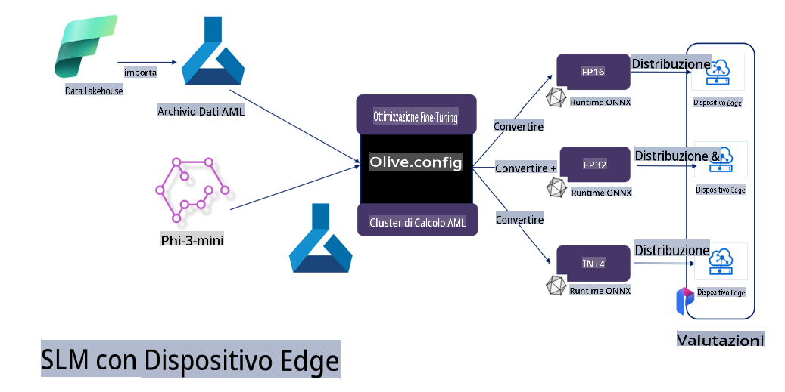

# **Ottimizzazione di Phi-3 con Microsoft Olive**

[Olive](https://github.com/microsoft/OLive?WT.mc_id=aiml-138114-kinfeylo) è uno strumento di ottimizzazione dei modelli hardware-aware facile da usare, che riunisce tecniche leader del settore per la compressione, l'ottimizzazione e la compilazione dei modelli.

È progettato per semplificare il processo di ottimizzazione dei modelli di machine learning, garantendo un uso efficiente delle architetture hardware specifiche.

Che tu stia lavorando su applicazioni basate su cloud o dispositivi edge, Olive ti consente di ottimizzare i tuoi modelli in modo semplice ed efficace.

## Caratteristiche principali:
- Olive aggrega e automatizza tecniche di ottimizzazione per hardware specifici.
- Non esiste una tecnica di ottimizzazione unica per tutti gli scenari, perciò Olive consente estensibilità permettendo agli esperti del settore di integrare le proprie innovazioni.

## Riduzione dello sforzo ingegneristico:
- Gli sviluppatori spesso devono apprendere e utilizzare diversi strumenti specifici dei fornitori di hardware per preparare e ottimizzare i modelli addestrati per il deployment.
- Olive semplifica questa esperienza automatizzando le tecniche di ottimizzazione per l'hardware desiderato.

## Soluzione E2E pronta all'uso:

Combinando e perfezionando tecniche integrate, Olive offre una soluzione unificata per l'ottimizzazione end-to-end. Tiene conto di vincoli come accuratezza e latenza durante l'ottimizzazione dei modelli.

## Utilizzo di Microsoft Olive per il fine-tuning

Microsoft Olive è uno strumento open source di ottimizzazione dei modelli molto semplice da usare, che copre sia il fine-tuning sia il riferimento nel campo dell'intelligenza artificiale generativa. Richiede solo una configurazione semplice e, grazie all'uso di modelli linguistici di piccole dimensioni open source e ambienti runtime correlati (AzureML / GPU locale, CPU, DirectML), consente di completare il fine-tuning o il riferimento del modello tramite un'ottimizzazione automatica, trovando il modello migliore da distribuire nel cloud o sui dispositivi edge. Consente alle aziende di creare i propri modelli verticali industriali sia on-premises che nel cloud.


## Fine-Tuning di Phi-3 con Microsoft Olive 



## Esempio di codice e configurazione per Phi-3 con Olive
In questo esempio utilizzerai Olive per:

- Effettuare il fine-tuning di un adattatore LoRA per classificare frasi in Sad, Joy, Fear, Surprise.
- Unire i pesi dell'adattatore al modello base.
- Ottimizzare e quantizzare il modello in int4.

[Codice di esempio](../../code/03.Finetuning/olive-ort-example/README.md)

### Installazione di Microsoft Olive

L'installazione di Microsoft Olive è molto semplice e supporta CPU, GPU, DirectML e Azure ML.

```bash
pip install olive-ai
```

Se desideri eseguire un modello ONNX con una CPU, puoi utilizzare

```bash
pip install olive-ai[cpu]
```

Se desideri eseguire un modello ONNX con una GPU, puoi utilizzare

```python
pip install olive-ai[gpu]
```

Se desideri utilizzare Azure ML, usa

```python
pip install git+https://github.com/microsoft/Olive#egg=olive-ai[azureml]
```

**Nota**
Requisiti OS: Ubuntu 20.04 / 22.04 

### **Config.json di Microsoft Olive**

Dopo l'installazione, puoi configurare diverse impostazioni specifiche del modello tramite il file di configurazione, inclusi dati, calcolo, addestramento, deployment e generazione del modello.

**1. Dati**

Su Microsoft Olive è possibile effettuare l'addestramento sia su dati locali che su dati nel cloud, configurandoli nelle impostazioni.

*Impostazioni dati locali*

Puoi configurare facilmente il dataset da utilizzare per il fine-tuning, solitamente in formato json, adattandolo al template dei dati. Questo deve essere regolato in base ai requisiti del modello (ad esempio, adattarlo al formato richiesto da Microsoft Phi-3-mini. Se utilizzi altri modelli, fai riferimento ai formati richiesti per il fine-tuning di tali modelli).

```json

    "data_configs": [
        {
            "name": "dataset_default_train",
            "type": "HuggingfaceContainer",
            "load_dataset_config": {
                "params": {
                    "data_name": "json", 
                    "data_files":"dataset/dataset-classification.json",
                    "split": "train"
                }
            },
            "pre_process_data_config": {
                "params": {
                    "dataset_type": "corpus",
                    "text_cols": [
                            "phrase",
                            "tone"
                    ],
                    "text_template": "### Text: {phrase}\n### The tone is:\n{tone}",
                    "corpus_strategy": "join",
                    "source_max_len": 2048,
                    "pad_to_max_len": false,
                    "use_attention_mask": false
                }
            }
        }
    ],
```

**Impostazioni dati nel cloud**

Collegando il datastore di Azure AI Studio/Azure Machine Learning Service, puoi introdurre diverse fonti di dati in Azure AI Studio/Azure Machine Learning Service tramite Microsoft Fabric e Azure Data come supporto per il fine-tuning dei dati.

```json

    "data_configs": [
        {
            "name": "dataset_default_train",
            "type": "HuggingfaceContainer",
            "load_dataset_config": {
                "params": {
                    "data_name": "json", 
                    "data_files": {
                        "type": "azureml_datastore",
                        "config": {
                            "azureml_client": {
                                "subscription_id": "Your Azure Subscrition ID",
                                "resource_group": "Your Azure Resource Group",
                                "workspace_name": "Your Azure ML Workspaces name"
                            },
                            "datastore_name": "workspaceblobstore",
                            "relative_path": "Your train_data.json Azure ML Location"
                        }
                    },
                    "split": "train"
                }
            },
            "pre_process_data_config": {
                "params": {
                    "dataset_type": "corpus",
                    "text_cols": [
                            "Question",
                            "Best Answer"
                    ],
                    "text_template": "<|user|>\n{Question}<|end|>\n<|assistant|>\n{Best Answer}\n<|end|>",
                    "corpus_strategy": "join",
                    "source_max_len": 2048,
                    "pad_to_max_len": false,
                    "use_attention_mask": false
                }
            }
        }
    ],
    
```

**2. Configurazione del calcolo**

Se hai bisogno di lavorare in locale, puoi utilizzare direttamente le risorse dati locali. Se invece desideri utilizzare le risorse di Azure AI Studio/Azure Machine Learning Service, devi configurare i parametri Azure pertinenti, il nome della potenza di calcolo, ecc.

```json

    "systems": {
        "aml": {
            "type": "AzureML",
            "config": {
                "accelerators": ["gpu"],
                "hf_token": true,
                "aml_compute": "Your Azure AI Studio / Azure Machine Learning Service Compute Name",
                "aml_docker_config": {
                    "base_image": "Your Azure AI Studio / Azure Machine Learning Service docker",
                    "conda_file_path": "conda.yaml"
                }
            }
        },
        "azure_arc": {
            "type": "AzureML",
            "config": {
                "accelerators": ["gpu"],
                "aml_compute": "Your Azure AI Studio / Azure Machine Learning Service Compute Name",
                "aml_docker_config": {
                    "base_image": "Your Azure AI Studio / Azure Machine Learning Service docker",
                    "conda_file_path": "conda.yaml"
                }
            }
        }
    },
```

***Nota***

Poiché viene eseguito tramite un container su Azure AI Studio/Azure Machine Learning Service, è necessario configurare l'ambiente richiesto. Questo viene configurato nel file conda.yaml dell'ambiente.

```yaml

name: project_environment
channels:
  - defaults
dependencies:
  - python=3.8.13
  - pip=22.3.1
  - pip:
      - einops
      - accelerate
      - azure-keyvault-secrets
      - azure-identity
      - bitsandbytes
      - datasets
      - huggingface_hub
      - peft
      - scipy
      - sentencepiece
      - torch>=2.2.0
      - transformers
      - git+https://github.com/microsoft/Olive@jiapli/mlflow_loading_fix#egg=olive-ai[gpu]
      - --extra-index-url https://aiinfra.pkgs.visualstudio.com/PublicPackages/_packaging/ORT-Nightly/pypi/simple/ 
      - ort-nightly-gpu==1.18.0.dev20240307004
      - --extra-index-url https://aiinfra.pkgs.visualstudio.com/PublicPackages/_packaging/onnxruntime-genai/pypi/simple/
      - onnxruntime-genai-cuda

    

```

**3. Scegli il tuo SLM**

Puoi utilizzare direttamente il modello da Hugging Face oppure combinare il tutto con il Model Catalog di Azure AI Studio/Azure Machine Learning per selezionare il modello da utilizzare. Nell'esempio di codice qui sotto utilizzeremo Microsoft Phi-3-mini come esempio.

Se hai il modello in locale, puoi utilizzare questo metodo

```json

    "input_model":{
        "type": "PyTorchModel",
        "config": {
            "hf_config": {
                "model_name": "model-cache/microsoft/phi-3-mini",
                "task": "text-generation",
                "model_loading_args": {
                    "trust_remote_code": true
                }
            }
        }
    },
```

Se desideri utilizzare un modello da Azure AI Studio/Azure Machine Learning Service, puoi utilizzare questo metodo

```json

    "input_model":{
        "type": "PyTorchModel",
        "config": {
            "model_path": {
                "type": "azureml_registry_model",
                "config": {
                    "name": "microsoft/Phi-3-mini-4k-instruct",
                    "registry_name": "azureml-msr",
                    "version": "11"
                }
            },
             "model_file_format": "PyTorch.MLflow",
             "hf_config": {
                "model_name": "microsoft/Phi-3-mini-4k-instruct",
                "task": "text-generation",
                "from_pretrained_args": {
                    "trust_remote_code": true
                }
            }
        }
    },
```

**Nota:**
È necessario integrarsi con Azure AI Studio/Azure Machine Learning Service, quindi, durante la configurazione del modello, fai riferimento al numero di versione e alla relativa nomenclatura.

Tutti i modelli su Azure devono essere impostati su PyTorch.MLflow.

Devi avere un account Hugging Face e collegare la chiave al valore Key di Azure AI Studio/Azure Machine Learning.

**4. Algoritmo**

Microsoft Olive integra molto bene gli algoritmi di fine-tuning Lora e QLora. Tutto ciò che devi fare è configurare alcuni parametri pertinenti. Qui utilizzerò QLora come esempio.

```json
        "lora": {
            "type": "LoRA",
            "config": {
                "target_modules": [
                    "o_proj",
                    "qkv_proj"
                ],
                "double_quant": true,
                "lora_r": 64,
                "lora_alpha": 64,
                "lora_dropout": 0.1,
                "train_data_config": "dataset_default_train",
                "eval_dataset_size": 0.3,
                "training_args": {
                    "seed": 0,
                    "data_seed": 42,
                    "per_device_train_batch_size": 1,
                    "per_device_eval_batch_size": 1,
                    "gradient_accumulation_steps": 4,
                    "gradient_checkpointing": false,
                    "learning_rate": 0.0001,
                    "num_train_epochs": 3,
                    "max_steps": 10,
                    "logging_steps": 10,
                    "evaluation_strategy": "steps",
                    "eval_steps": 187,
                    "group_by_length": true,
                    "adam_beta2": 0.999,
                    "max_grad_norm": 0.3
                }
            }
        },
```

Se desideri una conversione di quantizzazione, il branch principale di Microsoft Olive supporta già il metodo onnxruntime-genai. Puoi configurarlo in base alle tue esigenze:

1. Unire i pesi dell'adattatore al modello base.
2. Convertire il modello in un modello onnx con la precisione richiesta tramite ModelBuilder.

Ad esempio, convertire in INT4 quantizzato.

```json

        "merge_adapter_weights": {
            "type": "MergeAdapterWeights"
        },
        "builder": {
            "type": "ModelBuilder",
            "config": {
                "precision": "int4"
            }
        }
```

**Nota** 
- Se utilizzi QLoRA, la conversione di quantizzazione con ONNXRuntime-genai non è attualmente supportata.

- Va sottolineato che puoi configurare i passaggi sopra descritti in base alle tue esigenze. Non è necessario seguire tutti i passaggi. A seconda delle necessità, puoi utilizzare direttamente i passaggi dell'algoritmo senza effettuare il fine-tuning. Infine, devi configurare i motori pertinenti.

```json

    "engine": {
        "log_severity_level": 0,
        "host": "aml",
        "target": "aml",
        "search_strategy": false,
        "execution_providers": ["CUDAExecutionProvider"],
        "cache_dir": "../model-cache/models/phi3-finetuned/cache",
        "output_dir" : "../model-cache/models/phi3-finetuned"
    }
```

**5. Fine del fine-tuning**

Nel terminale, esegui il comando nella directory di olive-config.json.

```bash
olive run --config olive-config.json  
```

**Disclaimer (Avvertenza)**:  
Questo documento è stato tradotto utilizzando servizi di traduzione automatica basati sull'intelligenza artificiale. Sebbene ci impegniamo per garantire l'accuratezza, si prega di tenere presente che le traduzioni automatiche possono contenere errori o imprecisioni. Il documento originale nella sua lingua madre deve essere considerato la fonte autorevole. Per informazioni critiche, si consiglia una traduzione professionale umana. Non siamo responsabili per eventuali fraintendimenti o interpretazioni errate derivanti dall'uso di questa traduzione.