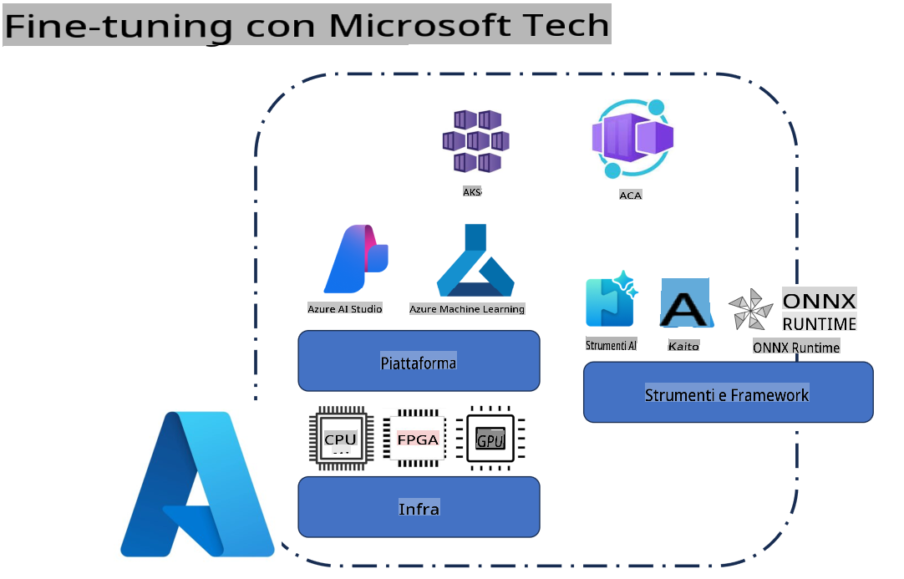
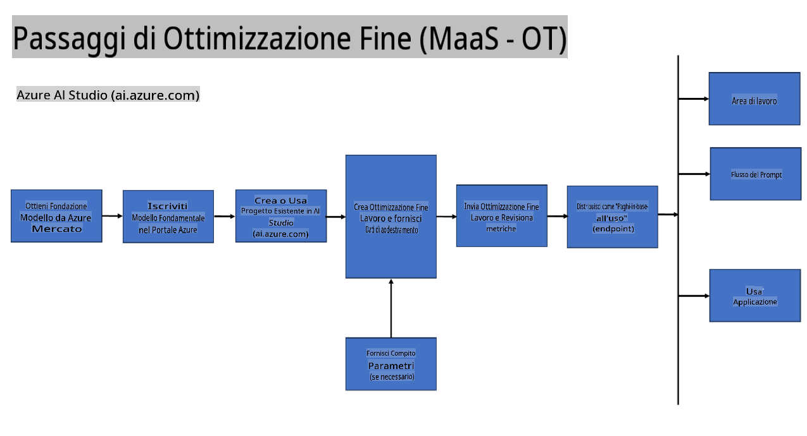
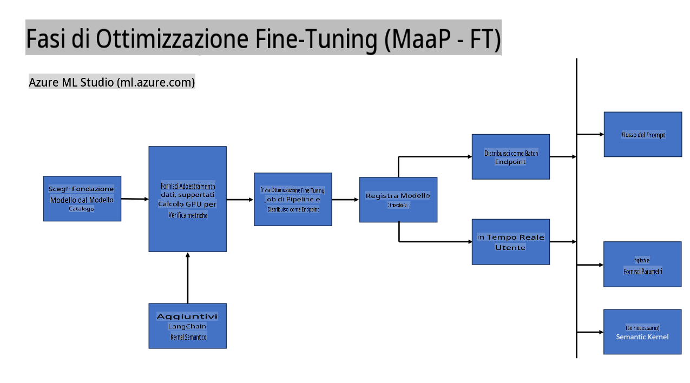
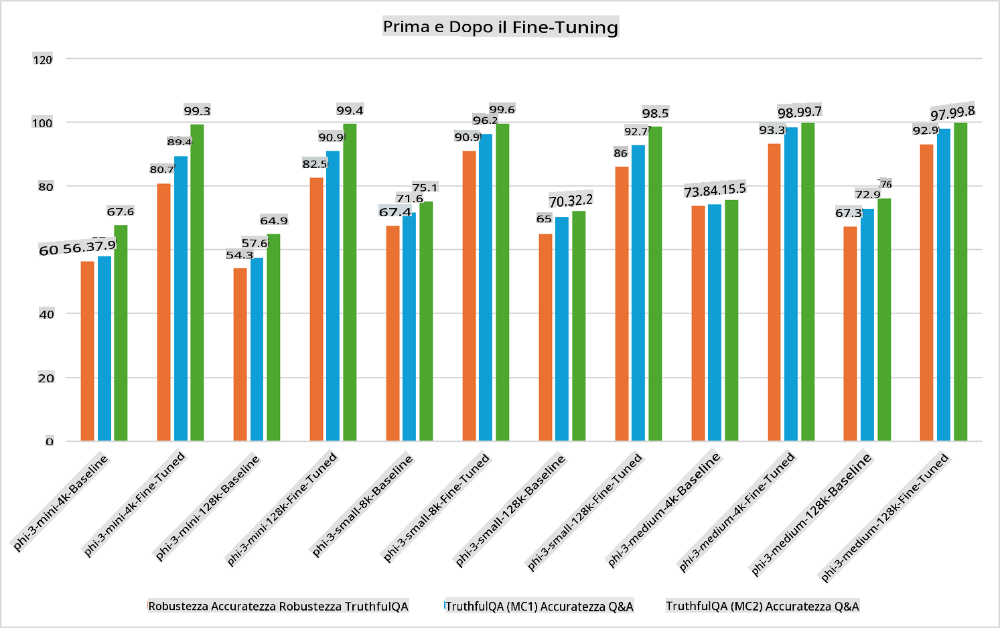

## Scenari di Fine Tuning

**Piattaforma** Include diverse tecnologie come Azure AI Foundry, Azure Machine Learning, AI Tools, Kaito e ONNX Runtime.

**Infrastruttura** Comprende CPU e FPGA, elementi fondamentali per il processo di fine-tuning. Ecco le icone per ciascuna di queste tecnologie.

**Strumenti & Framework** Include ONNX Runtime e ONNX Runtime. Ecco le icone per ciascuna di queste tecnologie.  
[Inserire icone per ONNX Runtime e ONNX Runtime]

Il processo di fine-tuning con le tecnologie Microsoft prevede diversi componenti e strumenti. Comprendendo e utilizzando queste tecnologie, possiamo ottimizzare le nostre applicazioni e creare soluzioni migliori.

## Modello come Servizio

Affina il modello utilizzando il fine-tuning ospitato, senza la necessità di creare e gestire risorse di calcolo.

Il fine-tuning serverless è disponibile per i modelli Phi-3-mini e Phi-3-medium, consentendo agli sviluppatori di personalizzare rapidamente e facilmente i modelli per scenari cloud ed edge senza dover gestire risorse di calcolo. Abbiamo anche annunciato che Phi-3-small è ora disponibile attraverso la nostra offerta Models-as-a-Service, permettendo agli sviluppatori di iniziare rapidamente con lo sviluppo AI senza dover gestire l'infrastruttura sottostante.

## Modello come Piattaforma

Gli utenti gestiscono le proprie risorse di calcolo per affinare i loro modelli.

[Esempio di Fine Tuning](https://github.com/Azure/azureml-examples/blob/main/sdk/python/foundation-models/system/finetune/chat-completion/chat-completion.ipynb)

## Scenari di Fine Tuning

| | | | | | | |
|-|-|-|-|-|-|-|
|Scenario|LoRA|QLoRA|PEFT|DeepSpeed|ZeRO|DORA|
|Adattamento di LLM pre-addestrati a compiti o domini specifici|Sì|Sì|Sì|Sì|Sì|Sì|
|Fine-tuning per attività NLP come classificazione del testo, riconoscimento di entità nominate e traduzione automatica|Sì|Sì|Sì|Sì|Sì|Sì|
|Fine-tuning per attività di domande e risposte|Sì|Sì|Sì|Sì|Sì|Sì|
|Fine-tuning per generare risposte simili a quelle umane nei chatbot|Sì|Sì|Sì|Sì|Sì|Sì|
|Fine-tuning per generare musica, arte o altre forme di creatività|Sì|Sì|Sì|Sì|Sì|Sì|
|Riduzione dei costi computazionali e finanziari|Sì|Sì|No|Sì|Sì|No|
|Riduzione dell'uso della memoria|No|Sì|No|Sì|Sì|Sì|
|Utilizzo di meno parametri per un fine-tuning efficiente|No|Sì|Sì|No|No|Sì|
|Forma di parallelismo dei dati efficiente in termini di memoria che consente l'accesso alla memoria GPU aggregata di tutti i dispositivi GPU disponibili|No|No|No|Sì|Sì|Sì|

## Esempi di Prestazioni di Fine Tuning

**Disclaimer (Dichiarazione di non responsabilità):**  
Questo documento è stato tradotto utilizzando servizi di traduzione automatica basati su intelligenza artificiale. Sebbene ci impegniamo per garantire l'accuratezza, si prega di tenere presente che le traduzioni automatiche potrebbero contenere errori o imprecisioni. Il documento originale nella sua lingua madre dovrebbe essere considerato la fonte autorevole. Per informazioni critiche, si consiglia una traduzione professionale eseguita da un traduttore umano. Non siamo responsabili per eventuali malintesi o interpretazioni errate derivanti dall'uso di questa traduzione.