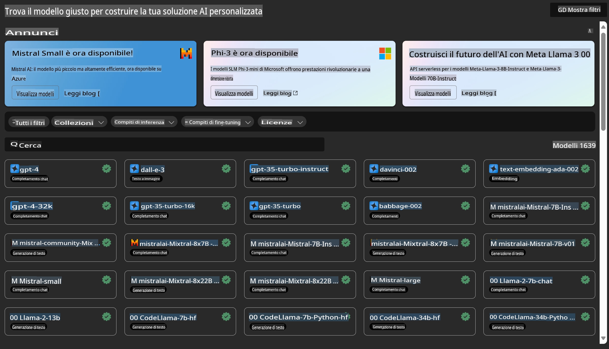

# **Introduzione al Servizio Azure Machine Learning**

[Azure Machine Learning](https://ml.azure.com?WT.mc_id=aiml-138114-kinfeylo) è un servizio cloud progettato per accelerare e gestire il ciclo di vita dei progetti di machine learning (ML).

Professionisti ML, data scientist e ingegneri possono utilizzarlo nelle loro attività quotidiane per:

- Addestrare e distribuire modelli.
- Gestire le operazioni di machine learning (MLOps).
- È possibile creare un modello direttamente in Azure Machine Learning o utilizzare un modello sviluppato su piattaforme open-source come PyTorch, TensorFlow o scikit-learn.
- Gli strumenti MLOps aiutano a monitorare, riaddestrare e ridistribuire i modelli.

## A chi è destinato Azure Machine Learning?

**Data Scientist e Ingegneri ML**

Possono utilizzare strumenti per accelerare e automatizzare i loro flussi di lavoro quotidiani.
Azure ML offre funzionalità per equità, spiegabilità, tracciabilità e auditabilità.

**Sviluppatori di Applicazioni**

Possono integrare i modelli in applicazioni o servizi in modo fluido.

**Sviluppatori di Piattaforme**

Hanno accesso a un set completo di strumenti supportati da API robuste di Azure Resource Manager.
Questi strumenti consentono di costruire strumenti avanzati per il machine learning.

**Aziende**

Operando nel cloud Microsoft Azure, le aziende beneficiano di sicurezza familiare e controllo degli accessi basato sui ruoli.
È possibile configurare progetti per controllare l'accesso ai dati protetti e a specifiche operazioni.

## Produttività per Tutti i Membri del Team

I progetti ML spesso richiedono un team con competenze diverse per essere sviluppati e mantenuti.

Azure ML offre strumenti che consentono di:
- Collaborare con il team tramite notebook condivisi, risorse di calcolo, calcolo serverless, dati e ambienti.
- Sviluppare modelli con equità, spiegabilità, tracciabilità e auditabilità per soddisfare i requisiti di conformità alla tracciabilità e agli audit.
- Distribuire modelli ML rapidamente e facilmente su larga scala e gestirli in modo efficiente con MLOps.
- Eseguire carichi di lavoro di machine learning ovunque con governance, sicurezza e conformità integrate.

## Strumenti di Piattaforma Compatibili

Ogni membro di un team ML può utilizzare gli strumenti che preferisce per portare a termine il lavoro.
Che si tratti di esperimenti rapidi, ottimizzazione di iperparametri, costruzione di pipeline o gestione di inferenze, è possibile utilizzare interfacce familiari come:
- Azure Machine Learning Studio
- Python SDK (v2)
- Azure CLI (v2)
- Azure Resource Manager REST APIs

Man mano che si perfezionano i modelli e si collabora durante il ciclo di sviluppo, è possibile condividere e trovare asset, risorse e metriche all'interno dell'interfaccia utente di Azure Machine Learning studio.

## **LLM/SLM in Azure ML**

Azure ML ha introdotto molte funzionalità relative a LLM/SLM, combinando LLMOps e SLMOps per creare una piattaforma tecnologica di intelligenza artificiale generativa a livello aziendale.

### **Catalogo Modelli**

Gli utenti aziendali possono distribuire diversi modelli in base ai vari scenari aziendali tramite il Catalogo Modelli e fornire servizi come Model as Service per consentire agli sviluppatori o utenti aziendali di accedere.

Il Catalogo Modelli in Azure Machine Learning studio è il punto centrale per scoprire e utilizzare una vasta gamma di modelli che consentono di costruire applicazioni di intelligenza artificiale generativa. Il catalogo include centinaia di modelli forniti da servizi come Azure OpenAI, Mistral, Meta, Cohere, Nvidia, Hugging Face, oltre a modelli addestrati da Microsoft. I modelli forniti da provider diversi da Microsoft sono prodotti Non-Microsoft, come definito nei Termini dei Prodotti Microsoft, e sono soggetti ai termini forniti con il modello.

### **Pipeline di Lavoro**

Il cuore di una pipeline di machine learning è suddividere un'attività ML completa in un flusso di lavoro a più passaggi. Ogni passaggio è un componente gestibile che può essere sviluppato, ottimizzato, configurato e automatizzato individualmente. I passaggi sono collegati tramite interfacce ben definite. Il servizio pipeline di Azure Machine Learning orchestra automaticamente tutte le dipendenze tra i passaggi della pipeline.

Nella personalizzazione di SLM/LLM, possiamo gestire i nostri dati, i processi di addestramento e generazione tramite la Pipeline.

### **Prompt Flow**

**Vantaggi dell'utilizzo di Azure Machine Learning Prompt Flow**

Azure Machine Learning Prompt Flow offre una serie di vantaggi che aiutano gli utenti a passare dall'ideazione alla sperimentazione e, infine, alla creazione di applicazioni basate su LLM pronte per la produzione:

**Agilità nell'ingegneria dei prompt**

- Esperienza interattiva: Azure Machine Learning Prompt Flow offre una rappresentazione visiva della struttura del flusso, consentendo agli utenti di comprendere e navigare facilmente nei loro progetti. Fornisce anche un'esperienza di codifica simile a un notebook per uno sviluppo e un debug efficienti.
- Varianti per l'ottimizzazione dei prompt: Gli utenti possono creare e confrontare più varianti di prompt, facilitando un processo iterativo di perfezionamento.
- Valutazione: I flussi di valutazione integrati consentono agli utenti di valutare la qualità e l'efficacia dei loro prompt e flussi.
- Risorse complete: Azure Machine Learning Prompt Flow include una libreria di strumenti integrati, esempi e modelli che fungono da punto di partenza per lo sviluppo, ispirando creatività e accelerando il processo.

**Prontezza aziendale per applicazioni basate su LLM**

- Collaborazione: Azure Machine Learning Prompt Flow supporta la collaborazione del team, consentendo a più utenti di lavorare insieme su progetti di ingegneria dei prompt, condividere conoscenze e mantenere il controllo delle versioni.
- Piattaforma all-in-one: Azure Machine Learning Prompt Flow semplifica l'intero processo di ingegneria dei prompt, dallo sviluppo e valutazione alla distribuzione e monitoraggio. Gli utenti possono distribuire facilmente i loro flussi come endpoint di Azure Machine Learning e monitorarne le prestazioni in tempo reale, garantendo un funzionamento ottimale e un miglioramento continuo.
- Soluzioni di prontezza aziendale di Azure Machine Learning: Prompt Flow sfrutta le robuste soluzioni di prontezza aziendale di Azure Machine Learning, fornendo una base sicura, scalabile e affidabile per lo sviluppo, la sperimentazione e la distribuzione dei flussi.

Con Azure Machine Learning Prompt Flow, gli utenti possono sfruttare l'agilità nell'ingegneria dei prompt, collaborare in modo efficace e utilizzare soluzioni di livello aziendale per uno sviluppo e una distribuzione di applicazioni basate su LLM di successo.

Combinando la potenza di calcolo, i dati e i diversi componenti di Azure ML, gli sviluppatori aziendali possono facilmente costruire le proprie applicazioni di intelligenza artificiale.

**Disclaimer**:  
Questo documento è stato tradotto utilizzando servizi di traduzione automatica basati sull'intelligenza artificiale. Sebbene ci impegniamo per garantire l'accuratezza, si prega di notare che le traduzioni automatiche potrebbero contenere errori o imprecisioni. Il documento originale nella sua lingua madre dovrebbe essere considerato la fonte autorevole. Per informazioni critiche, si raccomanda una traduzione professionale eseguita da un essere umano. Non siamo responsabili per eventuali fraintendimenti o interpretazioni errate derivanti dall'uso di questa traduzione.