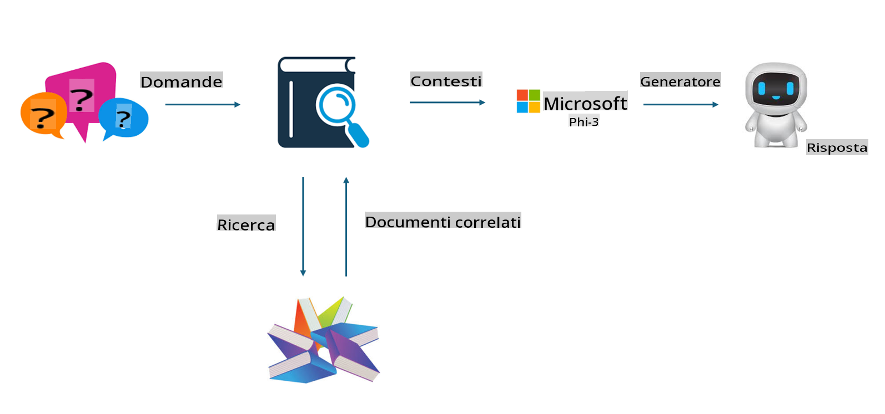

# **Trasformare Phi-3 in un esperto di settore**

Per integrare il modello Phi-3 in un settore industriale, è necessario aggiungere dati aziendali specifici al modello Phi-3. Abbiamo due opzioni diverse: la prima è RAG (Retrieval Augmented Generation) e la seconda è il Fine Tuning.

## **RAG vs Fine-Tuning**

### **Retrieval Augmented Generation**

RAG combina il recupero dei dati con la generazione di testo. I dati strutturati e non strutturati dell'azienda vengono memorizzati in un database vettoriale. Quando si cerca un contenuto rilevante, si trovano i riassunti e i contenuti pertinenti per creare un contesto, e si combina questa informazione con la capacità di completamento testuale di LLM/SLM per generare contenuti.

### **Fine-tuning**

Il Fine-tuning si basa sul miglioramento di un modello esistente. Non è necessario partire dall'algoritmo del modello, ma occorre accumulare continuamente dati. Se si desidera un linguaggio e una terminologia più precisi per applicazioni industriali, il Fine-tuning è la scelta migliore. Tuttavia, se i dati cambiano frequentemente, il Fine-tuning può diventare complicato.

### **Come scegliere**

1. Se la nostra risposta richiede l'integrazione di dati esterni, RAG è la scelta migliore.

2. Se è necessario fornire conoscenze di settore stabili e precise, il Fine-tuning sarà una buona opzione. RAG dà priorità al recupero di contenuti pertinenti, ma potrebbe non cogliere sempre le sfumature più specialistiche.

3. Il Fine-tuning richiede un set di dati di alta qualità, e se i dati sono limitati, la differenza sarà minima. RAG è più flessibile.

4. Il Fine-tuning è una sorta di "scatola nera", difficile da comprendere nel suo meccanismo interno. Al contrario, RAG rende più facile individuare la fonte dei dati, consentendo di correggere errori o inesattezze e garantendo maggiore trasparenza.

### **Scenari**

1. Settori verticali che richiedono un vocabolario specifico e espressioni professionali: ***Fine-tuning*** sarà la scelta migliore.

2. Sistemi di domande e risposte che coinvolgono la sintesi di diversi punti di conoscenza: ***RAG*** sarà la scelta migliore.

3. Combinazione di flussi di lavoro aziendali automatizzati: ***RAG + Fine-tuning*** è la scelta migliore.

## **Come utilizzare RAG**

Un database vettoriale è una raccolta di dati memorizzati in forma matematica. I database vettoriali facilitano ai modelli di machine learning il ricordo degli input precedenti, consentendo l'uso del machine learning per supportare casi d'uso come ricerca, raccomandazioni e generazione di testo. I dati possono essere identificati in base a metriche di similarità piuttosto che a corrispondenze esatte, permettendo ai modelli di comprendere il contesto dei dati.

Il database vettoriale è la chiave per realizzare RAG. Possiamo convertire i dati in archiviazione vettoriale attraverso modelli vettoriali come text-embedding-3, jina-ai-embedding, ecc.

Scopri di più su come creare un'applicazione RAG [https://github.com/microsoft/Phi-3CookBook](https://github.com/microsoft/Phi-3CookBook?WT.mc_id=aiml-138114-kinfeylo)

## **Come utilizzare il Fine-tuning**

Gli algoritmi più comunemente usati nel Fine-tuning sono Lora e QLora. Come scegliere?
- [Scopri di più con questo notebook di esempio](../../../../code/04.Finetuning/Phi_3_Inference_Finetuning.ipynb)
- [Esempio di script Python per Fine-tuning](../../../../code/04.Finetuning/FineTrainingScript.py)

### **Lora e QLora**

LoRA (Low-Rank Adaptation) e QLoRA (Quantized Low-Rank Adaptation) sono tecniche utilizzate per ottimizzare grandi modelli linguistici (LLM) tramite il Parameter Efficient Fine Tuning (PEFT). Le tecniche PEFT sono progettate per addestrare i modelli in modo più efficiente rispetto ai metodi tradizionali.  
LoRA è una tecnica autonoma di Fine-tuning che riduce l'utilizzo della memoria applicando un'approssimazione a basso rango alla matrice di aggiornamento dei pesi. Offre tempi di addestramento rapidi e mantiene prestazioni vicine a quelle dei metodi di Fine-tuning tradizionali.  

QLoRA è una versione estesa di LoRA che integra tecniche di quantizzazione per ridurre ulteriormente l'uso della memoria. QLoRA quantizza la precisione dei parametri dei pesi nel modello pre-addestrato LLM a una precisione di 4 bit, risultando più efficiente in termini di memoria rispetto a LoRA. Tuttavia, l'addestramento con QLoRA è circa il 30% più lento rispetto a quello con LoRA a causa dei passaggi aggiuntivi di quantizzazione e dequantizzazione.  

QLoRA utilizza LoRA come supporto per correggere gli errori introdotti durante la quantizzazione. QLoRA consente il Fine-tuning di modelli di grandi dimensioni con miliardi di parametri su GPU relativamente piccole e facilmente disponibili. Ad esempio, QLoRA può ottimizzare un modello con 70 miliardi di parametri che normalmente richiederebbe 36 GPU, utilizzandone solo 2.

**Disclaimer (Avvertenza):**  
Questo documento è stato tradotto utilizzando servizi di traduzione automatica basati sull'intelligenza artificiale. Sebbene ci impegniamo per garantire l'accuratezza, si prega di notare che le traduzioni automatiche possono contenere errori o imprecisioni. Il documento originale nella sua lingua madre deve essere considerato la fonte autorevole. Per informazioni critiche, si raccomanda una traduzione professionale eseguita da un traduttore umano. Non siamo responsabili per eventuali fraintendimenti o interpretazioni errate derivanti dall'uso di questa traduzione.