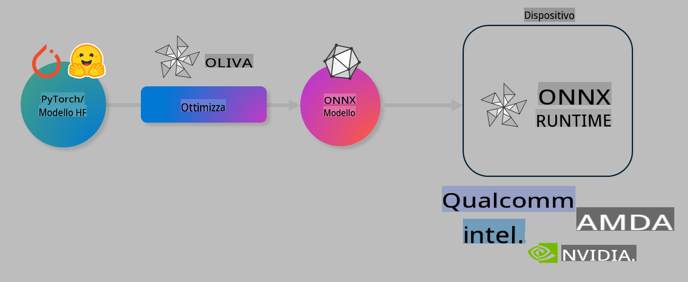

# Lab. Ottimizzare i modelli AI per l'inferenza on-device

## Introduzione

> [!IMPORTANT]
> Questo laboratorio richiede una **GPU Nvidia A10 o A100** con i relativi driver e toolkit CUDA (versione 12+) installati.

> [!NOTE]
> Questo è un laboratorio di **35 minuti** che ti offrirà un'introduzione pratica ai concetti fondamentali per ottimizzare i modelli per l'inferenza on-device utilizzando OLIVE.

## Obiettivi di apprendimento

Al termine di questo laboratorio, sarai in grado di utilizzare OLIVE per:

- Quantizzare un modello AI utilizzando il metodo di quantizzazione AWQ.
- Effettuare il fine-tuning di un modello AI per un compito specifico.
- Generare adattatori LoRA (modello ottimizzato) per un'inferenza efficiente on-device con ONNX Runtime.

### Che cos'è Olive

Olive (*O*NNX *live*) è un toolkit per l'ottimizzazione dei modelli con un'interfaccia CLI che consente di distribuire modelli per ONNX runtime +++https://onnxruntime.ai+++ con qualità e prestazioni ottimali.



L'input per Olive è tipicamente un modello PyTorch o Hugging Face, e l'output è un modello ONNX ottimizzato eseguibile su un dispositivo (target di distribuzione) con ONNX runtime. Olive ottimizza il modello per l'acceleratore AI del target di distribuzione (NPU, GPU, CPU) fornito da un produttore hardware come Qualcomm, AMD, Nvidia o Intel.

Olive esegue un *workflow*, una sequenza ordinata di compiti individuali di ottimizzazione del modello chiamati *passaggi* (*passes*). Esempi di passaggi includono: compressione del modello, acquisizione del grafo, quantizzazione, ottimizzazione del grafo. Ogni passaggio ha un insieme di parametri che possono essere regolati per ottenere le migliori metriche, come accuratezza e latenza, valutate dall'evaluator corrispondente. Olive utilizza una strategia di ricerca con un algoritmo che ottimizza automaticamente ciascun passaggio singolarmente o un gruppo di passaggi insieme.

#### Vantaggi di Olive

- **Riduce la frustrazione e il tempo** necessario per esperimenti manuali con tecniche diverse di ottimizzazione del grafo, compressione e quantizzazione. Definisci i tuoi vincoli di qualità e prestazioni, e Olive troverà automaticamente il miglior modello per te.
- **Oltre 40 componenti di ottimizzazione del modello integrati** che coprono tecniche all'avanguardia in quantizzazione, compressione, ottimizzazione del grafo e fine-tuning.
- **CLI facile da usare** per compiti comuni di ottimizzazione del modello. Ad esempio, olive quantize, olive auto-opt, olive finetune.
- Integrazione della distribuzione e del packaging del modello.
- Supporta la generazione di modelli per il **Multi LoRA serving**.
- Costruzione di workflow tramite YAML/JSON per orchestrare compiti di ottimizzazione e distribuzione del modello.
- Integrazione con **Hugging Face** e **Azure AI**.
- Meccanismo di **caching integrato** per **ridurre i costi**.

## Istruzioni per il laboratorio
> [!NOTE]
> Assicurati di aver configurato il tuo Azure AI Hub e Project e impostato il tuo calcolo A100 come descritto nel Laboratorio 1.

### Passaggio 0: Connettersi al calcolo Azure AI

Ti connetterai al calcolo Azure AI utilizzando la funzionalità remota in **VS Code.**

1. Apri la tua applicazione desktop **VS Code**:
1. Apri il **command palette** utilizzando **Shift+Ctrl+P**.
1. Nel command palette cerca **AzureML - remote: Connect to compute instance in New Window**.
1. Segui le istruzioni a schermo per connetterti al calcolo. Questo comporterà la selezione della tua sottoscrizione Azure, Resource Group, Project e Compute name configurati nel Laboratorio 1.
1. Una volta connesso al tuo nodo Azure ML Compute, questa connessione sarà visibile nell'**angolo in basso a sinistra di Visual Code** `><Azure ML: Compute Name`.

### Passaggio 1: Clona questo repository

In VS Code, puoi aprire un nuovo terminale con **Ctrl+J** e clonare questo repository:

Nel terminale dovresti vedere il prompt

```
azureuser@computername:~/cloudfiles/code$ 
```
Clona la soluzione 

```bash
cd ~/localfiles
git clone https://github.com/microsoft/phi-3cookbook.git
```

### Passaggio 2: Apri la cartella in VS Code

Per aprire VS Code nella cartella rilevante, esegui il seguente comando nel terminale, che aprirà una nuova finestra:

```bash
code phi-3cookbook/code/04.Finetuning/Olive-lab
```

In alternativa, puoi aprire la cartella selezionando **File** > **Open Folder**.

### Passaggio 3: Dipendenze

Apri una finestra del terminale in VS Code nella tua istanza di calcolo Azure AI (suggerimento: **Ctrl+J**) ed esegui i seguenti comandi per installare le dipendenze:

```bash
conda create -n olive-ai python=3.11 -y
conda activate olive-ai
pip install -r requirements.txt
az extension remove -n azure-cli-ml
az extension add -n ml
```

> [!NOTE]
> L'installazione di tutte le dipendenze richiederà circa **5 minuti**.

In questo laboratorio scaricherai e caricherai modelli nel catalogo modelli Azure AI. Per accedere al catalogo modelli, sarà necessario effettuare il login su Azure utilizzando:

```bash
az login
```

> [!NOTE]
> Durante il login ti verrà chiesto di selezionare la tua sottoscrizione. Assicurati di impostare la sottoscrizione fornita per questo laboratorio.

### Passaggio 4: Esegui i comandi Olive

Apri una finestra del terminale in VS Code nella tua istanza di calcolo Azure AI (suggerimento: **Ctrl+J**) e assicurati che l'ambiente `olive-ai` di conda sia attivato:

```bash
conda activate olive-ai
```

Successivamente, esegui i seguenti comandi Olive nella riga di comando.

1. **Ispeziona i dati:** In questo esempio, eseguirai il fine-tuning del modello Phi-3.5-Mini affinché sia specializzato nel rispondere a domande relative ai viaggi. Il codice seguente mostra i primi record del dataset, che sono in formato JSON lines:
   
    ```bash
    head data/data_sample_travel.jsonl
    ```
1. **Quantizza il modello:** Prima di addestrare il modello, esegui la quantizzazione con il seguente comando che utilizza una tecnica chiamata Active Aware Quantization (AWQ) +++https://arxiv.org/abs/2306.00978+++. AWQ quantizza i pesi di un modello considerando le attivazioni prodotte durante l'inferenza. Ciò significa che il processo di quantizzazione tiene conto della distribuzione effettiva dei dati nelle attivazioni, preservando meglio l'accuratezza del modello rispetto ai metodi tradizionali di quantizzazione dei pesi.
    
    ```bash
    olive quantize \
       --model_name_or_path microsoft/Phi-3.5-mini-instruct \
       --trust_remote_code \
       --algorithm awq \
       --output_path models/phi/awq \
       --log_level 1
    ```
    
    La quantizzazione AWQ richiede circa **8 minuti** e **riduce la dimensione del modello da ~7,5GB a ~2,5GB**.
   
   In questo laboratorio, ti mostreremo come inserire modelli da Hugging Face (ad esempio: `microsoft/Phi-3.5-mini-instruct`). However, Olive also allows you to input models from the Azure AI catalog by updating the `model_name_or_path` argument to an Azure AI asset ID (for example:  `azureml://registries/azureml/models/Phi-3.5-mini-instruct/versions/4`). 

1. **Train the model:** Next, the `olive finetune` per ottimizzare il modello quantizzato. La quantizzazione del modello *prima* del fine-tuning, invece che dopo, offre una migliore accuratezza poiché il processo di fine-tuning recupera parte della perdita dovuta alla quantizzazione.
    
    ```bash
    olive finetune \
        --method lora \
        --model_name_or_path models/phi/awq \
        --data_files "data/data_sample_travel.jsonl" \
        --data_name "json" \
        --text_template "<|user|>\n{prompt}<|end|>\n<|assistant|>\n{response}<|end|>" \
        --max_steps 100 \
        --output_path ./models/phi/ft \
        --log_level 1
    ```
    
    Il fine-tuning richiede circa **6 minuti** (con 100 step).

1. **Ottimizza:** Una volta addestrato il modello, ottimizzalo utilizzando il comando `auto-opt` command, which will capture the ONNX graph and automatically perform a number of optimizations to improve the model performance for CPU by compressing the model and doing fusions. It should be noted, that you can also optimize for other devices such as NPU or GPU by just updating the `--device` and `--provider` di Olive - per scopi di laboratorio useremo la CPU.

    ```bash
    olive auto-opt \
       --model_name_or_path models/phi/ft/model \
       --adapter_path models/phi/ft/adapter \
       --device cpu \
       --provider CPUExecutionProvider \
       --use_ort_genai \
       --output_path models/phi/onnx-ao \
       --log_level 1
    ```
    
    L'ottimizzazione richiede circa **5 minuti**.

### Passaggio 5: Test rapido dell'inferenza del modello

Per testare l'inferenza del modello, crea un file Python nella tua cartella chiamato **app.py** e copia-incolla il seguente codice:

```python
import onnxruntime_genai as og
import numpy as np

print("loading model and adapters...", end="", flush=True)
model = og.Model("models/phi/onnx-ao/model")
adapters = og.Adapters(model)
adapters.load("models/phi/onnx-ao/model/adapter_weights.onnx_adapter", "travel")
print("DONE!")

tokenizer = og.Tokenizer(model)
tokenizer_stream = tokenizer.create_stream()

params = og.GeneratorParams(model)
params.set_search_options(max_length=100, past_present_share_buffer=False)
user_input = "what is the best thing to see in chicago"
params.input_ids = tokenizer.encode(f"<|user|>\n{user_input}<|end|>\n<|assistant|>\n")

generator = og.Generator(model, params)

generator.set_active_adapter(adapters, "travel")

print(f"{user_input}")

while not generator.is_done():
    generator.compute_logits()
    generator.generate_next_token()

    new_token = generator.get_next_tokens()[0]
    print(tokenizer_stream.decode(new_token), end='', flush=True)

print("\n")
```

Esegui il codice utilizzando:

```bash
python app.py
```

### Passaggio 6: Carica il modello su Azure AI

Caricare il modello in un repository di modelli Azure AI lo rende condivisibile con altri membri del tuo team di sviluppo e gestisce anche il controllo delle versioni del modello. Per caricare il modello, esegui il seguente comando:

> [!NOTE]
> Aggiorna i campi `{}` placeholders with the name of your resource group and Azure AI Project Name. 

To find your resource group `"resourceGroup" e il nome del progetto Azure AI, quindi esegui il comando seguente:

```
az ml workspace show
```

Oppure accedi a +++ai.azure.com+++ e seleziona **management center**, **project**, **overview**.

Aggiorna i segnaposto `{}` con il nome del tuo resource group e del progetto Azure AI.

```bash
az ml model create \
    --name ft-for-travel \
    --version 1 \
    --path ./models/phi/onnx-ao \
    --resource-group {RESOURCE_GROUP_NAME} \
    --workspace-name {PROJECT_NAME}
```
Potrai quindi visualizzare il tuo modello caricato e distribuirlo su https://ml.azure.com/model/list

**Disclaimer (Avvertenza):**  
Questo documento è stato tradotto utilizzando servizi di traduzione automatizzati basati sull'intelligenza artificiale. Sebbene ci impegniamo per garantire l'accuratezza, si prega di tenere presente che le traduzioni automatiche potrebbero contenere errori o imprecisioni. Il documento originale nella sua lingua originale deve essere considerato come la fonte autorevole. Per informazioni critiche, si consiglia una traduzione professionale eseguita da un traduttore umano. Non siamo responsabili per eventuali fraintendimenti o interpretazioni errate derivanti dall'uso di questa traduzione.