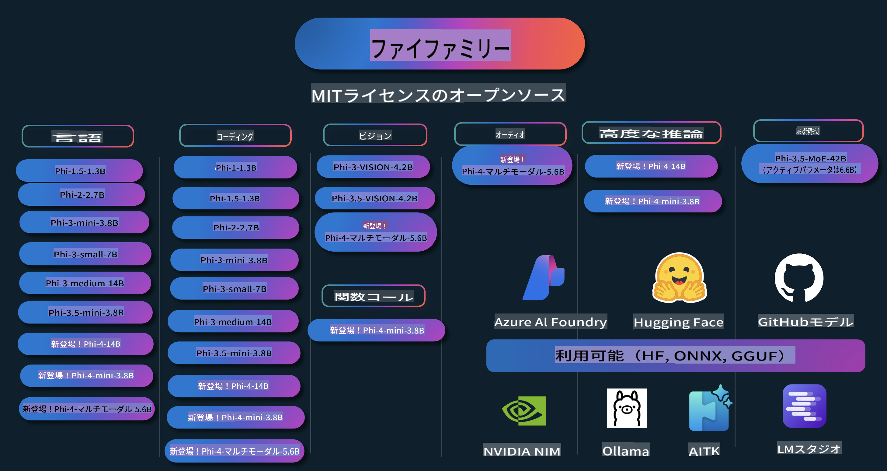

# Phi クックブック: Microsoft の Phi モデルを使った実践例

  

  
  
  

  
  

Phi は Microsoft によって開発されたオープンソースの AI モデルシリーズです。

Phi は現在、最も強力でコスト効率の高い小型言語モデル (SLM) であり、多言語、推論、テキスト/チャット生成、コーディング、画像、音声などのシナリオにおいて非常に優れたベンチマークを持っています。

Phi はクラウドまたはエッジデバイスにデプロイ可能で、限られたコンピューティングリソースでも生成型 AI アプリケーションを簡単に構築することができます。

以下のステップに従って、これらのリソースを使い始めてください:
1. **リポジトリをフォークする**:  をクリック  
2. **リポジトリをクローンする**: `git clone https://github.com/microsoft/PhiCookBook.git`  
3. [**Microsoft AI Discord コミュニティに参加して、専門家や他の開発者と交流する**](https://discord.com/invite/ByRwuEEgH4?WT.mc_id=aiml-137032-kinfeylo)

## 目次

- はじめに  
  - [Phi ファミリーへようこそ](./md/01.Introduction/01/01.PhiFamily.md)  
  - [環境のセットアップ](./md/01.Introduction/01/01.EnvironmentSetup.md)  
  - [主要技術の理解](./md/01.Introduction/01/01.Understandingtech.md)  
  - [Phi モデルの AI セーフティ](./md/01.Introduction/01/01.AISafety.md)  
  - [Phi のハードウェアサポート](./md/01.Introduction/01/01.Hardwaresupport.md)  
  - [Phi モデルとプラットフォームでの利用可能性](./md/01.Introduction/01/01.Edgeandcloud.md)  
  - [Guidance-ai と Phi の使用](./md/01.Introduction/01/01.Guidance.md)  
  - [GitHub Marketplace モデル](https://github.com/marketplace/models)  
  - [Azure AI モデルカタログ](https://ai.azure.com)

- 異なる環境での Phi の推論  
    - [Hugging Face](./md/01.Introduction/02/01.HF.md)  
    - [GitHub モデル](./md/01.Introduction/02/02.GitHubModel.md)  
    - [Azure AI Foundry モデルカタログ](./md/01.Introduction/02/03.AzureAIFoundry.md)  
    - [Ollama](./md/01.Introduction/02/04.Ollama.md)  
    - [AI Toolkit VSCode (AITK)](./md/01.Introduction/02/05.AITK.md)  
    - [NVIDIA NIM](./md/01.Introduction/02/06.NVIDIA.md)

- Phi ファミリーの推論  
    - [iOS での Phi 推論](./md/01.Introduction/03/iOS_Inference.md)  
    - [Android での Phi 推論](./md/01.Introduction/03/Android_Inference.md)  
- [JetsonでのPhi推論](./md/01.Introduction/03/Jetson_Inference.md)
    - [AI PCでのPhi推論](./md/01.Introduction/03/AIPC_Inference.md)
    - [Apple MLX Frameworkを使用したPhi推論](./md/01.Introduction/03/MLX_Inference.md)
    - [ローカルサーバーでのPhi推論](./md/01.Introduction/03/Local_Server_Inference.md)
    - [AI Toolkitを使用したリモートサーバーでのPhi推論](./md/01.Introduction/03/Remote_Interence.md)
    - [Rustを使用したPhi推論](./md/01.Introduction/03/Rust_Inference.md)
    - [ローカルでのPhi--Vision推論](./md/01.Introduction/03/Vision_Inference.md)
    - [Kaito AKS、Azure Containers（公式サポート）を使用したPhi推論](./md/01.Introduction/03/Kaito_Inference.md)
- [Phiファミリーの量子化](./md/01.Introduction/04/QuantifyingPhi.md)
    - [llama.cppを使用したPhi-3.5 / 4の量子化](./md/01.Introduction/04/UsingLlamacppQuantifyingPhi.md)
    - [onnxruntimeの生成AI拡張を使用したPhi-3.5 / 4の量子化](./md/01.Introduction/04/UsingORTGenAIQuantifyingPhi.md)
    - [Intel OpenVINOを使用したPhi-3.5 / 4の量子化](./md/01.Introduction/04/UsingIntelOpenVINOQuantifyingPhi.md)
    - [Apple MLX Frameworkを使用したPhi-3.5 / 4の量子化](./md/01.Introduction/04/UsingAppleMLXQuantifyingPhi.md)

- Phiの評価
    - [Responsible AI](./md/01.Introduction/05/ResponsibleAI.md)
    - [評価のためのAzure AI Foundry](./md/01.Introduction/05/AIFoundry.md)
    - [Promptflowを使用した評価](./md/01.Introduction/05/Promptflow.md)

- Azure AI Searchを使用したRAG
    - [Azure AI SearchでPhi-4-miniとPhi-4-multimodal（RAG）を使用する方法](https://github.com/microsoft/PhiCookBook/blob/main/code/06.E2E/E2E_Phi-4-RAG-Azure-AI-Search.ipynb)

- Phiアプリケーション開発サンプル
  - テキスト＆チャットアプリケーション
    - Phi-4 サンプル 🆕
      - [📓] [Phi-4-mini ONNXモデルとのチャット](./md/02.Application/01.TextAndChat/Phi4/ChatWithPhi4ONNX/README.md)
      - [Phi-4ローカルONNXモデル .NETとのチャット](../../md/04.HOL/dotnet/src/LabsPhi4-Chat-01OnnxRuntime)
      - [Sementic Kernelを使用したPhi-4 ONNXとのチャット .NETコンソールアプリ](../../md/04.HOL/dotnet/src/LabsPhi4-Chat-02SK)
    - Phi-3 / 3.5 サンプル
      - [Phi3、ONNX Runtime Web、WebGPUを使用したブラウザでのローカルチャットボット](https://github.com/microsoft/onnxruntime-inference-examples/tree/main/js/chat)
      - [OpenVinoチャット](./md/02.Application/01.TextAndChat/Phi3/E2E_OpenVino_Chat.md)
      - [マルチモデル - Phi-3-miniとOpenAI Whisperの対話型](./md/02.Application/01.TextAndChat/Phi3/E2E_Phi-3-mini_with_whisper.md)
      - [MLFlow - ラッパーの構築とPhi-3をMLFlowで使用](./md//02.Application/01.TextAndChat/Phi3/E2E_Phi-3-MLflow.md)
      - [モデル最適化 - Oliveを使用してONNX Runtime Web向けにPhi-3-minモデルを最適化する方法](https://github.com/microsoft/Olive/tree/main/examples/phi3)
      - [Phi-3 mini-4k-instruct-onnxを使用したWinUI3アプリ](https://github.com/microsoft/Phi3-Chat-WinUI3-Sample/)
      - [WinUI3 マルチモデル AI対応ノートアプリ サンプル](https://github.com/microsoft/ai-powered-notes-winui3-sample)
      - [Prompt flowを使用してカスタムPhi-3モデルをファインチューニングし統合](./md/02.Application/01.TextAndChat/Phi3/E2E_Phi-3-FineTuning_PromptFlow_Integration.md)
      - [Azure AI FoundryでPrompt flowを使用してカスタムPhi-3モデルをファインチューニングし統合](./md/02.Application/01.TextAndChat/Phi3/E2E_Phi-3-FineTuning_PromptFlow_Integration_AIFoundry.md)
      - [MicrosoftのResponsible AI原則に焦点を当て、Azure AI FoundryでファインチューニングしたPhi-3 / Phi-3.5モデルを評価](./md/02.Application/01.TextAndChat/Phi3/E2E_Phi-3-Evaluation_AIFoundry.md)
- [📓] [Phi-3.5-mini-instruct 言語予測サンプル (中国語/英語)](../../md/02.Application/01.TextAndChat/Phi3/phi3-instruct-demo.ipynb)
      - [Phi-3.5-Instruct WebGPU RAG チャットボット](./md/02.Application/01.TextAndChat/Phi3/WebGPUWithPhi35Readme.md)
      - [Windows GPU を使用して Phi-3.5-Instruct ONNX でプロンプトフローソリューションを作成する](./md/02.Application/01.TextAndChat/Phi3/UsingPromptFlowWithONNX.md)
      - [Microsoft Phi-3.5 tflite を使用して Android アプリを作成する](./md/02.Application/01.TextAndChat/Phi3/UsingPhi35TFLiteCreateAndroidApp.md)
      - [Microsoft.ML.OnnxRuntime を使用したローカル ONNX Phi-3 モデルによる Q&A .NET サンプル](../../md/04.HOL/dotnet/src/LabsPhi301)
      - [Semantic Kernel と Phi-3 を使用したコンソールチャット .NET アプリ](../../md/04.HOL/dotnet/src/LabsPhi302)

  - Azure AI 推論 SDK コードベースサンプル 
    - Phi-4 サンプル 🆕
      - [📓] [Phi-4-multimodal を使用してプロジェクトコードを生成する](./md/02.Application/02.Code/Phi4/GenProjectCode/README.md)
    - Phi-3 / 3.5 サンプル
      - [Microsoft Phi-3 ファミリーを使用して独自の Visual Studio Code GitHub Copilot チャットを構築する](./md/02.Application/02.Code/Phi3/VSCodeExt/README.md)
      - [GitHub モデルを使用して Phi-3.5 による独自の Visual Studio Code チャットエージェントを作成する](/md/02.Application/02.Code/Phi3/CreateVSCodeChatAgentWithGitHubModels.md)

  - 高度な推論サンプル
    - Phi-4 サンプル 🆕
      - [📓] [Phi-4-mini 推論サンプル](./md/02.Application/03.AdvancedReasoning/Phi4/AdvancedResoningPhi4mini/README.md)
  
  - デモ
      - [Hugging Face Spaces 上でホストされている Phi-4-mini デモ](https://huggingface.co/spaces/microsoft/phi-4-mini?WT.mc_id=aiml-137032-kinfeylo)
      - [Hugging Face Spaces 上でホストされている Phi-4-multimodal デモ](https://huggingface.co/spaces/microsoft/phi-4-multimodal?WT.mc_id=aiml-137032-kinfeylo)
  - ビジョンサンプル
    - Phi-4 サンプル 🆕
      - [📓] [Phi-4-multimodal を使用して画像を読み取りコードを生成する](./md/02.Application/04.Vision/Phi4/CreateFrontend/README.md) 
    - Phi-3 / 3.5 サンプル
      - [📓][Phi-3-vision-画像テキストからテキスト](../../md/02.Application/04.Vision/Phi3/E2E_Phi-3-vision-image-text-to-text-online-endpoint.ipynb)
      - [Phi-3-vision-ONNX](https://onnxruntime.ai/docs/genai/tutorials/phi3-v.html)
      - [📓][Phi-3-vision CLIP 埋め込み](../../md/02.Application/04.Vision/Phi3/E2E_Phi-3-vision-image-text-to-text-online-endpoint.ipynb)
      - [デモ: Phi-3 リサイクル](https://github.com/jennifermarsman/PhiRecycling/)
      - [Phi-3-vision - 視覚言語アシスタント - Phi3-Vision と OpenVINO を使用](https://docs.openvino.ai/nightly/notebooks/phi-3-vision-with-output.html)
      - [Phi-3 Vision Nvidia NIM](./md/02.Application/04.Vision/Phi3/E2E_Nvidia_NIM_Vision.md)
      - [Phi-3 Vision OpenVino](./md/02.Application/04.Vision/Phi3/E2E_OpenVino_Phi3Vision.md)
      - [📓][Phi-3.5 Vision マルチフレームまたはマルチイメージサンプル](../../md/02.Application/04.Vision/Phi3/phi3-vision-demo.ipynb)
      - [Microsoft.ML.OnnxRuntime .NET を使用した Phi-3 Vision ローカル ONNX モデル](../../md/04.HOL/dotnet/src/LabsPhi303)
      - [Microsoft.ML.OnnxRuntime .NET を使用したメニューベースの Phi-3 Vision ローカル ONNX モデル](../../md/04.HOL/dotnet/src/LabsPhi304)

  - オーディオサンプル
    - Phi-4 サンプル 🆕
      - [📓] [Phi-4-multimodal を使用して音声の文字起こしを抽出する](./md/02.Application/05.Audio/Phi4/Transciption/README.md)
      - [📓] [Phi-4-multimodal オーディオサンプル](../../md/02.Application/05.Audio/Phi4/Siri/demo.ipynb)
      - [📓] [Phi-4-multimodal 音声翻訳サンプル](../../md/02.Application/05.Audio/Phi4/Translate/demo.ipynb)
      - [.NET コンソールアプリケーションを使用して Phi-4-multimodal Audio で音声ファイルを分析し文字起こしを生成する](../../md/04.HOL/dotnet/src/LabsPhi4-MultiModal-02Audio)

  - MOE サンプル
    - Phi-3 / 3.5 サンプル
      - [📓] [Phi-3.5 Mixture of Experts Models (MoEs) ソーシャルメディアサンプル](../../md/02.Application/06.MoE/Phi3/phi3_moe_demo.ipynb)
      - [📓] [NVIDIA NIM Phi-3 MOE、Azure AI Search、LlamaIndex を使用して検索強化生成 (RAG) パイプラインを構築する](../../md/02.Application/06.MoE/Phi3/azure-ai-search-nvidia-rag.ipynb)
  - 関数呼び出しサンプル
    - Phi-4 サンプル 🆕
      - [📓] [Phi-4-mini を使用した関数呼び出し](./md/02.Application/07.FunctionCalling/Phi4/FunctionCallingBasic/README.md)
  - マルチモーダルミキシングサンプル
    - Phi-4 サンプル 🆕
-  [📓] [テクノロジージャーナリストとしてPhi-4-multimodalを活用する](../../md/02.Application/08.Multimodel/Phi4/TechJournalist/phi_4_mm_audio_text_publish_news.ipynb)
      - [Phi-4-multimodalを使用した.NETコンソールアプリケーションで画像を分析する](../../md/04.HOL/dotnet/src/LabsPhi4-MultiModal-01Images)

- Phiサンプルのファインチューニング
  - [ファインチューニングシナリオ](./md/03.FineTuning/FineTuning_Scenarios.md)
  - [ファインチューニング vs RAG](./md/03.FineTuning/FineTuning_vs_RAG.md)
  - [Phi-3を業界の専門家にするファインチューニング](./md/03.FineTuning/LetPhi3gotoIndustriy.md)
  - [VS Code用AIツールキットでPhi-3をファインチューニングする](./md/03.FineTuning/Finetuning_VSCodeaitoolkit.md)
  - [Azure Machine Learning ServiceでPhi-3をファインチューニングする](./md/03.FineTuning/Introduce_AzureML.md)
  - [Loraを使用してPhi-3をファインチューニングする](./md/03.FineTuning/FineTuning_Lora.md)
  - [QLoraを使用してPhi-3をファインチューニングする](./md/03.FineTuning/FineTuning_Qlora.md)
  - [Azure AI FoundryでPhi-3をファインチューニングする](./md/03.FineTuning/FineTuning_AIFoundry.md)
  - [Azure ML CLI/SDKでPhi-3をファインチューニングする](./md/03.FineTuning/FineTuning_MLSDK.md)
  - [Microsoft Oliveでファインチューニングする](./md/03.FineTuning/FineTuning_MicrosoftOlive.md)
  - [Microsoft Olive Hands-On Labでファインチューニングする](./md/03.FineTuning/olive-lab/readme.md)
  - [Weights and Biasを使用してPhi-3-visionをファインチューニングする](./md/03.FineTuning/FineTuning_Phi-3-visionWandB.md)
  - [Apple MLX FrameworkでPhi-3をファインチューニングする](./md/03.FineTuning/FineTuning_MLX.md)
  - [Phi-3-visionのファインチューニング（公式サポート）](./md/03.FineTuning/FineTuning_Vision.md)
  - [Kaito AKS、Azure ContainersでPhi-3をファインチューニング（公式サポート）](./md/03.FineTuning/FineTuning_Kaito.md)
  - [Phi-3および3.5 Visionのファインチューニング](https://github.com/2U1/Phi3-Vision-Finetune)

- Hands on Lab
  - [最先端モデルの探索：LLM、SLM、ローカル開発など](https://github.com/microsoft/aitour-exploring-cutting-edge-models)
  - [NLPの可能性を引き出す：Microsoft Oliveでのファインチューニング](https://github.com/azure/Ignite_FineTuning_workshop)

- 学術研究論文と出版物
  - [Textbooks Are All You Need II: phi-1.5 技術レポート](https://arxiv.org/abs/2309.05463)
  - [Phi-3 技術レポート: 高性能な言語モデルをスマートフォンでローカル実行](https://arxiv.org/abs/2404.14219)
  - [Phi-4 技術レポート](https://arxiv.org/abs/2412.08905)
  - [車載機能呼び出し用の小型言語モデルの最適化](https://arxiv.org/abs/2501.02342)
  - [(WhyPHI) 複数選択式質問応答のためのPHI-3のファインチューニング: 方法論、結果、および課題](https://arxiv.org/abs/2501.01588)

## Phiモデルの利用

### Azure AI FoundryでのPhi

Microsoft Phiの使い方や、さまざまなハードウェアデバイスでのE2Eソリューションの構築方法を学べます。Phiを体験するには、モデルを試したり、シナリオに合わせてPhiをカスタマイズしたりすることから始めてください。[Azure AI Foundry Azure AI Model Catalog](https://aka.ms/phi3-azure-ai)を使用して詳細を学ぶことができます。[Azure AI Foundryのクイックスタート](/md/02.QuickStart/AzureAIFoundry_QuickStart.md)をご覧ください。

**Playground**  
各モデルには、モデルをテストする専用のプレイグラウンドがあります。[Azure AI Playground](https://aka.ms/try-phi3)。

### GitHub ModelsでのPhi

Microsoft Phiの使い方や、さまざまなハードウェアデバイスでのE2Eソリューションの構築方法を学べます。Phiを体験するには、モデルを試したり、シナリオに合わせてPhiをカスタマイズしたりすることから始めてください。[GitHub Model Catalog](https://github.com/marketplace/models?WT.mc_id=aiml-137032-kinfeylo)を使用して詳細を学ぶことができます。[GitHub Model Catalogのクイックスタート](/md/02.QuickStart/GitHubModel_QuickStart.md)をご覧ください。

**Playground**
各モデルには、それぞれ専用の[モデルをテストするためのプレイグラウンド](/md/02.QuickStart/GitHubModel_QuickStart.md)があります。

### Hugging Face上のPhi

このモデルは[Hugging Face](https://huggingface.co/microsoft)でも利用できます。

**プレイグラウンド**  
[Hugging Chat プレイグラウンド](https://huggingface.co/chat/models/microsoft/Phi-3-mini-4k-instruct)

## 責任あるAI

Microsoftは、お客様がAI製品を責任を持って利用できるよう支援し、学びを共有し、透明性に関するノートや影響評価といったツールを通じて信頼に基づくパートナーシップを構築することに取り組んでいます。これらのリソースの多くは[https://aka.ms/RAI](https://aka.ms/RAI)でご覧いただけます。  
Microsoftの責任あるAIへのアプローチは、公平性、信頼性と安全性、プライバシーとセキュリティ、包括性、透明性、説明責任というAI原則に基づいています。

このサンプルで使用されているような大規模な自然言語、画像、音声モデルは、不公平、不確実、または攻撃的な振る舞いをする可能性があり、それによって害を引き起こすことがあります。リスクや制限について理解するために、[Azure OpenAI サービス透明性ノート](https://learn.microsoft.com/legal/cognitive-services/openai/transparency-note?tabs=text)をご参照ください。

これらのリスクを軽減するために推奨されるアプローチは、有害な行動を検出し防止する安全システムをアーキテクチャに組み込むことです。[Azure AI Content Safety](https://learn.microsoft.com/azure/ai-services/content-safety/overview)は、独立した保護層を提供し、アプリケーションやサービス内で生成された有害なユーザーコンテンツやAIコンテンツを検出できます。Azure AI Content Safetyには、有害な内容を検出するためのテキストおよび画像APIが含まれています。Azure AI Foundry内では、Content Safetyサービスを使用して、有害なコンテンツを検出するサンプルコードをさまざまなモダリティで確認、探索、試用できます。[クイックスタート ドキュメント](https://learn.microsoft.com/azure/ai-services/content-safety/quickstart-text?tabs=visual-studio%2Clinux&pivots=programming-language-rest)では、このサービスへのリクエストの作成方法を案内しています。

もう一つ考慮すべき点は、アプリケーション全体のパフォーマンスです。マルチモーダルおよびマルチモデルのアプリケーションでは、パフォーマンスとは、システムが期待通りに動作し、ユーザーや開発者にとって有害な出力を生成しないことを意味します。[Performance and Quality and Risk and Safety evaluators](https://learn.microsoft.com/azure/ai-studio/concepts/evaluation-metrics-built-in)を使用して、アプリケーション全体のパフォーマンスを評価することが重要です。また、[カスタム評価ツール](https://learn.microsoft.com/azure/ai-studio/how-to/develop/evaluate-sdk#custom-evaluators)を作成して評価することも可能です。

[Azure AI Evaluation SDK](https://microsoft.github.io/promptflow/index.html)を使用して、開発環境内でAIアプリケーションを評価できます。テストデータセットまたはターゲットを指定すると、生成AIアプリケーションの出力を組み込みの評価ツールや選択したカスタム評価ツールで定量的に測定できます。Azure AI Evaluation SDKを使用してシステムを評価する方法については、[クイックスタートガイド](https://learn.microsoft.com/azure/ai-studio/how-to/develop/flow-evaluate-sdk)をご参照ください。評価を実行した後は、[Azure AI Foundryで結果を可視化](https://learn.microsoft.com/azure/ai-studio/how-to/evaluate-flow-results)できます。

## 商標

このプロジェクトには、プロジェクト、製品、サービスの商標やロゴが含まれる場合があります。Microsoftの商標やロゴの使用は、[Microsoftの商標およびブランドガイドライン](https://www.microsoft.com/legal/intellectualproperty/trademarks/usage/general)に従い、承認された使用のみ許可されます。  
このプロジェクトの改変版におけるMicrosoftの商標やロゴの使用は、混乱を招いたり、Microsoftがスポンサーであると誤解されるようなものであってはなりません。第三者の商標やロゴの使用については、それぞれの第三者のポリシーに従う必要があります。

**免責事項**:  
この文書は、機械ベースのAI翻訳サービスを使用して翻訳されています。正確性を追求しておりますが、自動翻訳には誤りや不正確さが含まれる可能性があります。原文（元の言語で書かれた文書）が公式な情報源とみなされるべきです。重要な情報については、専門の人間による翻訳をお勧めします。この翻訳の使用に起因する誤解や誤認について、当方は一切の責任を負いかねます。