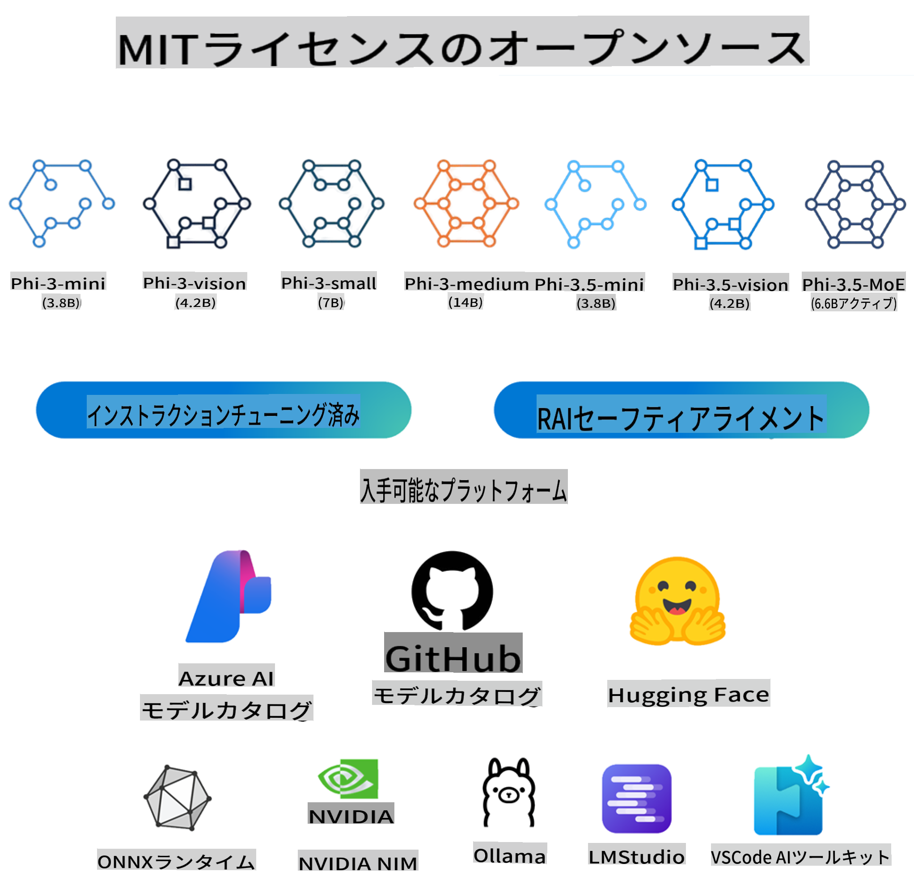

# Phi-3 クックブック: MicrosoftのPhi-3モデルを使ったハンズオン例

Phiは、Microsoftが開発したオープンAIモデルのファミリーです。Phiモデルは、同サイズおよび次のサイズアップのモデルに比べて、言語、推論、コーディング、数学のベンチマークにおいて優れた性能を発揮し、最も有能でコスト効率の高い小型言語モデル（SLM）です。Phi-3ファミリーには、異なるパラメータ量に基づいてトレーニングされたミニ、小、中、ビジョンバージョンが含まれており、さまざまなアプリケーションシナリオに対応しています。MicrosoftのPhiファミリーについての詳細な情報は、[Welcome to the Phi Family](/md/01.Introduce/Phi3Family.md)ページをご覧ください。

次のステップに従ってください：
1. **リポジトリをフォークする**: このページの右上にある「Fork」ボタンをクリックします。
2. **リポジトリをクローンする**: `git clone https://github.com/microsoft/Phi-3CookBook.git`

## 目次

- はじめに
  - [環境設定](./md/01.Introduce/EnvironmentSetup.md)(✅)
  - [Phiファミリーへようこそ](./md/01.Introduce/Phi3Family.md)(✅)
  - [主要技術の理解](./md/01.Introduce/Understandingtech.md)(✅)
  - [PhiモデルのAI安全性](./md/01.Introduce/AISafety.md)(✅)
  - [Phi-3のハードウェアサポート](./md/01.Introduce/Hardwaresupport.md)(✅)
  - [Phi-3モデルとプラットフォーム間の可用性](./md/01.Introduce/Edgeandcloud.md)(✅)
  - [Guidance-aiとPhiの使用](./md/01.Introduce/Guidance.md)(✅)
  - [GitHubマーケットプレイスモデル](https://github.com/marketplace/models)(✅)
  - [Azure AIモデルカタログ](https://ai.azure.com)(✅)

- クイックスタート
  - [GitHubモデルカタログでのPhi-3の使用](./md/02.QuickStart/GitHubModel_QuickStart.md)(✅)
  - [Hugging faceでのPhi-3の使用](./md/02.QuickStart/Huggingface_QuickStart.md)(✅)
  - [OpenAI SDKでのPhi-3の使用](./md/02.QuickStart/OpenAISDK_Quickstart.md)(✅)
  - [HttpリクエストでのPhi-3の使用](./md/02.QuickStart/HttpAPI_QuickStart.md)(✅)
  - [Azure AI StudioでのPhi-3の使用](./md/02.QuickStart/AzureAIStudio_QuickStart.md)(✅)
  - [Azure MaaSまたはMaaPでのPhi-3モデル推論の使用](./md/02.QuickStart/AzureModel_Inference.md)(✅)
  - [GitHubとAzure AIを使用したAzure推論APIでのPhi-3の使用](./md/02.QuickStart/AzureInferenceAPI_QuickStart.md)
  - [Azure AI StudioでのサーバーレスAPIとしてのPhi-3モデルのデプロイ](./md/02.QuickStart/AzureAIStudio_MaaS.md)(✅)
  - [OllamaでのPhi-3の使用](./md/02.QuickStart/Ollama_QuickStart.md)(✅)
- [LM StudioでPhi-3を使用する](./md/02.QuickStart/LMStudio_QuickStart.md)(✅)
  - [AI Toolkit VSCodeでPhi-3を使用する](./md/02.QuickStart/AITookit_QuickStart.md)(✅)
  - [Phi-3とLiteLLMを使用する](./md/02.QuickStart/LiteLLM_QuickStart.md)(✅)

- [Phi-3の推論](./md/03.Inference/overview.md)  
  - [iOSでPhi-3の推論を行う](./md/03.Inference/iOS_Inference.md)(✅)
  - [AndroidでPhi-3.5の推論を行う](./md/08.Update/Phi35/050.UsingPhi35TFLiteCreateAndroidApp.md)(✅)
  - [JetsonでPhi-3の推論を行う](./md/03.Inference/Jetson_Inference.md)(✅)
  - [AI PCでPhi-3の推論を行う](./md/03.Inference/AIPC_Inference.md)(✅)
  - [Apple MLX FrameworkでPhi-3の推論を行う](./md/03.Inference/MLX_Inference.md)(✅)
  - [ローカルサーバーでPhi-3の推論を行う](./md/03.Inference/Local_Server_Inference.md)(✅)
  - [AI Toolkitを使用してリモートサーバーでPhi-3の推論を行う](./md/03.Inference/Remote_Interence.md)(✅)
  - [RustでPhi-3の推論を行う](./md/03.Inference/Rust_Inference.md)(✅)
  - [ローカルでPhi-3-Visionの推論を行う](./md/03.Inference/Vision_Inference.md)(✅)
  - [Kaito AKS、Azure Containers（公式サポート）でPhi-3の推論を行う](./md/03.Inference/Kaito_Inference.md)(✅)
  - [あなたのファインチューニングされたONNX Runtimeモデルの推論を行う](./md/06.E2ESamples/E2E_Inference_ORT.md)(✅)

- Phi-3のファインチューニング
  - [サンプルデータセットのダウンロードと作成](./md/04.Fine-tuning/CreatingSampleData.md)(✅)
  - [ファインチューニングのシナリオ](./md/04.Fine-tuning/FineTuning_Scenarios.md)(✅)
  - [ファインチューニングとRAGの比較](./md/04.Fine-tuning/FineTuning_vs_RAG.md)(✅)
  - [Phi-3を業界の専門家にするファインチューニング](./md/04.Fine-tuning/LetPhi3gotoIndustriy.md)(✅)
  - [AI Toolkit for VS CodeでPhi-3をファインチューニングする](./md/04.Fine-tuning/Finetuning_VSCodeaitoolkit.md)(✅)
  - [Azure Machine Learning ServiceでPhi-3をファインチューニングする](./md/04.Fine-tuning/Introduce_AzureML.md)(✅)
  - [LoraでPhi-3をファインチューニングする](./md/04.Fine-tuning/FineTuning_Lora.md)(✅)
  - [QLoraでPhi-3をファインチューニングする](./md/04.Fine-tuning/FineTuning_Qlora.md)(✅)
  - [Azure AI StudioでPhi-3をファインチューニングする](./md/04.Fine-tuning/FineTuning_AIStudio.md)(✅)
  - [Azure ML CLI/SDKでPhi-3をファインチューニングする](./md/04.Fine-tuning/FineTuning_MLSDK.md)(✅)
  - [Microsoft Oliveでファインチューニングする](./md/04.Fine-tuning/FineTuning_MicrosoftOlive.md)(✅)
  - [Microsoft Oliveハンズオンラボでファインチューニングする](./code/04.Finetuning/olive-lab/readme.md)(✅)
  - [Weights and BiasでPhi-3-visionをファインチューニングする](./md/04.Fine-tuning/FineTuning_Phi-3-visionWandB.md)(✅)
  - [Apple MLX FrameworkでPhi-3をファインチューニングする](./md/04.Fine-tuning/FineTuning_MLX.md)(✅)
  - [Phi-3-visionをファインチューニングする（公式サポート）](./md/04.Fine-tuning/FineTuning_Vision.md)(✅)
- [Kaito AKS と Azure Containers を使用した Phi-3 のファインチューニング（公式サポート）](./md/04.Fine-tuning/FineTuning_Kaito.md)(✅)
  - [Phi-3 と 3.5 Vision のファインチューニング](https://github.com/2U1/Phi3-Vision-Finetune)(✅)

- Phi-3 の評価
  - [責任ある AI の概要](./md/05.Evaluation/ResponsibleAI.md)(✅)
  - [Promptflow の概要](./md/05.Evaluation/Promptflow.md)(✅)
  - [評価のための Azure AI Studio の概要](./md/05.Evaluation/AzureAIStudio.md)(✅)

- Phi-3-mini の E2E サンプル
  - [エンドツーエンド サンプルの概要](./md/06.E2ESamples/E2E_Introduction.md)(✅)
  - [業界データの準備](./md/06.E2ESamples/E2E_Datasets.md)(✅)
  - [Microsoft Olive を使用してプロジェクトを設計](./md/06.E2ESamples/E2E_LoRA&QLoRA_Config_With_Olive.md)(✅)
  - [Phi-3、ONNXRuntime Mobile、ONNXRuntime Generate API を使用した Android 上のローカルチャットボット](https://github.com/microsoft/onnxruntime-inference-examples/tree/main/mobile/examples/phi-3/android)(✅)
  - [Hugging Face Space WebGPU と Phi-3-mini デモ - Phi-3-mini はユーザーにプライベート（かつ強力な）チャットボット体験を提供します。試してみてください](https://huggingface.co/spaces/Xenova/experimental-phi3-webgpu)(✅)
  - [Phi3、ONNX Runtime Web、WebGPU を使用したブラウザ上のローカルチャットボット](https://github.com/microsoft/onnxruntime-inference-examples/tree/main/js/chat)(✅)
  - [OpenVino チャット](/md/06.E2ESamples/E2E_OpenVino_Chat.md)(✅)
  - [マルチモデル - インタラクティブ Phi-3-mini と OpenAI Whisper](./md/06.E2ESamples/E2E_Phi-3-mini_with_whisper.md)(✅)
  - [MLFlow - ラッパーの構築と MLFlow を使用した Phi-3](./md/06.E2ESamples/E2E_Phi-3-MLflow.md)(✅)
  - [モデル最適化 - Olive を使用して ONNX Runtime Web 用の Phi-3-min モデルを最適化する方法](https://github.com/microsoft/Olive/tree/main/examples/phi3)(✅)
  - [Phi-3 mini-4k-instruct-onnx を使用した WinUI3 アプリ](https://github.com/microsoft/Phi3-Chat-WinUI3-Sample/)(✅)
  - [WinUI3 マルチモデル AI パワード ノートアプリのサンプル](https://github.com/microsoft/ai-powered-notes-winui3-sample)(✅)
  - [Prompt flow を使用したカスタム Phi-3 モデルのファインチューニングと統合](./md/06.E2ESamples/E2E_Phi-3-FineTuning_PromptFlow_Integration.md)(✅)
  - [Azure AI Studio で Prompt flow を使用したカスタム Phi-3 モデルのファインチューニングと統合](./md/06.E2ESamples/E2E_Phi-3-FineTuning_PromptFlow_Integration_AIstudio.md)(✅)
  - [Microsoft の責任ある AI の原則に焦点を当てた Azure AI Studio でのファインチューニングされた Phi-3 / Phi-3.5 モデルの評価](./md/06.E2ESamples/E2E_Phi-3-Evaluation_AIstudio.md)(✅)
  - [Phi-3.5-mini-instruct 言語予測サンプル（中国語/英語）](../../code/09.UpdateSamples/Aug/phi3-instruct-demo.ipynb)(✅)

- Phi-3-vision の E2E サンプル
  - [Phi-3-vision-画像テキストからテキストへ](../../code/06.E2E/E2E_Phi-3-vision-image-text-to-text-online-endpoint.ipynb)(✅)
  - [Phi-3-vision-ONNX](https://onnxruntime.ai/docs/genai/tutorials/phi3-v.html)(✅)
  - [Phi-3-vision CLIP 埋め込み](./md/06.E2ESamples/E2E_Phi-3-Embedding_Images_with_CLIPVision.md)(✅)
  - [デモ: Phi-3 リサイクル](https://github.com/jennifermarsman/PhiRecycling/)(✅)
  - [Phi-3-vision - Phi3-Vision と OpenVINO を使用した視覚言語アシスタント](https://docs.openvino.ai/nightly/notebooks/phi-3-vision-with-output.html)(✅)
  - [Phi-3 Vision Nvidia NIM](/md/06.E2ESamples/E2E_Nvidia_NIM_Vision.md)(✅)
  - [Phi-3 Vision OpenVino](/md/06.E2ESamples/E2E_OpenVino_Phi3Vision.md)(✅)
  - [Phi-3.5 Vision マルチフレームまたはマルチイメージサンプル](../../code/09.UpdateSamples/Aug/phi3-vision-demo.ipynb)(✅)

- Phi-3.5-MoE の E2E サンプル
  - [Phi-3.5 エキスパートモデル (MoEs) ソーシャルメディアサンプル](../../code/09.UpdateSamples/Aug/phi3_moe_demo.ipynb)(✅)
- [NVIDIA NIM Phi-3 MOE、Azure AI Search、LlamaIndexを使用したRetrieval-Augmented Generation (RAG) パイプラインの構築](https://github.com/farzad528/azure-ai-search-python-playground/blob/main/azure-ai-search-nvidia-rag.ipynb)(✅)

- ラボとワークショップのサンプル Phi-3
  - [C# .NET ラボ](./md/07.Labs/Csharp/csharplabs.md)(✅)
  - [Microsoft Phi-3 ファミリーで自分のVisual Studio Code GitHub Copilot Chatを作成する](./md/07.Labs/VSCode/README.md)(✅)
  - [ローカルRAGファイルを使用したローカルWebGPU Phi-3 Mini RAG Chatbotのサンプル](./code/08.RAG/rag_webgpu_chat/README.md)(✅)
  - [Phi-3 ONNX チュートリアル](https://onnxruntime.ai/docs/genai/tutorials/phi3-python.html)(✅)
  - [Phi-3-vision ONNX チュートリアル](https://onnxruntime.ai/docs/genai/tutorials/phi3-v.html)(✅)
  - [ONNX Runtime generate() APIを使用してPhi-3モデルを実行する](https://github.com/microsoft/onnxruntime-genai/blob/main/examples/python/phi-3-tutorial.md)(✅)
  - [Phi-3 ONNX マルチモデル LLM チャット UI、これはチャットデモです](https://github.com/microsoft/onnxruntime-genai/tree/main/examples/chat_app)(✅)
  - [C# Hello Phi-3 ONNX の例 Phi-3](https://github.com/microsoft/onnxruntime-genai/tree/main/examples/csharp/HelloPhi)(✅)
  - [C# API Phi-3 ONNX の例 Phi3-Visionをサポート](https://github.com/microsoft/onnxruntime-genai/tree/main/examples/csharp/HelloPhi3V)(✅)
  - [CodeSpaceでC# Phi-3サンプルを実行する](./md/07.Labs/CsharpOllamaCodeSpaces/CsharpOllamaCodeSpaces.md)(✅)
  - [PromptflowとAzure AI Searchを使用してPhi-3を使用する](./code/07.Lab/RAG_with_PromptFlow_and_AISearch/README.md)(✅)
  - [Windows Copilotライブラリを使用したWindows AI-PC API](https://developer.microsoft.com/windows/ai/?WT.mc_id=aiml-137032-kinfeylo)

- Phi-3.5の学習
  - [Phi-3.5ファミリーの新機能](./md/08.Update/Phi35/010.WhatsNewInPhi35.md)(✅)
  - [Phi-3.5ファミリーの量子化](./md/08.Update/Phi35/020.QuantifyingPhi35.md)(✅)
    - [llama.cppを使用してPhi-3.5を量子化する](./md/08.Update/Phi35/021.UsingLlamacppQuantifyingPhi35.md)(✅)
    - [onnxruntimeの生成的AI拡張を使用してPhi-3.5を量子化する](./md/08.Update/Phi35/022.UsingORTGenAIQuantifyingPhi35.md)(✅)
    - [Intel OpenVINOを使用してPhi-3.5を量子化する](./md/08.Update/Phi35/023.UsingIntelOpenVINOQuantifyingPhi35.md)(✅)
    - [Apple MLX Frameworkを使用してPhi-3.5を量子化する](./md/08.Update/Phi35/024.UsingAppleMLXQuantifyingPhi35.md)(✅)
  - Phi-3.5アプリケーションサンプル
    - [Phi-3.5-Instruct WebGPU RAG Chatbot](./md/08.Update/Phi35/031.WebGPUWithPhi35Readme.md)(✅)
    - [GitHub Modelsを使用してPhi-3.5で自分のVisual Studio Code Chat Copilotエージェントを作成する](./md/08.Update/Phi35/032.CreateVSCodeChatAgentWithGitHubModels.md)(✅)
    - [Windows GPUを使用してPhi-3.5-Instruct ONNXでプロンプトフローソリューションを作成する](./md/08.Update/Phi35/040.UsingPromptFlowWithONNX.md)(✅)
    - [Microsoft Phi-3.5 tfliteを使用してAndroidアプリを作成する](./md/08.Update/Phi35/050.UsingPhi35TFLiteCreateAndroidApp.md)(✅)

## Phi-3モデルの使用

### Azure AI StudioでのPhi-3

Microsoft Phi-3の使用方法と、異なるハードウェアデバイスでE2Eソリューションを構築する方法を学べます。Phi-3を自分で体験するには、モデルを試して、シナリオに合わせてPhi-3をカスタマイズすることから始めてください。 [Azure AI Foundry Azure AI Model Catalog](https://aka.ms/phi3-azure-ai)で詳細を学べます。[Azure AI Studio](/md/02.QuickStart/AzureAIStudio_QuickStart.md)で始める方法についての詳細はこちら。

**Playground**
各モデルには専用のプレイグラウンドがあります。[Azure AI Playground](https://aka.ms/try-phi3)でモデルをテストしてください。

### GitHub ModelsでのPhi-3

Microsoft Phi-3の使用方法と、異なるハードウェアデバイスでE2Eソリューションを構築する方法を学べます。Phi-3を自分で体験するには、モデルを試して、シナリオに合わせてPhi-3をカスタマイズすることから始めてください。 [GitHub Model Catalog](https://github.com/marketplace/models?WT.mc_id=aiml-137032-kinfeylo)で詳細を学べます。[GitHub Model Catalog](/md/02.QuickStart/GitHubModel_QuickStart.md)で始める方法についての詳細はこちら。

**Playground**
各モデルには専用の[プレイグラウンドがあります](/md/02.QuickStart/GitHubModel_QuickStart.md)。

### Hugging FaceでのPhi-3

モデルは[Hugging Face](https://huggingface.co/microsoft)でも見つけることができます。

**Playground**
[Hugging Chat playground](https://huggingface.co/chat/models/microsoft/Phi-3-mini-4k-instruct)

## 🌐 多言語サポート

> **Note:**
> これらの翻訳はオープンソースの [co-op-translator](https://github.com/Azure/co-op-translator) を使用して自動的に生成されたものであり、誤りや不正確な情報が含まれている可能性があります。重要な情報については、元の情報を参照するか、専門の人間の翻訳を依頼することをお勧めします。翻訳を追加または更新したい場合は、[co-op-translator](https://github.com/Azure/co-op-translator) リポジトリを参照してください。簡単なコマンドを使用して簡単に貢献できます。

| 言語                 | コード | 翻訳されたREADMEへのリンク                             | 最終更新日   |
|----------------------|--------|---------------------------------------------------------|--------------|
| 中国語 (簡体字)      | zh     | [Chinese Translation](../zh/README.md)      | 2024-11-29   |
| 中国語 (繁体字)      | tw     | [Chinese Translation](../tw/README.md)      | 2024-11-29   |
| フランス語           | fr     | [French Translation](../fr/README.md)       | 2024-11-29   |
| 日本語               | ja     | [Japanese Translation](./README.md)     | 2024-11-29   |
| 韓国語               | ko     | [Korean Translation](../ko/README.md)       | 2024-11-29   |
| スペイン語           | es     | [Spanish Translation](../es/README.md)      | 2024-11-29   |

## 商標

このプロジェクトには、プロジェクト、製品、またはサービスの商標やロゴが含まれている場合があります。Microsoftの商標やロゴの使用は、[Microsoftの商標およびブランドガイドライン](https://www.microsoft.com/legal/intellectualproperty/trademarks/usage/general) に従う必要があります。このプロジェクトの改変版でMicrosoftの商標やロゴを使用する場合、混乱を引き起こしたり、Microsoftの後援を暗示したりしないようにしなければなりません。第三者の商標やロゴの使用は、それらの第三者のポリシーに従う必要があります。

**免責事項**:
この文書は機械翻訳AIサービスを使用して翻訳されています。正確性を期しておりますが、自動翻訳には誤りや不正確さが含まれる可能性があります。元の言語での原文が信頼できる情報源と見なされるべきです。重要な情報については、専門の人間による翻訳をお勧めします。この翻訳の使用に起因する誤解や誤解については、一切の責任を負いません。