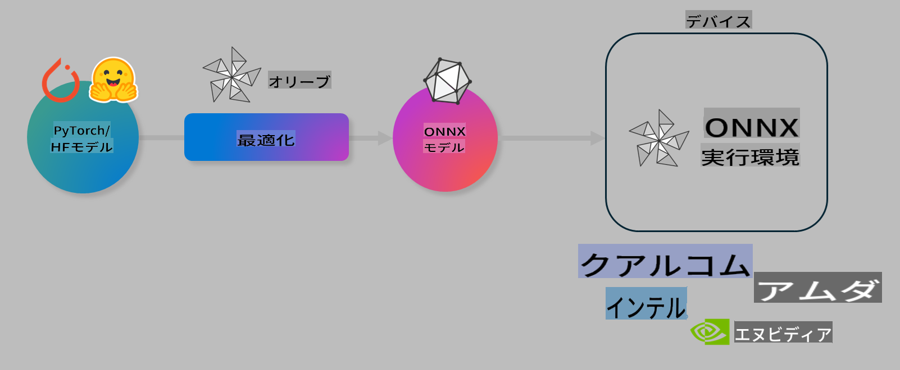

# ラボ. AIモデルをオンデバイス推論向けに最適化する

## はじめに

> [!IMPORTANT]
> このラボでは、**Nvidia A10 または A100 GPU** と、それに関連するドライバおよび CUDA ツールキット（バージョン12以上）が必要です。

> [!NOTE]
> このラボは **35分** で完了するハンズオンで、OLIVE を使用してオンデバイス推論向けにモデルを最適化するための基本概念を紹介します。

## 学習目標

このラボを終えると、OLIVE を使用して以下ができるようになります：

- AWQ量子化手法を使用してAIモデルを量子化する。
- 特定のタスクに向けてAIモデルを微調整する。
- ONNX Runtime 上で効率的なオンデバイス推論を実現するための LoRA アダプター（微調整済みモデル）を生成する。

### Oliveとは？

Olive (*O*NNX *live*) は、ONNX Runtime +++https://onnxruntime.ai+++ 向けのモデルを高品質かつ高性能に最適化するためのツールキットとCLIを提供します。



Olive の入力は通常、PyTorch または Hugging Face モデルであり、出力は ONNX Runtime を実行するデバイス（デプロイメントターゲット）で実行される最適化された ONNX モデルです。Olive は、Qualcomm、AMD、Nvidia、Intel などのハードウェアベンダーが提供するデプロイメントターゲットの AI アクセラレータ（NPU、GPU、CPU）向けにモデルを最適化します。

Olive は、個別のモデル最適化タスクである *パス* を順序付けたシーケンスとして実行する *ワークフロー* を実行します。例としては、モデル圧縮、グラフキャプチャ、量子化、グラフ最適化などのパスがあります。各パスには、精度やレイテンシーなどの最適なメトリクスを達成するために調整可能なパラメータが設定されています。Olive は、検索アルゴリズムを使用して各パスまたは複数のパスを自動調整する検索戦略を採用しています。

#### Oliveの利点

- **試行錯誤の手間と時間を削減**：グラフ最適化、圧縮、量子化のさまざまな手法を手動で試す必要がなくなります。品質とパフォーマンスの制約を定義すれば、Olive が最適なモデルを自動的に見つけます。
- **40以上の組み込みモデル最適化コンポーネント**：量子化、圧縮、グラフ最適化、微調整における最先端技術を網羅。
- **使いやすいCLI**：例えば、`olive quantize`、`olive auto-opt`、`olive finetune` のような一般的なモデル最適化タスクを簡単に実行可能。
- モデルのパッケージングとデプロイメントが組み込み済み。
- **マルチLoRAサービング** 向けのモデル生成をサポート。
- YAML/JSON を使用してワークフローを構築し、モデル最適化およびデプロイメントタスクをオーケストレーション可能。
- **Hugging Face** および **Azure AI** との統合。
- コスト削減を実現する **キャッシング** 機能を内蔵。

## ラボの手順
> [!NOTE]
> Azure AI Hub とプロジェクトをプロビジョニングし、Lab 1 に従って A100 コンピュートを設定していることを確認してください。

### ステップ 0: Azure AI Compute に接続する

**VS Code** のリモート機能を使用して Azure AI Compute に接続します。

1. **VS Code** デスクトップアプリケーションを開きます。
1. **Shift+Ctrl+P** を押して **コマンドパレット** を開きます。
1. コマンドパレットで **AzureML - remote: Connect to compute instance in New Window** を検索します。
1. 画面の指示に従い、Lab 1 で設定した Azure サブスクリプション、リソースグループ、プロジェクト、コンピュート名を選択して接続します。
1. Azure ML Compute ノードに接続されると、**VS Code の左下** に表示されます `><Azure ML: Compute Name`

### ステップ 1: このリポジトリをクローンする

VS Code で **Ctrl+J** を押して新しいターミナルを開き、このリポジトリをクローンします。

ターミナルで以下のプロンプトが表示されます：

```
azureuser@computername:~/cloudfiles/code$ 
```
リポジトリをクローンします：

```bash
cd ~/localfiles
git clone https://github.com/microsoft/phi-3cookbook.git
```

### ステップ 2: フォルダを VS Code で開く

関連フォルダで VS Code を開くには、ターミナルで以下のコマンドを実行します。この操作で新しいウィンドウが開きます：

```bash
code phi-3cookbook/code/04.Finetuning/Olive-lab
```

または、**ファイル** > **フォルダを開く** を選択してフォルダを開くこともできます。

### ステップ 3: 依存関係

Azure AI Compute インスタンス内で VS Code のターミナルウィンドウを開き（ヒント: **Ctrl+J**）、以下のコマンドを実行して依存関係をインストールします：

```bash
conda create -n olive-ai python=3.11 -y
conda activate olive-ai
pip install -r requirements.txt
az extension remove -n azure-cli-ml
az extension add -n ml
```

> [!NOTE]
> すべての依存関係のインストールには約5分かかります。

このラボでは、Azure AI モデルカタログにモデルをダウンロードおよびアップロードします。モデルカタログにアクセスするために、以下のコマンドで Azure にログインする必要があります：

```bash
az login
```

> [!NOTE]
> ログイン時にサブスクリプションを選択するよう求められます。このラボで提供されたサブスクリプションを選択してください。

### ステップ 4: Olive コマンドを実行する

Azure AI Compute インスタンス内で VS Code のターミナルウィンドウを開き（ヒント: **Ctrl+J**）、`olive-ai` conda 環境がアクティブであることを確認してください：

```bash
conda activate olive-ai
```

次に、以下の Olive コマンドをコマンドラインで実行します。

1. **データの確認**：この例では、Phi-3.5-Mini モデルを微調整して旅行関連の質問に特化させます。以下のコードは、JSON lines フォーマットのデータセットの最初の数レコードを表示します：
   
    ```bash
    head data/data_sample_travel.jsonl
    ```
1. **モデルの量子化**：モデルをトレーニングする前に、Active Aware Quantization (AWQ) +++https://arxiv.org/abs/2306.00978+++ と呼ばれる手法を使用して以下のコマンドで量子化します。AWQ は、推論中に生成されるアクティベーションを考慮してモデルの重みを量子化します。これにより、従来の重み量子化手法と比較して、モデル精度の保持が向上します。
    
    ```bash
    olive quantize \
       --model_name_or_path microsoft/Phi-3.5-mini-instruct \
       --trust_remote_code \
       --algorithm awq \
       --output_path models/phi/awq \
       --log_level 1
    ```
    
    AWQ量子化の完了には **約8分** かかり、**モデルサイズは約7.5GBから約2.5GBに縮小** されます。
   
   このラボでは、Hugging Face からモデルを入力する方法を示します（例：`microsoft/Phi-3.5-mini-instruct`). However, Olive also allows you to input models from the Azure AI catalog by updating the `model_name_or_path` argument to an Azure AI asset ID (for example:  `azureml://registries/azureml/models/Phi-3.5-mini-instruct/versions/4`). 

1. **Train the model:** Next, the `olive finetune` コマンドは量子化済みモデルを微調整します。量子化後ではなく、微調整の前にモデルを量子化することで、量子化による損失の一部を微調整プロセスで回復できます。
    
    ```bash
    olive finetune \
        --method lora \
        --model_name_or_path models/phi/awq \
        --data_files "data/data_sample_travel.jsonl" \
        --data_name "json" \
        --text_template "<|user|>\n{prompt}<|end|>\n<|assistant|>\n{response}<|end|>" \
        --max_steps 100 \
        --output_path ./models/phi/ft \
        --log_level 1
    ```
    
    微調整（100ステップ）は **約6分** で完了します。

1. **最適化**：トレーニング済みモデルを、Olive の `auto-opt` command, which will capture the ONNX graph and automatically perform a number of optimizations to improve the model performance for CPU by compressing the model and doing fusions. It should be noted, that you can also optimize for other devices such as NPU or GPU by just updating the `--device` and `--provider` 引数を使用して最適化します。ただし、このラボでは CPU を使用します。

    ```bash
    olive auto-opt \
       --model_name_or_path models/phi/ft/model \
       --adapter_path models/phi/ft/adapter \
       --device cpu \
       --provider CPUExecutionProvider \
       --use_ort_genai \
       --output_path models/phi/onnx-ao \
       --log_level 1
    ```
    
    最適化の完了には **約5分** かかります。

### ステップ 5: モデル推論の簡易テスト

モデルの推論をテストするため、フォルダ内に **app.py** という名前の Python ファイルを作成し、以下のコードをコピー＆ペーストします：

```python
import onnxruntime_genai as og
import numpy as np

print("loading model and adapters...", end="", flush=True)
model = og.Model("models/phi/onnx-ao/model")
adapters = og.Adapters(model)
adapters.load("models/phi/onnx-ao/model/adapter_weights.onnx_adapter", "travel")
print("DONE!")

tokenizer = og.Tokenizer(model)
tokenizer_stream = tokenizer.create_stream()

params = og.GeneratorParams(model)
params.set_search_options(max_length=100, past_present_share_buffer=False)
user_input = "what is the best thing to see in chicago"
params.input_ids = tokenizer.encode(f"<|user|>\n{user_input}<|end|>\n<|assistant|>\n")

generator = og.Generator(model, params)

generator.set_active_adapter(adapters, "travel")

print(f"{user_input}")

while not generator.is_done():
    generator.compute_logits()
    generator.generate_next_token()

    new_token = generator.get_next_tokens()[0]
    print(tokenizer_stream.decode(new_token), end='', flush=True)

print("\n")
```

以下のコマンドでコードを実行します：

```bash
python app.py
```

### ステップ 6: モデルを Azure AI にアップロードする

モデルを Azure AI モデルリポジトリにアップロードすることで、開発チームの他のメンバーと共有でき、モデルのバージョン管理も行えます。以下のコマンドを実行してモデルをアップロードします：

> [!NOTE]
> `{}` placeholders with the name of your resource group and Azure AI Project Name. 

To find your resource group `"resourceGroup"` と Azure AI プロジェクト名を更新して、以下のコマンドを実行してください：

```
az ml workspace show
```

または、+++ai.azure.com+++ にアクセスし、**管理センター** > **プロジェクト** > **概要** を選択します。

`{}` プレースホルダをリソースグループ名と Azure AI プロジェクト名で更新してください。

```bash
az ml model create \
    --name ft-for-travel \
    --version 1 \
    --path ./models/phi/onnx-ao \
    --resource-group {RESOURCE_GROUP_NAME} \
    --workspace-name {PROJECT_NAME}
```
その後、https://ml.azure.com/model/list でアップロードしたモデルを確認し、デプロイすることができます。

**免責事項**:  
この文書は、機械翻訳AIサービスを使用して翻訳されています。正確性を追求しておりますが、自動翻訳には誤りや不正確な部分が含まれる場合があります。原文（原言語の文書）を公式で信頼できる情報源としてお考えください。重要な情報については、専門の人間による翻訳を推奨します。本翻訳の使用により生じた誤解や誤った解釈について、当方は一切の責任を負いません。