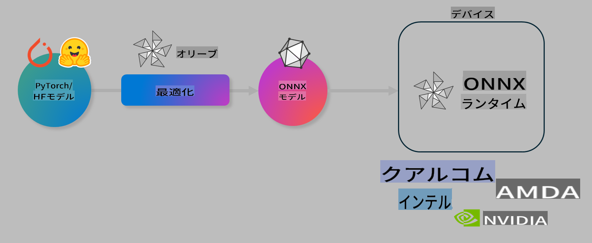

# ラボ. デバイス上での推論のためのAIモデルの最適化

## はじめに

> [!IMPORTANT]
> このラボでは、関連するドライバーとCUDAツールキット（バージョン12+）がインストールされた**Nvidia A10またはA100 GPU**が必要です。

> [!NOTE]
> このラボは**35分**で、OLIVEを使用してデバイス上での推論のためのモデル最適化の基本概念を実践的に紹介します。

## 学習目標

このラボを終えると、OLIVEを使用して以下のことができるようになります：

- AWQ量子化手法を使用してAIモデルを量子化する。
- 特定のタスクのためにAIモデルを微調整する。
- ONNX Runtimeでの効率的なデバイス上の推論のためにLoRAアダプター（微調整されたモデル）を生成する。

### Oliveとは

Olive (*O*NNX *live*)は、ONNXランタイム +++https://onnxruntime.ai+++ 用のモデルを高品質かつ高性能で出荷するためのモデル最適化ツールキットで、CLIも付属しています。



Oliveへの入力は通常、PyTorchまたはHugging Faceモデルであり、出力はONNXランタイムを実行しているデバイス（デプロイターゲット）で実行される最適化されたONNXモデルです。Oliveは、Qualcomm、AMD、Nvidia、Intelなどのハードウェアベンダーが提供するデプロイターゲットのAIアクセラレータ（NPU、GPU、CPU）向けにモデルを最適化します。

Oliveは*ワークフロー*を実行します。これは、個々のモデル最適化タスク（*パス*と呼ばれる）の順序付けされたシーケンスです。例としては、モデル圧縮、グラフキャプチャ、量子化、グラフ最適化などがあります。各パスには、精度や遅延などの最良のメトリクスを達成するために調整できるパラメータのセットがあります。Oliveは、検索アルゴリズムを使用して各パスを一つずつまたはセットで自動調整する検索戦略を採用しています。

#### Oliveの利点

- グラフ最適化、圧縮、量子化の異なる手法の試行錯誤による**フラストレーションと時間を削減**します。品質とパフォーマンスの制約を定義し、Oliveが最適なモデルを自動的に見つけます。
- **40以上の組み込みモデル最適化コンポーネント**があり、量子化、圧縮、グラフ最適化、微調整の最先端技術をカバーしています。
- 一般的なモデル最適化タスクのための**使いやすいCLI**。例えば、olive quantize、olive auto-opt、olive finetune。
- モデルのパッケージングとデプロイが組み込まれています。
- **マルチLoRAサービング**用のモデル生成をサポートします。
- YAML/JSONを使用してワークフローを構築し、モデル最適化およびデプロイタスクをオーケストレーションします。
- **Hugging Face**および**Azure AI**との統合。
- **コストを節約**するための**キャッシング**機能が組み込まれています。

## ラボの手順
> [!NOTE]
> Azure AI Hubとプロジェクトをプロビジョニングし、Lab 1に従ってA100コンピュートを設定していることを確認してください。

### ステップ0: Azure AI Computeに接続する

**VS Code**のリモート機能を使用してAzure AIコンピュートに接続します。

1. **VS Code**デスクトップアプリケーションを開きます。
1. **Shift+Ctrl+P**を使用して**コマンドパレット**を開きます。
1. コマンドパレットで**AzureML - remote: Connect to compute instance in New Window**を検索します。
1. 画面の指示に従ってコンピュートに接続します。これには、Lab 1で設定したAzureサブスクリプション、リソースグループ、プロジェクト、およびコンピュート名の選択が含まれます。
1. Azure ML Computeノードに接続されると、**Visual Codeの左下**に表示されます。 `><Azure ML: Compute Name`

### ステップ1: このリポジトリをクローンする

VS Codeで**Ctrl+J**を使用して新しいターミナルを開き、このリポジトリをクローンします：

ターミナルに次のプロンプトが表示されます

```
azureuser@computername:~/cloudfiles/code$ 
```
ソリューションをクローンします

```bash
cd ~/localfiles
git clone https://github.com/microsoft/phi-3cookbook.git
```

### ステップ2: フォルダーをVS Codeで開く

関連するフォルダーでVS Codeを開くには、ターミナルで次のコマンドを実行し、新しいウィンドウを開きます：

```bash
code phi-3cookbook/code/04.Finetuning/Olive-lab
```

または、**ファイル** > **フォルダーを開く**を選択してフォルダーを開くこともできます。

### ステップ3: 依存関係

VS CodeのAzure AI Computeインスタンスでターミナルウィンドウを開き（ヒント: **Ctrl+J**）、次のコマンドを実行して依存関係をインストールします：

```bash
conda create -n olive-ai python=3.11 -y
conda activate olive-ai
pip install -r requirements.txt
az extension remove -n azure-cli-ml
az extension add -n ml
```

> [!NOTE]
> すべての依存関係のインストールには約5分かかります。

このラボでは、モデルをAzure AIモデルカタログにダウンロードおよびアップロードします。モデルカタログにアクセスできるようにするために、次のコマンドを使用してAzureにログインする必要があります：

```bash
az login
```

> [!NOTE]
> ログイン時にサブスクリプションの選択を求められます。このラボに提供されたサブスクリプションを設定してください。

### ステップ4: Oliveコマンドを実行する

VS CodeのAzure AI Computeインスタンスでターミナルウィンドウを開き（ヒント: **Ctrl+J**）、`olive-ai`コンダ環境がアクティブになっていることを確認します：

```bash
conda activate olive-ai
```

次に、以下のOliveコマンドをコマンドラインで実行します。

1. **データを確認する:** この例では、Phi-3.5-Miniモデルを微調整して旅行関連の質問に答えるようにします。以下のコードは、JSONライン形式のデータセットの最初の数レコードを表示します：
   
    ```bash
    head data/data_sample_travel.jsonl
    ```
1. **モデルを量子化する:** モデルをトレーニングする前に、Active Aware Quantization（AWQ）+++https://arxiv.org/abs/2306.00978+++という手法を使用して次のコマンドで量子化します。AWQは、推論中に生成されるアクティベーションを考慮してモデルの重みを量子化します。これは、アクティベーションの実際のデータ分布を考慮するため、従来の重み量子化手法と比較してモデルの精度をより良く保持します。
    
    ```bash
    olive quantize \
       --model_name_or_path microsoft/Phi-3.5-mini-instruct \
       --trust_remote_code \
       --algorithm awq \
       --output_path models/phi/awq \
       --log_level 1
    ```
    
    AWQ量子化の完了には約8分かかり、モデルサイズは約7.5GBから約2.5GBに減少します。
   
   このラボでは、Hugging Faceからモデルを入力する方法を示しています（例: `microsoft/Phi-3.5-mini-instruct`). However, Olive also allows you to input models from the Azure AI catalog by updating the `model_name_or_path` argument to an Azure AI asset ID (for example:  `azureml://registries/azureml/models/Phi-3.5-mini-instruct/versions/4`). 

1. **Train the model:** Next, the `olive finetune` コマンドは量子化されたモデルを微調整します。モデルを微調整する前に量子化することで、量子化による損失の一部を回復するため、より良い精度が得られます。
    
    ```bash
    olive finetune \
        --method lora \
        --model_name_or_path models/phi/awq \
        --data_files "data/data_sample_travel.jsonl" \
        --data_name "json" \
        --text_template "<|user|>\n{prompt}<|end|>\n<|assistant|>\n{response}<|end|>" \
        --max_steps 100 \
        --output_path ./models/phi/ft \
        --log_level 1
    ```
    
    微調整（100ステップ）の完了には約6分かかります。

1. **最適化:** トレーニングされたモデルを使用して、次にOliveの `auto-opt` command, which will capture the ONNX graph and automatically perform a number of optimizations to improve the model performance for CPU by compressing the model and doing fusions. It should be noted, that you can also optimize for other devices such as NPU or GPU by just updating the `--device` and `--provider` 引数を使用してモデルを最適化しますが、このラボの目的ではCPUを使用します。

    ```bash
    olive auto-opt \
       --model_name_or_path models/phi/ft/model \
       --adapter_path models/phi/ft/adapter \
       --device cpu \
       --provider CPUExecutionProvider \
       --use_ort_genai \
       --output_path models/phi/onnx-ao \
       --log_level 1
    ```
    
    最適化の完了には約5分かかります。

### ステップ5: モデル推論の簡単なテスト

モデルの推論をテストするために、フォルダー内に**app.py**という名前のPythonファイルを作成し、次のコードをコピー＆ペーストします：

```python
import onnxruntime_genai as og
import numpy as np

print("loading model and adapters...", end="", flush=True)
model = og.Model("models/phi/onnx-ao/model")
adapters = og.Adapters(model)
adapters.load("models/phi/onnx-ao/model/adapter_weights.onnx_adapter", "travel")
print("DONE!")

tokenizer = og.Tokenizer(model)
tokenizer_stream = tokenizer.create_stream()

params = og.GeneratorParams(model)
params.set_search_options(max_length=100, past_present_share_buffer=False)
user_input = "what is the best thing to see in chicago"
params.input_ids = tokenizer.encode(f"<|user|>\n{user_input}<|end|>\n<|assistant|>\n")

generator = og.Generator(model, params)

generator.set_active_adapter(adapters, "travel")

print(f"{user_input}")

while not generator.is_done():
    generator.compute_logits()
    generator.generate_next_token()

    new_token = generator.get_next_tokens()[0]
    print(tokenizer_stream.decode(new_token), end='', flush=True)

print("\n")
```

次のコマンドでコードを実行します：

```bash
python app.py
```

### ステップ6: モデルをAzure AIにアップロードする

モデルをAzure AIモデルリポジトリにアップロードすることで、開発チームの他のメンバーと共有可能になり、モデルのバージョン管理も行えます。モデルをアップロードするには、次のコマンドを実行します：

> [!NOTE]
> `{}` placeholders with the name of your resource group and Azure AI Project Name. 

To find your resource group `"resourceGroup"and Azure AI Project name`を更新し、次のコマンドを実行します

```
az ml workspace show
```

または +++ai.azure.com+++ にアクセスし、**管理センター** **プロジェクト** **概要**を選択して実行します。

`{}`プレースホルダーをリソースグループ名とAzure AIプロジェクト名で更新します。

```bash
az ml model create \
    --name ft-for-travel \
    --version 1 \
    --path ./models/phi/onnx-ao \
    --resource-group {RESOURCE_GROUP_NAME} \
    --workspace-name {PROJECT_NAME}
```
次に、アップロードしたモデルを確認し、https://ml.azure.com/model/list でモデルをデプロイできます。

**免責事項**：
この文書は機械ベースのAI翻訳サービスを使用して翻訳されています。正確さを期しておりますが、自動翻訳には誤りや不正確さが含まれる場合がありますのでご注意ください。原文の言語で書かれた元の文書を信頼できる情報源と見なしてください。重要な情報については、専門の人間による翻訳をお勧めします。この翻訳の使用に起因する誤解や誤訳について、当社は一切の責任を負いかねます。