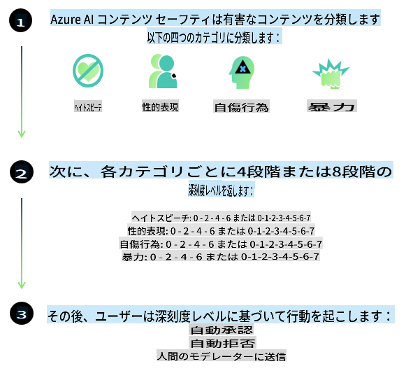
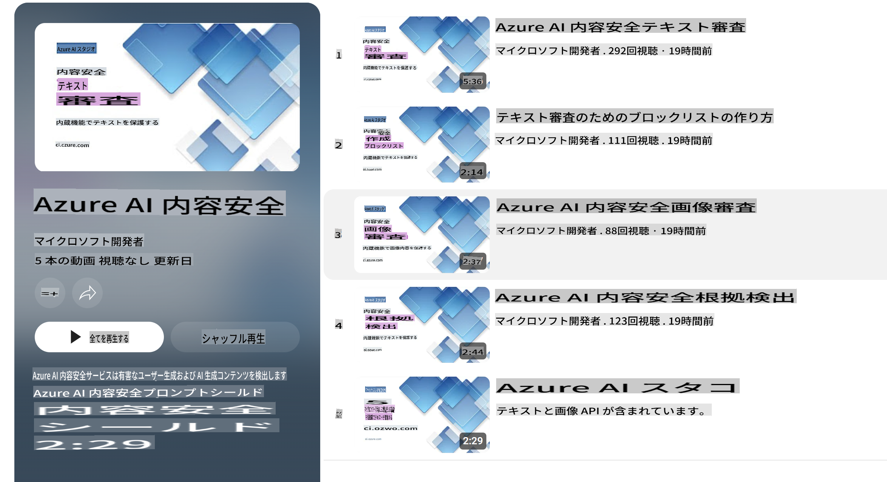

# Phi-3モデルのAI安全性
Phi-3ファミリーのモデルは、次の6つの原則に基づく会社全体の要件セットである[Microsoft Responsible AI Standard](https://query.prod.cms.rt.microsoft.com/cms/api/am/binary/RE5cmFl?culture=en-us&country=us)に従って開発されました。これらの原則は、説明責任、透明性、公平性、信頼性と安全性、プライバシーとセキュリティ、および包括性であり、[MicrosoftのResponsible AI原則](https://www.microsoft.com/ai/responsible-ai)を形成しています。

以前のPhi-3モデルと同様に、多面的な安全性評価と安全性の後トレーニングアプローチが採用されており、今回のリリースでは多言語対応を考慮した追加の対策が講じられています。我々の安全性トレーニングと評価のアプローチには、複数の言語とリスクカテゴリにわたるテストが含まれており、その詳細は[Phi-3 Safety Post-Training Paper](https://arxiv.org/abs/2407.13833)に記載されています。Phi-3モデルはこのアプローチの恩恵を受けていますが、開発者は特定の使用ケースおよび文化的・言語的コンテキストに関連するリスクをマッピング、測定、および軽減するためのResponsible AIのベストプラクティスを適用する必要があります。

## ベストプラクティス

他のモデルと同様に、Phiファミリーのモデルも不公平、不信頼、または攻撃的な振る舞いをする可能性があります。

SLMおよびLLMの制限される振る舞いのいくつかは次のとおりです：

- **サービスの品質:** Phiモデルは主に英語のテキストでトレーニングされています。英語以外の言語ではパフォーマンスが低下する可能性があります。トレーニングデータにおいて代表性が低い英語のバリエーションは、標準的なアメリカ英語よりもパフォーマンスが低下する可能性があります。
- **有害な表現とステレオタイプの継続:** これらのモデルは特定の人々のグループを過剰または過少に表現したり、一部のグループの表現を消去したり、侮辱的または否定的なステレオタイプを強化することがあります。安全性の後トレーニングにもかかわらず、これらの制限は異なるグループの表現レベルやトレーニングデータにおける否定的なステレオタイプの例の存在により依然として存在する可能性があります。
- **不適切または攻撃的なコンテンツ:** これらのモデルは他の種類の不適切または攻撃的なコンテンツを生成する可能性があり、特定の使用ケースに対して追加の軽減策なしでは敏感なコンテキストに展開するのは不適切かもしれません。
- **情報の信頼性:** 言語モデルは無意味なコンテンツを生成したり、合理的に聞こえるが不正確または時代遅れのコンテンツを作成したりする可能性があります。
- **コードの範囲の制限:** Phi-3のトレーニングデータの大部分はPythonに基づいており、"typing, math, random, collections, datetime, itertools"のような一般的なパッケージを使用しています。モデルが他のパッケージを使用するPythonスクリプトや他の言語のスクリプトを生成する場合、すべてのAPI使用を手動で確認することを強くお勧めします。

開発者はResponsible AIのベストプラクティスを適用し、特定の使用ケースが関連する法律や規制（例：プライバシー、貿易など）に準拠していることを確認する責任があります。

## Responsible AIの考慮事項

他の言語モデルと同様に、Phiシリーズのモデルも不公平、不信頼、または攻撃的な振る舞いをする可能性があります。認識しておくべき制限される振る舞いのいくつかは次のとおりです：

**サービスの品質:** Phiモデルは主に英語のテキストでトレーニングされています。英語以外の言語ではパフォーマンスが低下します。トレーニングデータにおいて代表性が低い英語のバリエーションは、標準的なアメリカ英語よりもパフォーマンスが低下する可能性があります。

**有害な表現とステレオタイプの継続:** これらのモデルは特定の人々のグループを過剰または過少に表現したり、一部のグループの表現を消去したり、侮辱的または否定的なステレオタイプを強化することがあります。安全性の後トレーニングにもかかわらず、これらの制限は異なるグループの表現レベルやトレーニングデータにおける否定的なステレオタイプの例の存在により依然として存在する可能性があります。

**不適切または攻撃的なコンテンツ:** これらのモデルは他の種類の不適切または攻撃的なコンテンツを生成する可能性があり、特定の使用ケースに対して追加の軽減策なしでは敏感なコンテキストに展開するのは不適切かもしれません。
情報の信頼性: 言語モデルは無意味なコンテンツを生成したり、合理的に聞こえるが不正確または時代遅れのコンテンツを作成したりする可能性があります。

**コードの範囲の制限:** Phi-3のトレーニングデータの大部分はPythonに基づいており、"typing, math, random, collections, datetime, itertools"のような一般的なパッケージを使用しています。モデルが他のパッケージを使用するPythonスクリプトや他の言語のスクリプトを生成する場合、すべてのAPI使用を手動で確認することを強くお勧めします。

開発者はResponsible AIのベストプラクティスを適用し、特定の使用ケースが関連する法律や規制（例：プライバシー、貿易など）に準拠していることを確認する責任があります。考慮すべき重要な領域は次のとおりです：

**割り当て:** モデルは、法的な地位やリソースや生活の機会の割り当てに重大な影響を与える可能性のあるシナリオ（例：住宅、雇用、信用など）には、さらなる評価と追加のバイアス除去技術なしでは適していないかもしれません。

**高リスクシナリオ:** 開発者は、不公平、不信頼、または攻撃的な出力が非常に高コストまたは害を引き起こす可能性のある高リスクシナリオでのモデルの使用の適合性を評価する必要があります。これには、正確性と信頼性が重要な敏感または専門分野でのアドバイスの提供（例：法的または健康アドバイス）が含まれます。追加の保護策は、展開コンテキストに応じてアプリケーションレベルで実装する必要があります。

**誤情報:** モデルは不正確な情報を生成する可能性があります。開発者は透明性のベストプラクティスに従い、エンドユーザーにAIシステムと対話していることを知らせるべきです。アプリケーションレベルでは、開発者はフィードバックメカニズムとパイプラインを構築して、使用ケース固有のコンテキスト情報に基づいて応答を生成するRetrieval Augmented Generation（RAG）という技術を使用できます。

**有害なコンテンツの生成:** 開発者は出力のコンテキストを評価し、使用ケースに適した利用可能な安全性分類器またはカスタムソリューションを使用する必要があります。

**悪用:** 詐欺、スパム、マルウェアの生成などの他の形態の悪用が可能であり、開発者はアプリケーションが適用される法律や規制に違反しないようにする必要があります。

### ファインチューニングとAIコンテンツの安全性

モデルをファインチューニングした後、生成されるコンテンツを監視し、潜在的なリスク、脅威、および品質問題を特定してブロックするために、[Azure AI Content Safety](https://learn.microsoft.com/azure/ai-services/content-safety/overview)の対策を活用することを強くお勧めします。

[Azure AI Content Safety](https://learn.microsoft.com/azure/ai-services/content-safety/overview)は、テキストと画像の両方のコンテンツをサポートしています。クラウド、切断されたコンテナ、およびエッジ/組み込みデバイスで展開することができます。

## Azure AI Content Safetyの概要

Azure AI Content Safetyは万能のソリューションではなく、企業の特定のポリシーに合わせてカスタマイズできます。さらに、その多言語モデルにより、複数の言語を同時に理解することができます。

- **Azure AI Content Safety**
- **Microsoft Developer**
- **5 videos**

Azure AI Content Safetyサービスは、アプリケーションやサービス内のユーザー生成およびAI生成の有害なコンテンツを検出します。これには、有害または不適切な素材を検出するためのテキストおよび画像APIが含まれます。

[AI Content Safety Playlist](https://www.youtube.com/playlist?list=PLlrxD0HtieHjaQ9bJjyp1T7FeCbmVcPkQ)

免責事項：この翻訳はAIモデルによって原文から翻訳されたものであり、完全ではない可能性があります。出力を確認し、必要に応じて修正を行ってください。