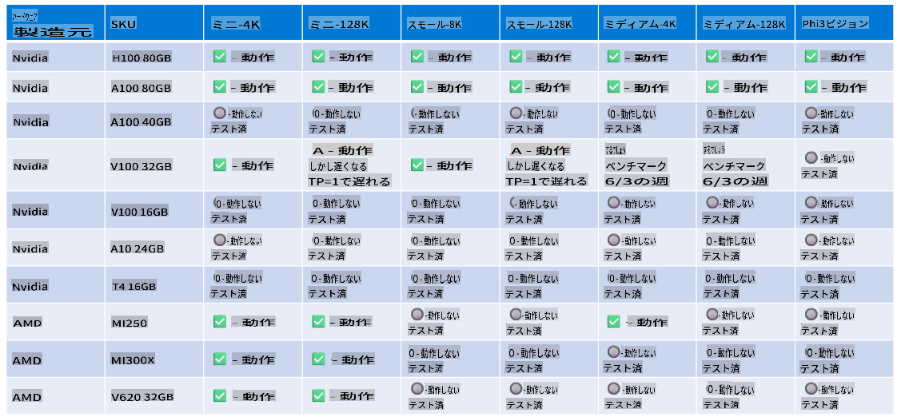

# Phi-3 ハードウェアサポート

Microsoft Phi-3 は ONNX Runtime に最適化されており、Windows DirectML をサポートしています。GPU、CPU、さらにはモバイルデバイスなど、さまざまなハードウェアタイプでうまく動作します。

## デバイスハードウェア
具体的にサポートされているハードウェアは次のとおりです:

- GPU SKU: RTX 4090 (DirectML)
- GPU SKU: 1 A100 80GB (CUDA)
- CPU SKU: Standard F64s v2 (64 vCPUs, 128 GiB メモリ)

## モバイル SKU

- Android - Samsung Galaxy S21
- Apple iPhone 14 またはそれ以上の A16/A17 プロセッサ

## Phi-3 ハードウェア仕様

- 最低構成要件
- Windows: DirectX 12対応GPUと最低4GBの統合RAM

CUDA: Compute Capability >= 7.02 の NVIDIA GPU



## 複数のGPUで onnxruntime を実行する

現在利用可能な Phi-3 ONNX モデルは1つのGPU用です。Phi-3モデルに対してマルチGPUをサポートすることは可能ですが、2つのGPUを使用する ORT が2つのORTインスタンスと比べてより高いスループットを保証するものではありません。

[Build 2024 the GenAI ONNX Team](https://youtu.be/WLW4SE8M9i8?si=EtG04UwDvcjunyfC) では、Phi モデルに対してマルチインスタンスを有効にしたことが発表されました。

現在のところ、CUDA_VISIBLE_DEVICES 環境変数を使用して、1つのonnxruntimeまたはonnxruntime-genaiインスタンスを実行することができます。

```Python
CUDA_VISIBLE_DEVICES=0 python infer.py
CUDA_VISIBLE_DEVICES=1 python infer.py
```

[Azure AI Studio](https://ai.azure.com) で Phi-3 をさらに探求してみてください。

**免責事項**：
この文書は、機械ベースのAI翻訳サービスを使用して翻訳されています。正確さを期していますが、自動翻訳にはエラーや不正確な部分が含まれる場合がありますのでご注意ください。元の言語で記載された文書が権威ある情報源と見なされるべきです。重要な情報については、専門の人間による翻訳を推奨します。この翻訳の使用に起因する誤解や誤訳については、一切の責任を負いかねます。