# Microsoft's Phi-3 ファミリー

Phi-3 モデルは、最も高性能でコストパフォーマンスに優れた小型言語モデル（SLM）であり、同サイズや次のサイズのモデルを上回るパフォーマンスを発揮します。このリリースにより、高品質なモデルの選択肢が拡大し、生成AIアプリケーションの構築においてより実用的な選択肢を提供します。

Phi-3 ファミリーには、mini、small、medium、vision バージョンがあり、異なるパラメータ数に基づいてトレーニングされ、さまざまなアプリケーションシナリオに対応します。各モデルは指示調整されており、Microsoftの責任あるAI、安全性、セキュリティ基準に従って開発されているため、すぐに使用可能です。Phi-3-mini はその2倍のサイズのモデルを上回り、Phi-3-small と Phi-3-medium は GPT-3.5T を含むさらに大きなモデルを上回ります。

## Phi-3 タスクの例

| | |
|-|-|
|タスク|Phi-3|
|言語タスク|Yes|
|数学 & 推論|Yes|
|コーディング|Yes|
|関数呼び出し|No|
|自己オーケストレーション（アシスタント）|No|
|専用埋め込みモデル|No|

## Phi-3-mini

Phi-3-mini は 3.8B パラメータの言語モデルで、[Microsoft Azure AI Studio](https://ai.azure.com/explore/models?selectedCollection=phi)、[Hugging Face](https://huggingface.co/collections/microsoft/phi-3-6626e15e9585a200d2d761e3)、および [Ollama](https://ollama.com/library/phi3) で利用可能です。2つのコンテキスト長を提供します：[128K](https://ai.azure.com/explore/models/Phi-3-mini-128k-instruct/version/9/registry/azureml) と [4K](https://ai.azure.com/explore/models/Phi-3-mini-4k-instruct/version/9/registry/azureml) です。

Phi-3-mini は 3.8B パラメータを持つ Transformer ベースの言語モデルです。教育的に有用な情報を含む高品質なデータを使用してトレーニングされ、さまざまな NLP 合成テキストや内部および外部のチャットデータセットを含む新しいデータソースで強化されており、チャット機能が大幅に向上しています。さらに、Phi-3-mini は事前トレーニング後に監督下での微調整（SFT）および直接選好最適化（DPO）を通じてチャット微調整されました。このポストトレーニングの後、Phi-3-mini は特に整合性、堅牢性、安全性において顕著な改善を示しました。このモデルは Phi-3 ファミリーの一部であり、4K と 128K の2つのバリアントがあり、サポートできるコンテキスト長（トークン数）を表しています。

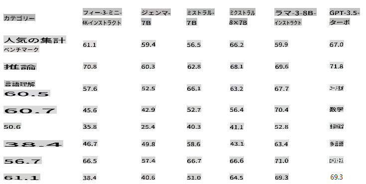

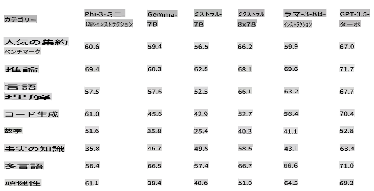

## Phi-3.5-mini-instruct

[Phi-3.5 mini](https://ai.azure.com/explore/models/Phi-3.5-mini-instruct/version/1/registry/azureml) は、Phi-3 用に使用されたデータセット（合成データおよびフィルタリングされた公開ウェブサイト）を基に構築された、軽量で最先端のオープンモデルであり、非常に高品質で推論が豊富なデータに焦点を当てています。このモデルは Phi-3 モデルファミリーに属し、128K トークンのコンテキスト長をサポートします。モデルは、監督下での微調整、近接ポリシー最適化、および直接選好最適化を組み込んだ厳格な強化プロセスを経て、正確な指示の遵守と堅牢な安全対策を確保しています。

Phi-3.5 Mini は 3.8B パラメータを持ち、Phi-3 Mini と同じトークナイザーを使用するデコーダのみの Transformer モデルです。

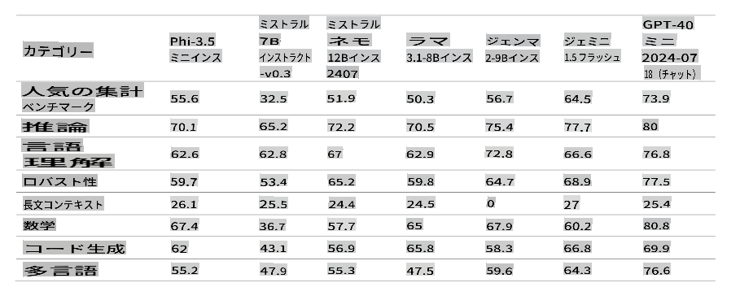

全体として、わずか 3.8B パラメータのモデルでありながら、多言語の言語理解および推論能力においてはるかに大きなモデルと同等のレベルを達成しています。ただし、特定のタスクにおいてはそのサイズによる限界があります。モデルには事実知識を大量に保持する能力がないため、事実の誤りが発生する可能性があります。しかし、この弱点は RAG 設定でモデルを使用する際に検索エンジンで Phi-3.5 を強化することで解決できると考えています。

### 言語サポート

以下の表は、Phi-3 の多言語 MMLU、MEGA、および多言語 MMLU-pro データセットにおける多言語対応能力を示しています。全体として、3.8B のアクティブパラメータしか持たないにもかかわらず、はるかに大きなアクティブパラメータを持つ他のモデルと比較して、多言語タスクで非常に競争力があります。

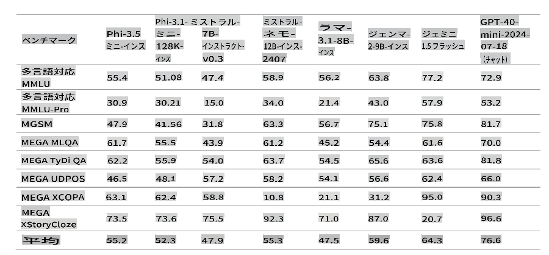

## Phi-3-small

Phi-3-small は 7B パラメータの言語モデルで、2つのコンテキスト長 [128K](https://ai.azure.com/explore/models/Phi-3-small-128k-instruct/version/2/registry/azureml) と [8K](https://ai.azure.com/explore/models/Phi-3-small-8k-instruct/version/2/registry/azureml) で利用可能です。言語、推論、コーディング、および数学のベンチマークにおいて GPT-3.5T を上回ります。

Phi-3-small は 7B パラメータを持つ Transformer ベースの言語モデルです。教育的に有用な情報を含む高品質なデータを使用してトレーニングされ、さまざまな NLP 合成テキストや内部および外部のチャットデータセットを含む新しいデータソースで強化されており、チャット機能が大幅に向上しています。さらに、Phi-3-small は事前トレーニング後に監督下での微調整（SFT）および直接選好最適化（DPO）を通じてチャット微調整されました。このポストトレーニングの後、Phi-3-small は特に整合性、堅牢性、安全性において顕著な改善を示しました。Phi-3-small は Phi-3-Mini と比較して多言語データセットでより集中的にトレーニングされています。モデルファミリーは 8K と 128K の2つのバリアントを提供し、サポートできるコンテキスト長（トークン数）を表しています。

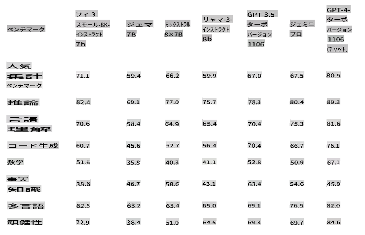

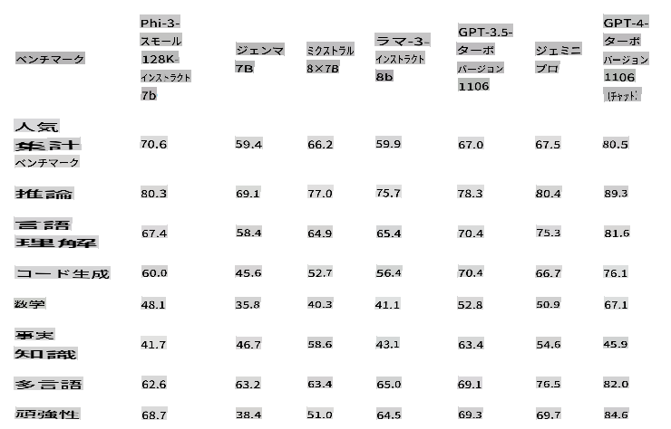

## Phi-3-medium

Phi-3-medium は 14B パラメータの言語モデルで、2つのコンテキスト長 [128K](https://ai.azure.com/explore/models/Phi-3-medium-128k-instruct/version/2/registry/azureml) と [4K](https://ai.azure.com/explore/models/Phi-3-medium-4k-instruct/version/2/registry/azureml) で利用可能です。Gemini 1.0 Pro を上回るパフォーマンスを発揮します。

Phi-3-medium は 14B パラメータを持つ Transformer ベースの言語モデルです。教育的に有用な情報を含む高品質なデータを使用してトレーニングされ、さまざまな NLP 合成テキストや内部および外部のチャットデータセットを含む新しいデータソースで強化されており、チャット機能が大幅に向上しています。さらに、Phi-3-medium は事前トレーニング後に監督下での微調整（SFT）および直接選好最適化（DPO）を通じてチャット微調整されました。このポストトレーニングの後、Phi-3-medium は特に整合性、堅牢性、安全性において顕著な改善を示しました。モデルファミリーは 4K と 128K の2つのバリアントを提供し、サポートできるコンテキスト長（トークン数）を表しています。

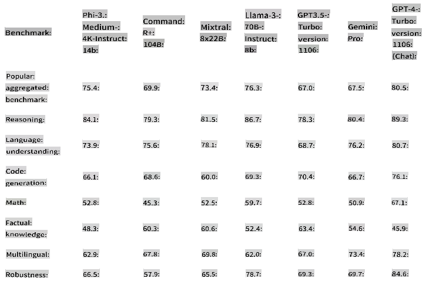

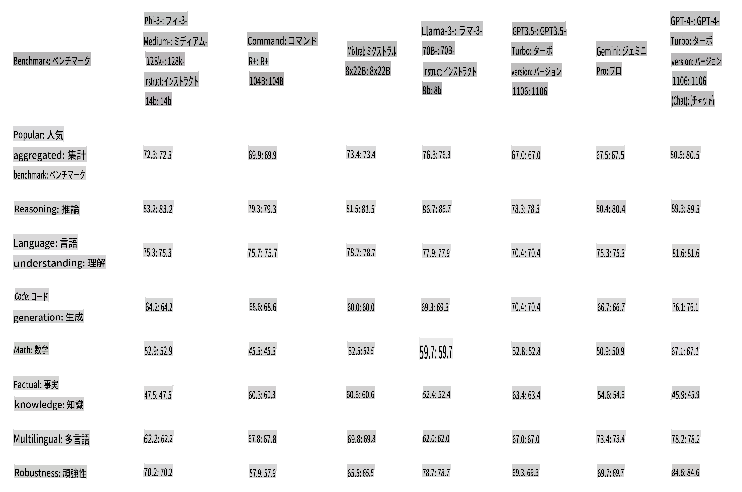

[!NOTE]
Phi-3-medium のアップグレードとして Phi-3.5-MoE への切り替えをお勧めします。MoE モデルはより優れたコストパフォーマンスを提供します。

## Phi-3-vision

[Phi-3-vision](https://ai.azure.com/explore/models/Phi-3-vision-128k-instruct/version/2/registry/azureml) は、言語およびビジョン機能を備えた 4.2B パラメータのマルチモーダルモデルで、Claude-3 Haiku や Gemini 1.0 Pro V などの大規模モデルを上回り、一般的な視覚推論、OCR、および表やチャートの理解タスクで優れた性能を発揮します。

Phi-3-vision は Phi-3 ファミリー初のマルチモーダルモデルで、テキストと画像を組み合わせています。Phi-3-vision は実世界の画像を推論し、画像からテキストを抽出して推論することができます。また、チャートや図表の理解に最適化されており、洞察を生成し質問に答えることができます。Phi-3-vision は Phi-3-mini の言語能力を基に構築され、小型サイズで強力な言語および画像推論品質を提供します。

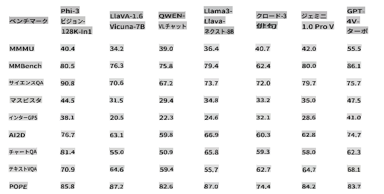

## Phi-3.5-vision
[Phi-3.5 Vision](https://ai.azure.com/explore/models/Phi-3.5-vision-instruct/version/1/registry/azureml) は、合成データおよびフィルタリングされた公開ウェブサイトを含むデータセットを基に構築された、軽量で最先端のオープンマルチモーダルモデルであり、テキストとビジョンの両方で非常に高品質で推論が豊富なデータに焦点を当てています。このモデルは Phi-3 モデルファミリーに属し、128K トークンのコンテキスト長をサポートします。モデルは、監督下での微調整および直接選好最適化を組み込んだ厳格な強化プロセスを経て、正確な指示の遵守と堅牢な安全対策を確保しています。

Phi-3.5 Vision は 4.2B パラメータを持ち、画像エンコーダ、コネクタ、プロジェクタ、および Phi-3 Mini 言語モデルを含みます。

このモデルは、英語での広範な商業および研究用途を目的としています。モデルは、視覚およびテキスト入力機能を備えた汎用AIシステムおよびアプリケーションに使用されることを目的としています。

1) メモリ/計算制約のある環境。
2) レイテンシー制約のあるシナリオ。
3) 一般的な画像理解。
4) OCR
5) チャートおよび表の理解。
6) 複数画像の比較。
7) 複数画像またはビデオクリップの要約。

Phi-3.5-vision モデルは、効率的な言語およびマルチモーダルモデルの研究を加速し、生成AI機能の構築ブロックとして使用することを目的としています。

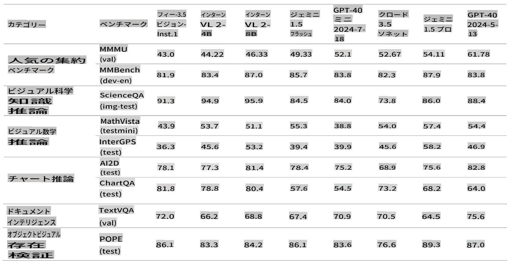

## Phi-3.5-MoE

[Phi-3.5 MoE](https://ai.azure.com/explore/models/Phi-3.5-MoE-instruct/version/1/registry/azureml) は、Phi-3 用に使用されたデータセット（合成データおよびフィルタリングされた公開文書）を基に構築された、軽量で最先端のオープンモデルであり、非常に高品質で推論が豊富なデータに焦点を当てています。モデルは多言語をサポートし、128K トークンのコンテキスト長をサポートします。モデルは、監督下での微調整、近接ポリシー最適化、および直接選好最適化を組み込んだ厳格な強化プロセスを経て、正確な指示の遵守と堅牢な安全対策を確保しています。

Phi-3 MoE は 16x3.8B パラメータを持ち、2つのエキスパートを使用する場合に 6.6B のアクティブパラメータを持ちます。モデルはトークナイザーを使用し、語彙サイズは 32,064 です。

このモデルは、英語での広範な商業および研究用途を目的としています。モデルは、以下のような汎用AIシステムおよびアプリケーションに使用されることを目的としています。

1) メモリ/計算制約のある環境。
2) レイテンシー制約のあるシナリオ。
3) 強力な推論（特に数学と論理）。

MoE モデルは、言語およびマルチモーダルモデルの研究を加速し、生成AI機能の構築ブロックとして使用することを目的としており、追加の計算リソースが必要です。

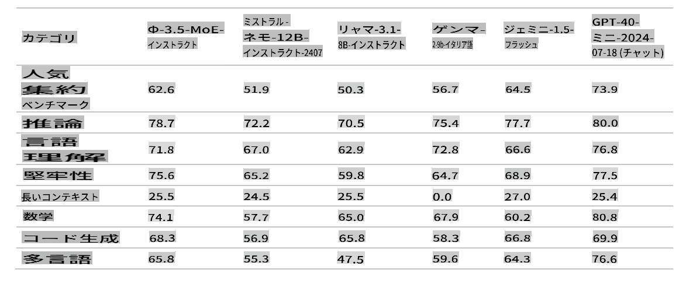

> [!NOTE]
>
> Phi-3 モデルは、事実知識のベンチマーク（例えば TriviaQA）ではあまり良いパフォーマンスを発揮しません。これは、小さいモデルサイズが事実を保持する能力を制限するためです。

## Phi silica

Phi シリカは Phi シリーズのモデルから構築され、Copilot+ PC の NPU 用に特別に設計されています。Windows は、NPU 用にカスタムビルドされた最先端の小型言語モデル（SLM）を最初に搭載するプラットフォームです。Phi シリカ API は、OCR、Studio Effects、Live Captions、および Recall User Activity API と共に、6月に Windows Copilot Library で利用可能になります。Vector Embedding、RAG API、テキスト要約などの新しい API も後ほど追加される予定です。

## **すべての Phi-3 モデルを見つける**

- [Azure AI](https://ai.azure.com/explore/models?selectedCollection=phi)
- [Hugging Face](https://huggingface.co/collections/microsoft/phi-3-6626e15e9585a200d2d761e3)

## ONNX モデル

2つの ONNX モデル「cpu-int4-rtn-block-32」と「cpu-int4-rtn-block-32-acc-level-4」の主な違いは、精度レベルです。「acc-level-4」を持つモデルは、遅延と精度のバランスを取るように設計されており、わずかな精度のトレードオフでパフォーマンスを向上させ、特にモバイルデバイスに適しています。

## モデル選択の例

| | | | |
|-|-|-|-|
|顧客のニーズ|タスク|開始モデル|詳細|
|メッセージのスレッドを単純に要約するモデルが必要|会話の要約|Phi-3 テキストモデル|顧客が明確で単純な言語タスクを持っていることが決定要因|
|子供向けの無料数学チューターアプリ|数学と推論|Phi-3 テキストモデル|アプリが無料のため、顧客は継続的な費用がかからない解決策を望んでいる|
|自動パトロール車カメラ|ビジョン解析|Phi-Vision|インターネットなし

免責事項: この翻訳はAIモデルによって原文から翻訳されたものであり、完璧ではない可能性があります。 出力を確認し、必要な修正を行ってください。