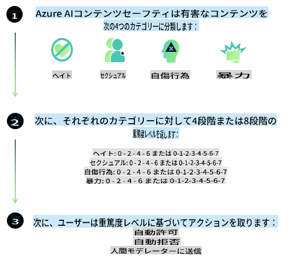
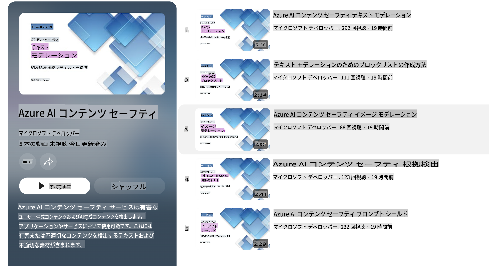

# PhiモデルにおけるAIの安全性
Phiファミリーのモデルは、[Microsoft Responsible AI Standard](https://query.prod.cms.rt.microsoft.com/cms/api/am/binary/RE5cmFl)に基づいて開発されました。この基準は、次の6つの原則に基づく企業全体の要件セットです：責任、透明性、公平性、信頼性と安全性、プライバシーとセキュリティ、そして包括性。これらの原則は[Microsoftの責任あるAIの原則](https://www.microsoft.com/ai/responsible-ai)を構成しています。

これまでのPhiモデルと同様に、多面的な安全性評価と安全性向上のための後処理アプローチが採用されており、今回のリリースでは多言語対応に特化した追加措置が取られています。多言語およびリスクカテゴリーにわたる安全性トレーニングと評価のアプローチについては、[Phi Safety Post-Training Paper](https://arxiv.org/abs/2407.13833)で詳しく説明されています。Phiモデルはこのアプローチの恩恵を受けていますが、開発者は、特定のユースケースや文化的・言語的文脈に関連するリスクをマッピングし、測定し、軽減するなど、責任あるAIのベストプラクティスを適用する必要があります。

## ベストプラクティス

他のモデルと同様に、Phiファミリーのモデルも不公平、不信頼、または攻撃的な動作をする可能性があります。

SLMやLLMの制限的な挙動として注意すべき点には以下が含まれます：

- **サービスの品質:** Phiモデルは主に英語テキストでトレーニングされています。英語以外の言語ではパフォーマンスが低下する可能性があります。また、トレーニングデータでの表現が少ない英語の方言は、標準的なアメリカ英語と比較してパフォーマンスが劣る場合があります。
- **有害な表現とステレオタイプの助長:** これらのモデルは、特定の人々のグループを過剰または過少に表現したり、あるグループの表現を消したり、または侮辱的または否定的なステレオタイプを助長したりする可能性があります。安全性向上のための後処理が行われたにもかかわらず、異なるグループの表現レベルの違いや、現実世界のパターンや社会的偏見を反映したトレーニングデータ中の否定的なステレオタイプの例の存在により、これらの制限が残っている可能性があります。
- **不適切または攻撃的なコンテンツ:** これらのモデルは、他の種類の不適切または攻撃的なコンテンツを生成する可能性があり、追加の緩和策がない場合には、敏感なコンテキストでの使用に適さない可能性があります。
- **情報の信頼性:** 言語モデルは、非論理的なコンテンツを生成したり、もっともらしいが不正確または古い内容を作り出したりする可能性があります。
- **コードの限定的な範囲:** Phi-3のトレーニングデータの大部分はPythonに基づいており、「typing, math, random, collections, datetime, itertools」などの一般的なパッケージを使用しています。モデルが他のパッケージや異なる言語のスクリプトを利用するPythonスクリプトを生成する場合、すべてのAPIの使用を手動で検証することを強く推奨します。

開発者は責任あるAIのベストプラクティスを適用し、特定のユースケースが関連する法律や規制（例：プライバシー、貿易など）を遵守していることを確認する責任を負います。

## 責任あるAIの考慮事項

他の言語モデルと同様に、Phiシリーズのモデルも不公平、不信頼、または攻撃的な動作をする可能性があります。注意すべき制限的な挙動には以下が含まれます：

**サービスの品質:** Phiモデルは主に英語テキストでトレーニングされています。英語以外の言語ではパフォーマンスが低下する可能性があります。また、トレーニングデータでの表現が少ない英語の方言は、標準的なアメリカ英語と比較してパフォーマンスが劣る場合があります。

**有害な表現とステレオタイプの助長:** これらのモデルは、特定の人々のグループを過剰または過少に表現したり、あるグループの表現を消したり、または侮辱的または否定的なステレオタイプを助長したりする可能性があります。安全性向上のための後処理が行われたにもかかわらず、異なるグループの表現レベルの違いや、現実世界のパターンや社会的偏見を反映したトレーニングデータ中の否定的なステレオタイプの例の存在により、これらの制限が残っている可能性があります。

**不適切または攻撃的なコンテンツ:** これらのモデルは、他の種類の不適切または攻撃的なコンテンツを生成する可能性があり、追加の緩和策がない場合には、敏感なコンテキストでの使用に適さない可能性があります。

**情報の信頼性:** 言語モデルは、非論理的なコンテンツを生成したり、もっともらしいが不正確または古い内容を作り出したりする可能性があります。

**コードの限定的な範囲:** Phi-3のトレーニングデータの大部分はPythonに基づいており、「typing, math, random, collections, datetime, itertools」などの一般的なパッケージを使用しています。モデルが他のパッケージや異なる言語のスクリプトを利用するPythonスクリプトを生成する場合、すべてのAPIの使用を手動で検証することを強く推奨します。

開発者は責任あるAIのベストプラクティスを適用し、特定のユースケースが関連する法律や規制（例：プライバシー、貿易など）を遵守していることを確認する責任を負います。考慮すべき重要な領域には以下が含まれます：

**配分:** モデルは、法的地位やリソースや生活機会の配分（例：住宅、雇用、信用など）に重大な影響を与える可能性のあるシナリオには、さらなる評価や追加のバイアス除去技術なしでは適さない場合があります。

**高リスクシナリオ:** 開発者は、不公平、不信頼、または攻撃的な出力が極めて高コストまたは有害をもたらす可能性のある高リスクシナリオでモデルを使用する適合性を評価する必要があります。これには、正確性と信頼性が重要な専門的または敏感な分野（例：法的助言や健康アドバイス）でのアドバイス提供が含まれます。展開コンテキストに応じた追加の保護策をアプリケーションレベルで実装する必要があります。

**誤情報:** モデルは不正確な情報を生成する可能性があります。開発者は透明性のベストプラクティスに従い、エンドユーザーにAIシステムと対話していることを知らせる必要があります。アプリケーションレベルでは、フィードバックメカニズムやユースケースに特化した文脈情報に基づいた応答を生成するパイプライン（Retrieval Augmented Generation (RAG) として知られる技術）を構築できます。

**有害なコンテンツの生成:** 開発者は出力内容を文脈に応じて評価し、利用可能な安全性分類器やユースケースに適したカスタムソリューションを活用する必要があります。

**不正利用:** 詐欺、スパム、マルウェアの生成などの不正利用が発生する可能性があり、開発者はそのアプリケーションが適用される法律や規制に違反しないことを確認する必要があります。

### ファインチューニングとAIコンテンツの安全性

モデルをファインチューニングした後は、生成されたコンテンツを監視し、潜在的なリスク、脅威、品質問題を特定してブロックするために、[Azure AI Content Safety](https://learn.microsoft.com/azure/ai-services/content-safety/overview)の活用を強く推奨します。

[Azure AI Content Safety](https://learn.microsoft.com/azure/ai-services/content-safety/overview)は、テキストおよび画像コンテンツの両方をサポートしています。クラウド、切り離されたコンテナ、エッジ/組み込みデバイスで展開可能です。

## Azure AIコンテンツ安全性の概要

Azure AI Content Safetyは、すべてのニーズに対応する一律のソリューションではなく、企業の特定のポリシーに合わせてカスタマイズ可能です。また、その多言語モデルにより、複数の言語を同時に理解することができます。

- **Azure AI Content Safety**
- **Microsoft Developer**
- **5本の動画**

Azure AI Content Safetyサービスは、アプリケーションやサービス内の有害なユーザー生成コンテンツおよびAI生成コンテンツを検出します。これには、有害または不適切な素材を検出するためのテキストおよび画像APIが含まれています。

[AI Content Safety Playlist](https://www.youtube.com/playlist?list=PLlrxD0HtieHjaQ9bJjyp1T7FeCbmVcPkQ)

**免責事項**:  
この文書は、機械ベースのAI翻訳サービスを使用して翻訳されています。正確さを期すよう努めておりますが、自動翻訳には誤りや不正確さが含まれる場合があります。原文（元の言語の文書）が信頼できる正式な情報源と見なされるべきです。重要な情報については、専門の人間による翻訳をお勧めします。この翻訳の使用に起因する誤解や誤解釈について、当社は一切の責任を負いません。