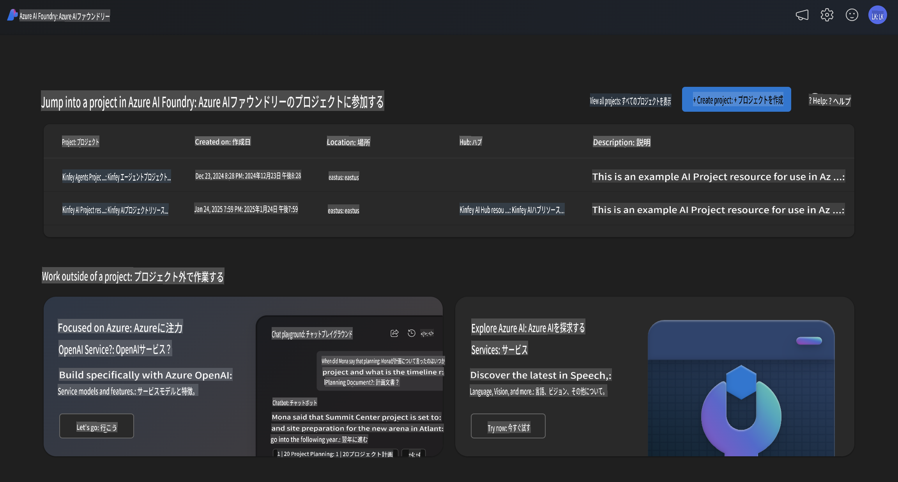
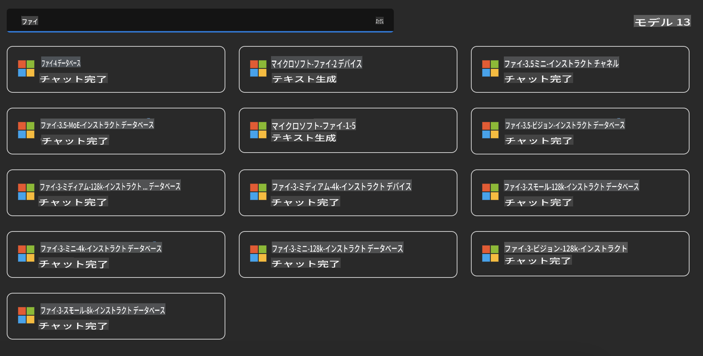
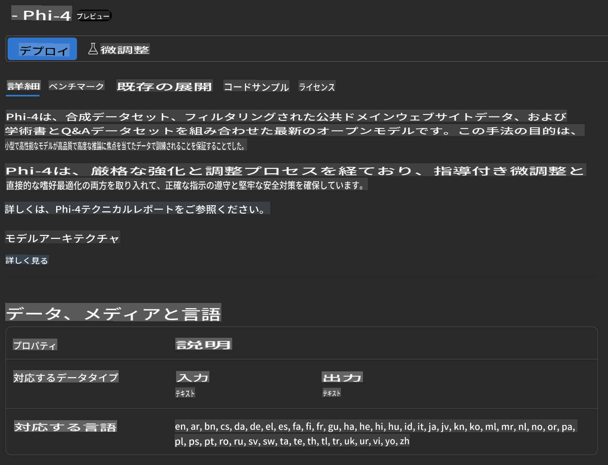
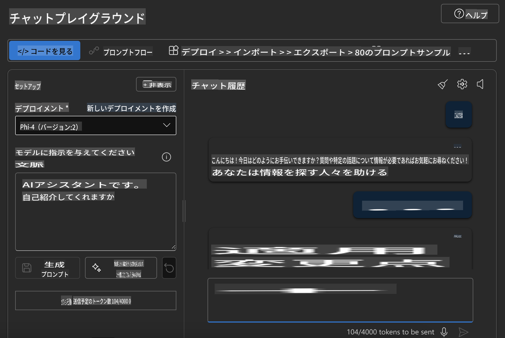

## Azure AI Foundry における Phi ファミリー

[Azure AI Foundry](https://ai.azure.com) は、開発者が安全でセキュア、かつ責任ある方法で AI を活用し、革新を推進し未来を形作るための信頼できるプラットフォームです。

[Azure AI Foundry](https://ai.azure.com) は、以下のような目的で設計されています：

- エンタープライズ向けの高品質なプラットフォーム上で生成型 AI アプリケーションを構築する。
- 最先端の AI ツールや ML モデルを使用して、探索、構築、テスト、デプロイを行い、責任ある AI 実践を基盤とする。
- アプリケーション開発のライフサイクル全体を通じてチームと協力する。

Azure AI Foundry を使用すると、多様なモデル、サービス、機能を探索し、自分の目標に最適な AI アプリケーションを構築することができます。Azure AI Foundry プラットフォームは、概念実証（PoC）を本格的なプロダクションアプリケーションに容易に変換できるスケーラビリティを提供します。また、継続的なモニタリングと改善により、長期的な成功をサポートします。



Azure AI Foundry 内で Azure AOAI Service を利用するだけでなく、Azure AI Foundry モデルカタログでサードパーティモデルを使用することもできます。Azure AI Foundry を AI ソリューションプラットフォームとして活用したい場合には、これは良い選択肢となります。

Azure AI Foundry のモデルカタログを通じて、Phi ファミリーモデルを迅速にデプロイできます。



### **Azure AI Foundry における Phi-4 のデプロイ**



### **Azure AI Foundry Playground での Phi-4 のテスト**



### **Python コードを実行して Azure AI Foundry Phi-4 を呼び出す**

```python

import os  
import base64
from openai import AzureOpenAI  
from azure.identity import DefaultAzureCredential, get_bearer_token_provider  
        
endpoint = os.getenv("ENDPOINT_URL", "Your Azure AOAI Service Endpoint")  
deployment = os.getenv("DEPLOYMENT_NAME", "Phi-4")  
      
token_provider = get_bearer_token_provider(  
    DefaultAzureCredential(),  
    "https://cognitiveservices.azure.com/.default"  
)  
  
client = AzureOpenAI(  
    azure_endpoint=endpoint,  
    azure_ad_token_provider=token_provider,  
    api_version="2024-05-01-preview",  
)  
  

chat_prompt = [
    {
        "role": "system",
        "content": "You are an AI assistant that helps people find information."
    },
    {
        "role": "user",
        "content": "can you introduce yourself"
    }
] 
    
# Include speech result if speech is enabled  
messages = chat_prompt 

completion = client.chat.completions.create(  
    model=deployment,  
    messages=messages,
    max_tokens=800,  
    temperature=0.7,  
    top_p=0.95,  
    frequency_penalty=0,  
    presence_penalty=0,
    stop=None,  
    stream=False  
)  
  
print(completion.to_json())  

```

**免責事項**:  
この文書は、機械ベースのAI翻訳サービスを使用して翻訳されています。正確性を追求していますが、自動翻訳には誤りや不正確さが含まれる場合があります。元の言語で作成された原文が公式な情報源と見なされるべきです。重要な情報については、専門の人間による翻訳をお勧めします。本翻訳の使用に起因する誤解や誤った解釈について、当社は一切の責任を負いません。