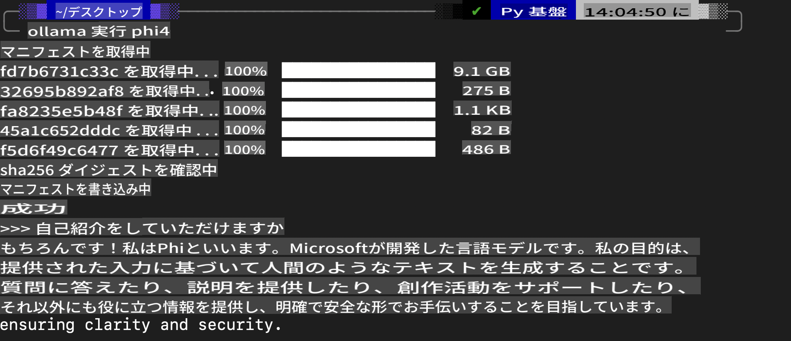
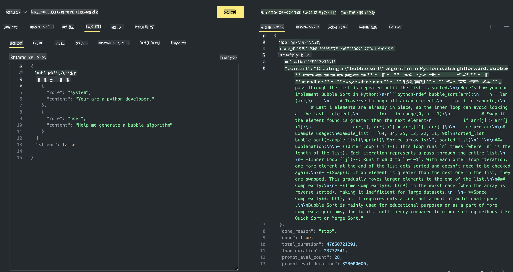

## Phiファミリー in Ollama

[Ollama](https://ollama.com) は、シンプルなスクリプトを通じて、より多くの人々がオープンソースのLLMやSLMを直接デプロイできるようにし、さらにAPIを構築してローカルのCopilotアプリケーションシナリオを支援することができます。

## **1. インストール**

Ollamaは、Windows、macOS、Linuxで動作します。このリンク ([https://ollama.com/download](https://ollama.com/download)) を通じてOllamaをインストールできます。インストールが成功した後、ターミナルウィンドウを使って直接Ollamaスクリプトを使用してPhi-3を呼び出すことができます。すべての[利用可能なライブラリはこちら](https://ollama.com/library)で確認できます。このリポジトリをCodespaceで開く場合、すでにOllamaがインストールされています。

```bash

ollama run phi4

```

> [!NOTE]
> 初めて実行する際にはモデルがダウンロードされます。もちろん、ダウンロード済みのPhi-4モデルを直接指定することもできます。ここでは、WSLを例にしてコマンドを実行します。モデルのダウンロードが成功すると、ターミナル上で直接対話が可能になります。



## **2. Ollamaからphi-4 APIを呼び出す**

Ollamaで生成されたPhi-4 APIを呼び出したい場合、以下のコマンドをターミナルで使用してOllamaサーバーを起動できます。

```bash

ollama serve

```

> [!NOTE]
> macOSまたはLinuxを使用している場合、次のエラーが発生する可能性があります: **"Error: listen tcp 127.0.0.1:11434: bind: address already in use"** このエラーは、通常サーバーがすでに起動していることを示しているため無視することができますが、Ollamaを停止して再起動することも可能です。

**macOS**

```bash

brew services restart ollama

```

**Linux**

```bash

sudo systemctl stop ollama

```

Ollamaは、generateとchatの2つのAPIをサポートしています。必要に応じて、ポート11434で動作しているローカルサービスにリクエストを送信して、Ollamaが提供するモデルAPIを呼び出すことができます。

**Chat**

```bash

curl http://127.0.0.1:11434/api/chat -d '{
  "model": "phi3",
  "messages": [
    {
      "role": "system",
      "content": "Your are a python developer."
    },
    {
      "role": "user",
      "content": "Help me generate a bubble algorithm"
    }
  ],
  "stream": false
  
}'

This is the result in Postman



## Additional Resources

Check the list of available models in Ollama in [their library](https://ollama.com/library).

Pull your model from the Ollama server using this command

```bash
ollama pull phi4
```

Run the model using this command

```bash
ollama run phi4
```

***Note:*** Visit this link [https://github.com/ollama/ollama/blob/main/docs/api.md](https://github.com/ollama/ollama/blob/main/docs/api.md) to learn more

## Calling Ollama from Python

You can use `requests` or `urllib3` to make requests to the local server endpoints used above. However, a popular way to use Ollama in Python is via the [openai](https://pypi.org/project/openai/) SDK, since Ollama provides OpenAI-compatible server endpoints as well.

Here is an example for phi3-mini:

```python
import openai

client = openai.OpenAI(
    base_url="http://localhost:11434/v1",
    api_key="nokeyneeded",
)

response = client.chat.completions.create(
    model="phi4",
    temperature=0.7,
    n=1,
    messages=[
        {"role": "system", "content": "You are a helpful assistant."},
        {"role": "user", "content": "Write a haiku about a hungry cat"},
    ],
)

print("Response:")
print(response.choices[0].message.content)
```

## Calling Ollama from JavaScript 

```javascript
// Phi-4を使用したファイルの要約例
script({
    model: "ollama:phi4",
    title: "Phi-4で要約",
    system: ["system"],
})

// 要約の例
const file = def("FILE", env.files)
$`Summarize ${file} in a single paragraph.`
```

## Calling Ollama from C#

Create a new C# Console application and add the following NuGet package:

```bash
dotnet add package Microsoft.SemanticKernel --version 1.34.0
```

Then replace this code in the `Program.cs` file

```csharp
using Microsoft.SemanticKernel;
using Microsoft.SemanticKernel.ChatCompletion;

// ローカルOllamaサーバーエンドポイントを使用してチャット補完サービスを追加
#pragma warning disable SKEXP0001, SKEXP0003, SKEXP0010, SKEXP0011, SKEXP0050, SKEXP0052
builder.AddOpenAIChatCompletion(
    modelId: "phi4",
    endpoint: new Uri("http://localhost:11434/"),
    apiKey: "non required");

// チャットサービスに簡単なプロンプトを送信
string prompt = "Write a joke about kittens";
var response = await kernel.InvokePromptAsync(prompt);
Console.WriteLine(response.GetValue<string>());
```

Run the app with the command:

```bash
dotnet run

**免責事項**:  
この文書は、機械ベースのAI翻訳サービスを使用して翻訳されています。正確性を期して努力しておりますが、自動翻訳には誤りや不正確さが含まれる可能性があります。本来の言語で作成された原文が公式の情報源とみなされるべきです。重要な情報については、専門の人間による翻訳を推奨します。この翻訳の利用により生じる誤解や誤認について、当社は一切の責任を負いかねます。