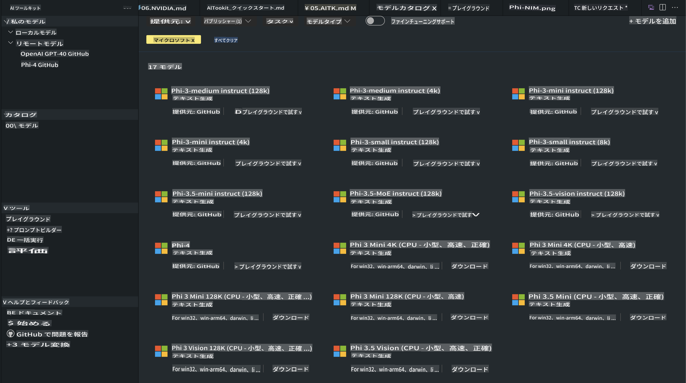
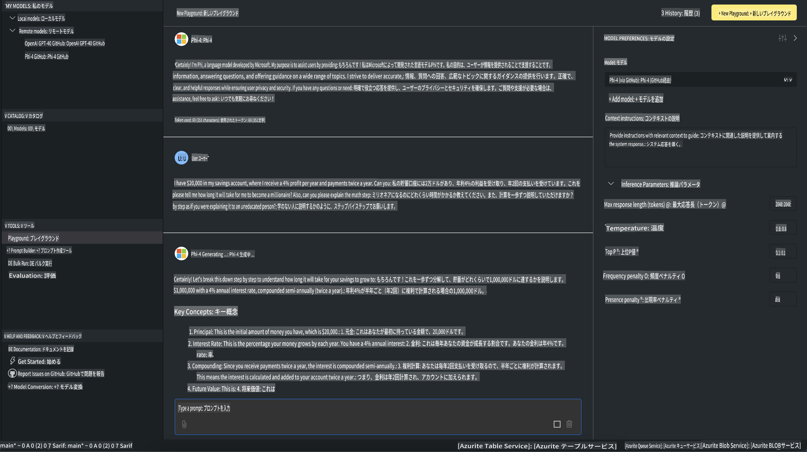

# AITKのPhiファミリー

[AI Toolkit for VS Code](https://marketplace.visualstudio.com/items?itemName=ms-windows-ai-studio.windows-ai-studio) は、Azure AI Foundry CatalogやHugging Faceのような他のカタログから最新のAI開発ツールやモデルを統合し、生成AIアプリの開発を簡単にします。GitHub ModelsやAzure AI Foundry Model Catalogsを活用したAIモデルカタログを閲覧し、ローカルまたはリモートでダウンロード、微調整、テスト、アプリケーションで使用することができます。

AI Toolkit Previewはローカルで動作します。選択したモデルによっては、ローカル推論や微調整にNVIDIA CUDA GPUのようなGPUが必要になる場合があります。また、GitHub Modelsを直接AITKで実行することも可能です。

## 始めに

[Windows Subsystem for Linuxをインストールする方法を学ぶ](https://learn.microsoft.com/windows/wsl/install?WT.mc_id=aiml-137032-kinfeylo)

および[デフォルトのディストリビューションを変更する方法](https://learn.microsoft.com/windows/wsl/install#change-the-default-linux-distribution-installed)をご確認ください。

[AI Toolkit GitHubリポジトリ](https://github.com/microsoft/vscode-ai-toolkit/)

- Windows、Linux、macOSに対応
  
- WindowsおよびLinuxで微調整を行う場合、Nvidia GPUが必要です。さらに、**Windows**ではUbuntuディストリビューション18.4以上を備えたLinux用サブシステムが必要です。[Windows Subsystem for Linuxをインストールする方法](https://learn.microsoft.com/windows/wsl/install)および[デフォルトのLinuxディストリビューションを変更する方法](https://learn.microsoft.com/windows/wsl/install#change-the-default-linux-distribution-installed)をご確認ください。

### AI Toolkitのインストール

AI Toolkitは[Visual Studio Code拡張機能](https://code.visualstudio.com/docs/setup/additional-components#_vs-code-extensions)として提供されているため、まず[VS Code](https://code.visualstudio.com/docs/setup/windows?WT.mc_id=aiml-137032-kinfeylo)をインストールし、[VS Marketplace](https://marketplace.visualstudio.com/items?itemName=ms-windows-ai-studio.windows-ai-studio)からAI Toolkitをダウンロードしてください。  
[AI ToolkitはVisual Studio Marketplaceで入手可能](https://marketplace.visualstudio.com/items?itemName=ms-windows-ai-studio.windows-ai-studio)で、他のVS Code拡張機能と同様にインストールできます。

VS Code拡張機能のインストールに慣れていない場合は、以下の手順に従ってください。

### サインイン

1. VS Codeのアクティビティバーで**拡張機能**を選択します。
2. 拡張機能の検索バーに「AI Toolkit」と入力します。
3. 「AI Toolkit for Visual Studio code」を選択します。
4. **インストール**を選択します。

これで、拡張機能を使用する準備が整いました！

GitHubへのサインインを求められるので、「許可」をクリックして続行してください。GitHubのサインインページにリダイレクトされます。

サインインしてプロセスを進めてください。成功すると、VS Codeにリダイレクトされます。

拡張機能のインストールが完了すると、アクティビティバーにAI Toolkitアイコンが表示されます。

さあ、利用可能なアクションを見てみましょう！

### 利用可能なアクション

AI Toolkitのメインサイドバーは以下に整理されています：

- **Models**
- **Resources**
- **Playground**  
- **Fine-tuning**
- **Evaluation**

これらはResourcesセクションにあります。まずは**Model Catalog**を選択してください。

### カタログからモデルをダウンロードする

VS CodeのサイドバーからAI Toolkitを起動すると、以下のオプションから選択できます：



- **Model Catalog**からサポートされているモデルを見つけてローカルにダウンロード
- **Model Playground**でモデル推論をテスト
- **Model Fine-tuning**でローカルまたはリモートでモデルを微調整
- AI Toolkitのコマンドパレットを使用して、微調整したモデルをクラウドにデプロイ
- モデルの評価

> [!NOTE]
>
> **GPUとCPU**
>
> モデルカードにはモデルサイズ、プラットフォーム、アクセラレータータイプ（CPU、GPU）が表示されます。**GPUを搭載したWindowsデバイス**で最適なパフォーマンスを得るには、Windowsをターゲットとしたモデルバージョンを選択してください。
>
> これにより、DirectMLアクセラレーターに最適化されたモデルを使用できます。
>
> モデル名の形式は次の通りです：
>
> - `{model_name}-{accelerator}-{quantization}-{format}`。
>
> WindowsデバイスにGPUが搭載されているか確認するには、**タスクマネージャー**を開き、**パフォーマンス**タブを選択します。GPUがある場合、「GPU 0」や「GPU 1」のように表示されます。

### Playgroundでモデルを実行する

すべてのパラメーターを設定した後、**Generate Project**をクリックしてください。

モデルのダウンロードが完了したら、カタログ内のモデルカードで**Load in Playground**を選択します：

- モデルのダウンロードを開始
- すべての前提条件と依存関係をインストール
- VS Codeワークスペースを作成



### アプリケーションでREST APIを使用する

AI Toolkitには、[OpenAIチャット補完フォーマット](https://platform.openai.com/docs/api-reference/chat/create)を使用するローカルREST API Webサーバー（**ポート5272**）が付属しています。

これにより、クラウドAIモデルサービスに依存せずにローカルでアプリケーションをテストできます。以下のJSONファイルは、リクエストボディを設定する方法を示しています：

```json
{
    "model": "Phi-4",
    "messages": [
        {
            "role": "user",
            "content": "what is the golden ratio?"
        }
    ],
    "temperature": 0.7,
    "top_p": 1,
    "top_k": 10,
    "max_tokens": 100,
    "stream": true
}
```

例えば、[Postman](https://www.postman.com/)やCURL（Client URL）ユーティリティを使用してREST APIをテストできます：

```bash
curl -vX POST http://127.0.0.1:5272/v1/chat/completions -H 'Content-Type: application/json' -d @body.json
```

### Python用OpenAIクライアントライブラリを使用する

```python
from openai import OpenAI

client = OpenAI(
    base_url="http://127.0.0.1:5272/v1/", 
    api_key="x" # required for the API but not used
)

chat_completion = client.chat.completions.create(
    messages=[
        {
            "role": "user",
            "content": "what is the golden ratio?",
        }
    ],
    model="Phi-4",
)

print(chat_completion.choices[0].message.content)
```

### .NET用Azure OpenAIクライアントライブラリを使用する

NuGetを使用してプロジェクトに[Azure OpenAIクライアントライブラリ for .NET](https://www.nuget.org/packages/Azure.AI.OpenAI/)を追加します：

```bash
dotnet add {project_name} package Azure.AI.OpenAI --version 1.0.0-beta.17
```

**OverridePolicy.cs**という名前のC#ファイルをプロジェクトに追加し、以下のコードを貼り付けます：

```csharp
// OverridePolicy.cs
using Azure.Core.Pipeline;
using Azure.Core;

internal partial class OverrideRequestUriPolicy(Uri overrideUri)
    : HttpPipelineSynchronousPolicy
{
    private readonly Uri _overrideUri = overrideUri;

    public override void OnSendingRequest(HttpMessage message)
    {
        message.Request.Uri.Reset(_overrideUri);
    }
}
```

次に、以下のコードを**Program.cs**ファイルに貼り付けてください：

```csharp
// Program.cs
using Azure.AI.OpenAI;

Uri localhostUri = new("http://localhost:5272/v1/chat/completions");

OpenAIClientOptions clientOptions = new();
clientOptions.AddPolicy(
    new OverrideRequestUriPolicy(localhostUri),
    Azure.Core.HttpPipelinePosition.BeforeTransport);
OpenAIClient client = new(openAIApiKey: "unused", clientOptions);

ChatCompletionsOptions options = new()
{
    DeploymentName = "Phi-4",
    Messages =
    {
        new ChatRequestSystemMessage("You are a helpful assistant. Be brief and succinct."),
        new ChatRequestUserMessage("What is the golden ratio?"),
    }
};

StreamingResponse<StreamingChatCompletionsUpdate> streamingChatResponse
    = await client.GetChatCompletionsStreamingAsync(options);

await foreach (StreamingChatCompletionsUpdate chatChunk in streamingChatResponse)
{
    Console.Write(chatChunk.ContentUpdate);
}
```

## AI Toolkitでの微調整

- モデル探索とPlaygroundから始めましょう。
- ローカルコンピューティングリソースを使用したモデルの微調整と推論。
- Azureリソースを使用したリモート微調整と推論。

[AI Toolkitでの微調整](../../03.FineTuning/Finetuning_VSCodeaitoolkit.md)

## AI Toolkit Q&Aリソース

最も一般的な問題とその解決策については、[Q&Aページ](https://github.com/microsoft/vscode-ai-toolkit/blob/main/archive/QA.md)をご参照ください。

**免責事項**:  
本書類は、機械ベースのAI翻訳サービスを使用して翻訳されています。正確性を追求しておりますが、自動翻訳にはエラーや不正確な部分が含まれる可能性があることをご承知おきください。元の言語で作成された原本が公式な情報源としてみなされるべきです。重要な情報については、専門の人間による翻訳を推奨します。本翻訳の使用に起因する誤解や解釈の誤りについて、当社は一切の責任を負いません。