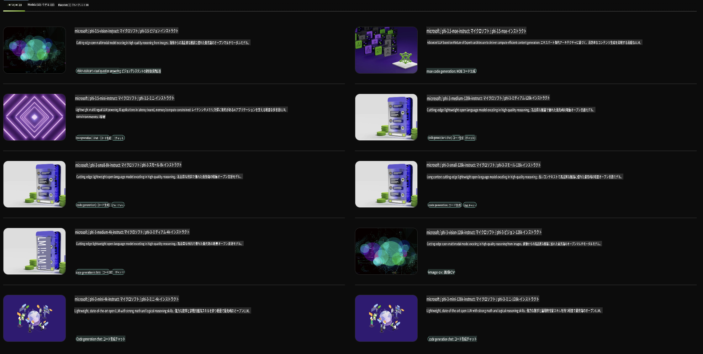

## NVIDIA NIMのPhiファミリー

NVIDIA NIMは、クラウド、データセンター、ワークステーション全体で生成AIモデルの展開を加速するために設計された、使いやすいマイクロサービスのセットです。NIMはモデルファミリーおよびモデルごとに分類されます。たとえば、大規模言語モデル（LLMs）向けのNVIDIA NIMは、最先端のLLMの力をエンタープライズアプリケーションにもたらし、卓越した自然言語処理と理解能力を提供します。

NIMを利用することで、ITチームやDevOpsチームは、自身が管理する環境内で大規模言語モデル（LLMs）をセルフホストしつつ、業界標準のAPIを開発者に提供できます。このAPIを活用することで、企業の業務を変革する強力なコパイロット、チャットボット、AIアシスタントを構築することが可能です。NVIDIAの最先端GPUアクセラレーションとスケーラブルなデプロイメントを活用し、NIMは比類のないパフォーマンスで推論を最速で実現します。

NVIDIA NIMを使用して、Phiファミリーモデルの推論を行うことができます。



### **サンプル - NVIDIA NIMでのPhi-3-Vision**

イメージファイル（`demo.png`）を用意し、この画像を処理して新しいバージョンの画像（`phi-3-vision.jpg`）を保存するPythonコードを生成したいとします。

上記のコードは以下のプロセスを自動化します：

1. 環境と必要な設定を構築。
2. モデルに必要なPythonコードを生成するよう指示するプロンプトを作成。
3. プロンプトをモデルに送信し、生成されたコードを収集。
4. 生成されたコードを抽出して実行。
5. 元の画像と処理済みの画像を表示。

このアプローチにより、AIの力を活用して画像処理タスクを自動化し、目標をより簡単かつ迅速に達成できます。

[サンプルコードソリューション](../../../../../code/06.E2E/E2E_Nvidia_NIM_Phi3_Vision.ipynb)

以下にコード全体の処理をステップごとに説明します：

1. **必要なパッケージをインストール**:
    ```python
    !pip install langchain_nvidia_ai_endpoints -U
    ```
    このコマンドは、`langchain_nvidia_ai_endpoints`パッケージをインストールし、常に最新バージョンを確保します。

2. **必要なモジュールをインポート**:
    ```python
    from langchain_nvidia_ai_endpoints import ChatNVIDIA
    import getpass
    import os
    import base64
    ```
    NVIDIA AIエンドポイントとやり取りするためのモジュール、パスワードを安全に処理するためのモジュール、OSとのやり取り、Base64形式でデータをエンコード/デコードするためのモジュールをインポートします。

3. **APIキーを設定**:
    ```python
    if not os.getenv("NVIDIA_API_KEY"):
        os.environ["NVIDIA_API_KEY"] = getpass.getpass("Enter your NVIDIA API key: ")
    ```
    このコードは、`NVIDIA_API_KEY`環境変数が設定されているか確認し、設定されていない場合はユーザーに安全にAPIキーを入力するよう促します。

4. **モデルと画像パスを定義**:
    ```python
    model = 'microsoft/phi-3-vision-128k-instruct'
    chat = ChatNVIDIA(model=model)
    img_path = './imgs/demo.png'
    ```
    使用するモデルを設定し、指定されたモデルで`ChatNVIDIA`インスタンスを作成し、画像ファイルのパスを定義します。

5. **テキストプロンプトを作成**:
    ```python
    text = "Please create Python code for image, and use plt to save the new picture under imgs/ and name it phi-3-vision.jpg."
    ```
    モデルに画像処理用のPythonコードを生成するよう指示するテキストプロンプトを定義します。

6. **画像をBase64でエンコード**:
    ```python
    with open(img_path, "rb") as f:
        image_b64 = base64.b64encode(f.read()).decode()
    image = f''
    ```
    このコードは画像ファイルを読み込み、Base64でエンコードし、エンコードされたデータを含むHTML画像タグを作成します。

7. **テキストと画像をプロンプトに結合**:
    ```python
    prompt = f"{text} {image}"
    ```
    テキストプロンプトとHTML画像タグを1つの文字列に結合します。

8. **ChatNVIDIAを使用してコードを生成**:
    ```python
    code = ""
    for chunk in chat.stream(prompt):
        print(chunk.content, end="")
        code += chunk.content
    ```
    このコードはプロンプトを`ChatNVIDIA` model and collects the generated code in chunks, printing and appending each chunk to the `code`文字列に送信します。

9. **生成されたコンテンツからPythonコードを抽出**:
    ```python
    begin = code.index('```python') + 9
    code = code[begin:]
    end = code.index('```')
    code = code[:end]
    ```
    このコードは、Markdown形式を削除することで生成されたコンテンツから実際のPythonコードを抽出します。

10. **生成されたコードを実行**:
    ```python
    import subprocess
    result = subprocess.run(["python", "-c", code], capture_output=True)
    ```
    このコードは抽出されたPythonコードをサブプロセスとして実行し、その出力をキャプチャします。

11. **画像を表示**:
    ```python
    from IPython.display import Image, display
    display(Image(filename='./imgs/phi-3-vision.jpg'))
    display(Image(filename='./imgs/demo.png'))
    ```
    これらの行は、`IPython.display`モジュールを使用して画像を表示します。

**免責事項**:  
この文書は、機械ベースのAI翻訳サービスを使用して翻訳されています。正確さを追求していますが、自動翻訳には誤りや不正確さが含まれる場合があります。元の言語で作成された文書を正式な情報源としてお考えください。重要な情報については、専門の人間による翻訳を推奨します。この翻訳の使用に起因する誤解や誤認について、当社は責任を負いません。