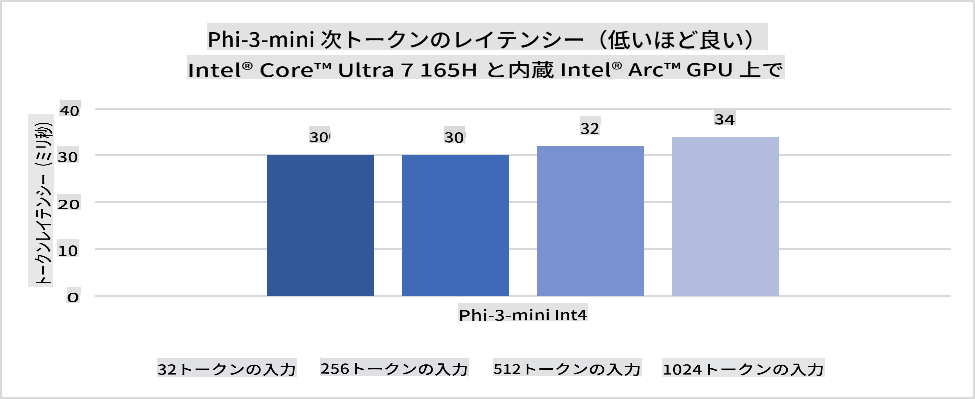
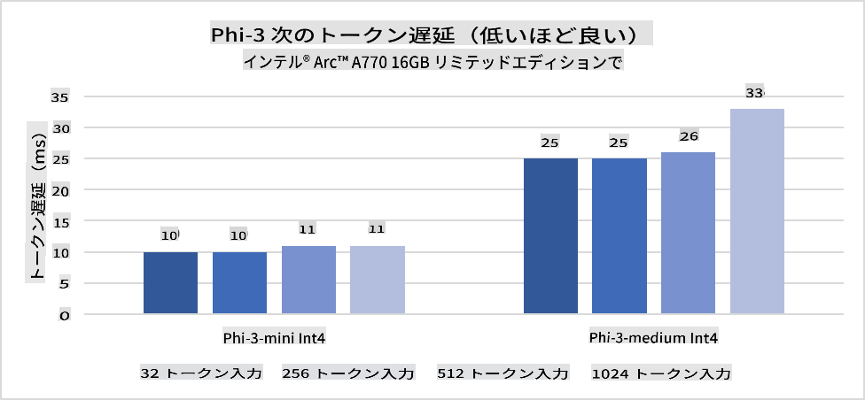
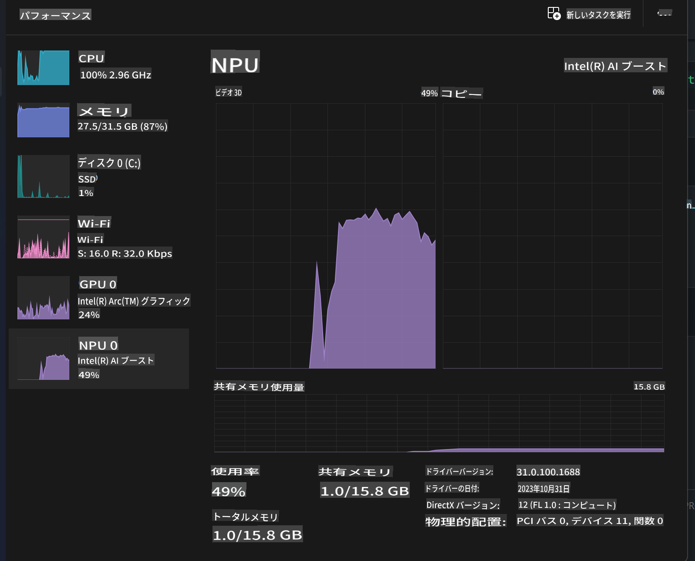
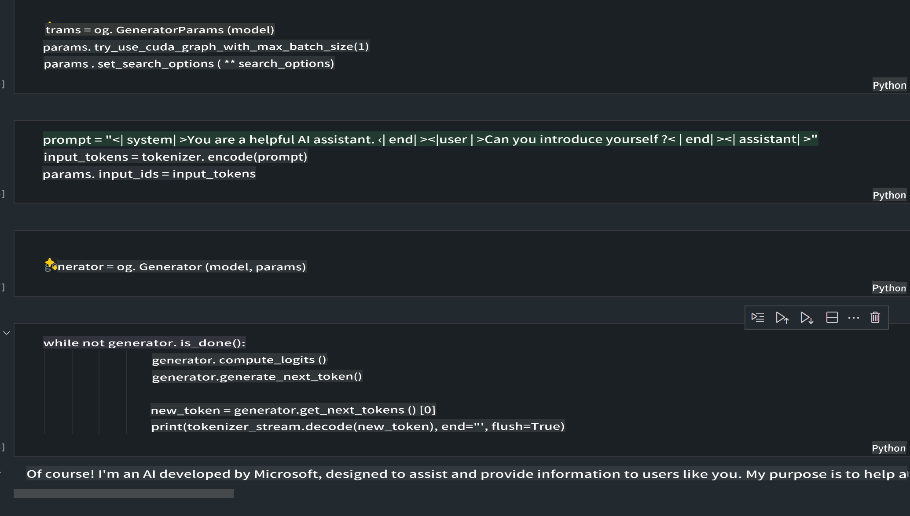
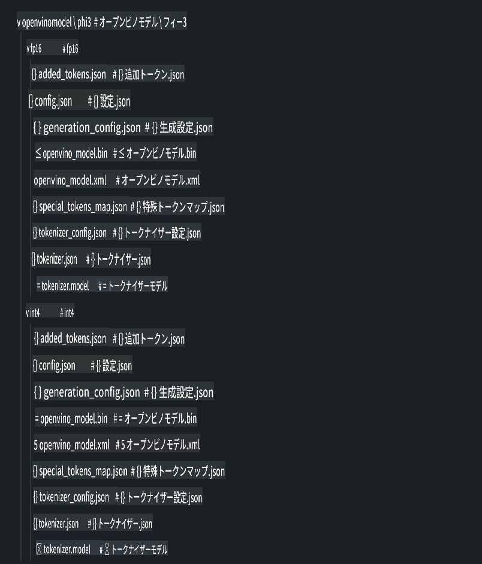
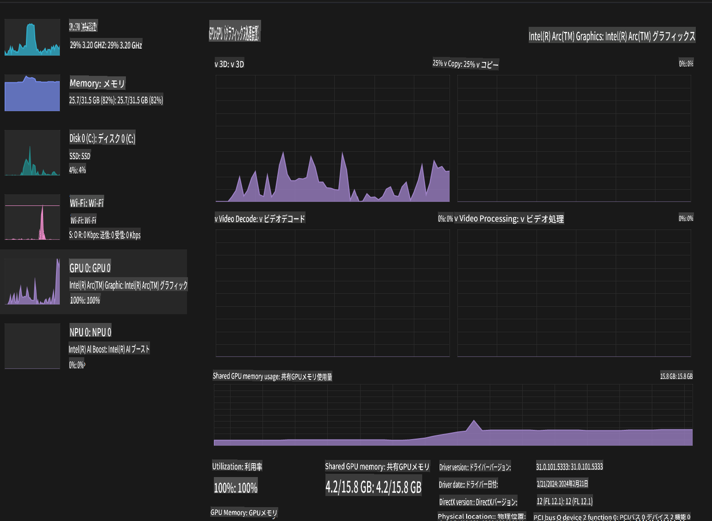

# **AI PCでのPhi-3推論**

生成AIの進化とエッジデバイスのハードウェア性能向上に伴い、ますます多くの生成AIモデルがユーザーのBYOD（Bring Your Own Device）デバイスに統合できるようになっています。その中でもAI PCは注目すべきモデルです。2024年から、Intel、AMD、QualcommがPCメーカーと連携し、ハードウェアの改良を通じてローカル生成AIモデルの展開を可能にするAI PCを導入しました。本稿では、Intel AI PCに焦点を当て、Intel AI PCでPhi-3を展開する方法を探ります。

### NPUとは

NPU（Neural Processing Unit）は、ニューラルネットワークの操作やAIタスクを高速化するために設計された専用のプロセッサまたはSoC上の処理ユニットです。汎用のCPUやGPUとは異なり、NPUsはデータ駆動型の並列コンピューティングに最適化されており、動画や画像のような膨大なマルチメディアデータの処理やニューラルネットワークのデータ処理に非常に効率的です。特に、音声認識、ビデオ通話の背景ぼかし、物体検出のような写真やビデオ編集プロセスなど、AI関連のタスクに優れています。

## NPUとGPUの違い

多くのAIや機械学習のワークロードはGPUで実行されますが、GPUとNPUには重要な違いがあります。  
GPUは並列コンピューティング能力で知られていますが、すべてのGPUがグラフィックス処理以外で同じ効率を持つわけではありません。一方、NPUはニューラルネットワーク操作に必要な複雑な計算を目的に設計されており、AIタスクに非常に効果的です。

要するに、NPUはAI計算を加速する数学の達人であり、AI PCの新時代において重要な役割を果たしています！

***この例はIntelの最新Intel Core Ultraプロセッサに基づいています***

## **1. NPUを使用してPhi-3モデルを実行する**

Intel® NPUデバイスは、Intel® Core™ Ultra世代のCPU（以前はMeteor Lakeとして知られていました）から統合されたAI推論アクセラレーターです。これにより、人工ニューラルネットワークタスクの省エネルギー実行が可能になります。





**Intel NPU Acceleration Library**

Intel NPU Acceleration Library [https://github.com/intel/intel-npu-acceleration-library](https://github.com/intel/intel-npu-acceleration-library) は、Intel Neural Processing Unit（NPU）の力を活用して、互換性のあるハードウェアで高速計算を実行し、アプリケーションの効率を向上させるために設計されたPythonライブラリです。

Intel® Core™ Ultraプロセッサで動作するAI PC上のPhi-3-miniの例


pipでPythonライブラリをインストール

```bash

   pip install intel-npu-acceleration-library

```

***注意*** このプロジェクトはまだ開発中ですが、リファレンスモデルはすでに非常に完成度が高いです。

### **Intel NPU Acceleration LibraryでPhi-3を実行する**

Intel NPUアクセラレーションを使用すると、このライブラリは従来のエンコーディングプロセスには影響しません。このライブラリを使用して、FP16、INT8、INT4など、元のPhi-3モデルを量子化するだけです。

```python
from transformers import AutoTokenizer, pipeline,TextStreamer
from intel_npu_acceleration_library import NPUModelForCausalLM, int4
from intel_npu_acceleration_library.compiler import CompilerConfig
import warnings

model_id = "microsoft/Phi-3-mini-4k-instruct"

compiler_conf = CompilerConfig(dtype=int4)
model = NPUModelForCausalLM.from_pretrained(
    model_id, use_cache=True, config=compiler_conf, attn_implementation="sdpa"
).eval()

tokenizer = AutoTokenizer.from_pretrained(model_id)

text_streamer = TextStreamer(tokenizer, skip_prompt=True)
```

量子化が成功した後、NPUを呼び出してPhi-3モデルを実行します。

```python
generation_args = {
   "max_new_tokens": 1024,
   "return_full_text": False,
   "temperature": 0.3,
   "do_sample": False,
   "streamer": text_streamer,
}

pipe = pipeline(
   "text-generation",
   model=model,
   tokenizer=tokenizer,
)

query = "<|system|>You are a helpful AI assistant.<|end|><|user|>Can you introduce yourself?<|end|><|assistant|>"

with warnings.catch_warnings():
    warnings.simplefilter("ignore")
    pipe(query, **generation_args)
```

コードを実行すると、タスクマネージャーを通じてNPUの実行状況を確認できます。



***サンプル*** : [AIPC_NPU_DEMO.ipynb](../../../../../code/03.Inference/AIPC/AIPC_NPU_DEMO.ipynb)

## **2. DirectML + ONNX Runtimeを使用してPhi-3モデルを実行する**

### **DirectMLとは**

[DirectML](https://github.com/microsoft/DirectML) は、高性能でハードウェアアクセラレーションされたDirectX 12の機械学習ライブラリです。DirectMLは、AMD、Intel、NVIDIA、QualcommなどのDirectX 12対応GPUを含む幅広いハードウェアとドライバーで、一般的な機械学習タスクにGPUアクセラレーションを提供します。

DirectML APIは単独で使用すると、低レベルのDirectX 12ライブラリであり、フレームワーク、ゲーム、その他のリアルタイムアプリケーションなど、高性能で低遅延のアプリケーションに適しています。DirectMLのDirect3D 12とのシームレスな相互運用性、その低オーバーヘッド、およびハードウェア全体での結果の信頼性と予測可能性により、高性能が求められ、かつハードウェア全体での結果の一貫性が重要な場合に機械学習を加速するのに理想的です。

***注意*** : 最新のDirectMLはすでにNPUをサポートしています (https://devblogs.microsoft.com/directx/introducing-neural-processor-unit-npu-support-in-directml-developer-preview/)

###  DirectMLとCUDAの機能とパフォーマンスの比較

**DirectML** は、Microsoftによって開発された機械学習ライブラリです。Windowsデバイス（デスクトップ、ラップトップ、エッジデバイスを含む）での機械学習ワークロードを高速化するために設計されています。
- **DX12ベース**: DirectMLはDirectX 12（DX12）の上に構築されており、NVIDIAとAMDの両方を含む幅広いGPUハードウェアをサポートします。
- **広範なサポート**: DX12を活用しているため、DirectMLはDX12をサポートするすべてのGPU（統合GPUを含む）で動作します。
- **画像処理**: DirectMLはニューラルネットワークを使用して画像やその他のデータを処理するため、画像認識や物体検出などのタスクに適しています。
- **セットアップの容易さ**: DirectMLのセットアップは簡単で、GPUメーカーの特定のSDKやライブラリを必要としません。
- **パフォーマンス**: 一部のワークロードではDirectMLが優れたパフォーマンスを発揮し、CUDAより高速な場合もあります。
- **制限**: ただし、特にfloat16の大きなバッチサイズではDirectMLが遅くなる場合もあります。

**CUDA** は、NVIDIAの並列コンピューティングプラットフォームおよびプログラミングモデルです。NVIDIA GPUのパワーを活用して、一般的な計算（機械学習や科学的シミュレーションを含む）を実行することができます。
- **NVIDIA専用**: CUDAはNVIDIA GPUと密接に統合されており、それ専用に設計されています。
- **高度に最適化**: GPUアクセラレーションタスクに優れたパフォーマンスを提供し、特にNVIDIA GPUを使用する場合に効果的です。
- **広く使用されている**: 多くの機械学習フレームワークやライブラリ（TensorFlowやPyTorchなど）がCUDAをサポートしています。
- **カスタマイズ性**: CUDA設定を特定のタスクに合わせて調整することで、最適なパフォーマンスを引き出すことができます。
- **制限**: ただし、CUDAはNVIDIAハードウェアへの依存があるため、異なるGPU間での互換性が求められる場合には制約となる可能性があります。

### DirectMLとCUDAの選択

DirectMLとCUDAの選択は、特定のユースケース、ハードウェアの有無、好みに依存します。  
幅広い互換性とセットアップの容易さを重視する場合はDirectMLが適していますが、NVIDIA GPUを所有しており、高度に最適化されたパフォーマンスが必要な場合はCUDAが優れた選択肢です。  
要するに、DirectMLとCUDAにはそれぞれ強みと弱みがあるため、要件と利用可能なハードウェアを考慮して選択してください。

### **ONNX Runtimeを使用した生成AI**

AIの時代において、AIモデルの移植性は非常に重要です。ONNX Runtimeを使用すると、トレーニング済みモデルを簡単に異なるデバイスに展開できます。開発者は推論フレームワークを気にする必要がなく、統一されたAPIを使用してモデル推論を完了できます。生成AIの時代において、ONNX Runtimeはコードの最適化も行っています (https://onnxruntime.ai/docs/genai/)。最適化されたONNX Runtimeを通じて、量子化された生成AIモデルを異なる端末で推論できます。ONNX Runtimeを使用した生成AIでは、Python、C#、C / C++を通じてAIモデルAPIを推論できます。もちろん、iPhoneでのデプロイにはC++のONNX Runtime APIを利用できます。

[サンプルコード](https://github.com/Azure-Samples/Phi-3MiniSamples/tree/main/onnx)

***ONNX Runtimeライブラリで生成AIをコンパイル***

```bash

winget install --id=Kitware.CMake  -e

git clone https://github.com/microsoft/onnxruntime.git

cd .\onnxruntime\

./build.bat --build_shared_lib --skip_tests --parallel --use_dml --config Release

cd ../

git clone https://github.com/microsoft/onnxruntime-genai.git

cd .\onnxruntime-genai\

mkdir ort

cd ort

mkdir include

mkdir lib

copy ..\onnxruntime\include\onnxruntime\core\providers\dml\dml_provider_factory.h ort\include

copy ..\onnxruntime\include\onnxruntime\core\session\onnxruntime_c_api.h ort\include

copy ..\onnxruntime\build\Windows\Release\Release\*.dll ort\lib

copy ..\onnxruntime\build\Windows\Release\Release\onnxruntime.lib ort\lib

python build.py --use_dml


```

**ライブラリのインストール**

```bash

pip install .\onnxruntime_genai_directml-0.3.0.dev0-cp310-cp310-win_amd64.whl

```

実行結果はこちらです。



***サンプル*** : [AIPC_DirectML_DEMO.ipynb](../../../../../code/03.Inference/AIPC/AIPC_DirectML_DEMO.ipynb)

## **3. Intel OpenVINOを使用してPhi-3モデルを実行する**

### **OpenVINOとは**

[OpenVINO](https://github.com/openvinotoolkit/openvino) は、ディープラーニングモデルの最適化とデプロイを支援するオープンソースツールキットです。TensorFlow、PyTorchなどの人気フレームワークからのビジョン、音声、言語モデルに対して、ディープラーニング性能を向上させます。OpenVINOを使用してPhi-3モデルをCPUやGPUと組み合わせて実行することも可能です。

***注意***: 現時点では、OpenVINOはNPUをサポートしていません。

### **OpenVINOライブラリのインストール**

```bash

 pip install git+https://github.com/huggingface/optimum-intel.git

 pip install git+https://github.com/openvinotoolkit/nncf.git

 pip install openvino-nightly

```

### **OpenVINOでPhi-3を実行する**

NPUと同様に、OpenVINOは量子化されたモデルを実行することで生成AIモデルを呼び出します。まずPhi-3モデルを量子化し、optimum-cliを使用してコマンドラインでモデルの量子化を完了します。

**INT4**

```bash

optimum-cli export openvino --model "microsoft/Phi-3-mini-4k-instruct" --task text-generation-with-past --weight-format int4 --group-size 128 --ratio 0.6  --sym  --trust-remote-code ./openvinomodel/phi3/int4

```

**FP16**

```bash

optimum-cli export openvino --model "microsoft/Phi-3-mini-4k-instruct" --task text-generation-with-past --weight-format fp16 --trust-remote-code ./openvinomodel/phi3/fp16

```

変換された形式は以下のようになります。



モデルパス（model_dir）、関連する設定（ov_config = {"PERFORMANCE_HINT": "LATENCY", "NUM_STREAMS": "1", "CACHE_DIR": ""}）、およびハードウェアアクセラレーションデバイス（GPU.0）をOVModelForCausalLMを通じてロードします。

```python

ov_model = OVModelForCausalLM.from_pretrained(
     model_dir,
     device='GPU.0',
     ov_config=ov_config,
     config=AutoConfig.from_pretrained(model_dir, trust_remote_code=True),
     trust_remote_code=True,
)

```

コードを実行すると、タスクマネージャーを通じてGPUの実行状況を確認できます。



***サンプル*** : [AIPC_OpenVino_Demo.ipynb](../../../../../code/03.Inference/AIPC/AIPC_OpenVino_Demo.ipynb)

### ***注意*** : 上記の3つの方法にはそれぞれ利点がありますが、AI PC推論にはNPUアクセラレーションを使用することをお勧めします。

**免責事項**:  
この文書は、機械ベースのAI翻訳サービスを使用して翻訳されています。正確性を追求しておりますが、自動翻訳には誤りや不正確な部分が含まれる場合があります。原文（元の言語で記載された文書）が公式で信頼できる情報源と見なされるべきです。重要な情報については、専門の人間による翻訳をお勧めします。本翻訳の使用により生じた誤解や誤認について、当社は一切の責任を負いません。