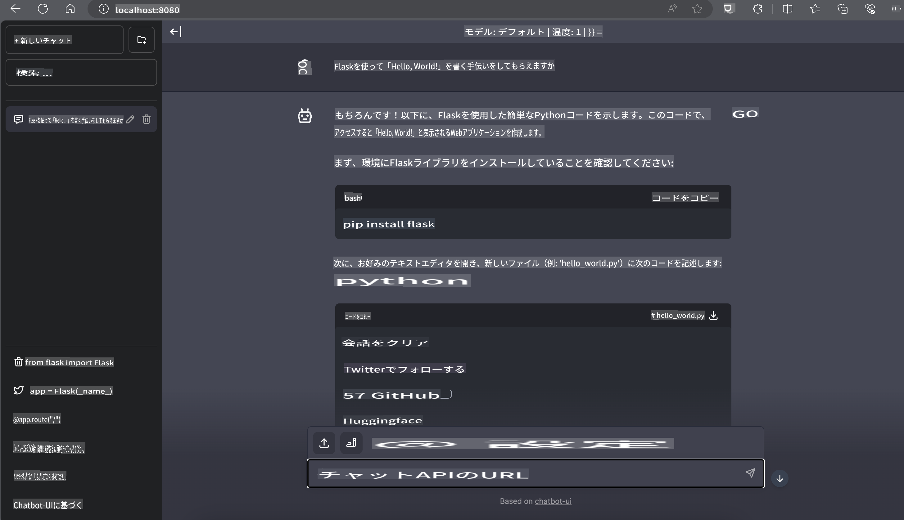

# **Nvidia JetsonでのPhi-3推論**

Nvidia Jetsonは、Nvidiaが提供する組み込みコンピューティングボードのシリーズです。Jetson TK1、TX1、TX2モデルには、NvidiaのTegraプロセッサ（またはSoC）が搭載されており、ARMアーキテクチャの中央処理装置（CPU）が統合されています。Jetsonは低消費電力のシステムで、機械学習アプリケーションの加速を目的に設計されています。Nvidia Jetsonは、プロの開発者があらゆる業界で革新的なAI製品を作成するために使用されるほか、学生や愛好家がAIを実践的に学び、素晴らしいプロジェクトを作成するために利用されています。SLMはJetsonのようなエッジデバイスに展開され、産業用生成AIアプリケーションシナリオのより良い実装を可能にします。

## NVIDIA Jetsonへの展開:
自律ロボットや組み込みデバイスに取り組む開発者は、Phi-3 Miniを活用できます。Phi-3は比較的小型であるため、エッジでの展開に理想的です。トレーニング中にパラメータが慎重に調整されており、高い応答精度が確保されています。

### TensorRT-LLMの最適化:
NVIDIAの[TensorRT-LLMライブラリ](https://github.com/NVIDIA/TensorRT-LLM?WT.mc_id=aiml-138114-kinfeylo)は、大規模言語モデルの推論を最適化します。このライブラリはPhi-3 Miniの長いコンテキストウィンドウをサポートし、スループットとレイテンシの両方を向上させます。最適化には、LongRoPE、FP8、インフライトバッチングなどの技術が含まれています。

### 利用可能性と展開:
開発者は、[NVIDIAのAI](https://www.nvidia.com/en-us/ai-data-science/generative-ai/)で128Kのコンテキストウィンドウを備えたPhi-3 Miniを探索できます。これは標準APIを備えたマイクロサービスとしてNVIDIA NIMにパッケージ化されており、どこでも展開可能です。また、[GitHub上のTensorRT-LLM実装](https://github.com/NVIDIA/TensorRT-LLM)も参照できます。

## **1. 準備**

a. Jetson Orin NX / Jetson NX

b. JetPack 5.1.2+

c. Cuda 11.8

d. Python 3.8+

## **2. JetsonでPhi-3を実行する**

[Ollama](https://ollama.com)または[LlamaEdge](https://llamaedge.com)を選択できます。

クラウドとエッジデバイスの両方でggufを使用したい場合、LlamaEdgeはWasmEdgeとして理解できます（WasmEdgeは軽量で高性能、スケーラブルなWebAssemblyランタイムであり、クラウドネイティブ、エッジ、分散型アプリケーションに適しています。サーバーレスアプリケーション、組み込み機能、マイクロサービス、スマートコントラクト、IoTデバイスをサポートします）。LlamaEdgeを通じてggufの量子化モデルをエッジデバイスやクラウドに展開できます。


以下は使用手順です：

1. 関連ライブラリとファイルをインストールおよびダウンロード

```bash

curl -sSf https://raw.githubusercontent.com/WasmEdge/WasmEdge/master/utils/install.sh | bash -s -- --plugin wasi_nn-ggml

curl -LO https://github.com/LlamaEdge/LlamaEdge/releases/latest/download/llama-api-server.wasm

curl -LO https://github.com/LlamaEdge/chatbot-ui/releases/latest/download/chatbot-ui.tar.gz

tar xzf chatbot-ui.tar.gz

```

**注記**: llama-api-server.wasmとchatbot-uiは同じディレクトリに配置する必要があります。

2. ターミナルでスクリプトを実行

```bash

wasmedge --dir .:. --nn-preload default:GGML:AUTO:{Your gguf path} llama-api-server.wasm -p phi-3-chat

```

以下は実行結果です：



***サンプルコード*** [Phi-3 mini WASM Notebook Sample](https://github.com/Azure-Samples/Phi-3MiniSamples/tree/main/wasm)

まとめると、Phi-3 Miniは効率性、コンテキスト認識、NVIDIAの最適化技術を組み合わせた言語モデリングの飛躍的進歩を表しています。ロボットやエッジアプリケーションを構築する場合でも、Phi-3 Miniは知っておくべき強力なツールです。

**免責事項**:  
本書類は、機械ベースのAI翻訳サービスを使用して翻訳されています。正確性を追求しておりますが、自動翻訳には誤りや不正確さが含まれる可能性があることをご承知おきください。元の言語で作成された原文が、正式な情報源として優先されるべきです。重要な情報については、専門の人間による翻訳を推奨します。本翻訳の使用に起因する誤解や解釈の誤りについて、当社は一切の責任を負いません。