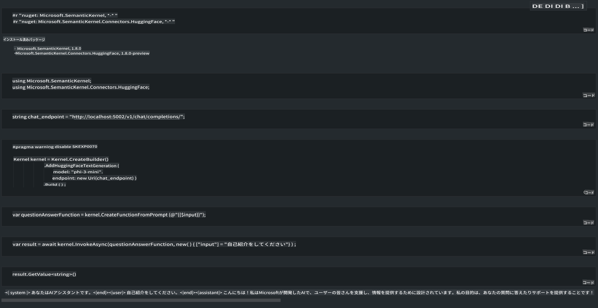

# **ローカルサーバーでのPhi-3推論**

Phi-3をローカルサーバーにデプロイすることができます。ユーザーは [Ollama](https://ollama.com) や [LM Studio](https://llamaedge.com) のソリューションを選択するか、自分でコードを書くことができます。[Semantic Kernel](https://github.com/microsoft/semantic-kernel?WT.mc_id=aiml-138114-kinfeylo) または [Langchain](https://www.langchain.com/) を通じてPhi-3のローカルサービスに接続し、Copilotアプリケーションを構築できます。

## **Semantic Kernelを使ってPhi-3-miniにアクセスする**

Copilotアプリケーションでは、Semantic Kernel / LangChainを使用してアプリケーションを作成します。この種のアプリケーションフレームワークは、一般的にAzure OpenAI Service / OpenAIモデルと互換性があり、Hugging Faceのオープンソースモデルやローカルモデルもサポートできます。では、Semantic Kernelを使ってPhi-3-miniにアクセスするにはどうすればよいでしょうか？.NETを例にすると、Semantic KernelのHugging Face Connectorと組み合わせることができます。デフォルトでは、Hugging Face上のモデルIDに対応します（初回利用時にはHugging Faceからモデルがダウンロードされるため、時間がかかります）。また、自分で構築したローカルサービスに接続することも可能です。この2つを比較すると、特に企業向けアプリケーションでは、自律性が高い後者を推奨します。

図からわかるように、Semantic Kernelを通じてローカルサービスにアクセスすることで、自分で構築したPhi-3-miniモデルサーバーに簡単に接続できます。以下は実行結果です。

***サンプルコード*** https://github.com/kinfey/Phi3MiniSamples/tree/main/semantickernel

**免責事項**:  
本書類は、AIを活用した機械翻訳サービスを使用して翻訳されています。正確性を期すよう努めておりますが、自動翻訳には誤りや不正確さが含まれる可能性があることをご承知おきください。原文（元の言語で記載された文書）が公式かつ信頼できる情報源と見なされるべきです。重要な情報については、専門の人間による翻訳を推奨します。本翻訳の使用に起因する誤解や誤解釈について、当方は一切の責任を負いかねます。