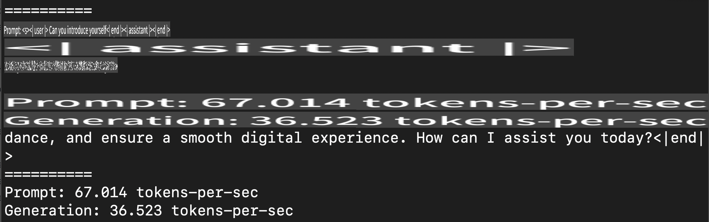
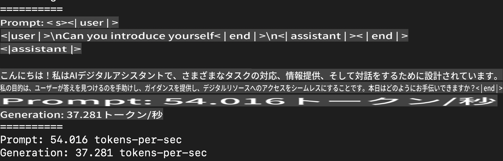
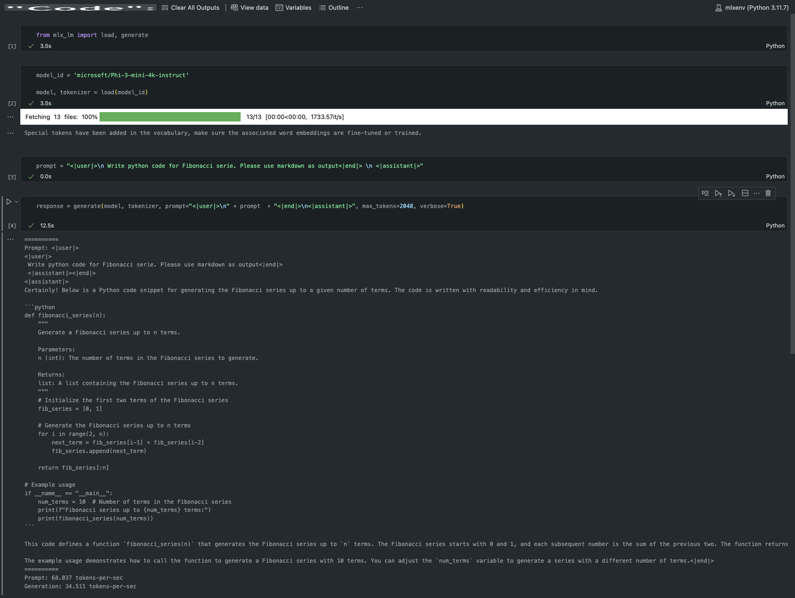

# **Apple MLXフレームワークでPhi-3を推論する**

## **MLXフレームワークとは**

MLXは、Appleシリコン上での機械学習研究のためにApple機械学習研究チームが提供する配列フレームワークです。

MLXは機械学習研究者によって、研究者のために設計されています。このフレームワークは使いやすさを重視しながらも、モデルのトレーニングやデプロイを効率的に行えるようになっています。また、フレームワーク自体の設計も概念的にシンプルで、研究者がMLXを拡張し、新しいアイデアを迅速に試すことができるよう配慮されています。

LLMはMLXを活用することでAppleシリコンデバイス上で加速され、ローカル環境で非常に便利に実行できます。

## **MLXを使用してPhi-3-miniを推論する**

### **1. MLX環境をセットアップする**

1. Python 3.11.x
2. MLXライブラリをインストールする

```bash

pip install mlx-lm

```

### **2. ターミナルでPhi-3-miniをMLXで実行する**

```bash

python -m mlx_lm.generate --model microsoft/Phi-3-mini-4k-instruct --max-token 2048 --prompt  "<|user|>\nCan you introduce yourself<|end|>\n<|assistant|>"

```

結果（私の環境はApple M1 Max, 64GB）は以下の通りです。



### **3. ターミナルでMLXを使用してPhi-3-miniを量子化する**

```bash

python -m mlx_lm.convert --hf-path microsoft/Phi-3-mini-4k-instruct

```

***注意：*** モデルはmlx_lm.convertを使用して量子化することが可能で、デフォルトの量子化形式はINT4です。この例ではPhi-3-miniをINT4に量子化します。

モデルはmlx_lm.convertを通じて量子化可能で、デフォルトではINT4に量子化されます。この例ではPhi-3-miniをINT4に量子化します。量子化後、デフォルトのディレクトリ ./mlx_model に保存されます。

ターミナルからMLXで量子化されたモデルをテストすることができます。

```bash

python -m mlx_lm.generate --model ./mlx_model/ --max-token 2048 --prompt  "<|user|>\nCan you introduce yourself<|end|>\n<|assistant|>"

```

結果は以下の通りです。



### **4. Jupyter NotebookでMLXを使用してPhi-3-miniを実行する**



***注意：*** このサンプルを参照してください [こちらをクリック](../../../../../code/03.Inference/MLX/MLX_DEMO.ipynb)

## **リソース**

1. Apple MLXフレームワークについて学ぶ [https://ml-explore.github.io](https://ml-explore.github.io/mlx/build/html/index.html)

2. Apple MLX GitHubリポジトリ [https://github.com/ml-explore](https://github.com/ml-explore)

**免責事項**:  
この文書は、機械翻訳AIサービスを使用して翻訳されています。正確性を期して努力しておりますが、自動翻訳には誤りや不正確さが含まれる可能性があることをご了承ください。元の言語で記載された原文が正式な情報源と見なされるべきです。重要な情報については、専門の人間による翻訳をお勧めします。本翻訳の使用に起因する誤解や解釈の誤りについて、当社は一切の責任を負いません。